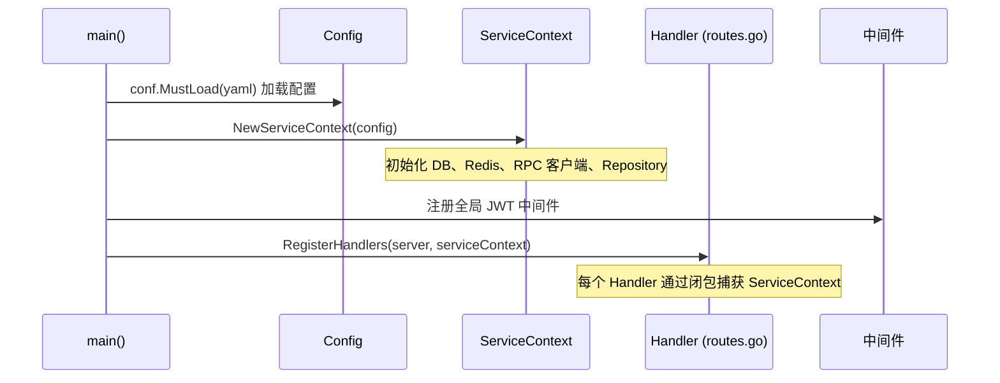
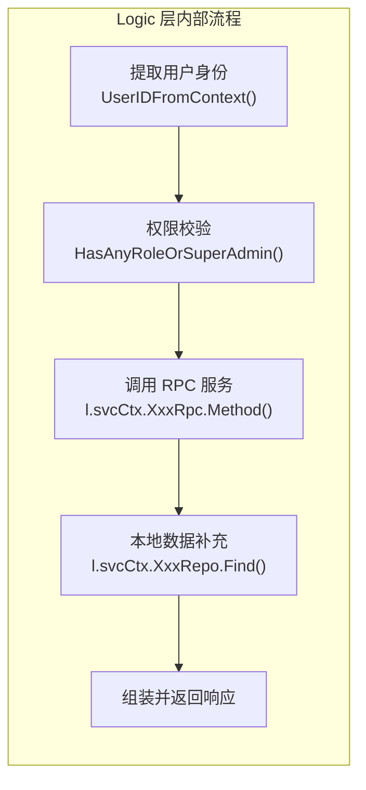
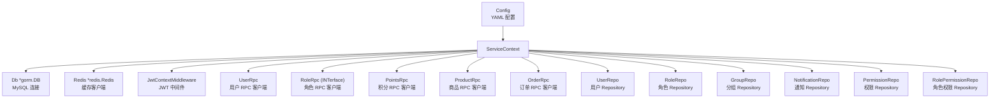
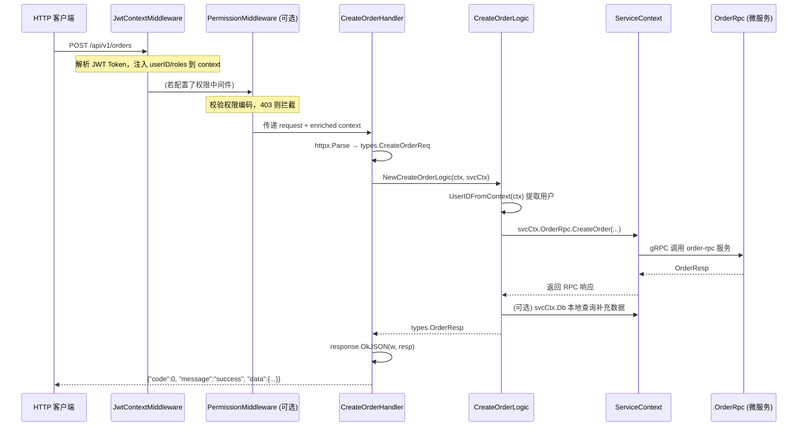

在 go-zero 框架中，API 网关层的代码被清晰地分为三个职责各异的层次：**Handler** 负责请求解析与响应序列化、**Logic** 承载全部业务逻辑、**ServiceContext** 作为统一的依赖容器将所有外部资源注入到 Logic 中。这种"薄 Handler、厚 Logic、集中注入"的设计模式让每一层都可以独立演化、独立测试，是本项目后端架构最核心的组织原则。

Sources: [INTegralmall.go](app/api/INTegralmall.go#L1-L46), [service_context.go](app/api/INTernal/svc/service_context.go#L1-L71)

## 启动链路：从 main() 到请求处理

整个三层的构建从 `main()` 函数开始，遵循一条线性的初始化路径：加载配置 → 构建 ServiceContext → 注册 Handler。理解这条链路是掌握三层关系的前提。



具体而言，[INTegralmall.go](app/api/INTegralmall.go) 的 `main()` 函数依次完成四件事：①通过 `conf.MustLoad` 将 YAML 配置文件反序列化为 `config.Config` 结构体；②调用 `svc.NewServiceContext(c)` 构建依赖容器；③注册全局 JWT 上下文中间件；④调用 `handler.RegisterHandlers(server, ctx)` 将所有路由及其 Handler 绑定到 HTTP Server 上。此后，每个 HTTP 请求便进入 Handler → Logic → ServiceContext 的三层流转。

Sources: [INTegralmall.go](app/api/INTegralmall.go#L19-L45)

## 三层职责划分

| 层次 | 目录 | 核心职责 | 依赖方向 | 可否含业务逻辑 |
|------|------|----------|----------|---------------|
| **Handler** | `handler/` | 请求解析、响应序列化、错误委托 | 接收 `*svc.ServiceContext`，创建 Logic | ❌ 不允许 |
| **Logic** | `logic/` | 业务编排、权限校验、RPC 调用 | 通过 `svcCtx` 访问所有外部资源 | ✅ 核心承载 |
| **ServiceContext** | `svc/` | 依赖容器，持有 DB、Redis、RPC、Repository | 被注入到所有 Logic 实例 | ❌ 仅初始化 |

下面逐层展开说明每一层的具体实现模式。

Sources: [create_order_handler.go](app/api/INTernal/handler/order/create_order_handler.go#L1-L33), [create_order_logic.go](app/api/INTernal/logic/order/create_order_logic.go#L1-L64), [service_context.go](app/api/INTernal/svc/service_context.go#L1-L71)

## Handler 层：请求的门面

Handler 是 HTTP 请求进入业务逻辑的**唯一入口**。在本项目中，Handler 严格遵循"三步走"模板：

1. **解析请求**：调用 `httpx.Parse(r, &req)` 将路径参数、查询参数、JSON Body 统一解析到强类型的 `types.XxxReq` 结构体
2. **创建 Logic 并调用**：通过 `logic.NewXxxLogic(r.Context(), svcCtx)` 创建 Logic 实例，传入请求上下文和依赖容器
3. **处理响应**：成功时调用 `response.OkJSON(w, resp)` 返回统一信封格式，失败时委托 `httpx.ErrorCtx` 交给全局错误处理器

以订单创建 Handler 为例，整个实现仅有 16 行有效代码：

```go
func CreateOrderHandler(svcCtx *svc.ServiceContext) http.HandlerFunc {
    return func(w http.ResponseWriter, r *http.Request) {
        var req types.CreateOrderReq
        if err := httpx.Parse(r, &req); err != nil {
            httpx.ErrorCtx(r.Context(), w, err)
            return
        }
        l := order.NewCreateOrderLogic(r.Context(), svcCtx)
        resp, err := l.CreateOrder(&req)
        if err != nil {
            httpx.ErrorCtx(r.Context(), w, err)
        } else {
            response.OkJSON(w, resp)
        }
    }
}
```

这里有一个关键设计：Handler 函数签名是 `func(svcCtx *svc.ServiceContext) http.HandlerFunc`，它返回一个闭包。这个闭包在 `routes.go` 的路由注册阶段被创建，**一次性捕获** `ServiceContext` 引用，后续每次请求复用同一个闭包，无需重复传递依赖。

值得注意的是，Handler 可以根据场景灵活适配：对于无返回值的操作（如审核），成功时直接调用 `response.OkJSON(w, nil)` 返回空数据；对于文件上传等特殊场景（如 [upload_image_handler.go](app/api/INTernal/handler/upload/upload_image_handler.go)），Handler 可能直接读取 `r.FormFile` 而非依赖 `httpx.Parse`，并在 Handler 层就访问 `svcCtx.Config` 来拼接图片 URL 前缀。

Sources: [create_order_handler.go](app/api/INTernal/handler/order/create_order_handler.go#L16-L32), [review_application_handler.go](app/api/INTernal/handler/review/review_application_handler.go#L16-L32), [upload_image_handler.go](app/api/INTernal/handler/upload/upload_image_handler.go#L16-L47), [response.go](app/api/INTernal/response/response.go#L10-L33)

## Logic 层：业务编排的核心

Logic 层是整个 API 网关的"大脑"。每个 Logic 结构体都遵循统一的三字段模式：

```go
type CreateOrderLogic struct {
    logx.Logger          // 内嵌日志器，自动携带请求上下文
    ctx    context.Context  // 请求级上下文（含用户信息）
    svcCtx *svc.ServiceContext  // 依赖容器
}
```

构造函数 `NewXxxLogic` 是固定模板：将 `context`、`ServiceContext` 绑定到结构体，同时用 `logx.WithContext(ctx)` 初始化带上下文的日志器。这样在 Logic 的任何方法中，调用 `l.Errorf(...)` 或 `l.Infof(...)` 都会自动带上请求追踪信息。

**Logic 的典型工作流**包含以下步骤（以登录为例）：

1. **身份提取**：通过 `apilogic.UserIDFromContext(l.ctx)` 从上下文中获取当前用户 ID，若未登录则直接返回 `CodeUnauthorized` 错误
2. **调用 RPC 服务**：通过 `l.svcCtx.UserRpc.Login(l.ctx, ...)` 将请求转发到后端微服务
3. **补充本地查询**：通过 `l.svcCtx.RoleRepo.FindUserRoles(l.ctx, ...)` 查询本地数据库中的角色详情（API 网关同时充当"轻量聚合层"的角色）
4. **组装响应**：将 RPC 返回数据和本地查询结果合并为 `types.XxxResp` 返回



这种模式确保了 Logic 层的业务逻辑可以自由组合 RPC 调用和本地数据库查询，而无需关心这些依赖是如何创建的——它们全部通过 `svcCtx` 注入。

Sources: [create_order_logic.go](app/api/INTernal/logic/order/create_order_logic.go#L18-L63), [login_logic.go](app/api/INTernal/logic/auth/login_logic.go#L14-L62), [review_application_logic.go](app/api/INTernal/logic/review/review_application_logic.go#L17-L52), [authz.go](app/api/INTernal/logic/authz.go#L10-L37)

## ServiceContext：依赖注入容器

**ServiceContext** 是整个三层架构的枢纽。它将所有外部依赖集中到一个结构体中，在应用启动时一次性初始化，然后注入到每一个 Logic 实例中。



从 [service_context.go](app/api/INTernal/svc/service_context.go) 可以看到，`NewServiceContext` 函数完成以下初始化工作：

| 依赖类别 | 字段 | 初始化方式 | 用途 |
|----------|------|-----------|------|
| 数据库 | `Db *gorm.DB` | `gorm.Open(mysql.Open(...))` | 直接 SQL 查询、事务操作 |
| 缓存 | `Redis *redis.Redis` | `redis.MustNewRedis(...)` | 分布式缓存 |
| 中间件 | `JwtContextMiddleware` | `middleware.NewJwtContextMiddleware(...)` | JWT Token 解析 |
| RPC 客户端 | `UserRpc` / `PointsRpc` 等 | `xxx.NewXxxService(zrpc.MustNewClient(...))` | 跨服务 gRPC 调用 |
| Repository | `UserRepo` / `RoleRepo` 等 | `model.NewXxxRepository(db)` | 本地表的 CRUD 封装 |

**为什么 API 网关层同时拥有 RPC 客户端和本地 Repository？** 这是一个务实的设计选择：核心业务（用户管理、积分、订单、商品）通过 RPC 调用独立微服务，保证服务边界的清晰；而 RBAC 相关的权限查询（角色、权限编码）直接在 API 网关层通过 Repository 访问本地数据库，避免了一次额外的 RPC 往返，也使得权限中间件可以高效运行。

Sources: [service_context.go](app/api/INTernal/svc/service_context.go#L19-L70), [config.go](app/api/INTernal/config/config.go#L9-L34)

## RoleService 接口：面向接口编程的实践

在本项目的 ServiceContext 中，`RoleRpc` 字段的类型不是具体的结构体，而是一个**接口** `RoleService`：

```go
type RoleService INTerface {
    CreateRole(ctx context.Context, in *roleservice.CreateRoleReq, ...) (*roleservice.RoleResp, error)
    UpdateRole(ctx context.Context, in *roleservice.UpdateRoleReq, ...) (*roleservice.RoleResp, error)
    // ... 更多方法
}
```

这是本项目面向接口编程的一个典型案例。`svc/role_service.go` 中定义了 `RoleService` 接口和其私有实现 `roleService` 结构体。`NewRoleService` 函数返回接口类型而非具体类型，使得测试时可以用 Mock 实现替换真实的 RPC 客户端。对比其他 RPC 客户端（如 `UserRpc`、`PointsRpc`）直接使用 goctl 生成的具体类型，`RoleRpc` 的接口化设计提供了更好的可替换性和可测试性。

Sources: [role_service.go](app/api/INTernal/svc/role_service.go#L13-L32)

## 路由注册：Handler 与 ServiceContext 的绑定点

[routes.go](app/api/INTernal/handler/routes.go) 是 Handler 和 ServiceContext 建立联系的地方。这个文件由 goctl 工具自动生成，其中的 `RegisterHandlers` 函数接收两个参数：HTTP Server 和 ServiceContext。

每个路由注册的核心模式是：

```go
{
    Method:  http.MethodPost,
    Path:    "/orders",
    Handler: order.CreateOrderHandler(serverCtx),  // 将 serverCtx 闭包捕获
},
```

`CreateOrderHandler(serverCtx)` 返回一个 `http.HandlerFunc`，其内部通过闭包持有 `serverCtx` 引用。这意味着同一个 `ServiceContext` 实例被所有 Handler 共享——这是线程安全的，因为 ServiceContext 持有的都是连接池、客户端等并发安全的对象。

路由注册中还展示了**中间件的分层应用**：部分路由使用 `rest.WithJwt(...)` 应用 JWT 认证；管理类路由额外包裹 `groupPerm.Handle(...)` 或 `superAdmin.Handle(...)` 实现权限守卫。这些中间件都在 Handler 之前执行，为 Logic 层准备好上下文信息。

Sources: [routes.go](app/api/INTernal/handler/routes.go#L28-L54), [routes.go](app/api/INTernal/handler/routes.go#L84-L114)

## 测试中的依赖替换：Mock 注入

三层架构最大的工程优势体现在**可测试性**上。由于 Logic 层通过 `svcCtx` 接口访问所有外部依赖，测试时只需替换 `svcCtx` 中的字段即可完全隔离外部系统。

[logic.go](app/api/INTernal/logic/logic.go) 中定义了完整的 Mock 体系，其设计模式是**函数字段委托**：

```go
// Mock 定义（函数字段模式）
type MockOrderRpc struct {
    CreateOrderFunc func(ctx context.Context, in *orderservice.CreateOrderReq, ...) (*orderservice.OrderResp, error)
}

// Mock 实现（委托给函数字段）
func (m *MockOrderRpc) CreateOrder(ctx context.Context, in *orderservice.CreateOrderReq, ...) (*orderservice.OrderResp, error) {
    if m.CreateOrderFunc != nil {
        return m.CreateOrderFunc(ctx, in, opts...)
    }
    return &orderservice.OrderResp{}, nil  // 默认零值返回
}
```

测试用例通过 `logic.NewMockSvcCtx()` 获取一个预装配好所有 Mock 的 `ServiceContext`，然后仅设置与当前测试相关的 Mock 函数：

```go
func TestCreateOrder_Success(t *testing.T) {
    svcCtx, _, _, _, orderRpc, _, _, _, _ := logic.NewMockSvcCtx()
    
    orderRpc.CreateOrderFunc = func(ctx context.Context, in *orderservice.CreateOrderReq, ...) (*orderservice.OrderResp, error) {
        return &orderservice.OrderResp{OrderNo: "ORD20260402000001", ...}, nil
    }
    
    ctx := logic.NewCtxWithUser(100, []string{"participant"})
    l := NewCreateOrderLogic(ctx, svcCtx)
    resp, err := l.CreateOrder(&types.CreateOrderReq{ProductId: 1})
    
    assert.NoError(t, err)
    assert.Equal(t, "ORD20260402000001", resp.OrderNo)
}
```

`NewMockSvcCtx()` 提供了两个版本：基础版返回 9 个 Mock 对象（覆盖常用 RPC 和 Repository），`NewMockSvcCtxV2()` 返回 12 个（额外包含 RoleRpc、PermissionRepo、RolePermissionRepo），满足不同业务场景的测试需求。配合 `NewCtxWithUser()` 和 `NewCtxWithUserAndPermissions()` 等上下文构造辅助函数，测试代码无需启动任何真实服务即可完整验证业务逻辑。

Sources: [logic.go](app/api/INTernal/logic/logic.go#L702-L764), [create_order_logic_test.go](app/api/INTernal/logic/order/create_order_logic_test.go#L16-L42)

## 完整请求流转图

将三层架构与中间件串联起来，一个典型的 API 请求（如"创建订单"）的完整生命周期如下：



Sources: [INTegralmall.go](app/api/INTegralmall.go#L36-L41), [routes.go](app/api/INTernal/handler/routes.go#L143-L178), [create_order_handler.go](app/api/INTernal/handler/order/create_order_handler.go#L16-L32), [create_order_logic.go](app/api/INTernal/logic/order/create_order_logic.go#L32-L63)

## 新增接口时的工作流

当你需要为积分商城新增一个 API 接口时，三层架构的工作流如下：

1. **定义 API 路由**：在 [INTegral.api](app/api/INTegral.api) 中添加路由声明，运行 `goctl api go` 生成 Handler 骨架和 types 类型
2. **实现 Handler**：生成的 Handler 已包含标准的"解析→创建 Logic→调用→响应"模板，通常无需修改
3. **实现 Logic**：在对应的 `logic/` 子目录中编写业务逻辑，通过 `l.svcCtx` 访问所需依赖
4. **编写测试**：使用 `logic.NewMockSvcCtx()` 构建 Mock 环境，仅 Mock 当前测试关心的依赖方法

这种由工具驱动、约定优于配置的开发模式，确保了所有接口遵循统一的架构规范，新人加入项目后只需理解这一个模式就能快速上手。

## 延伸阅读

- 了解 ServiceContext 中 RPC 客户端的微服务拓扑，参见 [微服务架构总览：API 网关与四路 RPC 的协作关系](3-wei-fu-wu-jia-gou-zong-lan-api-wang-guan-yu-si-lu-rpc-de-xie-zuo-guan-xi)
- 了解 Handler 前方的 JWT 中间件如何为 Logic 层准备上下文，参见 [JWT 认证中间件与上下文传递机制](12-jwt-ren-zheng-zhong-jian-jian-yu-shang-xia-wen-chuan-di-ji-zhi)
- 了解 PermissionMiddleware 如何在 Handler 外层拦截无权限请求，参见 [PermissionMiddleware 权限守卫的实现原理](13-permissionmiddleware-quan-xian-shou-wei-de-shi-xian-yuan-li)
- 了解 ServiceContext 中 Repository 的接口定义，参见 [GORM 模型定义与 Repository 模式](20-gorm-mo-xing-ding-yi-yu-repository-mo-shi)
- 了解测试体系的完整覆盖策略，参见 [后端单元测试策略：Mock 辅助与覆盖范围](22-hou-duan-dan-yuan-ce-shi-ce-lue-mock-fu-zhu-yu-fu-gai-fan-wei)