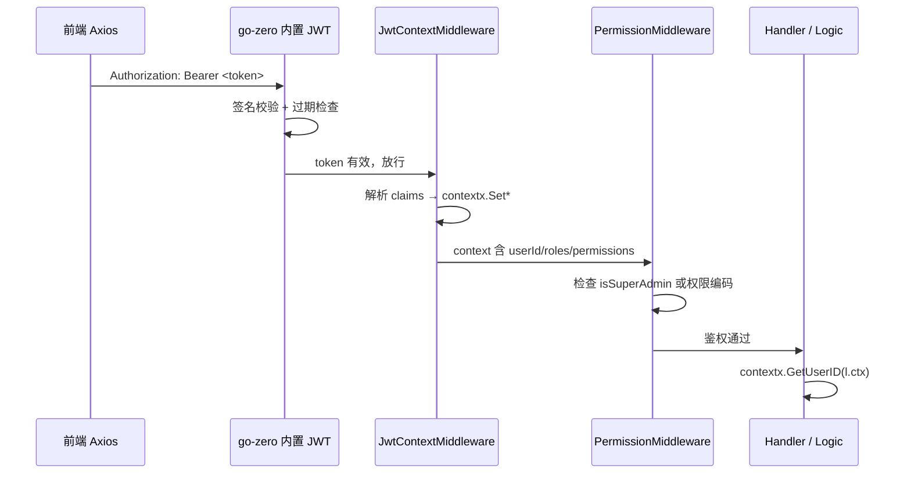

积分商城的安全认证体系围绕一条清晰的数据流构建：**登录签发 → 前端携带 → 网关验签 → 上下文注入 → 业务消费**。本文深入剖析这条链路上的每一个环节，帮助你理解 token 是如何从密码验证诞生、如何在 HTTP 请求的 context 中流转、最终如何被 Logic 层无缝消费的。你将掌握双中间件协作的分层设计思想，以及 `contextx` 包如何用类型安全的 API 隔离 `context.WithValue` 的底层细节。

Sources: [INTegralmall.go](app/api/INTegralmall.go#L1-L45), [user.go](pkg/contextx/user.go#L1-L65), [jwt_context_middleware.go](app/api/INTernal/middleware/jwt_context_middleware.go#L1-L103)

## 整体架构：四层中间件的协作关系

在深入每个组件之前，先从宏观视角理解请求经过的中间件栈。go-zero 框架提供了路由级的 JWT 签名校验能力，项目在此基础上叠加了自定义的上下文提取中间件和权限守卫中间件，形成了一个职责清晰的四层过滤链。



**核心设计原则**是"校验与提取分离"：go-zero 内置中间件负责密码学验证（签名 + 过期），确保 token 未被篡改；`JwtContextMiddleware` 则纯粹负责数据搬运——从 JWT claims 中提取用户身份信息并写入 Go 的 `context.Context`。这种分离使得每一层都可以独立测试，也使得权限中间件可以完全基于 context 做决策，而不需要知道 token 的存在。

Sources: [jwt_context_middleware.go](app/api/INTernal/middleware/jwt_context_middleware.go#L14-L18), [permission_middleware.go](app/api/INTernal/middleware/permission_middleware.go#L1-L68), [routes.go](app/api/INTernal/handler/routes.go#L52-L54)

## Token 的诞生：登录流程与 Claims 结构

JWT token 在 **User RPC 服务**的登录逻辑中生成。`LoginLogic` 完成密码验证后，依次查询用户的角色和权限，最终调用 `JwtUtil.GenerateToken()` 签发 token。

**Claims 结构**是整个认证体系的数据契约，定义在 `pkg/utils/jwt.go` 中：

| 字段 | 类型 | 用途 |
|------|------|------|
| `userId` | `INT64` | 用户唯一标识，贯穿所有业务逻辑 |
| `email` | `string` | 用户邮箱，同时设为 JWT Subject |
| `roles` | `[]string` | 角色编码列表，如 `["admin", "reviewer"]` |
| `permissions` | `[]string` | 权限编码列表，如 `["page:admin:users", "review:final"]` |
| `isSuperAdmin` | `bool` | 超级管理员标记，用于权限中间件短路放行 |
| `exp` | `INT64` | 过期时间戳（标准 Registered Claim） |
| `iss` | `string` | 签发者固定为 `"INTegral-mall"` |

签发过程有一个值得注意的优化：**超级管理员不枚举权限**。当检测到用户拥有 `super_admin` 角色时，`permissionCodes` 被设为空切片，因为后续的权限中间件会通过 `isSuperAdmin` 标记直接短路放行，无需逐条匹配权限编码。这避免了超级管理员在 token 中携带大量冗余的权限字符串。

Sources: [jwt.go](pkg/utils/jwt.go#L10-L54), [login_logic.go (RPC)](app/rpc/user/INTernal/logic/login_logic.go#L28-L110)

## 前端 Token 注入：Axios 拦截器

前端通过 Axios 请求拦截器，从 Zustand 状态管理 store 中读取 token，自动附加到每个 API 请求的 `Authorization` 头中：

```typescript
client.INTerceptors.request.use((config) => {
  const token = useAuthStore.getState().token
  if (token) {
    config.headers.Authorization = `Bearer ${token}`
  }
  return config
})
```

响应拦截器处理 401 状态码时，会自动清除认证状态并跳转到登录页，实现了完整的 token 生命周期管理。这种"拦截器注入"模式使得业务代码完全不需要关心认证细节。

Sources: [client.ts](frontend/src/api/client.ts#L14-L20), [client.ts](frontend/src/api/client.ts#L33-L38)

## JwtContextMiddleware：从 Claims 到 Context 的桥接

这是整个认证链路中最核心的自定义组件。它被注册为**全局中间件**，运行在所有路由处理之前：

```go
server.Use(ctx.JwtContextMiddleware.Handle)
```

它的设计体现了三个关键决策：

**1. 优雅降级（不拒绝请求）**。当 token 缺失、格式错误、签名无效或已过期时，中间件仅记录日志并继续传递请求。这不是安全漏洞——因为受保护的路由已经通过 `rest.WithJwt()` 注册了 go-zero 内置的 JWT 中间件，那些路由会在签名校验失败时直接返回 401。`JwtContextMiddleware` 的职责是**提取**而非**拦截**，它确保公开路由（如 `/auth/login`）在无 token 时仍可正常访问。

**2. 容错解析**。JWT claims 经过 JSON 序列化/反序列化后，数组字段的类型可能因不同的 JWT 库实现而变为 `[]any` 或保持为 `[]string`。中间件通过 `switch` 对 `roles` 和 `permissions` 字段进行了三种类型分支处理（`[]any`、`[]string`、单个 `string`），确保在各种边界条件下都能正确提取数据。

**3. Context 链式构建**。中间件通过连续调用 `contextx.Set*` 方法构建 context 链，每次调用都会返回一个新的 context 并作为下一次调用的输入。最终通过 `r.WithContext(ctx)` 将构建好的 context 附加到请求上。

Sources: [jwt_context_middleware.go](app/api/INTernal/middleware/jwt_context_middleware.go#L25-L102), [INTegralmall.go](app/api/INTegralmall.go#L38-L39)

## contextx 包：类型安全的 Context 存取

`pkg/contextx/user.go` 封装了 Go 原生的 `context.WithValue` / `ctx.Value` 模式，提供了四个类型安全的存取函数对：

| 函数 | 写入类型 | 读取类型 | 默认值 |
|------|---------|---------|--------|
| `SetUserID` / `GetUserID` | `INT64` | `INT64` | `0` |
| `SetUserRoles` / `GetUserRoles` | `[]string` | `[]string` | `nil` |
| `SetPermissions` / `GetPermissions` | `[]string` | `[]string` | `nil` |
| `SetIsSuperAdmin` / `IsSuperAdmin` | `bool` | `bool` | `false` |

这个包的关键价值在于**编译期类型保障**。`contextKey` 是一个未导出的自定义类型（`string` 的别名），外部代码无法构造相同的 key 来意外覆盖 context 中的值。每个 `Get*` 函数内部都通过类型断言 `.(INT64)` / `.([]string)` / `.(bool)` 进行安全的类型转换，并在断言失败时返回零值，杜绝了 panic 风险。

Sources: [user.go](pkg/contextx/user.go#L5-L65)

## 路由注册中的中间件组合

在 `routes.go` 中，中间件以两种方式组合到路由上：**路由级 JWT 验证**和**Handler 级权限守卫**。

**路由级 JWT 验证**通过 `rest.WithJwt()` 选项声明。go-zero 框架会为这些路由组自动注入内置的 JWT 签名校验中间件，在 token 无效或过期时返回 401：

```go
server.AddRoutes(
    []rest.Route{...},
    rest.WithJwt(serverCtx.Config.JwtAuth.AccessSecret),
    rest.WithPrefix("/api/v1"),
)
```

**Handler 级权限守卫**通过中间件的 `Handle` 方法包装 Handler 函数。`PermissionMiddleware` 和 `SuperAdminMiddleware` 都接受一个 `http.HandlerFunc` 并返回一个新的 `http.HandlerFunc`，形成洋葱模型：

```go
groupPerm := middleware.NewPermissionMiddleware("page:admin:groups")
Handler: groupPerm.Handle(group.ListGroupsHandler(serverCtx))
```

整个系统中存在三种权限守卫的使用模式：

| 模式 | 中间件 | 适用场景 | 示例路由 |
|------|--------|---------|---------|
| 无权限守卫 | 仅 JWT 验证 | 普通用户操作 | `/applications`, `/points/balance` |
| 权限编码匹配 | `PermissionMiddleware` | 功能模块访问控制 | `/groups` (需要 `page:admin:groups`) |
| 超级管理员专享 | `SuperAdminMiddleware` | 系统级操作 | `/admin/roles` |

Sources: [routes.go](app/api/INTernal/handler/routes.go#L28-L70), [routes.go](app/api/INTernal/handler/routes.go#L84-L114), [routes.go](app/api/INTernal/handler/routes.go#L366-L407)

## Logic 层如何消费上下文

当请求经过所有中间件到达 Logic 层时，用户身份信息已经安全地存储在 `context.Context` 中。Logic 层通过 `contextx.GetUserID(l.ctx)` 获取当前用户 ID，完全不感知 token 的存在。以下是一个典型的消费模式：

```go
func (l *SubmitApplicationLogic) SubmitApplication(req *types.SubmitApplicationReq) (*types.ApplicationResp, error) {
    userId := contextx.GetUserID(l.ctx)    // 从 context 获取当前用户 ID
    rpcReq := &pointsservice.SubmitApplicationReq{
        ApplicantId: userId,                // 直接用于 RPC 调用
        ...
    }
    rpcResp, err := l.svcCtx.PointsRpc.SubmitApplication(l.ctx, rpcReq)
    ...
}
```

对于需要权限判断的场景，Logic 层还通过 `authz.go` 提供了 `UserIDFromContext()`、`HasAnyRole()` 和 `HasAnyRoleOrSuperAdmin()` 等辅助函数。`UserIDFromContext` 在用户未认证时返回带 `CodeUnauthorized` 错误码的 error，而 `HasAnyRoleOrSuperAdmin` 则实现了"超级管理员或指定角色"的快捷判断逻辑。Dashboard 逻辑是一个集中展示 contextx 多值消费的典型场景——它同时读取 `userId`、`roles`、`permissions` 和 `isSuperAdmin` 来决定返回哪种角色的仪表盘视图。

Sources: [submit_application_logic.go](app/api/INTernal/logic/application/submit_application_logic.go#L31-L33), [authz.go](app/api/INTernal/logic/authz.go#L10-L37), [get_dashboard_logic.go](app/api/INTernal/logic/dashboard/get_dashboard_logic.go#L35-L60)

## 配置与安全防护

JWT 的密钥和过期时间通过 YAML 配置文件注入到两个服务中：

```yaml
JwtAuth:
  AccessSecret: "change-me-in-production-jwt-secret-key"
  AccessExpire: 86400   # 24 小时
```

API 网关和 User RPC 服务共享相同的 `AccessSecret`，确保 RPC 服务签发的 token 能被 API 网关正确验证。`AccessExpire` 为 86400 秒（24 小时），意味着用户每天需要重新登录一次。

**安全防护**方面，`INTegralmall.go` 的 `main` 函数中设置了一个硬性检查——如果检测到 JWT 密钥仍为默认值，程序将直接 panic 拒绝启动。这是一个"启动时安全断言"，确保生产环境绝不会使用开发阶段的占位密钥：

```go
if c.JwtAuth.AccessSecret == "change-me-in-production-jwt-secret-key" {
    panic("FATAL: JWT secret is still the default value...")
}
```

Sources: [INTegral_mall.yaml](app/api/etc/INTegral_mall.yaml#L6-L8), [INTegralmall.go](app/api/INTegralmall.go#L26-L28), [config.go (RPC)](app/rpc/user/INTernal/config/config.go#L19-L23)

## 测试覆盖策略

JWT 中间件的测试采用了"真实 JWT 签发 + 场景覆盖"的策略，而非 Mock 依赖。测试文件覆盖了以下关键场景：

| 测试用例 | 验证目标 |
|---------|---------|
| `NoAuthHeader` | 无 Authorization 头时请求正常放行 |
| `InvalidToken` | 无效 token 格式时请求正常放行 |
| `ValidToken` | 有效 token 正确解析 userId 和 roles |
| `WithRolesArrayAny` | roles 为 `[]any` 类型时正确转换 |
| `WithRolesStringArray` | roles 为 `[]string` 类型时正确转换 |
| `WithRolesSingleString` | roles 为单个 string 时包装为切片 |
| `EmptyRolesString` | 空字符串角色不添加到列表 |
| `NoUserIdClaim` | 缺少 userId 时不设置 context 值 |
| `ExpiredToken` | 过期 token 跳过解析但放行 |
| `InvalidBearerPrefix` | 非 Bearer 前缀跳过处理 |

每个测试都通过 `createTestToken` 辅助函数使用真实的 HMAC-SHA256 签名流程创建 token，然后在 `next handler` 中捕获请求的 context 并验证 `contextx.Get*` 的返回值。这种"端到端"的测试方式比 Mock JWT 解析器更能发现集成问题。

Sources: [jwt_context_middleware_test.go](app/api/INTernal/middleware/jwt_context_middleware_test.go#L1-L239), [user_test.go](pkg/contextx/user_test.go#L1-L78)

## 延伸阅读

- 了解权限中间件的详细实现：[PermissionMiddleware 权限守卫的实现原理](13-permissionmiddleware-quan-xian-shou-wei-de-shi-xian-yuan-li)
- 理解 Handler / Logic / ServiceContext 三层如何协作：[Handler / Logic / ServiceContext 三层架构与依赖注入](14-handler-logic-servicecontext-san-ceng-jia-gou-yu-yi-lai-zhu-ru)
- 查看前端如何管理认证状态：[Zustand 认证状态管理：登录持久化与权限判断](17-zustand-ren-zheng-zhuang-tai-guan-li-deng-lu-chi-jiu-hua-yu-quan-xian-pan-duan)
- 了解路由注册的完整 API 定义：[go-zero API 定义语言（INTegral.api）与路由注册](11-go-zero-api-ding-yi-yu-yan-INTegral-api-yu-lu-you-zhu-ce)