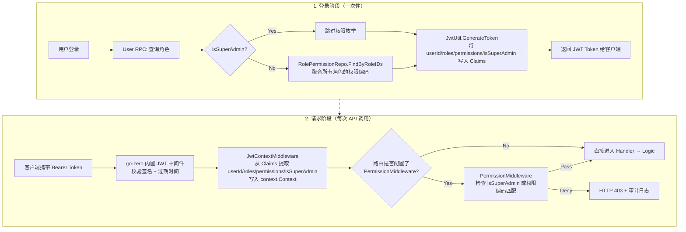
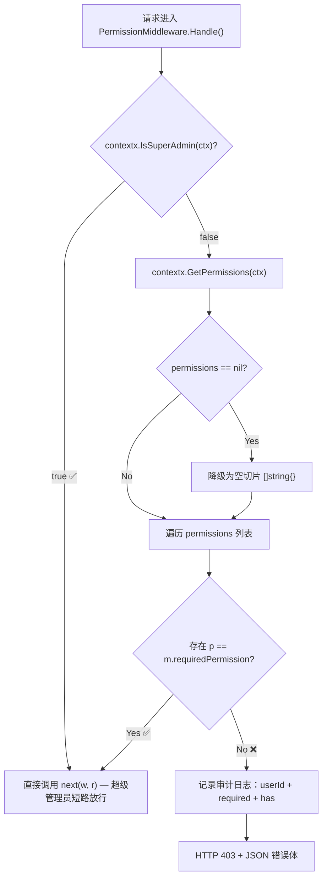
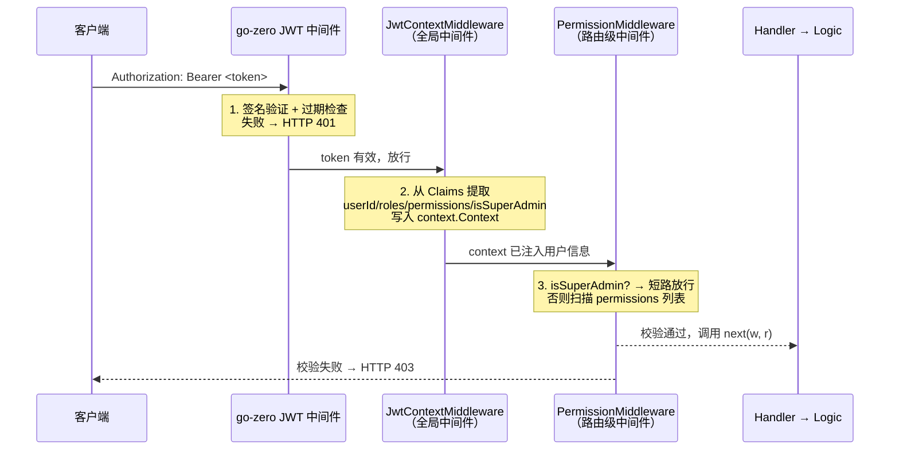

积分商城的权限守卫系统采用 **路由级中间件拦截 + 逻辑层细粒度校验** 的双层架构，将 RBAC 权限模型从数据库层一路传递到 API 请求上下文，在请求到达业务 Logic 之前完成权限决策。本文将深入剖析权限数据从登录写入 JWT、到中间件提取与匹配、再到最终放行或拒绝的完整链路。

Sources: [permission_middleware.go](app/api/INTernal/middleware/permission_middleware.go#L1-L68), [routes.go](app/api/INTernal/handler/routes.go#L1-L422)

## 整体架构：从登录到鉴权的全链路

在理解中间件的实现细节之前，需要先建立对权限数据流动路径的全局认知。下图展示了一个 HTTP 请求从客户端发出到权限校验完成的完整数据流：



这个架构的核心设计思想是：**权限数据在登录时一次性聚合并编码进 JWT**，后续请求无需再查询数据库，通过 context 传递实现零 I/O 的权限校验。这意味着权限变更（如角色权限调整）需要用户重新登录才能生效——这是一个有意的权衡，换取了请求路径上的性能优势。

Sources: [login_logic.go (User RPC)](app/rpc/user/INTernal/logic/login_logic.go#L56-L92), [jwt.go](pkg/utils/jwt.go#L35-L54), [jwt_context_middleware.go](app/api/INTernal/middleware/jwt_context_middleware.go#L54-L98)

## Context 上下文：权限数据的传输管道

整个权限守卫系统依赖 `context.Context` 作为权限数据的传输载体。`pkg/contextx` 包定义了四个类型安全的 context 键值操作，分别对应用户身份的四个维度：

| Context Key | 类型 | 写入时机 | 消费者 |
|---|---|---|---|
| `userId` | `INT64` | JwtContextMiddleware | 所有需要用户 ID 的 Logic |
| `userRoles` | `[]string` | JwtContextMiddleware | authz.go 辅助函数 |
| `userPermissions` | `[]string` | JwtContextMiddleware | PermissionMiddleware |
| `isSuperAdmin` | `bool` | JwtContextMiddleware | PermissionMiddleware / SuperAdminMiddleware |

`contextx` 包采用 `contextKey` 字符串类型作为 key，通过 Go 的 `context.WithValue` / `ctx.Value` 实现存取。每个 Getter 方法都包含类型断言的防御性处理——当 key 不存在或类型不匹配时，返回零值（`INT64(0)`、`nil`、`false`），避免 panic。

Sources: [user.go](pkg/contextx/user.go#L1-L65)

## PermissionMiddleware 的核心算法

`PermissionMiddleware` 的设计遵循 **单一职责** 原则：每个实例持有一个 `requiredPermission` 字符串，负责校验当前请求是否具备该特定权限编码。其核心算法可以分解为三个决策节点：



**决策节点一：超级管理员短路。** 这是性能最优的路径。`isSuperAdmin` 标志在登录时已根据用户角色编码 `super_admin` 写入 JWT，中间件只需一次 bool 判断即可放行，无需遍历权限列表。这种设计确保超级管理员永远不受权限规则限制，同时也避免了为超级管理员枚举全部权限的冗余。

**决策节点二：权限列表防御性初始化。** 当 context 中不存在 `userPermissions` key 时，`GetPermissions` 返回 `nil`。中间件显式将其降级为 `[]string{}`，确保后续遍历不会因 nil slice 而引发意外行为。

**决策节点三：线性扫描匹配。** 使用最简单的 `for range` 遍历进行精确字符串匹配。由于权限编码列表通常在 5-20 个之间，线性扫描的 O(n) 复杂度完全可接受，无需引入 map 或 set 数据结构。

拒绝时，中间件同时完成两件事：通过 `logx.WithContext` 写入结构化审计日志（包含用户 ID、所需权限、已有权限列表），以及返回标准化的 HTTP 403 响应体 `{"code": 40301, "message": "无访问权限", "data": null}`。

Sources: [permission_middleware.go](app/api/INTernal/middleware/permission_middleware.go#L23-L67), [code.go](pkg/errx/code.go#L22-L25)

## SuperAdminMiddleware：角色级隔离的独立守卫

与 `PermissionMiddleware` 基于权限编码的细粒度控制不同，`SuperAdminMiddleware` 是一个更严格的守卫——**仅允许超级管理员通过**。它不检查任何权限编码，只验证 `contextx.IsSuperAdmin(ctx)` 的布尔值。

这种双中间件策略的存在是因为系统中存在两类受限资源：**权限级资源**（如"用户管理页面"只需 `page:admin:users` 权限即可访问）和 **角色级资源**（如"角色管理"只允许超级管理员操作，不能通过权限编码授权给其他角色）。

```go
// 权限级资源 — 任何拥有 page:admin:users 权限的角色都可访问
adminPerm := middleware.NewPermissionMiddleware("page:admin:users")

// 角色级资源 — 仅超级管理员可访问
superAdmin := middleware.NewSuperAdminMiddleware()
```

两者的拒绝响应体也略有差异：`PermissionMiddleware` 使用通用错误消息 `"无访问权限"`，而 `SuperAdminMiddleware` 使用更具体的 `"仅超级管理员可执行此操作"`，帮助前端区分拒绝原因。

Sources: [super_admin_middleware.go](app/api/INTernal/middleware/super_admin_middleware.go#L1-L28)

## 路由注册：中间件实例化与 Handler 包装

权限守卫在路由注册阶段完成配置，采用 **工厂函数 + 函数包装** 的模式。`routes.go` 中首先创建各个中间件实例，每个实例绑定一个权限编码，然后将对应 Handler 通过 `.Handle()` 方法包装：

| 中间件实例 | 权限编码 | 保护的路由 |
|---|---|---|
| `adminPerm` | `page:admin:users` | `GET /users`, `POST /users`, `PUT /users/:id/groups`, `PUT /users/:id/roles` |
| `groupPerm` | `page:admin:groups` | `GET /groups`, `POST /groups`, `PUT /groups/:id`, `DELETE /groups/:id` |
| `rulePerm` | `page:admin:rules` | `GET/POST/PUT /rules/*`（6 条路由） |
| `productPerm` | `page:admin:products` | `POST /products`, `PUT /products/:id`, `PUT /products/:id/off-sale` |
| `reviewPerm` | `page:review` | `POST /applications/:id/review`, `GET /reviews/pending` |
| `superAdmin` | — | `/admin/roles/*`（7 条路由）, `GET /admin/users/:id/permissions` |

值得注意的是，**并非所有路由都需要权限中间件**。例如 `GET /products`（商品列表）和 `GET /rules`（规则列表）仅要求 JWT 认证（通过 `rest.WithJwt` 保证），不附加权限编码校验——任何已登录用户都可浏览。而写入操作（创建、修改、删除）则被权限守卫严格保护。这种 **读开放、写受限** 的策略在前端侧表现为：普通用户可以看到管理页面的数据列表，但操作按钮根据权限编码动态隐藏。

Sources: [routes.go](app/api/INTernal/handler/routes.go#L84-L420)

## 三层中间件链的执行顺序

一个需要权限校验的请求，实际上会依次经过三个中间件层。理解这个执行顺序对排查权限问题至关重要：



**第一层（go-zero 内置 JWT 中间件）**：由 `rest.WithJwt(serverCtx.Config.JwtAuth.AccessSecret)` 触发，负责 HMAC 签名验证和过期时间检查。失败时直接返回 HTTP 401，不会进入后续中间件。这一层保证 token 本身的合法性。

**第二层（JwtContextMiddleware 全局中间件）**：在 `INTegralmall.go` 中通过 `server.Use(ctx.JwtContextMiddleware.Handle)` 注册为全局中间件，运行在所有路由之前。它从已验证的 JWT Claims 中提取用户身份信息并写入 context。特别注意它的容错设计：当 token 无效或缺失时，它**不拒绝请求**，仅跳过 context 设置——这允许公开路由（如 `/auth/login`）在无 token 时正常工作。

**第三层（PermissionMiddleware 路由级中间件）**：通过 `middleware.Handle(handler)` 包装特定路由的 Handler。它在 JWT 中间件和 JwtContextMiddleware 之后执行，此时 context 中已包含完整的用户权限数据，可以直接进行权限决策。

Sources: [INTegralmall.go](app/api/INTegralmall.go#L38-L41), [jwt_context_middleware.go](app/api/INTernal/middleware/jwt_context_middleware.go#L25-L101)

## 逻辑层的细粒度权限校验

中间件解决的是"能不能访问这个路由"的问题，但在某些业务场景中，同一路由内的不同操作需要不同级别的权限。最典型的例子是审核系统——`POST /applications/:id/review` 路由的 `reviewPerm` 中间件只要求 `page:review` 权限即可进入，但进入后的审核级别由用户的具体权限编码决定：

| 权限编码 | 审核级别 | 说明 |
|---|---|---|
| `review:final` | `final_review`（总复核） | 可执行终审，覆盖所有审核 |
| `review:group` | `group_review`（小组审核） | 仅可执行组级审核 |
| `isSuperAdmin` | `final_review`（总复核） | 超级管理员默认获得最高审核级别 |

这种 **路由级粗粒度 + 逻辑级细粒度** 的双层设计，使得权限系统的表达力远超简单的"能/不能"二元判断。`resolveReviewLevel` 函数实现了基于权限编码的级别推断：当请求显式指定审核级别时，需要对应权限才可使用；未指定时，按 `review:final` > `review:group` > 拒绝 的优先级自动选择最高可用级别。

Sources: [review_application_logic.go](app/api/INTernal/logic/review/review_application_logic.go#L31-L82), [authz.go](app/api/INTernal/logic/authz.go#L1-L38)

## JWT Claims 中的权限数据结构

权限数据最终编码在 JWT 的 Claims 结构中。`Claims` 结构体明确定义了五个业务字段：

```go
type Claims struct {
    UserId       INT64    `json:"userId"`
    Email        string   `json:"email"`
    Roles        []string `json:"roles,omitempty"`
    Permissions  []string `json:"permissions,omitempty"`
    IsSuperAdmin bool     `json:"isSuperAdmin,omitempty"`
    jwt.RegisteredClaims
}
```

登录时，User RPC 的 `Login` 逻辑执行以下聚合步骤：首先通过 `RoleRepo.FindUserRoles` 获取用户的所有角色；然后判断是否为 `super_admin`——如果是，权限列表设为空（因为中间件会短路放行，无需枚举）；如果不是，通过 `RolePermissionRepo.FindByRoleIDs` 查询所有角色关联的权限记录并按 `permissions.id` 去重，提取 `code` 字段组成 `permissionCodes` 数组。这些数据最终通过 `JwtUtil.GenerateToken` 编码进 HS256 签名的 JWT。

Sources: [jwt.go](pkg/utils/jwt.go#L10-L18), [login_logic.go (User RPC)](app/rpc/user/INTernal/logic/login_logic.go#L56-L92)

## 权限编码的设计规范

系统中的权限编码采用 `resource:action` 或 `resource:module:action` 的层级命名规范：

| 编码格式 | 示例 | 用途 |
|---|---|---|
| `page:<module>` | `page:merchant`, `page:review` | 页面级访问权限 |
| `page:admin:<module>` | `page:admin:users`, `page:admin:groups` | 管理后台子模块权限 |
| `<action>:<level>` | `review:final`, `review:group` | 操作级别权限（细粒度） |

这种命名规范使得前端可以根据权限编码的模块前缀（`page:`）判断用户可见的页面范围，同时逻辑层可以根据操作前缀（`review:`）判断用户可执行的具体动作。

Sources: [seed-e2e.sql](deploy/seeds/seed-e2e.sql#L13-L15), [routes.go](app/api/INTernal/handler/routes.go#L84-L88)

## 测试策略：覆盖所有决策分支

权限中间件的测试文件 `permission_middleware_test.go` 精确覆盖了 `Handle` 方法中的每一个决策分支，共六个测试用例：

| 测试用例 | 输入条件 | 期望结果 | 覆盖的分支 |
|---|---|---|---|
| `IsSuperAdmin_Bypass` | isSuperAdmin=true | next 被调用, HTTP 200 | 超级管理员短路 |
| `HasPermission_Pass` | permissions 包含目标编码 | next 被调用, HTTP 200 | 权限匹配通过 |
| `NoPermission_Forbidden` | permissions 不含目标编码 | next 未调用, HTTP 403 | 权限不匹配拒绝 |
| `NilPermissions_Forbidden` | permissions 为 nil | next 未调用, HTTP 403 | nil 降级为空列表后拒绝 |
| `EmptyPermissions_Forbidden` | permissions 为 `[]string{}` | next 未调用, HTTP 403 | 空列表拒绝 |
| `EmptyStringPermissions_Forbidden` | permissions 为 `[]string{""}` | next 未调用, HTTP 403 | 无效编码拒绝 |

测试使用 `httptest.NewRecorder` + 闭包 `nextCalled` 标志位，在不启动真实 HTTP 服务的情况下完成完整的中间件行为验证。这种模式避免了依赖框架的测试容器，执行速度极快。

Sources: [permission_middleware_test.go](app/api/INTernal/middleware/permission_middleware_test.go#L1-L183)

## 延伸阅读

- 要了解 JWT 中间件的签名校验与 Claims 提取细节，参阅 [JWT 认证中间件与上下文传递机制](12-jwt-ren-zheng-zhong-jian-jian-yu-shang-xia-wen-chuan-di-ji-zhi)
- 要了解 RBAC 数据模型（角色、权限表、关联表）的数据库设计，参阅 [RBAC 权限系统：角色、权限编码与中间件鉴权](9-rbac-quan-xian-xi-tong-jiao-se-quan-xian-bian-ma-yu-zhong-jian-jian-jian-quan)
- 要了解 Handler / Logic / ServiceContext 三层如何协作传递权限上下文，参阅 [Handler / Logic / ServiceContext 三层架构与依赖注入](14-handler-logic-servicecontext-san-ceng-jia-gou-yu-yi-lai-zhu-ru)