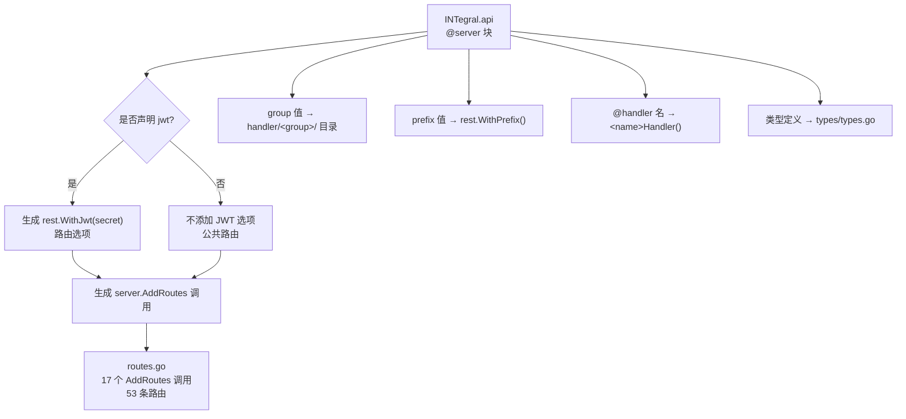
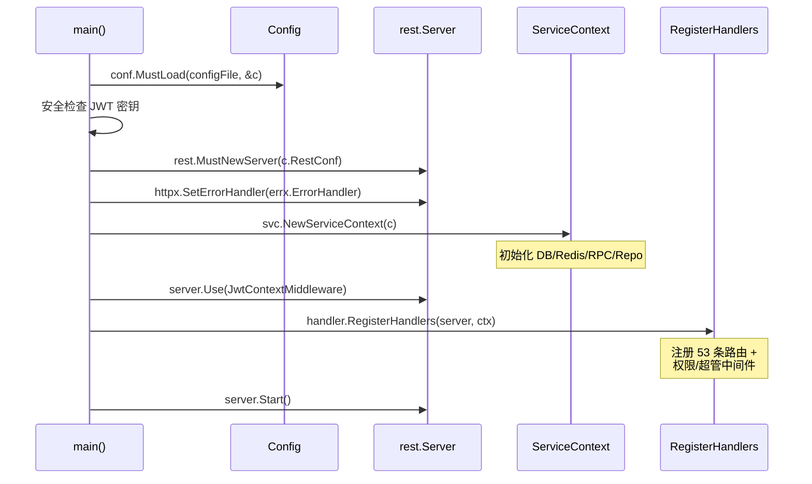

本文深入解析积分商城 API 网关层的核心入口——**`INTegral.api` 文件的语法结构、类型系统与路由声明**，以及 `goctl` 工具如何将这些声明编译为 `routes.go` 中的 53 条路由注册。你将理解从 `.api` 文本定义到运行时 HTTP 服务器的完整编译链路，以及项目中如何在此基础上叠加权限中间件实现细粒度访问控制。

Sources: [INTegral.api](app/api/INTegral.api#L1-L767)

## INTegral.api 文件的宏观结构

`INTegral.api` 是 go-zero 框架的 **API 定义语言（API Definition Language）** 文件，它以声明式方式描述了整个 HTTP API 的契约——包括请求/响应的类型签名、路由路径、HTTP 方法以及服务分组。该文件共 767 行，由两大区域组成：上半部分是 **类型定义区**（第 1–502 行），声明了所有请求与响应结构体；下半部分是 **路由定义区**（第 504–765 行），通过 `@server` + `service` 块将类型绑定到具体的 HTTP 端点。

整个文件的开头声明语法版本为 `v1`，这是 go-zero 目前唯一支持的 API 语法版本，决定了后续的类型声明语法和 `service` 块的解析规则。

Sources: [INTegral.api](app/api/INTegral.api#L1), [INTegral.api](app/api/INTegral.api#L504-L765)

### 类型定义区：13 个模块的请求/响应契约

类型定义区使用 `type ( ... )` 块组织，每个块以注释行标记所属业务模块。项目共定义了 **13 个类型块**，覆盖了认证、用户、小组、积分规则、积分申请、审核、积分账户、商品管理、兑换订单、通知、仪表盘、角色权限等全部业务领域。所有类型定义最终被 `goctl` 编译为 [types.go](app/api/INTernal/types/types.go) 中的 Go 结构体，供 Handler 和 Logic 层直接引用。

下表总结了各模块的类型定义规模与核心类型：

| 模块 | 核心请求类型 | 核心响应类型 | 典型字段特征 |
|------|-------------|-------------|-------------|
| 通用 | `IdReq`, `PageReq` | — | `path:"id"`, `form:"page,default=1"` |
| 认证 | `LoginReq`, `RegisterReq` | `LoginResp`, `UserInfo` | `validate:"required"`, 嵌套 `RoleBrief` |
| 用户 | `UpdateProfileReq`, `UserListReq` | `UserProfileResp`, `UserListResp` | `form:"keyword,optional"`, 积分余额字段 |
| 小组 | `CreateGroupReq`, `UpdateGroupReq` | `GroupResp`, `GroupListResp` | `path:"id"` 路径参数绑定 |
| 积分规则 | `CreateRuleReq`, `UpdateRuleReq` | `RuleResp`, `RuleListResp` | `validate:"required"`, 版本号/状态字段 |
| 积分申请 | `SubmitApplicationReq` | `ApplicationDetailResp` | `[]AttachmentItem` 数组嵌套, `*AiScoreInfo` 指针 |
| 审核 | `PendingReviewsReq`, `ReviewReq` | — | `path:"id"`, `json:"action"` |
| 积分账户 | `TransactionListReq` | `BalanceResp`, `TransactionListResp` | 余额/冻结/收入/支出四维数据 |
| 商品管理 | `CreateProductReq`, `UpdateProductReq` | `ProductResp`, `ProductListResp` | `form:"status,default=on_sale"` |
| 兑换订单 | `CreateOrderReq`, `OrderListReq` | `OrderDetailResp`, `OrderListResp` | `form:"role,optional"` 角色**视角**过滤 |
| 通知 | `NotificationListReq`, `MarkReadReq` | `NotificationListResp`, `UnreadCountResp` | `form:"is_read,optional"` 已读状态过滤 |
| 仪表盘 | — | `DashboardResp` | 全部字段 `optional`，按角色动态填充 |
| 角色权限 | `CreateRoleReq`, `AssignPermissionsReq` | `PermissionListResp`, `RoleListResp` | 按模块分组的权限列表 `PermissionModule` |

Sources: [INTegral.api](app/api/INTegral.api#L1-L502), [types.go](app/api/INTernal/types/types.go#L1-L527)

### 参数绑定标签的三种模式

go-zero 的 API 类型系统通过结构体标签实现 HTTP 参数的自动绑定与校验，本项目使用了三种核心标签模式：

**路径参数** — 使用 `path:"id"` 标签，从 URL 路径的 `:id` 段提取值。例如 `IdReq` 结构体中的 `Id INT64 \`path:"id"\``，它会自动匹配 `/applications/:id` 等路由中的动态路径段。

**查询参数** — 使用 `form:"page,default=1"` 标签，从 URL Query String 中提取值，并支持默认值声明。例如 `PageReq` 中的 `Page` 字段默认为 1，`PageSize` 默认为 20，这确保了分页接口即使未传参也不会出现零值问题。

**请求体参数** — 使用 `json:"email"` 标签，从 JSON 请求体中反序列化。`validate:"required"` 标签则声明了字段的必填校验规则，go-zero 在解析阶段会自动执行该校验。`optional` 后缀（如 `json:"avatar_url,optional"`）标记字段为可选，避免零值被序列化到 JSON 中。

Sources: [INTegral.api](app/api/INTegral.api#L5-L11), [INTegral.api](app/api/INTegral.api#L16-L24)

## 路由定义区：@server 块与 service 块的编译规则

路由定义区由 **12 个 `@server` 块** 组成，每个块包含一个 `service IntegralMall { ... }` 声明。`@server` 块是 go-zero API 语言的核心控制结构，它为内部的每条路由声明提供 **共享的元信息**：JWT 认证配置、代码生成的分组路径和 URL 前缀。

```
@server (
    jwt:    JwtAuth        // 启用 JWT 认证，对应 config 中的 JwtAuth 字段
    group:  application    // 代码生成到 handler/application/ 和 logic/application/ 目录
    prefix: /api/v1        // 所有路由自动添加 /api/v1 前缀
)
service IntegralMall {
    @handler SubmitApplication
    post /applications (SubmitApplicationReq) returns (ApplicationResp)

    @handler ListApplications
    get /applications (ApplicationListReq) returns (ApplicationListResp)
}
```

每个路由行遵循统一格式：`HTTP方法 路径 (请求类型) returns (响应类型)`。`@handler` 注解指定生成的 Handler 函数名。唯一不声明 `jwt` 的 `@server` 块是**认证路由**（`login` 和 `register`），它们作为公共端点无需 JWT Token 即可访问。

Sources: [INTegral.api](app/api/INTegral.api#L504-L611)

### 从 .api 到 routes.go 的编译映射

`goctl api go --api INTegral.api --dir .` 命令将 `.api` 文件编译为多个 Go 源文件。其中最关键的产物是 [routes.go](app/api/INTernal/handler/routes.go)——它将声明式路由转化为运行时的 `server.AddRoutes()` 调用。编译器遵循以下映射规则：



值得注意的是，`routes.go` 文件头部标注了 `// Code generated by goctl. DO NOT EDIT.`，但本项目在生成的基础上进行了**手动增强**——在 Handler 外层包裹了权限中间件，这是通过直接编辑 `routes.go` 实现的（go-zero 允许在生成代码上手动叠加中间件）。

Sources: [routes.go](app/api/INTernal/handler/routes.go#L1-L27), [INTegral.api](app/api/INTegral.api#L506-L516)

### 路由注册的三层安全模型

[routes.go](app/api/INTernal/handler/routes.go) 中的 17 次 `server.AddRoutes` 调用并非简单地一一对应 `.api` 中的 12 个 `@server` 块。开发者在生成代码基础上手动拆分了部分路由组，以实现 **三层递进的安全模型**：

| 安全层级 | 路由特征 | 实现方式 | 典型路由 |
|----------|---------|---------|---------|
| **公共路由** | 无 JWT，无权限检查 | `rest.WithPrefix` only | `POST /auth/login`, `POST /auth/register` |
| **认证路由** | JWT 验证，无额外权限 | `rest.WithJwt(...)` | `GET /points/balance`, `GET /notifications` |
| **权限路由** | JWT + PermissionMiddleware | `perm.Handle(handler)` | `POST /rules`, `PUT /groups/:id` |
| **超管路由** | JWT + SuperAdminMiddleware | `superAdmin.Handle(handler)` | `POST /admin/roles`, `PUT /admin/roles/:id/permissions` |

这种分层设计的关键实现手法是在 `RegisterHandlers` 函数顶部预创建中间件实例，然后在路由注册时按需包裹：

```go
adminPerm := middleware.NewPermissionMiddleware("page:admin:users")
rulePerm := middleware.NewPermissionMiddleware("page:admin:rules")
superAdmin := middleware.NewSuperAdminMiddleware()
```

每个 `PermissionMiddleware` 实例持有一个 `requiredPermission` 字符串，`Handle` 方法将原始 Handler 包装为带权限检查的 Handler。这种**声明式权限编码**（如 `"page:admin:users"`、`"page:review"`）使得路由级别的访问控制一目了然。

Sources: [routes.go](app/api/INTernal/handler/routes.go#L84-L89), [routes.go](app/api/INTernal/handler/routes.go#L366-L367), [permission_middleware.go](app/api/INTernal/middleware/permission_middleware.go#L15-L22)

## 完整路由表：53 个端点的模块化分布

下表按业务模块列出全部 53 个 API 端点的完整清单，标注了 HTTP 方法、路径、Handler 名称以及所需的安全层级：

| 模块 | 方法 | 路径 | Handler | 安全层级 |
|------|------|------|---------|---------|
| **认证** | POST | `/api/v1/auth/login` | `LoginHandler` | 公共 |
| | POST | `/api/v1/auth/register` | `RegisterHandler` | 公共 |
| **仪表盘** | GET | `/api/v1/dashboard` | `GetDashboardHandler` | JWT |
| **积分申请** | POST | `/api/v1/applications` | `SubmitApplicationHandler` | JWT |
| | GET | `/api/v1/applications` | `ListApplicationsHandler` | JWT |
| | GET | `/api/v1/applications/:id` | `GetApplicationHandler` | JWT |
| | POST | `/api/v1/applications/:id/resubmit` | `ResubmitApplicationHandler` | JWT |
| **小组** | GET | `/api/v1/groups` | `groupPerm → ListGroupsHandler` | JWT + `page:admin:groups` |
| | POST | `/api/v1/groups` | `groupPerm → CreateGroupHandler` | JWT + `page:admin:groups` |
| | PUT | `/api/v1/groups/:id` | `groupPerm → UpdateGroupHandler` | JWT + `page:admin:groups` |
| | DELETE | `/api/v1/groups/:id` | `groupPerm → DeleteGroupHandler` | JWT + `page:admin:groups` |
| **通知** | GET | `/api/v1/notifications` | `ListNotificationsHandler` | JWT |
| | PUT | `/api/v1/notifications/read` | `MarkNotificationsReadHandler` | JWT |
| | PUT | `/api/v1/notifications/read-all` | `MarkAllNotificationsReadHandler` | JWT |
| | GET | `/api/v1/notifications/unread-count` | `GetUnreadCountHandler` | JWT |
| **订单** | POST | `/api/v1/orders` | `CreateOrderHandler` | JWT |
| | GET | `/api/v1/orders` | `ListOrdersHandler` | JWT |
| | GET | `/api/v1/orders/:id` | `GetOrderHandler` | JWT |
| | PUT | `/api/v1/orders/:id/cancel` | `CancelOrderHandler` | JWT |
| | PUT | `/api/v1/orders/:id/complete` | `CompleteOrderHandler` | JWT |
| | PUT | `/api/v1/orders/:id/process` | `ProcessOrderHandler` | JWT |
| **积分** | GET | `/api/v1/points/balance` | `GetBalanceHandler` | JWT |
| | GET | `/api/v1/points/transactions` | `ListTransactionsHandler` | JWT |
| **商品** | GET | `/api/v1/products` | `ListProductsHandler` | JWT |
| | GET | `/api/v1/products/:id` | `GetProductHandler` | JWT |
| | POST | `/api/v1/products` | `productPerm → CreateProductHandler` | JWT + `page:admin:products` |
| | PUT | `/api/v1/products/:id` | `productPerm → UpdateProductHandler` | JWT + `page:admin:products` |
| | PUT | `/api/v1/products/:id/off-sale` | `productPerm → OffSaleProductHandler` | JWT + `page:admin:products` |
| **上传** | POST | `/api/v1/upload` | `UploadImageHandler` | JWT |
| **审核** | POST | `/api/v1/applications/:id/review` | `reviewPerm → ReviewApplicationHandler` | JWT + `page:review` |
| | GET | `/api/v1/reviews/pending` | `reviewPerm → ListPendingReviewsHandler` | JWT + `page:review` |
| **规则** | GET | `/api/v1/rules` | `ListRulesHandler` | JWT |
| | GET | `/api/v1/rules/:id` | `rulePerm → GetRuleHandler` | JWT + `page:admin:rules` |
| | POST | `/api/v1/rules` | `rulePerm → CreateRuleHandler` | JWT + `page:admin:rules` |
| | PUT | `/api/v1/rules/:id` | `rulePerm → UpdateRuleHandler` | JWT + `page:admin:rules` |
| | PUT | `/api/v1/rules/:id/disable` | `rulePerm → DisableRuleHandler` | JWT + `page:admin:rules` |
| | PUT | `/api/v1/rules/:id/enable` | `rulePerm → EnableRuleHandler` | JWT + `page:admin:rules` |
| | GET | `/api/v1/rules/:id/history` | `rulePerm → GetRuleHistoryHandler` | JWT + `page:admin:rules` |
| **用户** | GET | `/api/v1/users` | `adminPerm → ListUsersHandler` | JWT + `page:admin:users` |
| | POST | `/api/v1/users` | `adminPerm → CreateUserHandler` | JWT + `page:admin:users` |
| | PUT | `/api/v1/users/:id/groups` | `adminPerm → AssignGroupsHandler` | JWT + `page:admin:users` |
| | PUT | `/api/v1/users/:id/roles` | `adminPerm → AssignRolesHandler` | JWT + `page:admin:users` |
| **个人资料** | GET | `/api/v1/users/profile` | `GetUserProfileHandler` | JWT |
| | PUT | `/api/v1/users/profile` | `UpdateUserProfileHandler` | JWT |
| **权限** | GET | `/api/v1/admin/permissions` | `ListPermissionsHandler` | JWT |
| **角色管理** | GET | `/api/v1/admin/roles` | `superAdmin → ListRolesHandler` | JWT + 超管 |
| | POST | `/api/v1/admin/roles` | `superAdmin → CreateRoleHandler` | JWT + 超管 |
| | GET | `/api/v1/admin/roles/:id` | `superAdmin → GetRoleHandler` | JWT + 超管 |
| | PUT | `/api/v1/admin/roles/:id` | `superAdmin → UpdateRoleHandler` | JWT + 超管 |
| | DELETE | `/api/v1/admin/roles/:id` | `superAdmin → DeleteRoleHandler` | JWT + 超管 |
| | GET | `/api/v1/admin/roles/:id/permissions` | `superAdmin → GetRolePermissionsHandler` | JWT + 超管 |
| | PUT | `/api/v1/admin/roles/:id/permissions` | `superAdmin → AssignPermissionsHandler` | JWT + 超管 |
| **用户权限** | GET | `/api/v1/admin/users/:id/permissions` | `superAdmin → GetUserPermissionsHandler` | JWT + 超管 |

值得注意的是一个精细的设计决策：`GET /rules`（列表查询）只需 JWT 认证，而 `GET /rules/:id`（详情查询）却需要 `page:admin:rules` 权限——这是因为列表页面向普通用户展示公开的规则概览，而详情页可能包含评分标准等敏感信息。

Sources: [routes.go](app/api/INTernal/handler/routes.go#L28-L421)

## 服务启动：从配置到路由挂载的完整链路

[INTegralmall.go](app/api/INTegralmall.go) 是整个 API 网关的入口 `main` 函数，它编排了从配置加载到路由注册的完整启动流程：



启动过程中有几个关键设计点值得注意：

**JWT 密钥安全检查**（第 26–28 行）：在 `main` 函数中硬编码了默认密钥的检测逻辑，如果配置文件中的 `AccessSecret` 仍然是占位字符串，程序会直接 `panic` 退出，防止开发密钥泄露到生产环境。

**全局 JWT 上下文中间件**（第 39 行）：`server.Use(ctx.JwtContextMiddleware.Handle)` 注册了一个全局中间件，它会解析 JWT Token 并将用户信息（ID、角色、权限等）注入到 `context.Context` 中。这个中间件运行在所有路由之前，即使是没有声明 `jwt` 的公共路由也会执行——但它不会拒绝无 Token 的请求，只是不注入用户信息。

**统一错误处理器**（第 34 行）：`httpx.SetErrorHandler(errx.ErrorHandler)` 替换了 go-zero 默认的错误响应格式，统一为 `{"code": ..., "message": ..., "data": null}` 的信封结构，与 [response.go](app/api/INTernal/response/response.go) 中的成功响应格式保持一致。

Sources: [INTegralmall.go](app/api/INTegralmall.go#L19-L45), [response.go](app/api/INTernal/response/response.go#L11-L33)

## Handler 生成模板与自定义扩展

`goctl` 为每条路由生成一个独立的 Handler 文件，存放在 `handler/<group>/` 目录下。所有 Handler 遵循完全一致的代码模板：

```go
func XxxHandler(svcCtx *svc.ServiceContext) http.HandlerFunc {
    return func(w http.ResponseWriter, r *http.Request) {
        var req types.XxxReq
        if err := httpx.Parse(r, &req); err != nil {
            httpx.ErrorCtx(r.Context(), w, err)
            return
        }
        l := xxx.NewXxxLogic(r.Context(), svcCtx)
        resp, err := l.Xxx(&req)
        if err != nil {
            httpx.ErrorCtx(r.Context(), w, err)
        } else {
            response.OkJSON(w, resp)
        }
    }
}
```

这个模板体现了 go-zero 的 **Handler-Logic 分离** 原则：Handler 只负责 HTTP 协议层的解析与响应，所有业务逻辑委托给对应的 Logic 对象。Handler 文件头部标注了 `// Code scaffolded by goctl. Safe to edit.`，表示可以安全地在生成代码上修改——例如 [UploadImageHandler](app/api/INTernal/handler/upload/upload_image_handler.go) 就在标准模板基础上添加了 multipart 文件解析和 `ImagePrefix` 拼接逻辑。

Handler 通过闭包捕获 `svcCtx`（ServiceContext），而 ServiceContext 在启动时初始化了所有 RPC 客户端、数据库连接和 Repository 实例。这意味着 Logic 层可以通过 `svcCtx` 访问任何基础设施依赖，而无需关心它们的初始化过程。

Sources: [login_handler.go](app/api/INTernal/handler/auth/login_handler.go#L16-L32), [submit_application_handler.go](app/api/INTernal/handler/application/submit_application_handler.go#L16-L32), [upload_image_handler.go](app/api/INTernal/handler/upload/upload_image_handler.go#L16-L47)

## group 分组与代码组织的目录映射

`@server` 块中的 `group` 字段直接控制了代码生成的目录结构。本项目使用了 **13 个 group**，每个 group 对应一对 `handler/<group>/` 和 `logic/<group>/` 目录：

| group 值 | handler 目录 | logic 目录 | Handler 数量 |
|----------|-------------|-----------|-------------|
| `auth` | `handler/auth/` | `logic/auth/` | 2 |
| `user` | `handler/user/` | `logic/user/` | 6 |
| `group` | `handler/group/` | `logic/group/` | 4 |
| `rule` | `handler/rule/` | `logic/rule/` | 7 |
| `application` | `handler/application/` | `logic/application/` | 4 |
| `review` | `handler/review/` | `logic/review/` | 2 |
| `points` | `handler/points/` | `logic/points/` | 2 |
| `product` | `handler/product/` | `logic/product/` | 5 |
| `order` | `handler/order/` | `logic/order/` | 6 |
| `notification` | `handler/notification/` | `logic/notification/` | 4 |
| `dashboard` | `handler/dashboard/` | `logic/dashboard/` | 1 |
| `upload` | `handler/upload/` | `logic/upload/` | 1 |
| `admin` | `handler/admin/` | `logic/admin/` | 9 |

这种基于 group 的物理隔离使得每个模块的 Handler 和 Logic 代码在文件系统中完全独立，极大降低了多人协作时的文件冲突概率。值得注意的是 `admin` group 专门承载了角色权限管理的全部 Handler（9 个），它们在 `routes.go` 中被 `superAdmin` 中间件包裹，形成了最严格的安全层级。

Sources: [INTegral.api](app/api/INTegral.api#L506-L511), [routes.go](app/api/INTernal/handler/routes.go#L365-L420)

## 配置驱动：Config 结构与 .api 定义的对应关系

[config.go](app/api/INTernal/config/config.go) 中定义的 `Config` 结构体是连接配置文件与运行时的桥梁。`@server` 块中声明的 `jwt: JwtAuth` 直接对应 `Config.JwtAuth` 字段——`routes.go` 中通过 `serverCtx.Config.JwtAuth.AccessSecret` 将密钥传递给 `rest.WithJwt()` 选项。

配置文件 [INTegral_mall.yaml](app/api/etc/INTegral_mall.yaml) 定义了服务名称 `IntegralMall`，与 `.api` 文件中的 `service IntegralMall` 保持一致。`RestConf` 嵌套结构提供了 `Host`（`0.0.0.0`）和 `Port`（`8888`）的默认值，以及日志模式等运行时参数。四路 RPC 客户端配置（`UserRpc`、`PointsRpc`、`ProductRpc`、`OrderRpc`）通过 etcd 服务发现连接到后端微服务。

Sources: [config.go](app/api/INTernal/config/config.go#L9-L34), [INTegral_mall.yaml](app/api/etc/INTegral_mall.yaml#L1-L48), [service_context.go](app/api/INTernal/svc/service_context.go#L43-L70)

## 延伸阅读

- [JWT 认证中间件与上下文传递机制](12-jwt-ren-zheng-zhong-jian-jian-yu-shang-xia-wen-chuan-di-ji-zhi) — 深入理解全局 JWT 上下文中间件如何将 Token 解析结果注入到 `context.Context`
- [PermissionMiddleware 权限守卫的实现原理](13-permissionmiddleware-quan-xian-shou-wei-de-shi-xian-yuan-li) — 解析权限编码匹配、超级管理员放行与审计日志记录的完整流程
- [Handler / Logic / ServiceContext 三层架构与依赖注入](14-handler-logic-servicecontext-san-ceng-jia-gou-yu-yi-lai-zhu-ru) — 从 Handler 模板深入到 Logic 层的业务编排与 ServiceContext 的依赖注入模式
- [前后端契约驱动开发：goctl 类型生成与漂移检查](16-qian-hou-duan-qi-yue-qu-dong-kai-fa-goctl-lei-xing-sheng-cheng-yu-piao-yi-jian-cha) — 了解 `types.go` 如何被进一步编译为前端 TypeScript 类型定义