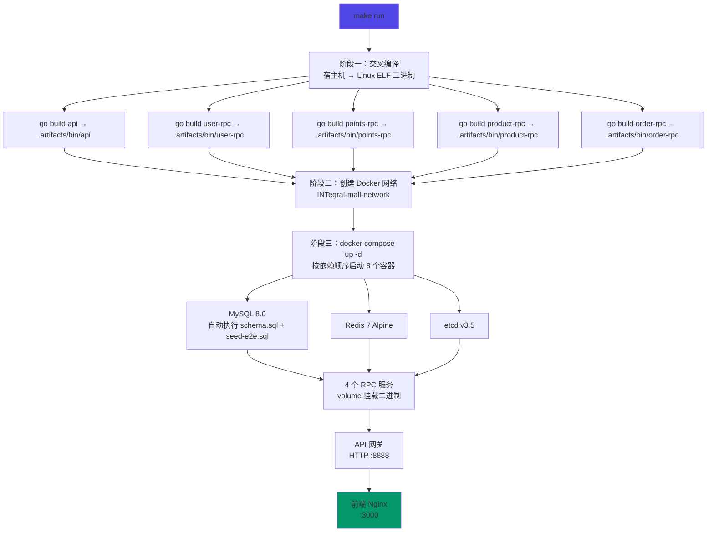
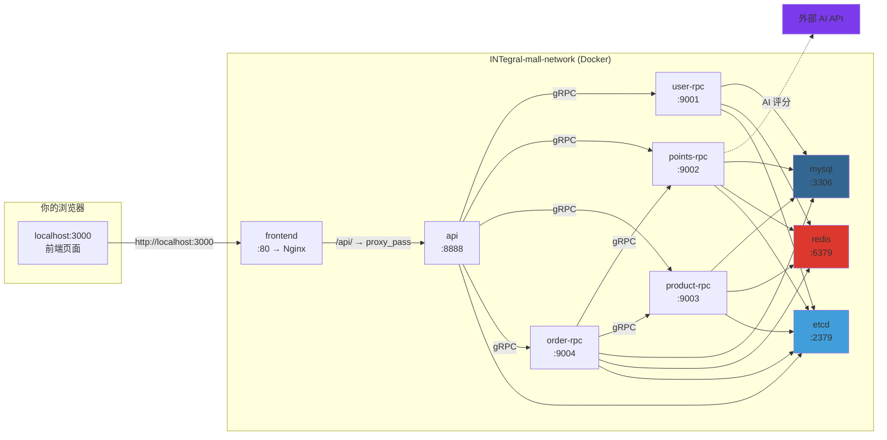

本文是一份面向新加入团队成员的**实操手册**，目标是从零到运行只需一条命令。你将了解本地开发环境所需的全部前置依赖、`make run` 背后发生的完整流程、启动后的服务拓扑与端口映射、可用的测试账号，以及日常开发中最常用的高效命令。

Sources: [README.md](README.md#L114-L170), [deploy/Makefile](deploy/Makefile#L33-L36)

## 环境前置依赖

在启动项目之前，请确认本地已安装以下工具。版本号来自项目的 `go.mod` 和 `frontend/package.json` 声明，低于最低版本可能出现编译或运行时错误。

| 工具 | 最低版本 | 验证命令 | 用途 |
|------|---------|---------|------|
| **Go** | 1.26+ | `go version` | 后端编译与交叉构建 |
| **Docker** | 24+ | `docker --version` | 运行 MySQL / Redis / etcd 等基础中间件 |
| **Docker Compose** | v2+ | `docker compose version` | 编排 8 个容器的一键启动 |
| **Node.js** | 22+ | `node --version` | 前端源码构建 |
| **pnpm** | 9+ | `pnpm --version` | 前端依赖管理 |
| **Make** | GNU Make | `make --version` | 执行 Makefile 中的构建/启动/测试命令 |

> **macOS 用户提示**：Docker Desktop for Mac 已内置 Docker Compose v2，安装 Docker Desktop 即可同时满足 Docker 和 Docker Compose 两项依赖。Go 可通过 `brew install go` 安装，Node.js + pnpm 推荐使用 `fnm` 或 `nvm` 管理。

Sources: [go.mod](go.mod#L3-L4), [frontend/package.json](frontend/package.json#L7-L8), [README.md](README.md#L117-L123)

## 一键启动：make run 的完整流程

从项目根目录执行以下命令即可完成从编译到全部服务上线的全过程：

```bash
cd INTegral_mall
make run
```

这条命令背后发生了什么？整个流程分为三个阶段：



**阶段一：宿主机交叉编译**。Makefile 在宿主机上执行 `CGO_ENABLED=0 GOOS=linux GOARCH=arm64/amd64 go build`，将 5 个 Go 服务编译为 Linux ELF 二进制文件，统一输出到 `.artifacts/bin/` 目录。这种"宿主机编译 + 容器挂载"的策略避免了在 Docker 内安装 Go 工具链，极大缩短了构建时间。

**阶段二：创建 Docker 网络**。`docker network create INTegral-mall-network` 创建一个共享网络，所有容器通过服务名（如 `mysql`、`redis`）互相访问，无需硬编码 IP。

**阶段三：按依赖顺序启动**。Docker Compose 根据 `depends_on` + `healthcheck` 条件确保启动顺序——MySQL / Redis / etcd 健康后启动 RPC 服务，RPC 服务健康后启动 API 网关，API 网关健康后启动前端。MySQL 容器初始化时自动执行 `docker-entrypoint-initdb.d/` 目录下的 `01-schema.sql`（建表 + 默认管理员）和 `02-seed-e2e.sql`（E2E 测试数据），数据库无需手动初始化。

Sources: [deploy/Makefile](deploy/Makefile#L5-L36), [deploy/docker-compose.yaml](deploy/docker-compose.yaml#L1-L263), [deploy/Dockerfile.local](deploy/Dockerfile.local#L1-L9)

## 服务拓扑与端口映射

启动完成后，你的本地环境运行着 8 个容器，它们之间的通信关系如下：



以下是各容器对外暴露的端口与默认配置：

| 容器名 | 对外端口 | 配置来源 | 默认值 |
|--------|---------|---------|--------|
| INTegral-mall-mysql | `${MYSQL_PORT:-3306}` | `deploy/.env` | 3306 |
| INTegral-mall-redis | `${REDIS_PORT:-6379}` | `deploy/.env` | 6379 |
| INTegral-mall-etcd | `${ETCD_PORT:-2379}` | `deploy/.env` | 2379 |
| INTegral-mall-api | `${API_PORT:-8888}` | `deploy/.env` | 8888 |
| INTegral-mall-frontend | `${FRONTEND_PORT:-3000}` | `deploy/.env` | 3000 |
| INTegral-mall-user-rpc | 无外部端口 | 内部 gRPC :9001 | — |
| INTegral-mall-points-rpc | 无外部端口 | 内部 gRPC :9002 | — |
| INTegral-mall-product-rpc | 无外部端口 | 内部 gRPC :9003 | — |
| INTegral-mall-order-rpc | 无外部端口 | 内部 gRPC :9004 | — |

所有端口均可在 `deploy/.env` 中自定义覆盖。RPC 服务通过 etcd 服务发现互相定位，不对外暴露端口。

Sources: [deploy/docker-compose.yaml](deploy/docker-compose.yaml#L1-L263), [deploy/.env](deploy/.env#L1-L29)

## 配置文件与环境变量

本地开发的配置体系由两层构成：**Docker Compose 环境变量**和**服务内部 YAML 配置**。

### 环境变量文件（deploy/.env）

`.env` 文件是所有可调参数的统一入口，Docker Compose 在启动时自动加载：

```bash
# deploy/.env 核心配置（节选）
MYSQL_ROOT_PASSWORD=root123      # MySQL root 密码
MYSQL_DATABASE=INTegral_mall     # 数据库名
MYSQL_USER=mall                  # 应用数据库用户
MYSQL_PASSWORD=mall123           # 应用数据库密码

AI_PROVIDER=minimax              # AI 评分供应商（minimax/zhipu/qwen/deepseek/kimi 等）
AI_ANTHROPIC_API_KEY=sk-xxx      # AI 服务密钥（Anthropic 兼容格式）
JWT_SECRET=change-me-jwt-secret-32-chars-min  # JWT 签名密钥
```

如果需要接入 AI 评分功能，只需修改 `.env` 中的 `AI_PROVIDER` 和对应的 `API_KEY` 即可。目前支持十余种国内主流 AI 模型，详见 `deploy/points-rpc-docker.yaml` 中的注释。

Sources: [deploy/.env](deploy/.env#L1-L29), [deploy/points-rpc-docker.yaml](deploy/points-rpc-docker.yaml#L16-L39)

### 配置注入机制：envsubst

各服务的 YAML 配置文件使用 `${VAR}` 占位符声明变量，容器启动时由 `entrypoint.sh` 调用 `envsubst` 进行运行时替换。以 API 网关配置为例：

```yaml
# deploy/api-docker.yaml（节选）
JwtAuth:
  AccessSecret: "${JWT_SECRET}"    # → 替换为 .env 中的 JWT_SECRET 值
ImagePrefix: "${IMAGE_PREFIX}"     # → 替换为 http://localhost:3000
```

这种模式确保了**敏感信息不硬编码在配置文件中**，同时同一份 YAML 模板可以在不同环境（本地 / 测试 / 生产）下通过不同的环境变量驱动不同的行为。

Sources: [deploy/api-docker.yaml](deploy/api-docker.yaml#L1-L49), [deploy/entrypoint.sh](deploy/entrypoint.sh#L1-L12)

## 测试账号与种子数据

系统启动后数据库已包含完整的种子数据，你可以直接使用以下账号登录体验各角色功能：

| 角色 | 邮箱 | 密码 | 核心能力 |
|------|------|------|---------|
| **系统管理员** | `admin@company.com` | `admin123` | 用户管理、角色分配、小组维护、全局设置 |
| **积分参与者** | `e2e_participant@test.com` | `admin123` | 提交积分申请、兑换商品、查看个人积分 |
| **小组审核员** | `e2e_reviewer@test.com` | `admin123` | 审核本小组的积分申请 |
| **总复核员** | `e2e_chief@test.com` | `admin123` | 最终复核所有积分申请 |
| **商家** | `e2e_merchant@test.com` | `admin123` | 商品上架、库存管理、订单履约 |
| **观察员** | `e2e_observer@test.com` | `admin123` | 只读浏览，无操作权限 |

种子数据还包含以下预置内容，方便你立即体验完整业务流程：

- **测试用户组**：E2E 测试A组、E2E 测试B组
- **示例商品**：低价（50 积分）、中价（200 积分）、高价（500 积分）、限量（1 件）、售罄
- **初始积分**：大部分测试账户预置 1000 可用积分
- **积分申请**：覆盖"已批准""待总复核""已拒绝""待 AI 评分"四种典型状态
- **兑换订单**：覆盖"待处理""处理中""已完成"三种流转状态

Sources: [deploy/schema.sql](deploy/schema.sql#L320-L332), [deploy/seeds/seed-e2e.sql](deploy/seeds/seed-e2e.sql#L1-L33), [frontend/e2e/TEST_ACCOUNTS.md](frontend/e2e/TEST_ACCOUNTS.md#L1-L23)

## 验证启动成功

启动完成后，按以下步骤逐一验证各组件是否正常运行：

**第一步：检查容器状态**

```bash
docker compose ps
```

所有 8 个容器的 STATUS 列应显示 `healthy`（约需 60-90 秒等待健康检查通过）。如果某个容器显示 `unhealthy`，可通过 `docker compose logs <服务名>` 查看具体错误。

**第二步：访问前端页面**

浏览器打开 http://localhost:3000，应看到积分商城登录页面。使用 `admin@company.com` / `admin123` 登录，进入管理后台。

**第三步：验证 API 网关**

```bash
curl http://localhost:8888/api/health 2>/dev/null || echo "API 正在运行但无 /health 端点（正常）"
```

**第四步：验证数据库连接**

```bash
docker compose exec mysql mysql -umall -pmall123 INTegral_mall -e "SELECT COUNT(*) AS table_count FROM information_schema.tables WHERE table_schema='INTegral_mall';"
```

预期输出约 14 张表（users, roles, permissions, products, exchange_orders 等）。

Sources: [deploy/docker-compose.yaml](deploy/docker-compose.yaml#L18-L22), [deploy/schema.sql](deploy/schema.sql#L1-L11)

## 日常开发命令速查

系统启动后，日常开发中最常用的操作是**修改代码 → 编译 → 重启**。以下是高频命令的速查表，所有命令均从项目根目录执行：

| 场景 | 命令 | 说明 |
|------|------|------|
| **首次启动** | `make run` | 编译 + 创建网络 + 启动全部容器 |
| **停止环境** | `make down` | 停止并移除所有容器（数据卷保留） |
| **修改后端代码后** | `cd deploy && make reload-points-rpc` | 仅编译并重启 points-rpc（其他服务同理） |
| **查看全部日志** | `make logs` | 实时跟踪所有容器日志（Ctrl+C 退出） |
| **查看单服务日志** | `cd deploy && make logs-api` | 仅查看 API 网关日志 |
| **重启某个服务** | `cd deploy && make restart-api` | 不重新编译，仅重启容器 |
| **重新编译全部** | `make build` | 交叉编译 5 个服务到 `.artifacts/bin/` |
| **运行后端测试** | `make test-backend` | 运行 Go 单元测试 |
| **运行前端测试** | `make test-frontend` | 运行 Vitest 单元测试 |
| **运行 E2E 测试** | `make test-e2e` | 运行 Playwright 端到端测试（需服务运行） |
| **数据库迁移** | `cd deploy && make migrate` | 重新执行 schema.sql |
| **查看帮助** | `make help` | 显示所有可用目标及说明 |

> **开发效率提示**：当你只修改了某个 RPC 服务的代码时，使用 `make reload-<服务名>` 而非 `make run`，可以将编译+重启的时间从全量构建的数分钟缩短到几秒钟。例如修改了积分相关逻辑后，只需 `cd deploy && make reload-points-rpc`。

Sources: [Makefile](Makefile#L1-L61), [deploy/Makefile](deploy/Makefile#L38-L59)

## 环境变量自定义参考

以下是 `deploy/.env` 中所有可配置项的完整说明。默认值已经可以正常启动，通常你只需要关注 AI 相关配置和端口冲突：

| 变量名 | 默认值 | 说明 |
|--------|--------|------|
| `MYSQL_ROOT_PASSWORD` | `root123` | MySQL root 账户密码 |
| `MYSQL_DATABASE` | `INTegral_mall` | 自动创建的数据库名 |
| `MYSQL_USER` | `mall` | 应用连接用户 |
| `MYSQL_PASSWORD` | `mall123` | 应用连接密码 |
| `MYSQL_PORT` | `3306` | MySQL 对外端口（若本地已装 MySQL 可改为 3307） |
| `REDIS_PORT` | `6379` | Redis 对外端口 |
| `ETCD_PORT` | `2379` | etcd 对外端口 |
| `API_PORT` | `8888` | API 网关对外端口 |
| `FRONTEND_PORT` | `3000` | 前端 Nginx 对外端口 |
| `AI_PROVIDER` | `minimax` | AI 评分供应商（不配置则 AI 评分降级为空） |
| `AI_MODEL` | `MiniMax-M2.7-highspeed` | AI 模型名称 |
| `AI_ANTHROPIC_API_KEY` | — | Anthropic 兼容格式的 API Key |
| `AI_ANTHROPIC_BASE_URL` | `https://api.minimaxi.com/anthropic` | Anthropic 兼容格式的 Base URL |
| `OPENAI_API_KEY` | — | OpenAI 兼容格式的 API Key |
| `OPENAI_BASE_URL` | `https://api.openai.com/v1` | OpenAI 兼容格式的 Base URL |
| `JWT_SECRET` | `change-me-jwt-secret-32-chars-min` | JWT 签名密钥 |
| `IMAGE_PREFIX` | `http://localhost:3000` | 图片 URL 前缀 |

Sources: [deploy/.env](deploy/.env#L1-L29)

## 常见问题排查

| 问题现象 | 可能原因 | 解决方案 |
|---------|---------|---------|
| 容器全部 `unhealthy` | Docker 资源不足 | 确保 Docker Desktop 分配 ≥ 4GB 内存，`docker system prune` 清理空间 |
| MySQL 容器启动失败 | 端口 3306 被占用 | 修改 `.env` 中 `MYSQL_PORT=3307` 或停止本地 MySQL |
| 前端页面白屏 | API 网关尚未就绪 | 等待 30 秒后刷新，或执行 `docker compose ps` 确认 api 容器状态 |
| `make run` 编译失败 | Go 版本过低 | 执行 `go version` 确认 ≥ 1.26 |
| AI 评分为空 | 未配置 API Key | 在 `deploy/.env` 中填写 `AI_ANTHROPIC_API_KEY` |
| 数据库数据丢失 | 执行了 `make clean` | `make clean` 会删除数据卷，需重新 `make run` |
| 权限被拒 (403) | 账号角色不匹配 | 使用对应角色的测试账号登录（参考上方账号表） |
| `docker compose` 命令不存在 | Docker Compose v1 | 升级 Docker Desktop 或安装 Docker Compose v2 插件 |

Sources: [deploy/Makefile](deploy/Makefile#L77-L80), [deploy/docker-compose.yaml](deploy/docker-compose.yaml#L18-L22)

## 清理与重置

当你需要彻底清理本地环境（例如数据库结构变更或测试数据污染），可以使用以下命令：

```bash
# 仅停止容器（保留数据库数据）
make down

# 彻底清理：删除二进制产物 + 停止容器 + 删除所有数据卷
# ⚠️ 数据库数据将全部丢失
cd deploy && make clean
```

清理后重新执行 `make run` 即可获得一个全新的环境。

Sources: [deploy/Makefile](deploy/Makefile#L77-L80)

## 下一步

环境就绪后，建议按以下顺序深入理解系统架构：

1. [微服务架构总览：API 网关与四路 RPC 的协作关系](3-wei-fu-wu-jia-gou-zong-lan-api-wang-guan-yu-si-lu-rpc-de-xie-zuo-guan-xi) — 理解 5 个服务的职责划分与通信方式
2. [数据库设计：14 张核心表的关联与约束](4-shu-ju-ku-she-ji-14-zhang-he-xin-biao-de-guan-lian-yu-yue-shu) — 掌握数据模型的全貌
3. [Makefile 构建入口与常用开发命令速查](27-makefile-gou-jian-ru-kou-yu-chang-yong-kai-fa-ming-ling-su-cha) — 更详细的构建系统说明
4. [Docker Compose 本地开发环境配置详解](25-docker-compose-ben-di-kai-fa-huan-jing-pei-zhi-xiang-jie) — 深入理解容器编排细节