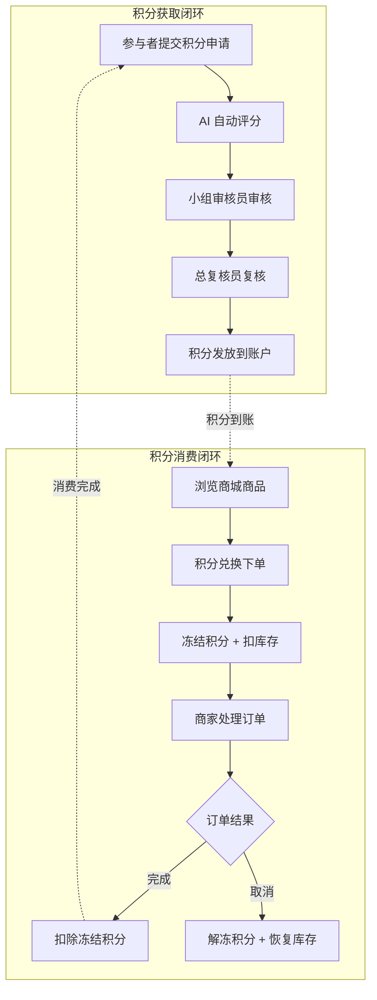
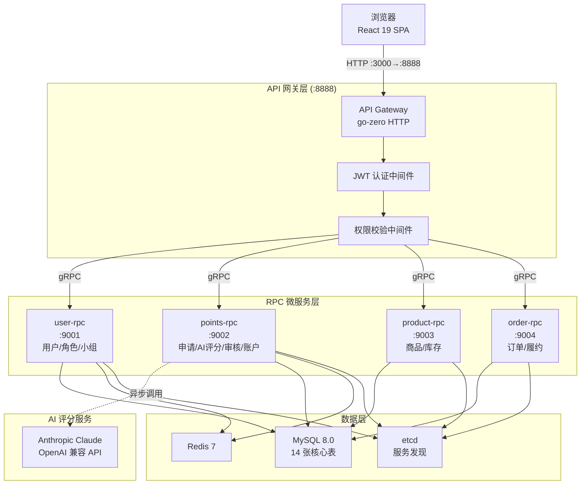

积分商城（Integral Mall）是一个面向企业内部的积分激励与商品兑换平台。它的核心命题是：**让员工的贡献被量化、被认可、被奖励**。系统通过「积分申请 → AI 智能评分 → 双级人工审核 → 积分发放 → 商品兑换」的完整闭环，将员工的技术贡献、培训学习、创新提案等行为转化为可量化的积分，再以积分兑换心仪商品，形成正向激励循环。本文将带你从业务视角出发，理解系统解决什么问题、服务哪些角色、运转哪些流程，以及代码仓库如何组织——为后续深入阅读奠定认知基础。

Sources: [README.md](README.md#L1-L5), [spec.md](specs/001-INTegral-mall/spec.md#L1-L7)

## 业务背景：为什么需要积分商城

在企业协作场景中，员工的许多贡献难以被直接衡量——一次架构设计评审、一份安全漏洞修复、一场跨团队培训——这些行为对企业有价值，却往往停留在"做了就做了"的状态。积分商城的核心价值正在于此：它提供了一套**标准化的贡献量化机制**，让每一份付出都能被记录、评分、认可、最终兑现为实物奖励。

从技术实现角度看，这个系统同时也是一个**金融级电商平台**的缩影：积分本质上是虚拟货币，兑换订单涉及资金冻结与解冻，库存管理需要防止超卖，多级审核要求严格的权限控制。因此，理解积分商城的业务模型，也是在理解一个完整的电商交易系统。

Sources: [DESIGN.md](docs/design/DESIGN.md#L24-L31), [spec.md](specs/001-INTegral-mall/spec.md#L1-L7)

## 五大角色与协作关系

系统预设了五种业务角色，每种角色在积分生命周期中承担不同职责。角色通过 RBAC（基于角色的访问控制）体系管理，支持一个用户拥有多个角色。

| 角色 | 编码 | 核心职责 | 典型操作 |
|------|------|----------|----------|
| **积分参与者** | `participant` | 提交积分申请、兑换商品 | 填写申请表、浏览商城、兑换下单、查看积分明细 |
| **小组积分审核员** | `reviewer` | 审核本小组的积分申请 | 查看待审核队列、通过/驳回申请、参考 AI 评分意见 |
| **总积分复核员** | `chief_reviewer` | 最终复核所有积分申请 | 跨小组复核、调整积分分数、确认发放 |
| **商品商家** | `merchant` | 上架管理商品、处理订单 | 创建商品、管理库存、处理兑换订单、完成履约 |
| **系统管理员** | `admin` / `super_admin` | 用户管理、角色分配、规则维护 | 创建用户、分配角色/小组、管理积分规则 |

一个关键的设计决策是：**用户可以同时拥有多个角色**。例如，一位技术主管可能既是 `reviewer`（审核团队成员的积分申请）又是 `participant`（自己也可以提交积分申请）。前端通过统一仪表盘按角色聚合展示各功能模块入口，用户无需切换身份即可在不同职责之间流转。

Sources: [schema.sql](deploy/schema.sql#L34-L53), [types.go](pkg/consts/types.go#L17-L25)

## 两大核心业务闭环

积分商城的业务运转围绕两个紧密咬合的闭环展开：**积分获取闭环**和**积分消费闭环**。前者创造积分供给，后者实现积分价值兑现，两者形成完整的激励飞轮。



### 积分获取闭环：从贡献到积分

**积分申请**是整个积分流转的起点。参与者选择一条积分规则、填写行为描述和证明材料后提交申请，系统将自动调用外部 LLM API（Anthropic Claude / OpenAI 兼容）对申请内容与规则进行匹配分析，返回建议分数和匹配度。AI 评分结果仅供审核员参考，不影响最终审批。随后申请进入双级审核流程：先由小组成员所在的小组审核员审核，通过后自动流转至总复核员进行最终复核。复核通过后，积分自动发放到参与者的积分账户。

申请状态在整个过程中遵循严格的线性流转：

| 状态 | 含义 | 触发条件 |
|------|------|----------|
| `pending_ai_review` | 待 AI 评分 | 申请刚提交 |
| `pending_group_review` | 待小组审核 | AI 评分完成（或标记不可用） |
| `pending_final_review` | 待总复核 | 小组审核通过 |
| `approved` | 已通过 | 总复核通过，积分已发放 |
| `rejected` | 已驳回 | 任一级审核驳回 |
| `resubmitted` | 已重新提交 | 驳回后参与者补充说明重新提交 |

Sources: [status.go](pkg/consts/status.go#L4-L11), [spec.md](specs/001-INTegral-mall/spec.md#L41-L103), [spec.md](specs/001-INTegral-mall/spec.md#L307-L365)

### 积分消费闭环：从积分到奖励

**积分兑换**实现了积分的价值兑现。参与者在商城浏览商品后，使用积分兑换心仪物品。兑换过程采用**冻结机制**保证事务安全：下单时先冻结对应积分并扣减商品库存；订单完成后冻结积分转为正式扣除；若商家取消订单，则冻结积分立即解冻退还、库存同步恢复。

积分账户模型设计为三个关键字段：`available_points`（可用积分）、`frozen_points`（冻结积分）、`total_earned` / `total_spent`（累计获取/消费）。通过乐观锁（`version` 字段）保障并发场景下的数据一致性。

订单状态流转同样遵循严格的状态机：

| 状态 | 含义 | 触发条件 |
|------|------|----------|
| `pending` | 待处理 | 用户下单成功 |
| `processing` | 处理中 | 商家开始处理 |
| `completed` | 已完成 | 商家确认完成 |
| `cancelled` | 已取消 | 商家取消（积分解冻退还） |

Sources: [status.go](pkg/consts/status.go#L14-L19), [schema.sql](deploy/schema.sql#L227-L239), [spec.md](specs/001-INTegral-mall/spec.md#L226-L284)

## 技术栈全景

积分商城采用 **Go 微服务后端 + React 单页前端** 的前后端分离架构，以下为完整技术选型：

| 层级 | 技术 | 说明 |
|------|------|------|
| 后端语言 | Go 1.26.1 | 高并发、编译型语言 |
| API 框架 | go-zero | HTTP 网关 + 4 个 gRPC 微服务 |
| ORM | GORM | Go 生态主流 ORM，支持乐观锁 |
| 数据库 | MySQL 8.0 | 关系型存储，utf8mb4 字符集 |
| 缓存 | Redis 7 | 会话缓存、服务发现辅助 |
| 服务发现 | etcd | gRPC 服务注册与发现 |
| 前端框架 | React 19 + TypeScript | 组件化 SPA，类型安全 |
| UI 组件库 | Ant Design 6 | 企业级组件，深度主题定制 |
| 状态管理 | Zustand | 轻量级状态管理 |
| 构建工具 | Vite | 快速 HMR，生产优化 |
| 包管理器 | pnpm | 高效磁盘利用 |
| 容器化 | Docker Compose（本地）/ Kubernetes（生产） | 标准化部署 |
| CI/CD | GitLab CI → Jenkins → Kubernetes | 自动化构建与部署 |
| AI 评分 | Anthropic Claude / OpenAI 兼容 API | 外部 LLM 调用 |

系统当前版本为 **1.0.0.0**，状态为**生产就绪**。后端拥有约 105 个测试文件、13,330 行测试代码，核心模块覆盖率超过 85%；前端拥有 14 个测试文件、69 个单元测试以及 147 个 Playwright E2E 测试用例。

Sources: [README.md](README.md#L9-L24), [go.mod](go.mod#L1-L5), [VERSION](VERSION#L1-L1), [CHANGELOG.md](CHANGELOG.md#L15-L41)

## 系统架构总览

系统由 **1 个 API 网关 + 4 个 RPC 微服务** 组成，通过 etcd 实现服务注册与发现。前端 React 应用通过 HTTP 请求访问 API 网关，网关负责 JWT 认证、RBAC 权限校验后，将请求通过 gRPC 路由到对应的 RPC 服务。



五个服务的职责划分清晰：

| 服务 | 端口 | 职责范围 |
|------|------|----------|
| **api**（HTTP 网关） | 8888 | 统一鉴权、路由分发、请求聚合 |
| **user-rpc** | 9001 | 用户管理、角色管理、小组管理、权限管理 |
| **points-rpc** | 9002 | 积分申请、AI 评分、审核流程、积分账户、积分规则 |
| **product-rpc** | 9003 | 商品 CRUD、库存管理、状态控制 |
| **order-rpc** | 9004 | 兑换订单、积分冻结/解冻、商家履约 |

Sources: [README.md](README.md#L28-L46), [schema.sql](deploy/schema.sql#L1-L10)

## 仓库结构导览

项目采用**单仓库（monorepo）** 结构，后端 Go 代码、前端 React 代码、部署配置和文档统一管理在一个 Git 仓库中。以下是顶层目录的功能定位：

```
INTegral_mall/
├── app/api/                 # HTTP API 网关（handler / logic / middleware / svc）
├── app/rpc/                 # 4 个 gRPC 微服务（user / points / product / order）
├── model/                   # GORM 数据模型 + Repository 层（14 张表的模型定义）
├── pkg/                     # 跨服务公共库（常量 / 错误码 / JWT / 通知 / 工具）
├── frontend/                # React 前端（pages / components / stores / api / theme）
├── deploy/                  # 部署配置（Docker Compose / Dockerfile / 种子 SQL）
├── k8s/                     # Kubernetes 配置（base + overlays/staging/production）
├── scripts/                 # 构建与测试脚本（backend / frontend / e2e / contracts）
├── docs/                    # 仓库级文档（设计规范 / 测试用例 / 部署指南）
├── specs/                   # 功能基线规格（spec / tasks / progress）
├── openspec/                # 增量变更提案（OpenSpec 规范）
├── Makefile                 # 项目根构建入口
├── go.mod                   # Go 模块定义
└── VERSION                  # 当前版本号
```

后端代码遵循 go-zero 框架的 **Handler → Logic → ServiceContext** 三层架构。Handler 负责参数解析与响应序列化，Logic 承载业务逻辑，ServiceContext 通过依赖注入管理 RPC 客户端、数据库连接等基础设施。前端代码按照 **pages（页面）→ components（组件）→ stores（状态）→ api（接口）** 的层次组织，18 个页面覆盖了从登录注册到管理后台的完整功能。

Sources: [README.md](README.md#L49-L110), [Makefile](Makefile#L1-L61)

## 数据库核心表概览

系统使用 14 张核心表支撑全部业务，可分为五大领域：

| 领域 | 核心表 | 说明 |
|------|--------|------|
| **用户与权限** | `users`、`roles`、`user_roles`、`permissions`、`role_permissions`、`groups`、`user_groups` | 7 张表构成完整的 RBAC 体系，支持双模式认证（LDAP / 本地密码） |
| **积分规则** | `points_rules`、`points_rules_history` | 规则定义 + 版本快照，规则修改时自动保存历史版本 |
| **积分申请与审核** | `points_applications`、`review_records` | 申请表包含 AI 评分结果字段 + 规则快照；审核记录按级别追踪 |
| **积分账户与流水** | `points_accounts`、`points_transactions` | 账户表含乐观锁版本号；流水表记录 earn/freeze/unfreeze/spend 四种变动类型 |
| **商品与订单** | `products`、`exchange_orders` | 商品含库存与状态管理；订单含商品快照与积分冻结关联 |

一个值得注意的设计细节：积分申请表 `points_applications` 中使用 JSON 字段保存 `rule_snapshot`（规则快照），确保即使规则后续被修改或禁用，已有申请仍按提交时的规则版本处理。订单表 `exchange_orders` 同样保存 `product_snapshot`（商品快照），实现同样的历史不可变性。

Sources: [schema.sql](deploy/schema.sql#L1-L332), [spec.md](specs/001-INTegral-mall/spec.md#L287-L304)

## 前端页面架构

前端共 18 个页面，通过 React Router 实现基于权限的路由守卫。所有认证后的页面共享 `MainLayout` 布局，包含顶部导航和侧边栏。路由按功能区域分为四大块：

| 功能区 | 页面 | 权限控制 |
|--------|------|----------|
| **公共页面** | 仪表盘、商品商城、积分中心、通知中心、个人设置 | 登录即可访问 |
| **申请流程** | 申请列表、提交申请、申请详情 | 登录即可访问 |
| **审核工作台** | 待审核列表、审核详情 | `page:review` 权限守卫 |
| **管理后台** | 用户管理、小组管理、规则管理、商品管理、订单管理、角色管理 | 各自独立的 `page:admin:*` 权限守卫 |

前端路由使用 `lazy()` 实现代码分割，首屏仅加载公共页面代码，管理后台和审核页面按需加载，优化首屏性能。

Sources: [index.tsx](frontend/src/router/index.tsx#L1-L101)

## 测试体系概览

项目建立了三层测试防线，确保从单元到端到端的质量覆盖：

| 测试层级 | 框架 | 规模 | 运行命令 |
|----------|------|------|----------|
| 后端单元测试 | Go testing + testify + go-sqlmock | ~105 文件 / ~13,330 行 | `make test-backend` |
| 前端单元测试 | Vitest | 14 文件 / 69 测试 | `make test-frontend` |
| E2E 端到端测试 | Playwright | 147 用例 | `make test-e2e` |

后端测试采用 Mock 辅助策略，通过 `go-sqlmock` 模拟数据库行为，使得各 Logic 层的单元测试无需真实数据库即可运行。E2E 测试使用预置的种子数据（`deploy/seeds/seed-e2e.sql`），覆盖了完整的用户注册、积分申请、审核、兑换、订单处理等业务流程。

Sources: [CHANGELOG.md](CHANGELOG.md#L36-L41), [seed-e2e.sql](deploy/seeds/seed-e2e.sql#L1-L7), [PROGRESS.md](specs/001-INTegral-mall/PROGRESS.md#L19-L24)

## 阅读路线推荐

作为入门开发者，建议按照以下顺序逐步深入：

**第一阶段：动手运行**
1. [本地环境搭建与一键启动指南](2-ben-di-huan-jing-da-jian-yu-jian-qi-dong-zhi-nan) — 把系统跑起来，用四个测试账号体验完整业务流程

**第二阶段：理解架构**
2. [微服务架构总览：API 网关与四路 RPC 的协作关系](3-wei-fu-wu-jia-gou-zong-lan-api-wang-guan-yu-si-lu-rpc-de-xie-zuo-guan-xi) — 理解请求如何从浏览器流转到数据库
3. [数据库设计：14 张核心表的关联与约束](4-shu-ju-ku-she-ji-14-zhang-he-xin-biao-de-guan-lian-yu-yue-shu) — 对照本文的表概览，深入理解表结构和外键关系

**第三阶段：深入核心业务**
4. [积分申请全流程：提交 → AI 评分 → 双级审核 → 积分发放](6-ji-fen-shen-qing-quan-liu-cheng-ti-jiao-ai-ping-fen-shuang-ji-shen-he-ji-fen-fa-fang) — 积分获取闭环的完整实现
5. [兑换订单：积分冻结、库存扣减与事务一致性保障](8-dui-huan-ding-dan-ji-fen-dong-jie-ku-cun-kou-jian-yu-shi-wu-zhi-xing-bao-zhang) — 积分消费闭环的事务安全
6. [RBAC 权限系统：角色、权限编码与中间件鉴权](9-rbac-quan-xian-xi-tong-jiao-se-quan-xian-bian-ma-yu-zhong-jian-jian-quan) — 理解权限如何控制页面和接口访问