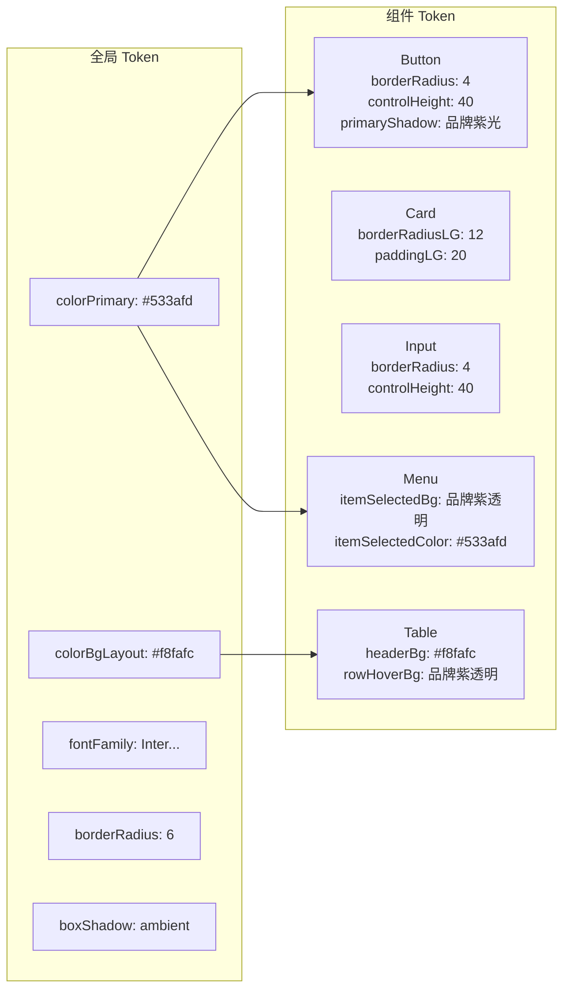

积分商城是一个**金融级电商平台**——用户使用积分（虚拟货币）兑换商品。UI 设计需要在"专业可信"与"温暖亲切"之间取得平衡。项目团队选择了一套 **Stripe 占 80%（金融信任层）+ Airbnb 占 20%（体验温暖层）** 的融合策略，通过 Ant Design 的 `ConfigProvider` 主题机制 + CSS 变量双层体系，将这套设计理念精确落地到每一个组件像素中。本文将带你从设计理念出发，逐层拆解主题系统的架构、令牌（Token）体系、Ant Design 集成方式，以及在实际组件中的应用方法。

Sources: [DESIGN.md](docs/design/DESIGN.md#L1-L46)

## 设计理念：为什么是 Stripe + Airbnb？

Stripe 的设计语言传递的是**金融级可信度**——深海军蓝的标题、蓝调多层阴影、轻盈的 300 字重、克制的圆角——用户看到这个界面，潜意识里会觉得"钱放在这里是安全的"。而 Airbnb 的设计语言传递的是**愉悦的探索感**——大圆角商品卡片、图像驱动的浏览体验、温暖的辅助色——用户浏览商品时会觉得"兑换是一种奖励，而不是消费"。两者的融合比例经过精心权衡：

| 层级 | 来源 | 占比 | 应用场景 |
|------|------|------|----------|
| **金融层** | Stripe | 80% | 色彩系统、阴影系统、排版规范、按钮样式、数据展示 |
| **体验层** | Airbnb | 20% | 商品卡片布局、分类浏览体验、温暖品牌调性 |

这个 80/20 比例体现在具体的视觉决策上：按钮和输入框使用 Stripe 风格的 4px 圆角，而商品卡片则采用 Airbnb 风格的 12px 大圆角；阴影系统中，金融数据卡片使用 Stripe 的蓝调多层阴影，商品卡片使用 Airbnb 的三层温暖阴影。

Sources: [DESIGN.md](docs/design/DESIGN.md#L26-L45)

## 主题系统架构：三层令牌传递机制

整个主题系统由三个核心文件构成，它们各司其职，形成清晰的层级传递关系：

```mermaid
flowchart TD
    A["<b>tokens.ts</b><br/>设计令牌源头<br/>TypeScript 常量"] -->|导入| B["<b>antd-theme.ts</b><br/>Ant Design 主题配置<br/>ThemeConfig 对象"]
    A -->|直接引用| C["<b>布局组件</b><br/>sidebar.tsx / header.tsx<br/>inline style 使用 tokens"]
    B -->|ConfigProvider| D["<b>App.tsx</b><br/>全局注入主题"]
    E["<b>global.css</b><br/>CSS 变量 + 全局重置<br/>+ Ant Design 组件覆盖"] -->|import| F["<b>main.tsx</b><br/>应用入口"]
    D --> G["<b>Ant Design 组件</b><br/>自动继承主题"]
    F --> G
    E -->|var(--xxx)| H["<b>业务组件 CSS</b><br/>points-badge.css<br/>product-card.css 等"]
    A -.->|同一份值| E
```

理解这个架构的关键在于：**[tokens.ts](frontend/src/theme/tokens.ts)** 是唯一的"真理之源"（Single Source of Truth），它用 TypeScript 常量定义了所有设计值。**[antd-theme.ts](frontend/src/theme/antd-theme.ts)** 将这些值转换为 Ant Design 的 `ThemeConfig` 对象，通过 React 的 `ConfigProvider` 在运行时注入到所有 Ant Design 组件中。**[global.css](frontend/src/theme/global.css)** 则将同样的值注册为 CSS 自定义属性（CSS Variables），供自定义业务组件的 CSS 文件引用。两者保持数值同步，确保 Ant Design 组件和手写 CSS 组件的视觉表现完全一致。

Sources: [tokens.ts](frontend/src/theme/tokens.ts#L1-L157), [antd-theme.ts](frontend/src/theme/antd-theme.ts#L1-L28), [global.css](frontend/src/theme/global.css#L1-L10), [App.tsx](frontend/src/App.tsx#L1-L14), [main.tsx](frontend/src/main.tsx#L1-L10)

## 令牌体系详解：七大设计维度

`tokens.ts` 将设计规范拆解为七个独立的令牌维度，每个维度都是一个 `as const` 的 TypeScript 常量对象，既提供了类型安全，也确保了值不可变。以下逐一解析。

### 色彩系统

色彩令牌是最复杂也是最关键的维度，包含 6 个语义分组：

| 分组 | 用途 | 代表值 | 设计来源 |
|------|------|--------|----------|
| **品牌色** | CTA 按钮、交互强调 | `brand: '#533afd'` | Stripe 品牌紫 |
| **功能色** | 成功/警告/错误状态 | `success: '#15be53'` | Stripe 语义色 |
| **中性色** | 标题/正文/辅助文字 | `textBody: '#64748b'` | Stripe 文字层级 |
| **表面色** | 页面/卡片/弹出层背景 | `bgPage: '#f8fafc'` | Stripe 浅灰白 |
| **边框色** | 默认/悬停/品牌边框 | `border: '#e5edf5'` | Stripe 淡蓝灰 |
| **积分色** | 积分图标/增减标记 | `points: '#533afd'` | 业务专属 |
| **温暖色** | 限时促销/抢购按钮 | `warmRed: '#ff385c'` | Airbnb 标志红 |

一个值得注意的设计决策是**功能色都使用了半透明背景**（如 `successBg: 'rgba(21, 190, 83, 0.12)'`），而不是浅色纯色。这种做法源自 Stripe 的设计规范——半透明背景在不同底色上都能自然融合，避免视觉割裂。

Sources: [tokens.ts](frontend/src/theme/tokens.ts#L10-L56)

### 阴影系统：蓝调多层阴影的哲学

阴影令牌是 Stripe 设计系统最显著的视觉特征。它不是简单的灰色投影，而是采用了**蓝调阴影**——阴影色值使用 `rgba(50, 50, 93, ...)` 而非纯黑色，呼应品牌色调，营造"品牌氛围感"。系统分为 5 个层级：

| 层级 | 变量名 | 用途 | 特征 |
|------|--------|------|------|
| 0 - 平面 | 无阴影 | 页面背景 | — |
| 1 - 环境 | `ambient` | 微妙卡片 Lift | 灰调，极其克制 |
| 2 - 标准 | `standard` | 标准卡片面板 | 灰调，中等扩散 |
| 3 - 提升 | `elevated` | 下拉菜单、精选卡片 | **蓝调 + 负扩散** |
| 4 - 深层 | `deep` | 模态框、浮层 | 蓝调，高浓度 |

其中**负扩散**（如 `-30px` 的 spread 值）是一个精妙的技巧——它确保阴影垂直延伸但不会超出元素水平范围，保持视觉干净。此外，交互状态还有专属阴影：`buttonHover` 使用品牌紫色光晕 `rgba(83, 58, 253, 0.35)`，`focus` 使用浅紫焦点环 `#b9b9f9`。Airbnb 贡献了 `cardAirbnb` 和 `cardHover` 两个温暖阴影，专门用于商品卡片。

Sources: [tokens.ts](frontend/src/theme/tokens.ts#L84-L103), [DESIGN.md](docs/design/DESIGN.md#L272-L329)

### 圆角与排版

圆角系统遵循"功能组件用小圆角（Stripe），展示组件用大圆角（Airbnb）"的融合原则。按钮/输入框使用 4px，数据卡片使用 6px，商品卡片使用 12px，标签徽章使用药丸形 9999px。排版方面，Inter 字体搭配 300 字重（标题的轻盈自信感）是 Stripe 的标志性选择，而等宽字体 `SF Mono / Fira Code` 配合 `tabular-nums` OpenType 特性则确保积分数字始终等宽对齐。

Sources: [tokens.ts](frontend/src/theme/tokens.ts#L59-L143), [global.css](frontend/src/theme/global.css#L133-L138)

## Ant Design 集成：ConfigProvider + 组件级定制

### 全局 Token 注入

在 [App.tsx](frontend/src/App.tsx) 中，`ConfigProvider` 作为最外层的主题容器，接收 `antdTheme` 配置对象注入到整棵组件树。`antdTheme` 在 [antd-theme.ts](frontend/src/theme/antd-theme.ts) 中定义，结构上对应 Ant Design 5.x 的 `ThemeConfig` 接口，分为 `token`（全局级）和 `components`（组件级）两个层级：



全局 `token` 设置了基础调性：品牌色 `#533afd`、页面背景 `#f8fafc`、Inter 字体、6px 默认圆角。组件级 Token 则针对每个 Ant Design 组件做精细调整——比如 `Button` 的圆角回退到 4px（Stripe 风格）、高度统一为 40px、主按钮拥有品牌紫色光晕阴影；`Table` 的表头背景使用 `#f8fafc`、行悬停使用 `rgba(83, 58, 253, 0.04)` 的品牌紫透明色；`Menu` 的选中项背景和文字色都使用品牌紫。这种双层配置确保了 Ant Design 组件在开箱即用的同时，视觉上已经融入了 Stripe + Airbnb 设计系统。

Sources: [antd-theme.ts](frontend/src/theme/antd-theme.ts#L119-L301), [App.tsx](frontend/src/App.tsx#L1-L14)

### CSS 变量与组件覆盖

Ant Design 的 `ThemeConfig` 机制虽然强大，但无法覆盖所有视觉细节——比如按钮的渐变背景、卡片的悬停动画等。这时 [global.css](frontend/src/theme/global.css) 中的 CSS 覆盖就发挥作用了。它做了三件事：

1. **注册 CSS 变量**——将所有令牌值注册为 `:root` 下的 CSS 自定义属性（如 `--color-brand: #533afd`），使手写 CSS 组件也能引用同一套设计值
2. **全局基础重置**——设置 `box-sizing`、字体渲染优化、自定义滚动条样式
3. **Ant Design 组件 CSS 覆盖**——针对 `.ant-card`、`.ant-btn-primary`、`.ant-modal-content` 等类名添加渐变背景、悬停动画等 ThemeConfig 无法表达的样式

```css
/* global.css 中的关键覆盖示例 */

/* 主按钮渐变 —— ThemeConfig 无法设置渐变 */
.ant-btn-primary {
  background: linear-gradient(135deg, #533afd 0%, #6b5ce7 100%);
  border: none;
  box-shadow: 0 4px 14px rgba(83, 58, 253, 0.35);
}

/* 卡片悬停 —— Airbnb 式 Lift 效果 */
.ant-card:hover {
  box-shadow: var(--shadow-card-hover);
  transform: translateY(-2px);
}
```

Sources: [global.css](frontend/src/theme/global.css#L201-L289)

## 在业务组件中应用主题令牌

### 方式一：布局组件直接引用 TypeScript 令牌

对于使用 inline style 的布局组件（如侧边栏、顶部栏），直接从 `tokens.ts` 导入令牌对象即可。以侧边栏为例：

```tsx
import { tokens } from '@/theme/tokens'

// 在 JSX 的 style 属性中直接使用
<div style={{ borderBottom: `1px solid ${tokens.sidebar.border}` }}>
  <span style={{ color: tokens.color.brand, fontWeight: 700 }}>积分商城</span>
</div>
```

这种方式的优点是 TypeScript 类型检查，如果令牌名拼错会在编译期报错。[sidebar.tsx](frontend/src/layouts/main-layout/sidebar.tsx)、[header.tsx](frontend/src/layouts/main-layout/header.tsx)、[index.tsx](frontend/src/layouts/main-layout/index.tsx) 三个布局组件都采用了这种方式。

Sources: [sidebar.tsx](frontend/src/layouts/main-layout/sidebar.tsx#L18-L199), [header.tsx](frontend/src/layouts/main-layout/header.tsx#L7-L84), [index.tsx](frontend/src/layouts/main-layout/index.tsx#L6-L28)

### 方式二：业务组件通过 CSS 变量引用

对于有独立 CSS 文件的业务组件（如积分徽章、状态标签、商品卡片），通过 `var(--xxx)` 引用全局 CSS 变量。这是更推荐的做法，因为 CSS 变量天然支持浏览器调试和动态主题切换。以下是积分徽章组件的示例：

```css
/* points-badge.css */
.points-badge {
  background: var(--color-points-bg);       /* 积分专属半透明紫 */
  border-radius: var(--radius-pill);        /* 药丸形圆角 */
  color: var(--color-points);               /* 品牌紫文字 */
}
.points-badge__value {
  font-family: var(--font-mono);            /* 等宽数字字体 */
  font-feature-settings: "tnum";            /* 等宽数字特性 */
}
```

Sources: [points-badge.css](frontend/src/components/points-badge.css#L1-L71)

### 各组件的设计系统应用一览

| 组件 | 主要使用的令牌 | 设计来源 | 特色效果 |
|------|----------------|----------|----------|
| **积分徽章** | `--color-points-*`、`--radius-pill`、`--font-mono` | Stripe 数字展示 | 等宽积分数字 + 药丸形容器 |
| **状态标签** | `--status-color`、`--radius-pill` | Stripe 语义色 | 通过 CSS 变量覆盖实现多状态变体 |
| **商品卡片** | `--shadow-card-*`、`--radius-card`、`--color-warm-red` | Airbnb 商品展示 | 12px 大圆角 + Airbnb 三层阴影 + 悬停上浮 |
| **页面头部** | `--color-heading`、`--font-weight: 300` | Stripe 排版 | 轻盈 300 字重标题 + 面包屑导航 |
| **空状态** | 品牌紫渐变按钮 | Stripe CTA | 渐变按钮 + 品牌紫光晕阴影 |

Sources: [status-badge.css](frontend/src/components/status-badge.css#L1-L71), [product-card.css](frontend/src/components/product-card.css#L1-L232), [page-header.css](frontend/src/components/page-header.css#L1-L100), [empty-state.css](frontend/src/components/empty-state.css#L1-L75)

## 设计系统的分层哲学

理解本项目的主题定制，最终要回到一个核心问题：**为什么需要 TypeScript 令牌 + CSS 变量双轨制？** 答案在于 React 生态中两类组件的并存。Ant Design 组件通过 `ThemeConfig` 接收配置（运行时，JavaScript 侧），而自定义业务组件通过 CSS 文件声明样式（编译时，CSS 侧）。`tokens.ts` 作为唯一的真理之源，同时向两条管道输出相同的值——保证了"改一处，全局生效"的一致性。

当你需要为积分商城创建新组件时，推荐的做法是：在 `tokens.ts` 中确认所需的令牌值是否已存在，然后在组件 CSS 中通过 `var(--xxx)` 引用。如果令牌不存在，先在 `tokens.ts` 和 `global.css` 中同步添加，再在组件中使用——这样所有组件都能从统一的设计语言中受益。

Sources: [tokens.ts](frontend/src/theme/tokens.ts#L145-L157), [global.css](frontend/src/theme/global.css#L12-L94)

## 延伸阅读

- **[公共组件库：积分徽章、状态标签与商品卡片](19-gong-gong-zu-jian-ku-ji-fen-hui-zhang-zhuang-tai-biao-qian-yu-shang-pin-qia-pian)** — 深入了解每个业务组件如何具体应用这套设计令牌
- **[React 19 应用架构：路由、状态管理与权限守卫](15-react-19-ying-yong-jia-gou-lu-you-zhuang-tai-guan-li-yu-quan-xian-shou-wei)** — 了解主题系统如何嵌入到整体 React 应用架构中
- **[前端 Vitest 单元测试与组件测试实践](24-qian-duan-vitest-dan-yuan-ce-shi-yu-zu-jian-ce-shi-shi-jian)** — 了解如何为遵循设计系统的组件编写测试