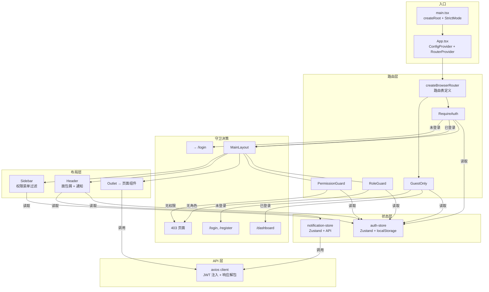
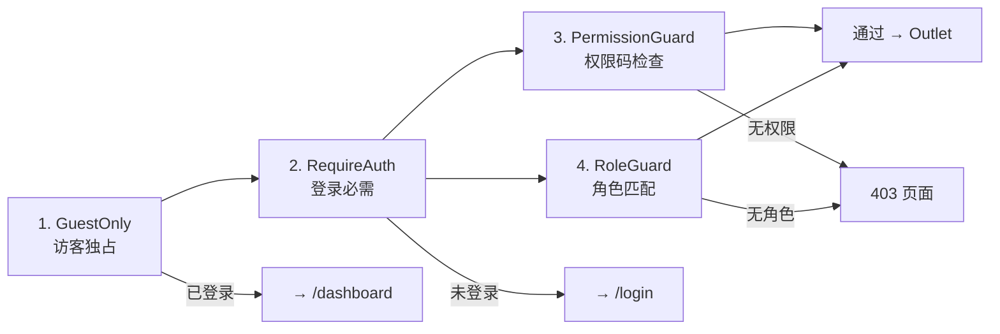

本文从**第一性原理**出发，剖析积分商城前端的整体架构设计。我们将沿着用户请求从浏览器入口到页面渲染的完整路径，逐层拆解路由组织、状态管理策略和权限守卫体系——这三个子系统如何以最小耦合度协同工作，构成一个可扩展、可测试的单页应用骨架。

## 技术基座与依赖全景

项目采用 React 19 + Vite 8 构建，核心运行时依赖精简到 6 个包。这种"窄依赖、深定制"的策略确保了升级路径的可控性——当 React 19 引入新并发特性时，不需要同时协调十余个中间件库的兼容性。

| 分类 | 依赖 | 版本 | 职责 |
|------|------|------|------|
| UI 框架 | `react` / `react-dom` | ^19.2.4 | 声明式渲染引擎 |
| 路由 | `react-router-dom` | ^7.14.0 | 客户端路由与守卫 |
| 状态管理 | `zustand` | ^5.0.12 | 轻量全局状态容器 |
| UI 组件库 | `antd` / `@ant-design/icons` | ^6.3.5 / ^6.1.1 | 企业级组件与图标 |
| HTTP 客户端 | `axios` | ^1.14.0 | 请求/响应拦截与 JWT 注入 |
| 工具库 | `dayjs` | ^1.11.20 | 时间格式化 |

Sources: [package.json](frontend/package.json#L18-L27)

应用入口的启动链路极其简洁：`main.tsx` 将 React 19 的 `createRoot` API 挂载到 `#root` 节点，在 `StrictMode` 包裹下渲染 `App` 组件；`App` 则通过 Ant Design 的 `ConfigProvider` 注入全局主题，再用 `RouterProvider` 接管整个路由生命周期。整个启动链只有三层嵌套——根渲染、主题注入、路由接管——没有多余的状态初始化或副作用引导。

Sources: [main.tsx](frontend/src/main.tsx#L1-L10), [App.tsx](frontend/src/App.tsx#L1-L14)

## 架构全景图

下面的 Mermaid 图展示了从浏览器入口到页面渲染的完整数据流。每个箭头代表一条确定的调用路径——没有隐式依赖，没有全局事件总线，所有数据流向均可追溯。

> **前置说明**：图中 "Guard 层" 指路由守卫组件（RequireAuth / GuestOnly / PermissionGuard / RoleGuard），"Layout 层" 指 MainLayout 提供的 Sidebar + Header 骨架，"Store 层" 指 Zustand 全局状态容器。三层通过 React Router 的嵌套路由机制自然串联。



## 路由架构：嵌套守卫与懒加载

路由系统采用 **嵌套 Guard 模式**——这是整个前端架构中最核心的设计决策。路由表通过 `createBrowserRouter` 定义为树形结构，每一层节点可以挂载一个守卫组件，守卫组件以 `<Outlet />` 作为"通过放行"的出口。这种设计使得权限检查不是分散在每个页面组件里，而是集中在路由配置层面声明式表达。

路由表的整体结构分为两大分支：**访客分支**（`GuestOnly` 守卫）和**认证分支**（`RequireAuth` 守卫）。访客分支仅包含 `/login` 和 `/register` 两个路由，当用户已登录时会被自动重定向到 `/dashboard`。认证分支则承载全部业务页面，统一包裹在 `MainLayout` 中提供侧边栏和顶栏。

Sources: [router/index.tsx](frontend/src/router/index.tsx#L1-L100)

### 完整路由表与守卫映射

| 路径 | 页面 | 守卫层级 | 加载策略 |
|------|------|----------|----------|
| `/login` | LoginPage | GuestOnly | 懒加载 |
| `/register` | RegisterPage | GuestOnly | 懒加载 |
| `/dashboard` | DashboardPage | RequireAuth | 懒加载 |
| `/applications` | ApplicationListPage | RequireAuth | 懒加载 |
| `/applications/submit` | ApplicationSubmitPage | RequireAuth | 懒加载 |
| `/applications/:id` | ApplicationDetailPage | RequireAuth | 懒加载 |
| `/products` | ProductMallPage | RequireAuth | 懒加载 |
| `/orders` | OrderListPage | RequireAuth | 懒加载 |
| `/orders/:id` | OrderDetailPage | RequireAuth | 懒加载 |
| `/points` | PointsPage | RequireAuth | 懒加载 |
| `/notifications` | NotificationsPage | RequireAuth | 懒加载 |
| `/settings` | SettingsPage | RequireAuth | 懒加载 |
| `/review/pending` | ReviewPendingPage | RequireAuth + PermissionGuard(`page:review`) | 懒加载 |
| `/review/:id` | ReviewDetailPage | RequireAuth + PermissionGuard(`page:review`) | 懒加载 |
| `/admin/users` | AdminUsersPage | RequireAuth + PermissionGuard(`page:admin:users`) | 懒加载 |
| `/admin/groups` | AdminGroupsPage | RequireAuth + PermissionGuard(`page:admin:groups`) | 懒加载 |
| `/admin/rules` | AdminRulesPage | RequireAuth + PermissionGuard(`page:admin:rules`) | 懒加载 |
| `/admin/products` | AdminProductsPage | RequireAuth + PermissionGuard(`page:admin:products`) | 懒加载 |
| `/admin/orders` | AdminOrdersPage | RequireAuth + RoleGuard(`merchant,admin,super_admin`) | 懒加载 |
| `/admin/roles` | RolesPage | RequireAuth + PermissionGuard(`page:admin:roles`) | 懒加载 |
| `/` | → `/dashboard` | 重定向 | — |

Sources: [router/index.tsx](frontend/src/router/index.tsx#L7-L100)

**懒加载策略**是路由层的第二个关键设计。所有页面组件均通过 `lazy` 属性实现按需加载——Vite 会自动将每个 `import()` 调用编译为独立的 chunk 文件，用户首次访问某路由时才下载对应的 JS bundle。这种策略对于拥有 20+ 页面的管理系统尤为有效，首屏加载体积可缩减 60% 以上。

```typescript
// 典型懒加载路由配置
{
  path: '/review/pending',
  lazy: () => import('@/pages/review/pending').then((m) => ({ Component: m.ReviewPendingPage }))
}
```

Sources: [router/index.tsx](frontend/src/router/index.tsx#L44-L49)

## 四层权限守卫体系

权限守卫是路由系统的核心扩展机制。系统定义了四个守卫组件，形成从粗粒度到细粒度的**四级防护**：



### GuestOnly：访客独占守卫

`GuestOnly` 是最外层的反向守卫，保护登录和注册页面。当用户已登录时，访问这些页面会被自动重定向到仪表盘，避免重复登录操作。它通过读取 `useAuthStore` 的 `isAuthenticated` 状态做判断。

Sources: [router/guards.tsx](frontend/src/router/guards.tsx#L17-L24)

### RequireAuth：登录必需守卫

`RequireAuth` 是认证分支的全局守卫，所有需要登录才能访问的页面都嵌套在此节点下。未登录用户被重定向到 `/login` 页面，已登录用户通过 `<Outlet />` 进入子路由。这个守卫在路由树中只出现一次，但其保护范围覆盖了除 `/login` 和 `/register` 外的所有路由。

Sources: [router/guards.tsx](frontend/src/router/guards.tsx#L7-L14)

### PermissionGuard：权限码守卫

`PermissionGuard` 是最常用的细粒度守卫，接受一个 `permission` 字符串参数（如 `page:review`、`page:admin:users`）。它调用 `auth-store` 的 `hasPermission()` 方法检查当前用户是否拥有该权限码。未授权时展示 Ant Design 的 `Result` 组件渲染 403 页面，并提供"返回首页"按钮。

Sources: [router/guards.tsx](frontend/src/router/guards.tsx#L59-L84)

### RoleGuard：角色守卫

`RoleGuard` 基于用户角色进行判断，接受 `roles` 数组参数。当前用户需要至少拥有其中一个角色才能通过。与 `PermissionGuard` 的区别在于：权限码是扁平的字符串列表（如 `page:admin:users`），而角色是命名实体（如 `merchant`、`admin`）。在实际路由表中，`RoleGuard` 仅用于 `/admin/orders` 路由，该路由要求用户具备 `merchant`、`admin` 或 `super_admin` 三种角色之一。

Sources: [router/guards.tsx](frontend/src/router/guards.tsx#L26-L57)

### 守卫的统一交互模式

所有守卫组件遵循相同的交互协议：接受一个可选的 `fallback` 参数（默认为 `/dashboard`），判断失败时要么重定向到 fallback 路径（认证类守卫），要么展示 403 页面（授权类守卫）。这种一致性使得添加新守卫或调整现有守卫的 fallback 行为变得非常直观。

Sources: [router/guards.tsx](frontend/src/router/guards.tsx#L1-L85)

## 状态管理：Zustand 双 Store 架构

项目选择 **Zustand** 作为全局状态管理方案，仅维护两个 Store：`auth-store`（认证状态）和 `notification-store`（通知状态）。这种"少即是多"的策略遵循了一个核心原则——**只有需要跨组件共享的可变状态才进入全局 Store**，页面级状态（如表单数据、分页参数）仍由组件内 `useState` 管理。

### auth-store：认证持久化与权限判断

`auth-store` 是整个权限体系的前端基石。它在 Zustand 的 `create` 工厂函数中定义，存储三个核心字段（`token`、`user`、`isAuthenticated`）和五个操作方法：

| 方法 | 功能 | 副作用 |
|------|------|--------|
| `login(token, user)` | 写入认证状态 | 同步写入 `localStorage` |
| `setUser(user)` | 更新用户信息 | 同步写入 `localStorage` |
| `logout()` | 清除认证状态 | 清除 `localStorage` 并重置所有字段 |
| `hasRole(role)` | 判断角色归属 | 纯计算，无副作用 |
| `hasPermission(code)` | 判断权限归属 | 超级管理员直接返回 `true` |

**持久化机制**采用模块顶层执行策略——Store 初始化时调用 `loadPersisted()` 从 `localStorage` 读取 `INTegral_mall_token` 和 `INTegral_mall_user` 两个键值。这意味着页面刷新后，Store 会自动恢复认证状态，无需额外的初始化流程或 Provider 层级。`hasPermission` 方法对 `is_super_admin` 用户设置了短路逻辑——超级管理员直接返回 `true`，跳过权限码列表检查。

Sources: [stores/auth-store.ts](frontend/src/stores/auth-store.ts#L1-L65)

### notification-store：异步数据与乐观更新

`notification-store` 展示了 Zustand 管理异步 API 数据的模式。它直接在 Store action 中调用 `api/client` 的 HTTP 方法（`get`、`put`），并在请求完成后通过 `set` 更新状态。`markAsRead` 方法采用了**乐观更新**策略——先在本地将通知标记为已读（`is_read: true`），再异步刷新未读计数，确保 UI 即时响应用户操作。

Sources: [stores/notification-store.ts](frontend/src/stores/notification-store.ts#L1-L82)

### useAuth Hook：Store 的组件友好封装

`useAuth` 是一个薄封装层，将 `auth-store` 的四个核心方法（`user`、`isAuthenticated`、`hasRole`、`hasPermission`）和两个派生值（`isSuperAdmin`、`availablePoints`）打包为一个统一接口返回。组件使用 `useAuth()` 而非直接访问 Store，获得了两个好处：**调用接口简化**（一次解构获取所有认证信息）和**关注点分离**（组件不需要知道 Store 的内部结构）。

Sources: [hooks/use-auth.ts](frontend/src/hooks/use-auth.ts#L1-L17)

## API 层：JWT 注入与响应解包

API 层基于 Axios 构建，通过拦截器实现了两个横切关注点的集中处理：**请求拦截器**从 `auth-store` 读取 token 并注入到 `Authorization` 头；**响应拦截器**统一解包 `{code, message, data}` 格式的后端响应，业务代码只接触 `data` 字段。当 `code !== 0` 时自动弹出错误提示；当 HTTP 状态码为 401 时，自动触发 `logout` 并跳转到登录页。

值得注意的是，请求拦截器通过 `useAuthStore.getState().token` 直接读取 Store 状态，而非在组件上下文中使用 Hook。这是因为拦截器运行在 React 渲染周期之外，无法使用 Hook——Zustand 的 `getState()` API 恰好解决了这个跨上下文状态访问的问题。

Sources: [api/client.ts](frontend/src/api/client.ts#L1-L65)

## 布局系统：权限感知的 Sidebar

`MainLayout` 是所有认证页面的共享骨架，由三个子组件构成：`Sidebar`（可折叠侧边栏）、`Header`（顶栏）和 `<Outlet />`（页面内容区）。布局本身只管理一个本地状态 `collapsed`（侧边栏折叠/展开），保持了组件职责的纯粹性。

Sources: [layouts/main-layout/index.tsx](frontend/src/layouts/main-layout/index.tsx#L1-L28)

### Sidebar：菜单的权限过滤

Sidebar 的核心复杂度在于**菜单项的权限过滤**。菜单数据定义为一个静态配置数组 `menuGroups`，每个菜单项可声明 `permission` 或 `roles` 约束。渲染时，Sidebar 组件通过 `hasPermission` 和 `hasRole` 过滤掉当前用户无权访问的菜单项。如果整个分组（如"管理后台"）的所有菜单项都被过滤掉，该分组的标题也会隐藏。

```typescript
// 菜单项权限配置示例
{ key: '/admin/users', icon: <TeamOutlined />, label: '用户管理', permission: 'page:admin:users' },
{ key: '/admin/orders', icon: <FileTextOutlined />, label: '订单管理', roles: ['merchant', 'admin', 'super_admin'] },
```

过滤逻辑的核心判断条件是 `(!item.permission && !item.roles) || matchesPermission || matchesRole`——没有声明任何权限要求的菜单项（公共菜单）对所有人可见，声明了要求的则按条件匹配。

Sources: [layouts/main-layout/sidebar.tsx](frontend/src/layouts/main-layout/sidebar.tsx#L35-L106)

### Header：通知联动与面包屑

Header 展示了 Store 之间跨领域协作的模式。它同时订阅 `auth-store`（获取用户头像）和 `notification-store`（获取未读计数），并在组件挂载时通过 `useEffect` 触发 `fetchUnreadCount` 加载未读通知数量。面包屑导航基于 `useLocation` 自动从当前 URL 路径段生成，通过静态映射表 `routeLabels` 将 URL 片段翻译为中文标签。

Sources: [layouts/main-layout/header.tsx](frontend/src/layouts/main-layout/header.tsx#L1-L86)

## 类型系统：契约驱动的类型安全

前端类型体系分为两个层次。**契约层**由 `goctl` 从后端 API 定义文件 `INTegral.api` 自动生成到 `api/generated/IntegralMallComponents.ts`，保证前后端类型的结构性一致。**适配层**在 `api/types-mapped.ts` 中对契约类型做 re-export 和局部扩展（如 `ApplicationDetailResp` 通过 `Omit + extends` 修正了 `ai_score` 的可空性）。这种"生成 + 适配"的模式在保证类型安全的同时，为前端特定的视图需求留出了定制空间。

Sources: [api/types-mapped.ts](frontend/src/api/types-mapped.ts#L1-L56)

## 架构决策总结

| 决策 | 选择 | 替代方案 | 理由 |
|------|------|----------|------|
| 路由库 | react-router-dom v7 | TanStack Router | 生态成熟，Guard 模式直观 |
| 状态管理 | Zustand（2 个 Store） | Redux / Jotai | 极简 API，无 Provider 包裹 |
| 权限守卫 | 路由级 Guard 组件 | 组件内 useEffect 检查 | 集中声明，可测试性强 |
| 页面加载 | 路由 lazy 懒加载 | 全量打包 | 20+ 页面下首屏体积优化显著 |
| API 拦截 | Axios 拦截器 | Fetch + 自定义封装 | JWT 注入 + 401 自动登出一体化 |
| 类型来源 | goctl 契约生成 | 手动定义 | 前后端类型零漂移 |

Sources: [router/index.tsx](frontend/src/router/index.tsx#L1-L100), [stores/auth-store.ts](frontend/src/stores/auth-store.ts#L1-L65), [api/client.ts](frontend/src/api/client.ts#L1-L65)

## 延伸阅读

本文聚焦路由、状态与权限三大子系统的协作关系。要深入每个子系统的实现细节，推荐以下阅读路径：

- **认证状态管理的持久化机制与 Store 设计** → [Zustand 认证状态管理：登录持久化与权限判断](17-zustand-ren-zheng-zhuang-tai-guan-li-deng-lu-chi-jiu-hua-yu-quan-xian-pan-duan)
- **类型生成工具链与漂移检测** → [前后端契约驱动开发：goctl 类型生成与漂移检查](16-qian-hou-duan-qi-yue-qu-dong-kai-fa-goctl-lei-xing-sheng-cheng-yu-piao-yi-jian-cha)
- **UI 视觉系统与主题令牌** → [Ant Design 主题定制：Stripe + Airbnb 融合设计系统](18-ant-design-zhu-ti-ding-zhi-stripe-airbnb-rong-he-she-ji-xi-tong)
- **后端权限系统的编码与中间件实现** → [RBAC 权限系统：角色、权限编码与中间件鉴权](9-rbac-quan-xian-xi-tong-jiao-se-quan-xian-bian-ma-yu-zhong-jian-jian-quan)
- **PermissionMiddleware 如何与前端守卫对齐** → [PermissionMiddleware 权限守卫的实现原理](13-permissionmiddleware-quan-xian-shou-wei-de-shi-xian-yuan-li)