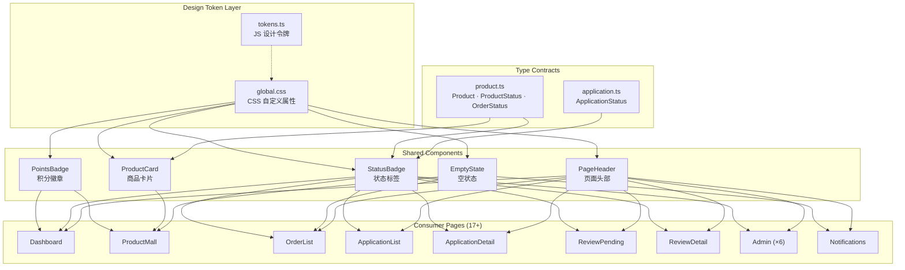
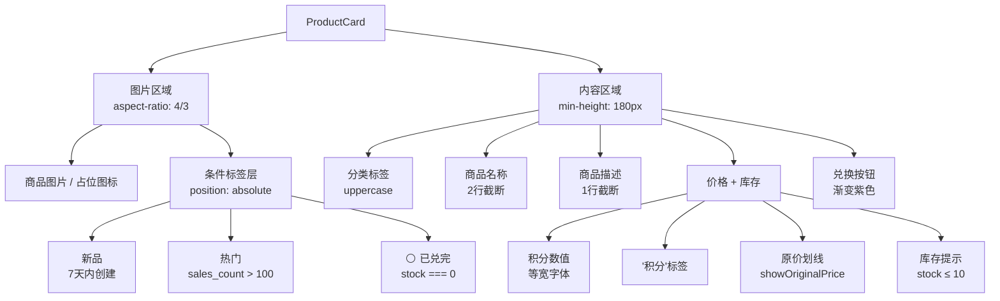

积分商城前端在 `frontend/src/components/` 目录下维护了 **五个核心公共组件**——PointsBadge（积分徽章）、StatusBadge（状态标签）、ProductCard（商品卡片）、EmptyState（空状态）和 PageHeader（页面头部）。这组组件遵循 **Stripe (80%) + Airbnb (20%) 融合设计系统**，通过 CSS 自定义属性（Design Tokens）实现视觉一致性，是整个应用 UI 层的原子积木。每个组件均为纯函数式 React 组件，零外部状态依赖，仅通过 Props 驱动渲染，确保在 Dashboard、商品商城、订单管理、审核流程等 **17+ 个页面** 中可安全复用。

Sources: [points-badge.tsx](frontend/src/components/points-badge.tsx#L1-L63), [status-badge.tsx](frontend/src/components/status-badge.tsx#L1-L187), [product-card.tsx](frontend/src/components/product-card.tsx#L1-L139), [empty-state.tsx](frontend/src/components/empty-state.tsx#L1-L59), [page-header.tsx](frontend/src/components/page-header.tsx#L1-L61)

---

## 组件架构总览

下面的 Mermaid 图展示了五个公共组件的层次关系及其依赖的数据类型和设计令牌系统：



Sources: [tokens.ts](frontend/src/theme/tokens.ts#L1-L158), [global.css](frontend/src/theme/global.css#L1-L94), [product.ts](frontend/src/types/product.ts#L1-L80), [application.ts](frontend/src/types/application.ts#L1-L86)

---

## PointsBadge — 积分徽章

**PointsBadge** 是积分商城中最高频使用的展示组件，负责将数值型的积分数量格式化为带有图标和标签的药丸形徽章。它出现在 Dashboard 头部、商品商城余额区、兑换确认弹窗等多个场景。

### Props 接口

| 属性 | 类型 | 默认值 | 说明 |
|------|------|--------|------|
| `value` | `number` | —（必填） | 积分数值 |
| `size` | `'sm' \| 'md' \| 'lg'` | `'md'` | 尺寸变体 |
| `showIcon` | `BOOLEAN` | `true` | 是否显示左侧 SVG 图标 |
| `showLabel` | `BOOLEAN` | `true` | 是否显示"积分"文字后缀 |
| `className` | `string` | `''` | 额外 CSS 类名 |

Sources: [points-badge.tsx](frontend/src/components/points-badge.tsx#L3-L14)

### 核心实现机制

组件的核心逻辑集中在两个层面：**数字格式化**和**BEM 风格类名组合**。`value.toLocaleString('zh-CN')` 使用浏览器原生国际化 API 自动添加千分位分隔符（如 `50000` → `"50,000"`），避免了手动正则处理的边界问题。类名拼接采用 **BEM 命名 + 变体修饰符**模式 `points-badge points-badge--${size}`，通过 `size` prop 切换三档尺寸的 `padding`、`font-size` 和图标尺寸。

Sources: [points-badge.tsx](frontend/src/components/points-badge.tsx#L25-L59)

### 尺寸变体与样式参数

| 变体 | padding | font-size | 图标尺寸 | 典型场景 |
|------|---------|-----------|----------|----------|
| `sm` | `2px 8px` | `0.75rem (12px)` | `12×12` | 弹窗内嵌、表格行内 |
| `md` | `4px 12px` | `0.875rem (14px)` | `16×16` | 通用展示（默认） |
| `lg` | `6px 16px` | `1rem (16px)` | `20×20` | 页面头部余额展示 |

积分数值使用 `font-family: var(--font-mono)` 等宽字体族，并启用 `font-feature-settings: "tnum"` 和 `font-variant-numeric: tabular-nums` 确保数字在表格和列表中对齐时列宽一致——这是金融类 UI 的标准实践。

Sources: [points-badge.css](frontend/src/components/points-badge.css#L1-L71)

### 实际使用模式

在商品兑换确认弹窗中，PointsBadge 展示了它的灵活性——**消耗积分**显示完整三件套（图标 + 数值 + 标签），而**兑换后余额**则通过 `showIcon={false}` 关闭图标，视觉上区分"成本"与"结果"：

```tsx
// 消耗积分 — 完整展示
<PointsBadge value={product.required_points} size="sm" />

// 兑换后余额 — 精简展示
<PointsBadge value={availablePoints - product.required_points} size="sm" showIcon={false} />
```

Sources: [product/index.tsx](frontend/src/pages/product/index.tsx#L91-L97)

---

## StatusBadge — 状态标签

**StatusBadge** 是系统中覆盖面最广的组件，承担了将后端英文状态码映射为中文语义标签的核心职责。它通过一个 **25 条映射记录的配置字典** 覆盖了四大业务域（申请、商品、订单、通用）的全部状态，每条记录包含 `color`（文字色）、`bg`（背景色）、`border`（边框色）和 `text`（中文标签）四个维度。

### Props 接口

| 属性 | 类型 | 默认值 | 说明 |
|------|------|--------|------|
| `status` | `StatusValue` | —（必填） | 状态码字符串 |
| `text` | `string` | — | 自定义显示文本（覆盖默认映射） |
| `type` | `'default' \| 'order'` | `'default'` | 业务域区分（解决同名状态冲突） |

Sources: [status-badge.tsx](frontend/src/components/status-badge.tsx#L6-L13)

### 状态映射全景

下面的表格展示了 `statusConfig` 中全部 **25 条** 状态映射，按业务域分组。每种状态使用半透明背景色 + 同色系边框 + 圆形指示点的三层视觉结构，遵循 Stripe 徽章设计规范。

#### 申请状态

| 状态码 | 中文标签 | 色系 | 视觉语义 |
|--------|----------|------|----------|
| `pending` | 待审核 | 琥珀色 `#9b6829` | 等待中 |
| `pending_ai_review` | 待 AI 审核 | 蓝色 `#2563EB` | 流程中 |
| `ai_reviewing` | AI 审核中 | 蓝色 `#2563EB` | 流程中 |
| `pending_group_review` | 待小组审核 | 紫色 `#7c3aed` | 流程中 |
| `manager_reviewing` | 经理审核中 | 紫色 `#7c3aed` | 流程中 |
| `pending_final_review` | 待总复核 | 橙色 `#C2410C` | 关键节点 |
| `approved` | 已通过 | 绿色 `#15be53` | 成功 |
| `rejected` | 已驳回 | 红色 `#ea2261` | 失败 |

#### 商品状态

| 状态码 | 中文标签 | 色系 | 视觉语义 |
|--------|----------|------|----------|
| `on_sale` | 在售 | 绿色 `#15be53` | 正常 |
| `off_sale` | 已下架 | 灰色 `#64748b` | 中性 |
| `sold_out` | 已售罄 | 红色 `#ea2261` | 告警 |

#### 订单状态

| 状态码 | 中文标签 | 色系 | 视觉语义 |
|--------|----------|------|----------|
| `order_pending` | 待处理 | 橙色 `#C2410C` | 需行动 |
| `processing` | 处理中 | 蓝色 `#2563EB` | 流程中 |
| `paid` | 已支付 | 蓝色 `#2563EB` | 流程中 |
| `shipped` | 已发货 | 青色 `#0891b2` | 流程中 |
| `completed` | 已完成 | 绿色 `#15be53` | 成功 |
| `cancelled` | 已取消 | 灰色 `#64748b` | 中性 |
| `refunded` | 已退款 | 红色 `#ea2261` | 逆向 |

#### 通用状态

| 状态码 | 中文标签 | 色系 | 视觉语义 |
|--------|----------|------|----------|
| `active` | 启用 | 绿色 `#15be53` | 正常 |
| `disabled` | 禁用 | 灰色 `#64748b` | 中性 |
| `inactive` | 停用 | 灰色 `#64748b` | 中性 |

Sources: [status-badge.tsx](frontend/src/components/status-badge.tsx#L21-L155)

### 同名状态消歧：`type` 属性

后端定义中，申请单和订单都使用了 `pending` 这个状态码，但语义完全不同（申请的"待审核" vs 订单的"待处理"）。StatusBadge 通过 `type` 属性解决这一冲突：当 `type="order"` 且 `status === "pending"` 时，组件内部将键值重写为 `order_pending`，命中订单专属的橙色映射，而非申请的琥珀色映射。这是一个典型的 **策略模式** 在组件 Props 层的轻量化实现。

```tsx
// 订单列表中 — pending 显示为"待处理"（橙色）
<StatusBadge status={status} type="order" />

// 申请列表中 — pending 显示为"待审核"（琥珀色）
<StatusBadge status={status} />
```

Sources: [status-badge.tsx](frontend/src/components/status-badge.tsx#L157-L184)

### 防御性设计：空值回退与未知状态

组件内置了两层防御机制。第一层，当 `status` 为空字符串或 falsy 值时，自动回退为 `'active'`（启用），避免页面出现空白徽章。第二层，对于 `statusConfig` 中未定义的任意状态码，回退为灰色中性样式，并将原始状态码作为文本直接显示——这使得后端新增状态时前端不会崩溃，只是暂时缺少中文翻译。

Sources: [status-badge.tsx](frontend/src/components/status-badge.tsx#L158-L169), [status-badge.test.tsx](frontend/src/components/__tests__/status-badge.test.tsx#L25-L56)

### 前后端状态码契约

StatusBadge 的映射字典与后端 `pkg/consts/status.go` 中定义的常量字符串形成了 **隐式契约**。后端使用蛇形命名（`pending_ai_review`、`on_sale`），前端组件直接以相同字符串作为字典键查询，无需中间转换层。这种设计要求前后端在状态码变更时保持同步——项目通过 [前后端契约驱动开发：goctl 类型生成与漂移检查](16-qian-hou-duan-qi-yue-qu-dong-kai-fa-goctl-lei-xing-sheng-cheng-yu-piao-yi-jian-cha) 中描述的契约检查机制来保障一致性。

Sources: [status.go](pkg/consts/status.go#L1-L45), [product.ts](frontend/src/types/product.ts#L1-L5), [application.ts](frontend/src/types/application.ts#L1-L18)

---

## ProductCard — 商品卡片

**ProductCard** 是积分商城中最复杂的展示组件，融合了图片展示、条件标签、价格区域、库存提示和兑换操作五大功能模块。它基于 Ant Design 的 `Card` 组件进行二次封装，注入 Airbnb 风格的多层阴影系统和悬停动画。

### Props 接口

| 属性 | 类型 | 默认值 | 说明 |
|------|------|--------|------|
| `product` | `Product` | —（必填） | 商品数据对象 |
| `onClick` | `() => void` | — | 卡片整体点击回调 |
| `onRedeem` | `() => void` | — | 兑换按钮点击回调 |
| `showOriginalPrice` | `BOOLEAN` | `false` | 是否显示原价划线 |

Sources: [product-card.tsx](frontend/src/components/product-card.tsx#L6-L15)

### 卡片结构解剖



Sources: [product-card.tsx](frontend/src/components/product-card.tsx#L23-L136)

### 条件标签系统

卡片图片区域左上角叠加了三个互不排斥的条件标签，每个标签基于不同的业务规则独立计算：

- **新品**：通过组件初始化时计算 `newnessThreshold = Date.now() - 7天`，将商品的 `created_at` 时间戳与之比较，7 天内创建的商品标记为新品
- **热门**：直接读取 `sales_count > 100`，采用固定阈值而非动态排名
- **已兑完**：`stock === 0` 时触发，同时联动禁用兑换按钮

这三个标签使用 `position: absolute` 定位在图片区域内部，通过 `flex-wrap: wrap` 和 `gap: 6px` 确保多个标签同时出现时的布局稳定性。

Sources: [product-card.tsx](frontend/src/components/product-card.tsx#L29-L83)

### 视觉交互设计

卡片悬停时触发三重视觉反馈：**阴影升级**（从 `--shadow-card-airbnb` 过渡到 `--shadow-card-hover`）、**上移 4px**（`translateY(-4px)`）和**边框色加深**（`--color-border-default` → `--color-border-hover`），三者共用 `transition: all 0.2s ease` 保持动画节奏一致。图片区域额外施加 `scale(1.02)` 的微缩放效果，创造 Airbnb 风格的"呼吸感"。兑换按钮使用 **Stripe 风格渐变**（`linear-gradient(135deg, #533afd, #6b5ce7)`）配合品牌色投影，`disabled` 状态切换为灰色并移除投影。

Sources: [product-card.css](frontend/src/components/product-card.css#L1-L232)

### 在商品商城中的布局集成

ProductCard 在商品商城页面中通过 Ant Design 的 `Row` / `Col` 栅格系统进行响应式排列，四断点布局为 `xs=24`（单列）、`sm=12`（双列）、`md=8`（三列）、`lg=6`（四列），配合 `gutter=[24, 24]` 的行列间距。当列表为空时，通过 EmptyState 组件展示筛选条件相关的空状态提示。

Sources: [product/index.tsx](frontend/src/pages/product/index.tsx#L162-L198)

---

## EmptyState — 空状态

**EmptyState** 封装了 Ant Design 的 `Empty` 组件，提供统一的空数据展示方案。它扩展了标题、描述文案和行动按钮三个核心能力，在商品商城、订单列表、通知中心等场景中使用。

### Props 接口

| 属性 | 类型 | 默认值 | 说明 |
|------|------|--------|------|
| `title` | `string` | `'暂无数据'` | 空状态标题 |
| `description` | `string` | — | 补充描述文案 |
| `actionText` | `string` | — | 操作按钮文案（需配合 `onAction`） |
| `onAction` | `() => void` | — | 操作按钮回调 |
| `...rest` | `EmptyProps` | — | 透传至 Ant Design `Empty` |

Sources: [empty-state.tsx](frontend/src/components/empty-state.tsx#L6-L11)

组件采用居中对称布局，`InboxOutlined` 图标置于 80px 圆形容器内，搭配 `64px 24px` 的内边距确保足够的视觉留白。行动按钮继承品牌渐变样式，与全局按钮系统保持一致。在商品商城中，EmptyState 还会根据当前筛选条件动态调整描述文案（如 "暂无热门商品"、"暂无新品商品"），体现了组件的上下文感知能力。

Sources: [empty-state.tsx](frontend/src/components/empty-state.tsx#L19-L57), [empty-state.css](frontend/src/components/empty-state.css#L1-L75)

---

## PageHeader — 页面头部

**PageHeader** 是应用中 **复用度最高的组件**，被 13 个页面引用，提供了统一的页面标题、副标题、面包屑导航和右侧操作区（`extra` slot）。它替代了 Ant Design 废弃的 `PageHeader` 组件，采用更灵活的 flexbox 布局。

### Props 接口

| 属性 | 类型 | 默认值 | 说明 |
|------|------|--------|------|
| `title` | `string` | —（必填） | 页面标题 |
| `subtitle` | `string` | — | 灰色副标题 |
| `breadcrumb` | `Array<{ title, href? }>` | — | 面包屑路径（自动追加首页） |
| `extra` | `ReactNode` | — | 右侧操作区插槽 |

Sources: [page-header.tsx](frontend/src/components/page-header.tsx#L7-L12)

### 面包屑自动追加首页

当传入 `breadcrumb` 属性时，组件自动在数组头部插入一个指向 `/dashboard` 的首页链接（`HomeOutlined` 图标 + "首页"文字），开发者无需手动处理。面包屑中的可点击链接使用 `react-router-dom` 的 `Link` 组件而非 `<a>` 标签，确保 SPA 路由切换时不触发页面刷新。

Sources: [page-header.tsx](frontend/src/components/page-header.tsx#L20-L58)

### 标题字重：Stripe 风格的"轻盈自信"

PageHeader 的标题字重设置为 `font-weight: 300`（Light），而非常见的 600 或 700。这是 Stripe 设计系统的标志性手法——通过降低字重来营造高端、克制的品牌调性，与 `--color-heading: #061b31`（深海军蓝）配合形成"轻盈但有力"的视觉印象。标题底部通过 `border-bottom: 1px solid var(--color-border-default)` 分隔内容区，在移动端（≤768px）自动切换为纵向堆叠布局。

Sources: [page-header.css](frontend/src/components/page-header.css#L57-L100)

---

## 设计令牌依赖关系

所有公共组件共享 `frontend/src/theme/global.css` 中定义的 CSS 自定义属性，以及 `frontend/src/theme/tokens.ts` 中的 JavaScript 设计令牌。下表汇总了各组件依赖的关键令牌：

| 令牌变量 | 值 | 使用组件 | 用途 |
|----------|-----|----------|------|
| `--color-points` | `#533afd` | PointsBadge, ProductCard | 积分数值颜色 |
| `--color-points-bg` | `rgba(83,58,253,0.08)` | PointsBadge | 徽章背景 |
| `--radius-pill` | `9999px` | PointsBadge, StatusBadge | 药丸形圆角 |
| `--radius-card` | `12px` | ProductCard | 卡片圆角 |
| `--shadow-card-airbnb` | 三层复合阴影 | ProductCard | 卡片默认阴影 |
| `--shadow-card-hover` | 提亮阴影 | ProductCard | 卡片悬停阴影 |
| `--font-mono` | SF Mono, Fira Code... | PointsBadge, ProductCard | 数字等宽 |
| `--color-heading` | `#061b31` | PageHeader | 标题颜色 |
| `--color-brand` | `#533afd` | EmptyState, PageHeader | 品牌色 |

Sources: [global.css](frontend/src/theme/global.css#L12-L94), [tokens.ts](frontend/src/theme/tokens.ts#L1-L158)

---

## 组件使用统计

通过全项目 `import` 分析，各组件在页面中的引用频次如下：

| 组件 | 引用页面数 | 典型使用场景 |
|------|-----------|-------------|
| **PageHeader** | 13 | 几乎所有页面的顶部标题区 |
| **StatusBadge** | 11 | 表格状态列、详情页状态展示 |
| **EmptyState** | 4 | 列表为空时的占位展示 |
| **PointsBadge** | 2 | Dashboard 余额、商城头部 |
| **ProductCard** | 1 | 商品商城网格列表 |

Sources: [全项目 import 扫描结果](frontend/src/pages/)

---

## 设计原则总结

公共组件库遵循三条核心设计原则：

**第一，配置驱动而非继承驱动。** 所有视觉变体通过 Props 和 CSS 变量切换，不使用组件继承或 HOC。StatusBadge 的 25 条映射字典、PointsBadge 的三档尺寸、ProductCard 的条件标签，均是声明式配置的体现。

**第二，CSS 变量作为设计合约。** 组件样式文件只引用 `--color-*`、`--radius-*`、`--shadow-*` 等语义令牌，绝不硬编码十六进制色值（StatusBadge 的 `statusConfig` 字典中直接写色值是唯一的例外，因为每条状态需要独立的色系）。这意味着修改 [Ant Design 主题定制：Stripe + Airbnb 融合设计系统](18-ant-design-zhu-ti-ding-zhi-stripe-airbnb-rong-he-she-ji-xi-tong) 中的令牌定义即可全局变更视觉风格。

**第三，渐进增强的防御性。** StatusBadge 的空值回退和未知状态处理、ProductCard 的无图片占位符、EmptyState 的合理默认文案，都体现了"数据可能不完美，但 UI 不能崩溃"的工程哲学。这些组件对应的测试用例在 [前端 Vitest 单元测试与组件测试实践](24-qian-duan-vitest-dan-yuan-ce-shi-yu-zu-jian-ce-shi-shi-jian) 中有详细描述。

Sources: [status-badge.tsx](frontend/src/components/status-badge.tsx#L157-L169), [product-card.tsx](frontend/src/components/product-card.tsx#L41-L73), [empty-state.tsx](frontend/src/components/empty-state.tsx#L19-L26)

---

## 延伸阅读

- [Ant Design 主题定制：Stripe + Airbnb 融合设计系统](18-ant-design-zhu-ti-ding-zhi-stripe-airbnb-rong-he-she-ji-xi-tong) — 理解组件依赖的设计令牌体系
- [React 19 应用架构：路由、状态管理与权限守卫](15-react-19-ying-yong-jia-gou-lu-you-zhuang-tai-guan-li-yu-quan-xian-shou-wei) — 了解组件在路由层如何被组织
- [前端 Vitest 单元测试与组件测试实践](24-qian-duan-vitest-dan-yuan-ce-shi-yu-zu-jian-ce-shi-shi-jian) — StatusBadge 的测试用例详解
- [兑换订单：积分冻结、库存扣减与事务一致性保障](8-dui-huan-ding-dan-ji-fen-dong-jie-ku-cun-kou-jian-yu-shi-wu-zhi-xing-bao-zhang) — ProductCard 兑换按钮触发的后端流程