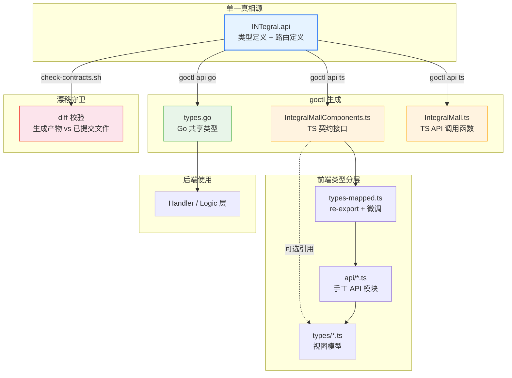
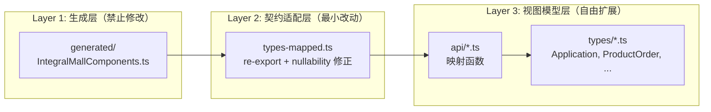
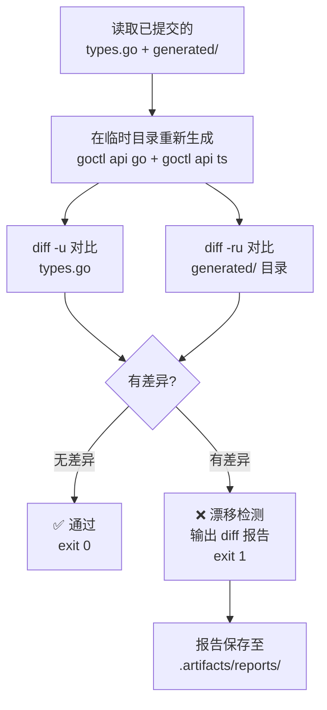
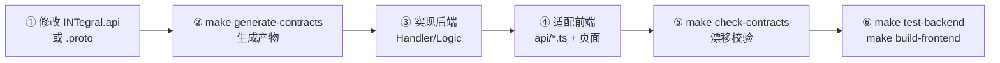

积分商城项目采用 **契约优先** 的前后端协作模式：后端 `INTegral.api` 文件是唯一的 API 类型真相源，通过 goctl 工具同时生成 Go 共享类型与 TypeScript 契约类型，再由漂移检查脚本确保生成产物始终与源契约一致。这种机制彻底消除了前后端类型手工对齐的负担，也在 CI 环节为"接口变更是否已同步"提供了自动化守门。本文将系统阐述从 `.api` 定义到前端 TypeScript 类型的完整生成链路、三层类型架构的设计意图，以及漂移检查的工作原理。

Sources: [ai-contract-workflow.md](docs/ai-contract-workflow.md#L1-L66)

## 契约架构全景

在深入每个环节之前，先从全局视角理解契约在整个系统中的位置。下图展示了 `.api` 文件作为单一真相源，同时驱动 Go 后端和 TypeScript 前端的类型生成流程：



核心原则可归纳为一句话：**所有 API 类型只来自 `INTegral.api` 的 goctl 生成产物，禁止在前端手写后端镜像类型**。如果前端页面需要额外的展示字段（如 `applicant_name`），应在视图模型层（`types/*.ts`）或 API 映射层（`api/*.ts`）中适配，绝不在契约层补字段。

Sources: [ai-contract-workflow.md](docs/ai-contract-workflow.md#L6-L13), [INTegral.api](app/api/INTegral.api#L1-L12)

## 契约定义：INTegral.api 的结构

`app/api/INTegral.api` 是 go-zero 框架的 API 定义语言文件，承载了项目的全部 HTTP 接口契约。它由两个核心部分组成：**类型定义**（`type` 块）和**路由定义**（`service` 块）。

类型定义区按业务模块组织，每个 `type` 块包含该模块的请求、响应和辅助类型。以认证模块为例：

```
type (
    LoginReq {
        Email    string `json:"email" validate:"required"`
        Password string `json:"password" validate:"required"`
    }
    LoginResp {
        Token  string   `json:"token"`
        Expire INT64    `json:"expire"`
        User   UserInfo `json:"user"`
    }
    UserInfo {
        Id              INT64       `json:"id"`
        Email           string      `json:"email"`
        Name            string      `json:"name"`
        Roles           []RoleBrief `json:"roles"`
        Permissions     []string    `json:"permissions"`
        IsSuperAdmin    bool        `json:"is_super_admin"`
        GroupIds        []INT64     `json:"group_ids"`
        AvailablePoints INT64       `json:"available_points"`
    }
)
```

路由定义区通过 `@server` 注解声明中间件配置（JWT、权限），在 `service` 块内按 HTTP 方法 + 路径 + 请求/响应类型注册路由：

```
@server (
    jwt:    JwtAuth
    group:  application
    prefix: /api/v1
)
service IntegralMall {
    @handler SubmitApplication
    post /applications (SubmitApplicationReq) returns (ApplicationResp)
}
```

整个文件涵盖 **12 个业务模块**、**40+ 类型定义**和 **35+ 路由端点**，是前后端协作的唯一权威参考。

Sources: [INTegral.api](app/api/INTegral.api#L14-L45), [INTegral.api](app/api/INTegral.api#L593-L611)

## 生成链路详解

### generate-contracts.sh 脚本分析

`make generate-contracts` 背后的脚本是 `scripts/generate-contracts.sh`，执行以下四步流水线：

| 步骤 | 命令 | 产物 | 说明 |
|------|------|------|------|
| 1. 校验 | `goctl api validate` | — | 语法检查，拦截格式错误 |
| 2. Go 生成 | `goctl api go` | `types.go` | 生成 Go 结构体到临时目录，再覆盖到 `app/api/INTernal/types/` |
| 3. TS 生成 | `goctl api ts` | `IntegralMallComponents.ts` + `IntegralMall.ts` | 生成 TypeScript 接口和 API 函数 |
| 4. 模板注入 | `cp gocliRequest.ts` | `gocliRequest.ts` | 注入自定义 HTTP 客户端模板 |

脚本使用 `mktemp -d` 创建临时目录进行中间生成，最终通过 `cp` 覆盖正式文件，避免生成过程中的半成品状态。临时目录在 `trap cleanup EXIT` 中自动清理。

**关键细节**：Go 生成使用 `--style go_zero` 命名风格，确保字段名与 `.api` 文件中的驼峰定义一致。TypeScript 生成则自动将驼峰转为 snake_case（如 `ApplicableBehavior` → `applicable_behavior`），与 JSON 序列化保持一致。

Sources: [generate-contracts.sh](scripts/generate-contracts.sh#L1-L44)

### goctl 的 TypeScript 生成产物

goctl 生成两个 TypeScript 文件，各有明确职责：

**`IntegralMallComponents.ts`** — 纯类型定义文件，包含所有 `.api` 中的类型转换为 TypeScript `INTerface`。文件头部标注 `// Code generated by goctl. DO NOT EDIT.`，明确表示禁止手工修改。对于带路径参数的请求类型（如 `IdReq`），goctl 会同时生成空接口和对应的 `Params` 接口：

```typescript
export INTerface IdReq {
}
export INTerface IdReqParams {
}
```

对于含 `form` 标签的查询参数类型，`Params` 接口会包含实际字段：

```typescript
export INTerface ApplicationListReq {
}
export INTerface ApplicationListReqParams {
    page: number
    page_size: number
    status?: string
    group_id?: number
}
```

**`IntegralMall.ts`** — API 调用函数文件，每个路由端点生成一个对应的 TypeScript 函数。这些函数引用 `IntegralMallComponents.ts` 中的类型，并通过 `gocliRequest.ts` 中的 `webapi` 对象发起请求。

Sources: [IntegralMallComponents.ts](frontend/src/api/generated/IntegralMallComponents.ts#L1-L10), [IntegralMall.ts](frontend/src/api/generated/IntegralMall.ts#L1-L10)

### gocliRequest.ts 自定义模板

`scripts/templates/gocliRequest.ts` 是一个手工维护的 HTTP 客户端模板，在每次契约生成时被复制到 `generated/` 目录。它提供 `webapi` 对象，支持 `get`/`post`/`put`/`delete`/`patch` 方法，内部基于原生 `fetch` API 实现。

模板中的 `genUrl` 函数处理了 go-zero 风格的路径参数替换（`:id` → 实际值）和查询字符串拼接，确保生成的 API 函数能正确构造 URL：

```typescript
export function genUrl(url: string, params?: Record<string, unknown>) {
  // 1. 替换路径参数 /users/:id → /users/123
  // 2. 拼接查询参数 ?page=1&page_size=20
}
```

Sources: [gocliRequest.ts](scripts/templates/gocliRequest.ts#L27-L46), [gocliRequest.ts](scripts/templates/gocliRequest.ts#L101-L119)

## 前端类型三层架构

前端并非直接使用生成产物，而是设计了三层类型架构，在契约忠实性和前端灵活性之间取得平衡：



### Layer 1：生成层（generated/）

`frontend/src/api/generated/` 目录下的文件完全由 goctl 生成，**绝不手工编辑**。包含 556 行类型定义（`IntegralMallComponents.ts`）和 429 行 API 函数（`IntegralMall.ts`）。此层与后端 `types.go` 是 1:1 映射关系，是前端唯一可信赖的类型真相来源。

Sources: [IntegralMallComponents.ts](frontend/src/api/generated/IntegralMallComponents.ts#L1-L2), [IntegralMall.ts](frontend/src/api/generated/IntegralMall.ts#L1-L4)

### Layer 2：契约适配层（types-mapped.ts）

`frontend/src/api/types-mapped.ts` 承担两个职责：

**Re-export**：将生成层中需要在前端使用的类型直接转发，保持导入路径的稳定性。即使 `generated/` 目录中的类型名发生变化，业务代码只需更新 `types-mapped.ts` 一处：

```typescript
export type RuleResp = Contract.RuleResp
export type BalanceResp = Contract.BalanceResp
export type OrderDetailResp = Contract.OrderDetailResp
```

**Nullability 修正**：Go 的指针类型（如 `*AiScoreInfo`）在 goctl TS 生成中被转为非空接口，但业务语义上是可空的。`types-mapped.ts` 通过 `Omit + extends` 模式修正：

```typescript
export INTerface ApplicationDetailResp extends Omit<Contract.ApplicationDetailResp, 'ai_score' | 'rule'> {
  ai_score: Contract.AiScoreInfo | null
  rule: Contract.RuleBrief
  self_reported_points: number
}
```

此层还定义了通用响应格式 `ApiResponse<T>`（`{code, message, data}`）和分页泛型 `PaginatedData<T>`，这些是后端统一包装结构在前端的类型映射。

Sources: [types-mapped.ts](frontend/src/api/types-mapped.ts#L1-L56)

### Layer 3：视图模型层（types/*.ts + api/*.ts）

`frontend/src/types/` 目录下的文件定义了页面组件实际使用的视图模型类型。这些类型可能与后端契约结构完全不同——它们可以合并多个接口字段、重命名字段、添加仅前端使用的派生字段。

以订单模块为例，后端 `OrderDetailResp` 的结构是嵌套的：

```typescript
// 后端契约：product 是嵌套对象
INTerface OrderDetailResp {
  product: { id: number; name: string; image: string }
  points_cost: number
}
```

前端 `ProductOrder` 视图模型将其展平为：

```typescript
// 视图模型：展平后的扁平结构
INTerface ProductOrder {
  product_id: number
  product_name: string
  product_image?: string
  points_spent: number   // 重命名自 points_cost
}
```

映射逻辑位于 `frontend/src/api/order.ts` 中的 `mapOrder` 函数，每个 API 调用返回契约类型后立即转换为视图模型：

```typescript
function mapOrder(item: OrderDetailResp): ProductOrder {
  return {
    id: item.id,
    product_id: item.product.id,
    product_name: item.product.name,
    points_spent: item.points_cost,    // 字段重命名
    // ...
  }
}
```

这种"契约层忠实 + 映射层适配"的模式确保了：后端字段变更只需更新映射函数，组件代码完全不受影响。

Sources: [order.ts](frontend/src/api/order.ts#L1-L21), [product.ts](frontend/src/types/product.ts#L44-L58), [application.ts](frontend/src/api/application.ts#L7-L31)

### 双 HTTP 客户端并存

项目存在两套 HTTP 客户端，服务于不同场景：

| 特性 | `generated/gocliRequest.ts` | `api/client.ts` |
|------|---------------------------|-----------------|
| 底层实现 | 原生 `fetch` | `axios` |
| JWT 注入 | 无 | 请求拦截器自动注入 |
| 响应解包 | 直接返回 `response.json()` | 自动解包 `{code, message, data}` |
| 401 处理 | 无 | 自动登出 + 跳转登录页 |
| 使用者 | 生成的 `IntegralMall.ts` 函数 | 手写的 `api/*.ts` 模块 |

当前项目中，**业务代码主要通过 `api/client.ts` 调用接口**（经过映射函数），`generated/IntegralMall.ts` 的函数作为参考和备用。`client.ts` 的响应拦截器封装了统一的错误提示和 JWT 过期处理逻辑，是实际生产路径。

Sources: [gocliRequest.ts](frontend/src/api/generated/gocliRequest.ts#L48-L71), [client.ts](frontend/src/api/client.ts#L1-L65)

## 漂移检查机制

### check-contracts.sh 工作原理

`make check-contracts` 执行 `scripts/check-contracts.sh`，采用"**重新生成 + diff 对比**"策略检测漂移：



脚本的核心逻辑是在一个隔离的临时目录中完整执行一遍 `goctl api go` + `goctl api ts` 生成流程，然后将生成结果与已提交到版本库的文件进行 `diff` 对比。如果发现任何不一致，立即输出差异报告并以非零退出码退出，适合在 CI 流水线中作为质量门禁。

报告同时保存两份：带时间戳的归档版本（`contract-check-20260418_143000.txt`）和始终指向最新结果的符号文件（`contract-check-latest.txt`），便于开发者回溯历史检查记录。

Sources: [check-contracts.sh](scripts/check-contracts.sh#L1-L57)

### 漂移场景与修复

下表列出常见的漂移场景及其修复方法：

| 漂移场景 | 表现 | 修复方式 |
|---------|------|---------|
| 修改 `.api` 后忘记生成 | `types.go` 或 TS 文件与重新生成结果不一致 | 执行 `make generate-contracts` |
| 手工修改了生成文件 | diff 显示非预期的字段差异 | 撤销手工修改，重新生成 |
| goctl 版本升级 | 生成格式变化（如注释风格） | 重新生成并提交全部差异 |
| 新增接口未同步 | 前端缺少新类型的定义 | 先改 `.api`，再 `make generate-contracts` |

Sources: [ai-contract-workflow.md](docs/ai-contract-workflow.md#L17-L26)

## 契约驱动开发的标准工作流

项目在 `docs/ai-contract-workflow.md` 中定义了严格的增量开发流程。无论是人工还是 AI 辅助开发，都必须遵循以下步骤：



关键约束在 AI 执行环节尤为重要——项目明确要求"**禁止在页面、store、API 层猜字段名、状态值、权限码**"和"**禁止新增手写后端镜像类型文件**"。这确保了所有类型信息都有契约可溯，避免前后端字段名拼写不一致导致的运行时错误。

Sources: [ai-contract-workflow.md](docs/ai-contract-workflow.md#L17-L58)

## Makefile 入口速查

所有契约相关命令均通过根目录 `Makefile` 统一入口：

| 命令 | 作用 | 适用场景 |
|------|------|---------|
| `make generate-contracts` | 重新生成 Go 共享类型 + TS 契约类型 | 修改 `.api` 文件后 |
| `make check-contracts` | 校验生成产物是否与契约一致 | 提交前 / CI 流水线 |
| `make build-frontend` | 前端生产构建 | 验证 TS 类型编译无错误 |
| `make test-backend` | 后端 Go 测试 | 验证 Handler/Logic 正确性 |
| `make test-e2e` | Playwright E2E 测试 | 验证前后端联调正确性 |

Sources: [Makefile](Makefile#L53-L60)

## 类型映射实战案例

为了更直观地理解三层架构的协作方式，下面通过积分申请模块展示从后端契约到前端视图的完整映射路径：

**后端契约**（`INTegral.api`）定义了 `ApplicationResp` 的结构，包含嵌套的 `Rule` 对象和可选的 `SelfReportedPoints`：

```
ApplicationResp {
    Status             string    `json:"status"`
    FinalPoints        INT32     `json:"final_points"`
    SelfReportedPoints INT32     `json:"self_reported_points,optional"`
    GroupId            INT64     `json:"group_id"`
    Rule               RuleBrief `json:"rule"`
}
```

**TypeScript 契约层**（`IntegralMallComponents.ts`）由 goctl 自动生成，字段名转为 snake_case：

```typescript
export INTerface ApplicationResp {
  status: string
  final_points: number
  self_reported_points?: number
  group_id: number
  rule: RuleBrief
}
```

**映射层**（`application.ts`）将契约类型转换为页面视图模型，展平嵌套结构、重命名字段：

```typescript
list: resp.list.map((item) => ({
  id: item.id,
  points: item.final_points,           // 重命名
  reason: item.description,            // 语义化重命名
  rule_name: item.rule?.name,          // 展平嵌套
  rule_type: item.rule?.rule_type,     // 展平嵌套
  self_reported_points: item.self_reported_points,
  group_id: item.group_id,
}))
```

这种分层使得：当后端将 `FinalPoints` 重命名为 `AwardedPoints` 时，只需修改 `INTegral.api` → 重新生成 → 更新 `application.ts` 中的映射函数，页面组件的 `points` 属性完全不受影响。

Sources: [INTegral.api](app/api/INTegral.api#L196-L205), [IntegralMallComponents.ts](frontend/src/api/generated/IntegralMallComponents.ts#L47-L56), [application.ts](frontend/src/api/application.ts#L7-L31)

## 测试验证

契约映射的正确性通过前端单元测试保障。`frontend/src/api/__tests/` 目录为每个 API 模块编写了映射测试，验证契约类型到视图模型的字段转换逻辑：

以订单测试为例，测试数据直接按照后端契约结构（`OrderDetailResp`）构造 mock 返回值，断言映射后的视图模型（`ProductOrder`）字段正确：

```typescript
// mock 数据按后端契约结构构造
vi.mocked(get).mockResolvedValueOnce({
  product: { id: 5, name: '测试商品', image: '/uploads/product.png' },
  points_cost: 200,
})

// 断言映射后的视图模型字段
expect(resp.list[0]).toMatchObject({
  product_id: 5,           // 展平自 product.id
  product_name: '测试商品', // 展平自 product.name
  points_spent: 200,       // 重命名自 points_cost
})
```

这种测试模式确保了：即使后端契约发生变更，映射层的测试会立即捕获不一致，避免错误传播到 UI 层。

Sources: [order.test.ts](frontend/src/api/__tests__/order.test.ts#L18-L55)

## 设计决策总结

| 设计决策 | 动机 | 权衡 |
|---------|------|------|
| `.api` 作为单一真相源 | 消除前后端类型定义的重复和不一致 | 后端开发者必须熟悉 go-zero API 语法 |
| goctl 自动生成 | 避免手工维护两套类型定义 | 生成产物的格式不可定制（如命名风格） |
| 三层类型架构 | 契约忠实性与前端灵活性解耦 | 增加了类型文件的层次和映射代码 |
| 漂移检查脚本 | 防止生成产物被手工修改后遗忘同步 | 每次检查需重新生成，有一定耗时 |
| 双 HTTP 客户端 | 生成的 fetch 客户端与 axios 业务客户端各司其职 | 存在功能重叠，新人需理解为何有两套 |

这种契约驱动架构在积分商城这类前后端紧密协作的项目中展现出显著优势：接口变更的影响面可以在类型系统中被精确定位，编译器成为前后端一致的自动验证器。要了解此契约体系如何融入整体的微服务架构，可参阅 [微服务架构总览：API 网关与四路 RPC 的协作关系](3-wei-fu-wu-jia-gou-zong-lan-api-wang-guan-yu-si-lu-rpc-de-xie-zuo-guan-xi)。要了解 API 定义语言本身的语法细节，可参阅 [go-zero API 定义语言（INTegral.api）与路由注册](11-go-zero-api-ding-yi-yu-yan-INTegral-api-yu-lu-you-zhu-ce)。要了解前端如何在组件层面使用这些类型，可参阅 [React 19 应用架构：路由、状态管理与权限守卫](15-react-19-ying-yong-jia-gou-lu-you-zhuang-tai-guan-li-yu-quan-xian-shou-wei)。