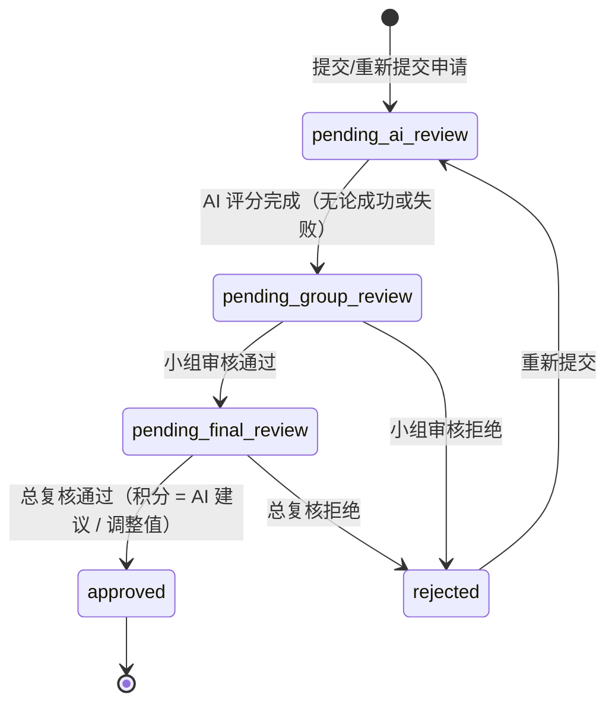

积分商城的 AI 评分引擎是整个积分申请流程的智能化核心——当员工提交一份积分申请后，引擎会自动调用大语言模型，根据**规则快照**与**申请描述**生成建议积分、匹配度百分比和评分分析。引擎采用**双协议适配**架构，将国内 10+ 家主流 LLM 提供商统一归约为 Anthropic 与 OpenAI 两种兼容协议，通过零依赖的 HTTP 直连方式实现轻量级调用。本文将从架构总览、多提供商解析策略、Prompt 构建与响应解析、评分安全护栏、配置与初始化，以及异步触发机制六个维度，完整拆解这一评分引擎的设计哲学与工程实现。

Sources: [scorer.go](app/rpc/points/INTernal/ai/scorer.go#L1-L212), [trigger_a_i_score_logic.go](app/rpc/points/INTernal/logic/pointsservice/trigger_a_i_score_logic.go#L1-L171)

## 架构总览：三层分离与职责边界

AI 评分引擎在代码组织上遵循**核心层 → 适配层 → 编排层**的三层分离原则，每一层都有明确的职责边界：

```mermaid
graph TB
    subgraph "编排层 (Logic)"
        SA["SubmitApplicationLogic<br/>提交申请 → 异步触发"]
        RA["ResubmitApplicationLogic<br/>重新提交 → 异步触发"]
        TA["TriggerAIScoreLogic<br/>AI 评分编排器"]
    end

    subgraph "核心层 (ai package)"
        AS["AiScorer<br/>统一入口 + Prompt 构建"]
        PS["parseScoreResult()<br/>JSON 提取与容错解析"]
    end

    subgraph "适配层 (Provider Implementations)"
        AN["scoreWithAnthropic()<br/>Anthropic 协议<br/>POST /v1/messages"]
        OP["scoreWithOpenAI()<br/>OpenAI 协议<br/>POST /v1/chat/completions"]
    end

    subgraph "外部 LLM 服务"
        A1["Anthropic / MiniMax"]
        A2["OpenAI / DeepSeek<br/>智谱 / 通义千问 / Kimi ..."]
    end

    SA -->|go goroutine| TA
    RA -->|go goroutine| TA
    TA -->|1. 查询申请 + 状态校验| TA
    TA -->|2. Score()| AS
    AS -->|resolveProvider| AN
    AS -->|resolveProvider| OP
    AN -->|HTTP + x-api-key| A1
    OP -->|HTTP + Bearer Token| A2
    AN -->|响应| PS
    OP -->|响应| PS
    PS -->|ScoreResult| TA
    TA -->|3. 更新申请 + 通知| TA
```

**核心层**（`app/rpc/points/INTernal/ai/` 包）封装了 `AiScorer` 结构体，它是整个引擎的唯一对外入口。核心层负责 Prompt 构建、Provider 解析、响应解析这三个与具体 LLM 无关的通用逻辑，屏蔽了外部调用的所有细节。

**适配层**由 `scorer_anthropic.go` 和 `scorer_openai.go` 两个文件组成，分别实现了 Anthropic Messages API 和 OpenAI Chat Completions API 的请求构造与响应提取。这种双文件分离使得新增协议适配器时只需添加一个新文件，无需修改核心逻辑。

**编排层**是 `TriggerAIScoreLogic`，它承担了完整的工作流编排：查询申请记录 → 校验状态 → 提取规则快照文本 → 调用 AI Scorer → 安全截断 → 持久化评分结果 → 发送通知 → 状态流转。编排层对 AI Scorer 的依赖通过 `ServiceContext.AiScorer` 接口注入，便于测试时替换为 Mock 实现。

Sources: [scorer.go](app/rpc/points/INTernal/ai/scorer.go#L51-L106), [trigger_a_i_score_logic.go](app/rpc/points/INTernal/logic/pointsservice/trigger_a_i_score_logic.go#L36-L66), [scorer_anthropic.go](app/rpc/points/INTernal/ai/scorer_anthropic.go#L1-L113), [scorer_openai.go](app/rpc/points/INTernal/ai/scorer_openai.go#L1-L131)

## 多提供商解析：15+ 别名到双协议的统一映射

国内 LLM 市场的一个显著特点是：绝大多数提供商（DeepSeek、智谱、通义千问、Kimi 等）都兼容 OpenAI Chat Completions 协议，而 MiniMax 等少数提供商兼容 Anthropic Messages 协议。引擎的 `resolveProvider()` 函数正是基于这一事实，将 15+ 种提供商别名统一归约为两种协议：

| 配置值（Provider） | 解析结果 | 协议端点 | 认证方式 |
|:---|:---|:---|:---|
| `minimax` | `anthropic` | `/v1/messages` | `x-api-key` Header |
| `zhipu` / `glm` / `智谱` | `openai` | `/v1/chat/completions` | `Bearer` Token |
| `qwen` / `qwenvl` / `通义千问` / `tongyi` | `openai` | `/v1/chat/completions` | `Bearer` Token |
| `deepseek` | `openai` | `/v1/chat/completions` | `Bearer` Token |
| `kimi` / `moonshot` / `月之暗面` | `openai` | `/v1/chat/completions` | `Bearer` Token |
| `spark` / `讯飞星火` / `iflytek` | `openai` | `/v1/chat/completions` | `Bearer` Token |
| `wenxin` / `文心一言` / `ernie` / `百度` | `openai` | `/v1/chat/completions` | `Bearer` Token |
| `hunyuan` / `腾讯混元` / `tencent` | `openai` | `/v1/chat/completions` | `Bearer` Token |
| `step` / `阶跃星辰` / `stepfun` | `openai` | `/v1/chat/completions` | `Bearer` Token |
| `yi` / `零一万物` / `01ai` | `openai` | `/v1/chat/completions` | `Bearer` Token |
| `openai-compatible` / `openai_compatible` | `openai` | `/v1/chat/completions` | `Bearer` Token |
| 空字符串（自动检测） | 依 API Key 配置决定 | — | — |

解析逻辑的核心判断路径是：先对 Provider 字符串做 `strings.ToLower` + `strings.TrimSpace` 标准化，然后进入 `switch` 匹配。当 Provider 为空字符串时，引擎执行**自动检测**——检查 OpenAI API Key 是否已配置而 Anthropic API Key 未配置，若是则走 OpenAI 协议，否则默认 Anthropic。这一设计确保了**零配置降级**：在没有显式指定 Provider 的情况下，引擎仍能根据环境中实际存在的 Key 做出合理选择。

Sources: [scorer.go](app/rpc/points/INTernal/ai/scorer.go#L108-L145)

### URL 构建策略：自适应 Endpoint 拼接

不同的 LLM 提供商其 BaseURL 格式各异——有的以 `/v1` 结尾，有的已包含完整路径。`buildEndpointURL()` 函数通过三级匹配策略自适应处理：

```go
// 伪逻辑：
// 1. 如果 baseURL 已以 endpoint 结尾 → 直接使用（用户可能填了完整 URL）
// 2. 如果 baseURL 以 apiRoot 结尾 → 拼接 endpoint（如 https://api.xxx.com/v1 + /chat/completions）
// 3. 否则 → 拼接 apiRoot + endpoint（如 https://api.xxx.com + /v1/chat/completions）
```

这意味着用户在配置文件中无论是填写 `https://api.deepseek.com`、`https://api.deepseek.com/v1` 还是 `https://api.deepseek.com/v1/chat/completions`，引擎都能正确构建请求 URL。结合 `normalizeProviderConfig()` 函数对空 BaseURL 自动填充默认值（Anthropic → `https://api.anthropic.com`，OpenAI → `https://api.openai.com/v1`），整个配置容错机制确保了**一个 ApiKey + 一个 Model 名称即可完成对接**。

Sources: [scorer.go](app/rpc/points/INTernal/ai/scorer.go#L147-L167)

## Prompt 工程：规则快照的结构化输入与 JSON 约束输出

### Prompt 模板设计

引擎的 Prompt 由 `buildPrompt()` 函数生成，采用**单轮 User Message** 的简洁模式，不使用 System Message（确保在所有提供商中行为一致）：

```
你是一个积分评分助手。请根据以下积分规则，对积分申请进行评分。

积分规则：
{ruleSnapshot}

申请描述：
{description}

请严格按照以下 JSON 格式返回评分结果（不要包含其他文字）：
{"suggested_points": 数字, "match_rate": 匹配度百分比(0-100), "analysis": "评分分析说明"}
```

Prompt 模板中 `{ruleSnapshot}` 的内容由 `extractRuleSnapshotText()` 函数从 JSON 规则快照中提取并格式化为可读文本：

```
规则名称: 技术创新奖
适用行为: 提交技术改进提案并获得采纳
分数范围: 50-200
评分标准: 基础分50，每项被采纳的改进提案加30分...
```

这种**结构化文本**而非原始 JSON 的输入方式，降低了 LLM 的理解负担，提升了评分的准确性和一致性。值得注意的是，`{description}` 直接取自申请人的原始描述文本，保留了完整的上下文信息。

Sources: [scorer.go](app/rpc/points/INTernal/ai/scorer.go#L169-L180), [trigger_a_i_score_logic.go](app/rpc/points/INTernal/logic/pointsservice/trigger_a_i_score_logic.go#L150-L170)

### 响应解析：三层容错机制

LLM 的输出具有不确定性——它可能返回纯 JSON、Markdown 代码块包裹的 JSON，甚至在 JSON 前后附加解释性文字。`parseScoreResult()` 函数通过三层容错策略处理这些情况：

**第一层：Markdown 代码块提取**。当 LLM 返回 ` ```json ... ``` ` 格式时，函数通过定位第一个 `{` 和最后一个 `}` 的索引来截取 JSON 子串。

**第二层：嵌入式 JSON 提取**。当 LLM 在 JSON 前后附加了额外文字（如 "评分结果如下：{...} 请查收"）时，同样的 `{}` 索引定位策略可以精确提取中间的 JSON 部分。

**第三层：直接解析**。对于返回纯 JSON 的理想情况，直接 `json.Unmarshal` 即可。

解析后的 `aiScorerResp` 中 `match_rate` 字段类型为 `float64`（如 `85.5`），最终转换为 `INT32`（`85`）存入数据库。这种**先保留精度再截断**的设计确保了评分数据在传输过程中不会因过早取整而丢失信息。

Sources: [scorer.go](app/rpc/points/INTernal/ai/scorer.go#L189-L211)

### OpenAI 响应的特殊处理

OpenAI 协议的响应格式存在两种变体：`content` 字段可能是纯字符串，也可能是内容数组 `[{"type":"text","text":"..."}]`。`extractOpenAIText()` 函数先尝试按字符串解析，失败后降级为数组解析，遍历所有 `type: "text"` 的部件拼接结果。这一处理确保了对所有 OpenAI 兼容提供商（包括那些返回多模态混合内容的模型）的兼容性。

Anthropic 协议的响应则采用了**text 优先 → thinking 降级**的策略：优先提取 `type: "text"` 的内容块，若 text 为空则降级取 `type: "thinking"` 的推理过程。这一设计针对的是某些开启了 Extended Thinking 功能的 Anthropic 模型——当模型选择将最终回答放入 thinking 块时，引擎仍能正确提取评分结果。

Sources: [scorer_openai.go](app/rpc/points/INTernal/ai/scorer_openai.go#L107-L130), [scorer_anthropic.go](app/rpc/points/INTernal/ai/scorer_anthropic.go#L86-L104)

## 评分安全护栏：LLM 输出的防御性校验

LLM 可能产生**幻觉**——返回超出规则范围的积分数值。引擎在 `updateApplicationWithAIResult()` 中实现了两层安全护栏：

**积分上限截断**：引擎首先从申请的 `RuleSnapshot` JSON 中提取 `max_score` 字段，若提取失败则使用硬编码的默认上限 `10000`。当 AI 建议积分超过此上限时，自动截断并记录 Info 级别日志。

**负数保护**：即使理论上 Prompt 要求返回非负值，引擎仍防御性地将负值归零。

```go
// 伪逻辑：
// 1. 尝试从规则快照提取 max_score
// 2. suggestedPoints > maxScore → 截断为 maxScore + 日志
// 3. suggestedPoints < 0 → 归零
```

这一安全护栏与 `ScoreResult.Available` 字段协同工作：当 AI 服务不可用（API Key 未配置、网络错误、响应解析失败等）时，`Available` 为 `false`，此时 `suggestedPoints` 虽被存入数据库但标记为无效。下游的 `calcFinalPoints()` 函数在计算最终积分时会检查 `AiScore.Valid && AiScore.Int32 > 0`，无效的 AI 评分不会影响最终积分计算。

Sources: [trigger_a_i_score_logic.go](app/rpc/points/INTernal/logic/pointsservice/trigger_a_i_score_logic.go#L69-L125), [review_application_logic.go](app/rpc/points/INTernal/logic/pointsservice/review_application_logic.go#L268-L277)

## 配置体系：双结构兼容与依赖注入

### 配置结构

引擎的配置通过 `config.Config` 中的两个嵌套结构实现向后兼容：

```yaml
# 新结构（推荐）：显式指定 Provider，支持双提供商
AI:
  Provider: "deepseek"        # 提供商别名
  Model: "deepseek-chat"      # 模型名称
  Timeout: 30                 # 超时秒数
  Anthropic:
    ApiKey: ""                 # Anthropic 兼容格式的 Key
    BaseURL: ""                # 可选，覆盖默认 BaseURL
  OpenAI:
    ApiKey: "sk-xxx"           # OpenAI 兼容格式的 Key
    BaseURL: "https://api.deepseek.com/v1"

# 旧结构（兼容）：仅 Anthropic 配置
Anthropic:
  ApiKey: "sk-xxx"
  Model: "claude-3-haiku"
  Timeout: 10
  BaseURL: ""
```

`newAIScorer()` 函数在 `ServiceContext` 初始化时检测新结构 `AI` 的所有字段是否为空——若全部为空，则回退读取旧结构 `Anthropic` 的配置。这种**全零检测**策略确保了从旧配置迁移到新配置时的零停机升级。

Sources: [config.go](app/rpc/points/INTernal/config/config.go#L1-L44), [service_context.go](app/rpc/points/INTernal/svc/service_context.go#L65-L97)

### 环境变量驱动

生产配置通过 Docker Compose 的环境变量注入实现提供商切换：

```yaml
# deploy/.env
AI_PROVIDER=minimax                         # 切换提供商只需改这一行
AI_MODEL=MiniMax-M2.7-highspeed             # 对应模型名称
AI_ANTHROPIC_API_KEY=sk-cp-xxx              # Anthropic 格式的 Key
AI_ANTHROPIC_BASE_URL=https://api.minimaxi.com/anthropic  # MiniMax 的 Anthropic 兼容端点
OPENAI_API_KEY=                             # 留空表示不使用 OpenAI 格式
OPENAI_BASE_URL=https://api.openai.com/v1
```

切换提供商的操作路径是：修改 `AI_PROVIDER` + `AI_MODEL` + 对应的 API Key → 重启服务。无需修改代码、无需重新编译。配置文件 `points-rpc-docker.yaml` 中以注释形式内联了完整的提供商支持列表，作为运维参考。

Sources: [points-rpc-docker.yaml](deploy/points-rpc-docker.yaml#L1-L44), [.env](deploy/.env#L11-L21)

## 异步触发与生命周期管理

### 异步 Goroutine 触发机制

AI 评分在积分申请提交后通过 **goroutine 异步触发**，不阻塞申请创建的响应返回。触发逻辑在 `SubmitApplicationLogic` 和 `ResubmitApplicationLogic` 中均以相同的模式实现：

```go
go func(appCopy model.PointsApplication) {
    defer func() {
        if r := recover(); r != nil {
            logx.Errorf("异步 AI 评分 panic, applicationID=%d: %v", appCopy.ID, r)
        }
    }()
    ctx, cancel := context.WithTimeout(context.Background(), 30*time.Second)
    defer cancel()
    triggerLogic := NewTriggerAIScoreLogic(ctx, l.svcCtx)
    triggerLogic.TriggerAIScore(&points.TriggerAIScoreReq{ApplicationId: appCopy.ID})
}(*application) // 显式传递副本，避免数据竞争
```

这一实现中有三个关键设计点值得注意：**值拷贝传参**（`*application`）避免了 goroutine 与主流程之间的数据竞争；**panic recovery** 确保异步评分的异常不会导致进程崩溃；**独立 context + 30s 超时**使异步调用拥有独立的生命周期，不受原始请求 context 取消的影响。

Sources: [submit_application_logic.go](app/rpc/points/INTernal/logic/pointsservice/submit_application_logic.go#L86-L102), [resubmit_application_logic.go](app/rpc/points/INTernal/logic/pointsservice/resubmit_application_logic.go#L66-L80)

### 状态流转与降级策略

AI 评分在整个积分申请生命周期中扮演"智能预处理"角色，其结果不影响流程的完整性：



核心降级策略体现在：**AI 评分失败不会阻塞流程**。无论 `ScoreResult.Available` 为 `true` 还是 `false`，申请状态都会从 `pending_ai_review` 流转到 `pending_group_review`，进入人工审核环节。在总复核阶段，`calcFinalPoints()` 优先取 AI 建议积分，若 AI 不可用则取已审批积分，若两者都无效则返回 0（此时审核员必须通过"调整积分后通过"操作手动指定积分）。

Sources: [trigger_a_i_score_logic.go](app/rpc/points/INTernal/logic/pointsservice/trigger_a_i_score_logic.go#L119-L125), [review_application_logic.go](app/rpc/points/INTernal/logic/pointsservice/review_application_logic.go#L139-L163), [consts/status.go](pkg/consts/status.go#L4-L11)

### 数据模型：五个 AI 专用字段

`points_applications` 表为 AI 评分结果预留了五个专用字段，均使用 `sql.Null*` 类型以区分"未评分"和"评分为零"：

| 数据库字段 | Go 类型 | 语义 |
|:---|:---|:---|
| `ai_score` | `sql.NullInt32` | AI 建议积分 |
| `ai_match_rate` | `sql.NullFloat64` | 匹配度百分比（0-100） |
| `ai_reasoning` | `sql.NullString` | AI 评分分析文本 |
| `ai_scored_at` | `sql.NullTime` | AI 评分完成时间 |
| `ai_available` | `sql.NullBool` | AI 评分是否可用 |

这五个字段在 gRPC 层被聚合为 `AiScoreInfo` 消息，通过 `ApplicationDetailResp.ai_score` 字段传递给前端展示。重新提交申请时，这五个字段会被统一重置为 `Valid: false`，确保每次重新提交都获得全新的 AI 评分。

Sources: [points_application.go](model/points_application.go#L11-L31), [schema.sql](deploy/schema.sql#L184-L189), [get_application_logic.go](app/rpc/points/INTernal/logic/pointsservice/get_application_logic.go#L40-L57)

## 错误处理：优雅降级而非中断

引擎的整个错误处理哲学是**优雅降级**——所有 AI 调用错误都不会抛出异常，而是返回 `Available: false` 的 `ScoreResult`。这一哲学贯穿在多个层次：

`unavailableResult()` 工厂函数是所有错误场景的统一出口。无论是 API Key 未配置、网络请求失败、HTTP 状态码异常、响应解析失败，还是 Provider 不受支持，都通过这个函数生成一个包含详细错误日志的降级结果。函数内部使用 `logx.Errorf()` 记录完整上下文，便于问题排查。

在 gRPC 层，`TriggerAIScore` RPC 方法仅在申请不存在时返回错误（`CodeAppNotFound: 40406`），而 AI 服务本身的异常则返回 `CodeAIServiceError: 50005`。这意味着调用方（如 `SubmitApplicationLogic` 的异步 goroutine）可以选择性地处理严重错误，而对降级场景无感。

Sources: [scorer.go](app/rpc/points/INTernal/ai/scorer.go#L182-L187), [trigger_a_i_score_logic.go](app/rpc/points/INTernal/logic/pointsservice/trigger_a_i_score_logic.go#L53-L57), [code.go](pkg/errx/code.go#L49-L56)

## 测试策略：HTTP Transport Mock 与纯函数覆盖

引擎的测试通过 `roundTripFunc` 类型实现了 **HTTP Transport 层的 Mock 注入**，无需启动真实 HTTP 服务器即可验证完整的请求-响应链路：

```go
// 注入自定义 Transport 替换真实网络调用
scorer.httpClient = &http.Client{
    Transport: roundTripFunc(func(r *http.Request) (*http.Response, error) {
        // 断言请求路径、Header、Body
        assert.Equal(t, "/v1/chat/completions", r.URL.Path)
        assert.Equal(t, "Bearer openai-key", r.Header.Get("Authorization"))
        return jsonResponse(`{"choices":[...]}`), nil
    }),
}
```

测试用例覆盖了以下关键场景：空 API Key 降级、纯 JSON 响应解析、Markdown 包裹 JSON 解析、嵌入式 JSON 提取、OpenAI 数组内容格式、网络错误降级、Anthropic 成功路径、OpenAI 成功路径、不受支持的 Provider 降级、自动检测 Provider、默认超时值等。

Sources: [scorer_test.go](app/rpc/points/INTernal/ai/scorer_test.go#L1-L212), [trigger_a_i_score_logic_test.go](app/rpc/points/INTernal/logic/pointsservice/trigger_a_i_score_logic_test.go#L1-L57)

---

**延伸阅读**：AI 评分引擎是积分申请全流程中的一环。要理解其在完整业务链路中的位置，建议继续阅读 [积分申请全流程：提交 → AI 评分 → 双级审核 → 积分发放](6-ji-fen-shen-qing-quan-liu-cheng-ti-jiao-ai-ping-fen-shuang-ji-shen-he-ji-fen-fa-fang)。若需了解评分所依赖的规则数据结构，参见 [积分规则管理：版本快照与生命周期控制](10-ji-fen-gui-ze-guan-li-ban-ben-kuai-zhao-yu-sheng-ming-zhou-qi-kong-zhi)。若需了解评分结果的持久化方式，参见 [GORM 模型定义与 Repository 模式](20-gorm-mo-xing-ding-yi-yu-repository-mo-shi)。