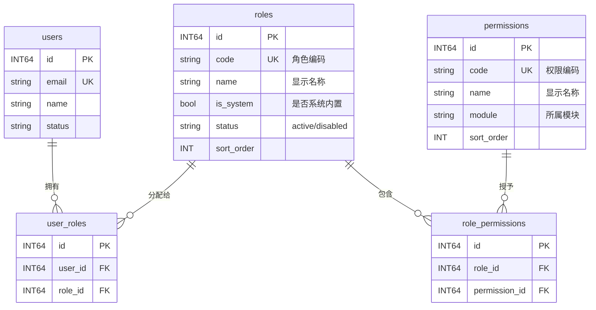
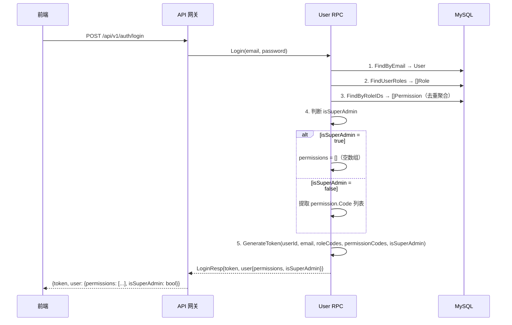
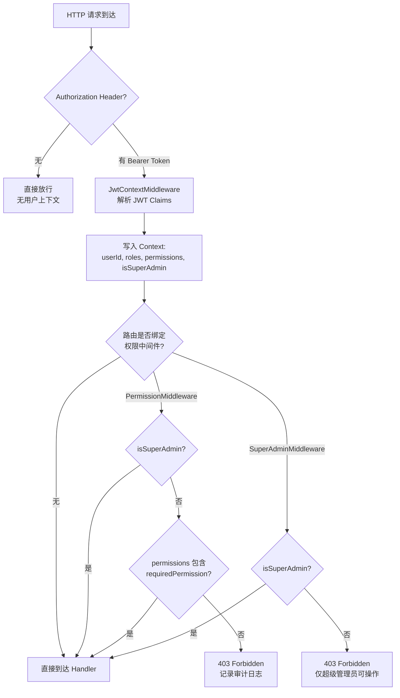

积分商城的权限系统采用 **RBAC（Role-Based Access Control）** 模型，通过「用户 → 角色 → 权限编码」三层结构实现细粒度的访问控制。系统在用户登录时将角色和权限聚合写入 JWT，后续每次请求在中间件层完成权限校验，**零数据库调用**即可完成鉴权。本文将从数据模型、权限编码体系、登录时权限写入、三层中间件鉴权、业务层权限分流、以及前端权限同步六个维度展开，呈现一套完整的端到端权限链路。

Sources: [role.go](model/role.go#L1-L53), [migrate.go](model/migrate.go#L67-L84), [consts/types.go](pkg/consts/types.go#L17-L25)

## 数据模型：四张表支撑的经典 RBAC 结构

系统的权限数据由四张核心表组成，它们之间的关系遵循 RBAC 标准范式：



**Role 模型**通过 `Code`（如 `super_admin`）和 `Name`（如「超级管理员」）的双字段设计实现技术标识与显示名称的分离。`IsSystem` 标记用于区分系统预置角色和自定义角色——系统角色不可删除、系统角色不允许修改权限。`user_roles` 和 `role_permissions` 两张关联表均使用复合唯一索引（`uk_user_roles`、`uk_role_permissions`）防止重复分配，并设置外键级联删除确保数据一致性。

Sources: [role.go](model/role.go#L1-L53), [schema.sql](deploy/schema.sql#L34-L95)

## 六大系统角色与权限预置策略

系统在数据库迁移时通过 `SeedData()` 函数预置 6 个系统角色，采用**英文字符串编码**作为唯一标识，同时在 `consts/types.go` 中以常量形式集中定义，确保后端代码与数据库数据的一致性：

| 角色编码 | 显示名称 | 角色定位 | 权限策略 |
|---------|---------|---------|---------|
| `super_admin` | 超级管理员 | 系统最高权限 | `isSuperAdmin=true`，不枚举具体权限 |
| `admin` | 系统管理员 | 用户管理、角色分配 | 全部 16 项权限 |
| `participant` | 积分参与者 | 提交申请、兑换商品 | 7 项通用权限 |
| `reviewer` | 小组审核员 | 审核本小组申请 | 参与者权限 + `page:review` + `review:group` |
| `chief_reviewer` | 总复核员 | 最终复核 | 审核员权限 + `review:final` |
| `merchant` | 商品商家 | 商品与订单管理 | 6 项商品/订单相关权限 |

**超级管理员的特殊设计**值得特别说明：它不通过 `role_permissions` 表分配具体权限，而是通过 JWT 中的 `isSuperAdmin` 布尔标记实现**全局通行**。这种设计避免了超级管理员每次新增权限都需要更新关联表的问题，同时减少了 JWT 的 payload 体积。

Sources: [migrate.go](model/migrate.go#L67-L155), [consts/types.go](pkg/consts/types.go#L17-L25), [migrate.go](model/migrate.go#L115-L139)

## 权限编码体系：16 项权限的模块化命名

权限编码采用 `资源:操作` 的层级命名格式，共 16 项权限分为三个模块。这种命名方式不仅用于后端中间件匹配，同时也是前端菜单渲染和路由守卫的驱动依据：

**通用模块（common）**——所有角色基础权限：

| 编码 | 名称 | 说明 |
|------|------|------|
| `page:dashboard` | 仪表盘 | 首页数据展示 |
| `page:products` | 商品浏览 | 商品列表与详情 |
| `page:applications` | 积分申请 | 提交积分申请 |
| `page:orders` | 我的订单 | 订单列表查看 |
| `page:points` | 积分查询 | 积分余额与流水 |
| `page:notifications` | 通知中心 | 系统通知列表 |
| `page:settings` | 个人设置 | 个人信息修改 |

**审核模块（review）**——审核业务专属权限：

| 编码 | 名称 | 说明 |
|------|------|------|
| `page:review` | 审核中心 | 审核页面入口 |
| `review:group` | 小组审核 | 小组级别审核操作 |
| `review:final` | 总复核 | 最终复核操作 |

**管理模块（admin）**——后台管理权限：

| 编码 | 名称 | 说明 |
|------|------|------|
| `page:admin:users` | 用户管理 | 用户列表与角色分配 |
| `page:admin:groups` | 小组管理 | 小组 CRUD |
| `page:admin:rules` | 规则管理 | 积分规则管理 |
| `page:admin:products` | 商品管理 | 商品上下架 |
| `page:admin:orders` | 订单管理 | 订单处理 |
| `page:admin:roles` | 角色管理 | 角色权限配置 |

注意编码命名中的关键区别：`page:review` 是页面入口权限（控制是否能进入审核中心页面），而 `review:group` 和 `review:final` 是**操作权限**（控制能执行哪种级别的审核）。这种「页面权限 + 操作权限」的分离使得系统可以灵活地允许用户进入审核页面查看数据，但限制其只能执行特定级别的审核操作。

Sources: [migrate.go](model/migrate.go#L87-L113), [permission-system/spec.md](openspec/specs/permission-system/spec.md#L16-L33)

## 登录时权限写入 JWT：聚合与嵌入机制

用户登录时的权限聚合流程是整个 RBAC 链路的起点，它将数据库中的角色-权限关系一次性「快照」到 JWT 中，后续请求无需查询数据库：



这段流程的核心实现在 `User RPC` 的 `Login` 逻辑中。代码首先通过 `FindByRoleIDs` 聚合用户所有角色的权限并通过 SQL 的 `GROUP BY` 实现去重。**超级管理员走了独立分支**：不查询具体权限，直接将 `permissionCodes` 设为空数组，通过 `isSuperAdmin=true` 让中间件短路放行。JWT Claims 的最终结构为：

```json
{
  "userId": 1,
  "email": "admin@company.com",
  "roles": ["super_admin", "admin", "participant"],
  "permissions": [],
  "isSuperAdmin": true,
  "exp": 1748275200,
  "iss": "INTegral-mall"
}
```

Sources: [login_logic.go (RPC)](app/rpc/user/INTernal/logic/userservice/login_logic.go#L56-L92), [jwt.go](pkg/utils/jwt.go#L11-L54), [login_logic.go (API)](app/api/INTernal/logic/auth/login_logic.go#L28-L62)

## 三层中间件鉴权：从 JWT 解析到权限守卫

系统通过三层中间件的协作完成从 JWT 解析到权限校验的完整鉴权链路。每一层中间件职责明确，形成「提取 → 判断 → 放行/拒绝」的处理流水线：



**第一层：JwtContextMiddleware**——JWT 上下文提取器。它在 `go-zero` 内置 JWT 签名校验通过后运行，负责从已验证的 Token 中提取 `userId`、`roles`、`permissions`、`isSuperAdmin` 四个字段写入 `context.Context`。这一层的设计哲学是**宽容放行**：即使 Token 无效或缺失，也不会阻止请求——仅不设置用户上下文。这种设计允许公开路由（如 `/auth/login`）在无 Token 时正常工作。

**第二层：PermissionMiddleware**——基于权限编码的访问控制器。每个路由在注册时绑定一个特定的 `requiredPermission`（如 `page:admin:users`），中间件从 Context 读取权限列表进行精确匹配。**超级管理员短路机制**是性能关键点：当 `isSuperAdmin=true` 时直接跳过权限匹配，O(1) 时间复杂度完成放行。普通用户则执行 O(n) 线性扫描匹配，被拒绝时记录审计日志（包含 userId、所需权限、已有权限列表）。

**第三层：SuperAdminMiddleware**——超级管理员专用守卫。这是最严格的中间件，仅检查 `isSuperAdmin` 标记。用于角色管理（CRUD）和权限分配等**只有超级管理员才能执行**的操作，其他任何角色（包括拥有全部权限的 `admin`）都无法通过。

Sources: [jwt_context_middleware.go](app/api/INTernal/middleware/jwt_context_middleware.go#L25-L101), [permission_middleware.go](app/api/INTernal/middleware/permission_middleware.go#L23-L67), [super_admin_middleware.go](app/api/INTernal/middleware/super_admin_middleware.go#L16-L27), [user.go (contextx)](pkg/contextx/user.go#L1-L64)

## 路由级权限绑定：五种权限守卫实例

在路由注册阶段（`routes.go`），系统为不同业务路由绑定了 5 个权限中间件实例，每个实例对应一个特定的权限编码或超级管理员限制：

| 实例变量 | 中间件类型 | 绑定权限 | 保护路由 | 访问门槛 |
|---------|----------|---------|---------|---------|
| `adminPerm` | PermissionMiddleware | `page:admin:users` | `/users`、`/users/:id/groups`、`/users/:id/roles` | 需此权限或 super_admin |
| `groupPerm` | PermissionMiddleware | `page:admin:groups` | `/groups` CRUD | 需此权限或 super_admin |
| `rulePerm` | PermissionMiddleware | `page:admin:rules` | `/rules` 写操作 | 需此权限或 super_admin |
| `productPerm` | PermissionMiddleware | `page:admin:products` | `/products` 写操作 | 需此权限或 super_admin |
| `reviewPerm` | PermissionMiddleware | `page:review` | `/applications/:id/review`、`/reviews/pending` | 需此权限或 super_admin |
| `superAdmin` | SuperAdminMiddleware | — | `/admin/roles/*`、`/admin/users/:id/permissions` | 仅 super_admin |

值得注意的是路由层对**读操作与写操作的差异化保护**。例如 `/products`（列表）和 `/products/:id`（详情）不需要权限即可访问（只需 JWT 认证），而 `POST /products`（创建）、`PUT /products/:id`（更新）和 `PUT /products/:id/off-sale`（下架）则需要 `page:admin:products` 权限。同样，`/rules`（列表）仅需认证，而 `/rules/:id`（详情）需要 `page:admin:rules` 权限。这种「公开只读、权限管控写操作」的模式是 RESTful API 权限设计的常见最佳实践。

Sources: [routes.go](app/api/INTernal/handler/routes.go#L84-L420)

## 业务层权限分流：审核级别解析机制

除了路由级中间件的粗粒度保护，系统在业务逻辑层还实现了**细粒度的权限分流**。最典型的例子是审核业务的 `resolveReviewLevel()` 函数，它根据用户持有的审核权限编码动态决定审核级别：

```go
func resolveReviewLevel(requestedLevel string, permissions []string, isSuperAdmin bool) (string, error) {
    if requestedLevel != "" {
        // 显式指定级别时，校验是否有对应权限
        switch requestedLevel {
        case "final_review":
            if isSuperAdmin || HasPermission(permissions, "review:final") { ... }
        case "group_review":
            if isSuperAdmin || HasPermission(permissions, "review:group") { ... }
        }
    }
    // 未指定级别时，自动推导最高可用级别
    switch {
    case isSuperAdmin:                        return "final_review"
    case HasPermission(permissions, "review:final"):  return "final_review"
    case HasPermission(permissions, "review:group"):  return "group_review"
    default:                                  return error("无权审核申请")
    }
}
```

这段代码体现了**显式请求与隐式推导双模式**的设计。当请求中显式指定了审核级别时，系统严格校验用户是否持有该级别对应的权限；当未指定级别时，系统自动推导用户可用的最高审核级别（`review:final` > `review:group`）。超级管理员在所有分支中都具有最高优先级，默认使用 `final_review` 级别。

这种将权限编码嵌入业务逻辑的方式，使得同一个审核 API 能够根据用户权限自动适配不同行为，避免了为每种审核级别创建独立 API 的冗余设计。

Sources: [review_application_logic.go](app/api/INTernal/logic/review/review_application_logic.go#L31-L82), [authz.go](app/api/INTernal/logic/authz.go#L21-L37), [logic.go](app/api/INTernal/logic/logic.go#L783-L791)

## Repository 层：权限查询的数据访问抽象

权限系统的数据访问层通过接口抽象与实现分离，定义了两个核心 Repository：

**PermissionRepository** 提供权限表的只读查询能力，包括按模块过滤（`FindByModule`）、按 ID 批量查询（`FindByIDs`）、按编码批量查询（`FindByCodes`），以及通过 `role_permissions` 关联表查询角色权限（`FindByRoleID`，使用 JOIN 查询）。

**RolePermissionRepository** 提供角色-权限关联的读写能力，核心方法是 `ReplaceRolePermissions`，它在事务中**先删除后重建**角色权限映射，确保权限分配的原子性。`FindByRoleIDs` 方法通过 `GROUP BY permissions.id` 实现多角色权限去重聚合，这是登录时构建用户权限列表的关键查询。

Sources: [permission_repository.go](model/permission_repository.go#L1-L131), [user_repository.go](model/user_repository.go#L99-L200)

## 角色管理 CRUD：系统角色的保护机制

角色的增删改查操作由 `admin` 逻辑层实现，并内置了针对系统角色的保护机制。**创建角色**时要求 `code` 和 `name` 非空且 code 全局唯一，新建角色自动标记 `IsSystem=false`、`Status=active`。**更新角色**允许修改名称、描述和排序，但系统角色的权限分配通过独立的 `AssignPermissions` 接口操作。**删除角色**时系统角色（`IsSystem=true`）被明确拒绝，自定义角色则级联删除关联的 `user_roles` 和 `role_permissions` 记录。**权限分配**使用 `ReplaceRolePermissions` 的全量替换策略，通过 permission code 到 ID 的转换后批量写入，系统角色的权限修改同样被拒绝。

Sources: [create_role_logic.go](app/api/INTernal/logic/admin/create_role_logic.go#L29-L68), [delete_role_logic.go](app/api/INTernal/logic/admin/delete_role_logic.go#L27-L42), [assign_permissions_logic.go](app/api/INTernal/logic/admin/assign_permissions_logic.go#L28-L54)

## 前端权限同步：Zustand Store 的 hasPermission 方法

前端通过 Zustand 的 `useAuthStore` 与后端权限体系保持同步。登录响应中的 `permissions` 数组和 `isSuperAdmin` 布尔值被持久化到 `localStorage`，随后通过 `hasPermission(code)` 方法驱动菜单渲染和路由守卫：

```typescript
hasPermission: (code) => {
    const { user } = get()
    if (user?.is_super_admin) return true  // 超级管理员全局放行
    return user?.permissions?.includes(code) ?? false
}
```

前端与后端的权限判断逻辑完全对称：都优先检查 `isSuperAdmin` 标记进行短路放行，否则在权限列表中精确匹配编码。这种一致性确保了前后端权限判断的统一性——只要后端中间件能通过的路由，前端侧边栏也一定会展示对应的菜单项。

Sources: [auth-store.ts](frontend/src/stores/auth-store.ts#L55-L64)

## 权限变更的生效机制：重新登录触发 JWT 刷新

由于权限数据在登录时「快照」到 JWT 中，权限变更（角色权限分配、角色启停）不会立即生效——用户需要**重新登录**才能获取包含新权限的 JWT Token。这是一种常见的「最终一致性」权限模型，在安全性与性能之间取得了平衡：牺牲了实时生效的能力，换来了每次请求零数据库调用的性能优势。系统在角色管理前端页面的权限分配操作后，会提示管理员「需通知相关用户重新登录以生效」。

Sources: [role-management/spec.md](openspec/specs/role-management/spec.md#L38-L43)

## 扩展阅读

权限系统是微服务架构中横切关注点的核心组件。如需了解本系统更广泛的技术上下文，推荐阅读以下相关页面：

- [JWT 认证中间件与上下文传递机制](12-jwt-ren-zheng-zhong-jian-jian-yu-shang-xia-wen-chuan-di-ji-zhi)——深入理解 JWT 签名校验与上下文提取的协作关系
- [PermissionMiddleware 权限守卫的实现原理](13-permissionmiddleware-quan-xian-shou-wei-de-shi-xian-yuan-li)——中间件鉴权的工程实现细节
- [Zustand 认证状态管理：登录持久化与权限判断](17-zustand-ren-zheng-zhuang-tai-guan-li-deng-lu-chi-jiu-hua-yu-quan-xian-pan-duan)——前端权限同步的完整实现
- [GORM 模型定义与 Repository 模式](20-gorm-mo-xing-ding-yi-yu-repository-mo-shi)——权限数据访问层的 Repository 模式实践