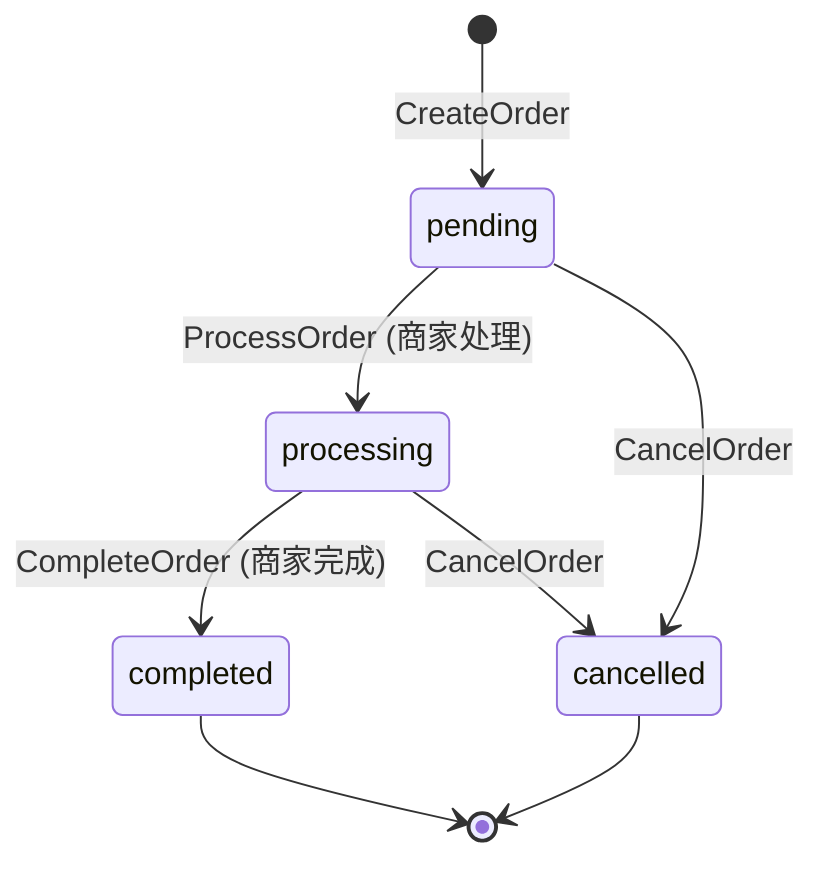
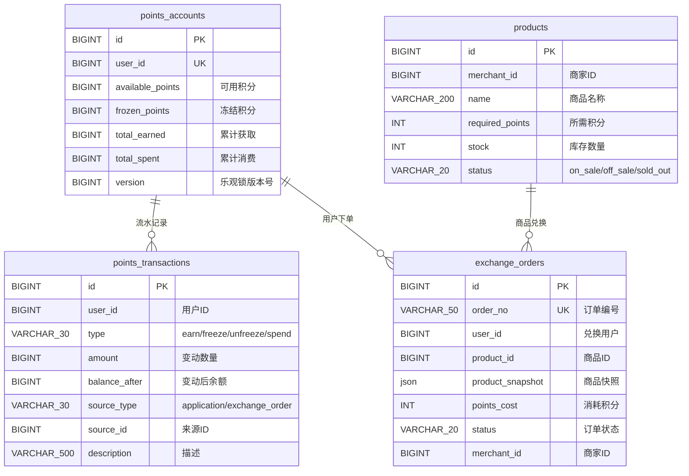
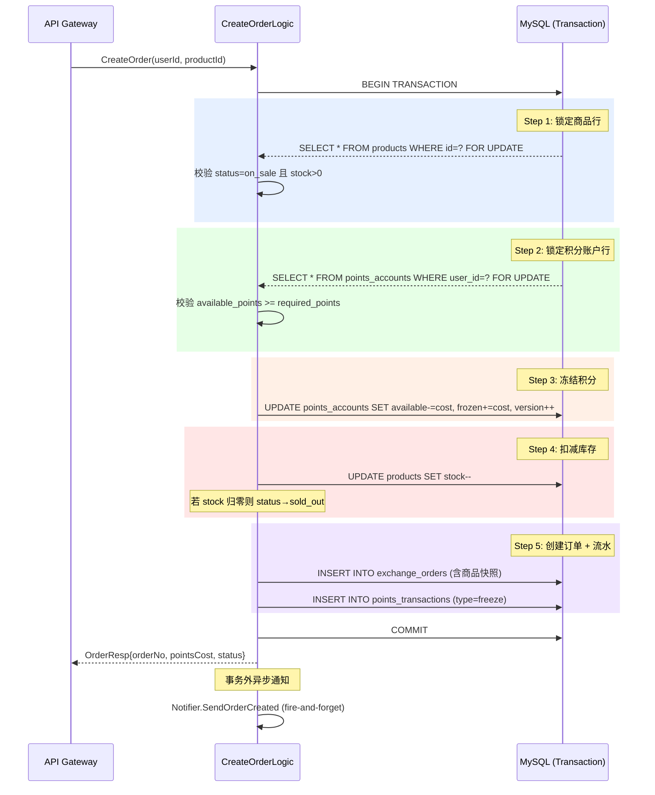

积分商城的兑换订单是系统中**资金敏感度最高**的业务链路——用户积分从可用态转入冻结态，商品库存从可售态进入扣减态，任何一步失败都必须原子性回滚。本文将深入剖析 Order RPC 服务如何在单库事务中通过悲观锁（`SELECT ... FOR UPDATE`）加乐观锁（`version` 字段）双重保障，完成积分冻结、库存扣减、订单创建与流水记录的四表协同操作，以及取消/完成等反向路径如何安全释放资源。

Sources: [create_order_logic.go](app/rpc/order/INTernal/logic/orderservice/create_order_logic.go#L1-L127), [cancel_order_logic.go](app/rpc/order/INTernal/logic/orderservice/cancel_order_logic.go#L1-L105), [complete_order_logic.go](app/rpc/order/INTernal/logic/orderservice/complete_order_logic.go#L1-L94)

## 订单状态机：四态有限自动机

兑换订单的生命周期由四个状态和严格的状态转换规则控制。系统在任何非法状态转换尝试时都会返回 `CodeStatusConflict (40904)` 错误，避免业务数据进入不一致态。



| 状态常量 | 值 | 含义 | 积分状态 | 库存状态 |
|---|---|---|---|---|
| `OrderStatusPending` | `"pending"` | 待处理 | 已冻结 | 已扣减 |
| `OrderStatusProcessing` | `"processing"` | 处理中 | 已冻结 | 已扣减 |
| `OrderStatusCompleted` | `"completed"` | 已完成 | 已消费（从冻结转为 `total_spent`） | 已扣减（不可逆） |
| `OrderStatusCancelled` | `"cancelled"` | 已取消 | 已解冻（退回可用） | 已恢复 |

Sources: [status.go](pkg/consts/status.go#L14-L19), [exchange_order.go](model/exchange_order.go#L1-L26)

## 核心数据模型：四表协同

兑换订单的事务横跨四张核心表，每张表承担不同的职责。理解它们的字段设计是理解事务一致性的前提。



**设计要点**：

- **`points_accounts.available_points` 与 `frozen_points` 的分离**：可用积分与冻结积分是两个独立字段，冻结操作是 `available -= cost; frozen += cost`，而非直接扣减。这种"先冻结、后消费"的模式是金融系统的标准做法，保证了取消订单时能安全退回。
- **`exchange_orders.product_snapshot`**：JSON 字段在订单创建时序列化商品的名称、图片、描述和所需积分，确保即使商品后续修改或下架，订单中仍保留创建时的完整信息。
- **`points_accounts.version`**：乐观锁版本号，每次更新时递增。虽然在当前实现中主要依赖悲观锁，但该字段为未来可能的跨服务调用场景预留了防并发冲突能力。
- **`points_transactions`**：完整的审计流水，`source_type = "exchange_order"` 关联订单来源，`type` 字段区分 `freeze`（创建冻结）、`unfreeze`（取消解冻）、`spend`（完成消费）三种交易类型。

Sources: [points_account.go](model/points_account.go#L1-L34), [product.go](model/product.go#L1-L20), [exchange_order.go](model/exchange_order.go#L1-L26), [schema.sql](deploy/schema.sql#L227-L318)

## 创建订单：原子冻结与扣减

创建订单是整个兑换链路中最复杂的操作，涉及四个实体的协同变更。系统选择在 **单一数据库事务** 中完成所有操作，而非跨 RPC 分布式事务，这一架构决策是理解整个一致性保障的关键。

### 为什么是单库事务而非跨 RPC 调用？

虽然 Order RPC 的 `ServiceContext` 持有 `PointsRpc` 和 `ProductRpc` 客户端引用，但创建订单逻辑**直接通过 GORM 操作数据库**，绕过了 RPC 调用。原因有三：

1. **一致性保障强度**：跨 RPC 意味着分布式事务（Saga / TCC），需要引入消息队列或事务协调器，复杂度指数级上升。而当前四张表位于同一 MySQL 实例中，单库事务提供了最严格的 ACID 保证。
2. **性能考量**：`SELECT ... FOR UPDATE` 悲观锁在单库中开销远低于跨服务锁协调。
3. **故障隔离**：单库事务失败自动回滚，无需处理部分成功的补偿逻辑。

Sources: [service_context.go](app/rpc/order/INTernal/svc/service_context.go#L17-L35), [create_order_logic.go](app/rpc/order/INTernal/logic/orderservice/create_order_logic.go#L33-L126)

### 事务内的执行序列



### 关键实现细节

**悲观锁的加锁顺序**遵循"商品 → 积分账户"的固定序列。这一顺序隐含了死锁预防策略——如果所有事务都按相同顺序获取锁，就不可能产生循环等待。代码中通过 `clause.Locking{Strength: "UPDATE"}` 生成 `FOR UPDATE` 子句：

```go
// 第一步：锁定商品行
tx.Clauses(clause.Locking{Strength: "UPDATE"}).First(&productModel, in.ProductId)

// 第二步：锁定积分账户行
tx.Clauses(clause.Locking{Strength: "UPDATE"}).
    Where("user_id = ?", in.UserId).First(&account)
```

**积分冻结的原子性操作**通过 Go 代码计算新值后 `Save` 整个对象实现。`available_points` 减去 `pointsCost`，`frozen_points` 加上 `pointsCost`，同时 `version` 递增：

```go
pointsCost := INT64(productModel.RequiredPoints)
account.AvailablePoints -= pointsCost
account.FrozenPoints += pointsCost
account.Version++
tx.Save(&account)
```

**库存归零的自动状态转换**：当 `stock--` 后值为 0 时，商品状态自动从 `on_sale` 变为 `sold_out`，防止后续用户看到无库存商品：

```go
productModel.Stock--
if productModel.Stock == 0 {
    productModel.Status = consts.ProductStatusSoldOut
}
```

**商品快照的序列化**通过 `buildProductSnapshot` 辅助函数完成，将商品的 ID、名称、图片、描述和所需积分编码为 JSON，存入订单的 `product_snapshot` 字段。这一设计确保了商品信息变更后，历史订单仍可正确展示：

```go
snapshot, err := buildProductSnapshot(&productModel)
// 序列化为 {"id":1,"name":"商品","image_url":"...","description":"...","required_points":100}
```

Sources: [create_order_logic.go](app/rpc/order/INTernal/logic/orderservice/create_order_logic.go#L39-L115), [helpers.go](app/rpc/order/INTernal/logic/orderservice/helpers.go#L11-L27)

### 错误场景与回滚

下表枚举了创建订单在事务中所有可能的失败点和对应的错误码。GORM 事务闭包内的任何 `error` 返回都会触发自动 `ROLLBACK`，四张表的数据保持一致：

| 校验阶段 | 失败条件 | 错误码 | 错误消息 |
|---|---|---|---|
| 商品查询 | `ErrRecordNotFound` | `40404` (CodeProductNotFound) | 商品不存在 |
| 商品状态 | `status == off_sale` | `40904` (CodeStatusConflict) | 商品已下架 |
| 库存检查 | `stock <= 0` 或 `status == sold_out` | `40902` (CodeStockInsufficient) | 库存不足 |
| 商品状态 | 非 `on_sale` 的其他状态 | `40904` (CodeStatusConflict) | 商品不可兑换 |
| 积分账户 | 账户不存在 (`ErrRecordNotFound`) | `40901` (CodePointsInsufficient) | 积分不足 |
| 积分余额 | `available_points < required_points` | `40901` (CodePointsInsufficient) | 积分不足 |

Sources: [create_order_logic.go](app/rpc/order/INTernal/logic/orderservice/create_order_logic.go#L34-L75), [code.go](pkg/errx/code.go#L28-L47)

## 商家处理：状态推进

`ProcessOrder` 是商家侧的过渡操作，将订单从 `pending` 推进到 `processing`，表示商家已接单正在处理。此步骤**不涉及积分和库存变更**，仅修改订单状态和商家备注：

```go
item.Status = consts.OrderStatusProcessing
item.MerchantRemark = sql.NullString{String: in.Remark, Valid: in.Remark != ""}
```

API 层通过 `HasAnyRoleOrSuperAdmin` 校验调用者必须具备 `merchant` 或 `admin` 角色。Admin 角色可以代理任意商家操作，而 Merchant 只能操作自己的订单（`merchant_id == userID`）。

Sources: [process_order_logic.go (RPC)](app/rpc/order/INTernal/logic/orderservice/process_order_logic.go#L32-L60), [process_order_logic.go (API)](app/api/INTernal/logic/order/process_order_logic.go#L33-L60)

## 完成订单：冻结积分消费

`CompleteOrder` 是订单的终态操作之一，将冻结积分正式转为消费。此操作将 `frozen_points` 减去 `pointsCost`，同时累加 `total_spent`，并记录一条 `type = "spend"` 的积分流水。与创建订单不同，完成订单**不再涉及库存变更**——库存已在创建时扣减且不可逆。

核心积分变更逻辑：

```go
account.FrozenPoints -= pointsCost   // 冻结积分减少
account.TotalSpent += pointsCost     // 累计消费增加
account.Version++
```

**安全校验**包括：订单状态必须为 `processing`、调用者 `merchant_id` 必须匹配订单的 `merchant_id`、冻结积分余额必须充足。若 `frozen_points < pointsCost`，返回 `CodeStatusConflict (40904)`，这通常意味着数据异常（同一用户的多个订单冻结总额超过了账户冻结余额），需要人工介入。

Sources: [complete_order_logic.go](app/rpc/order/INTernal/logic/orderservice/complete_order_logic.go#L32-L93)

## 取消订单：资源安全释放

取消订单是创建订单的**精确逆操作**，必须将冻结的积分退还至可用余额，并恢复商品库存。系统允许在 `pending` 和 `processing` 两种状态下取消，给予商家和用户最大的灵活性。

### 逆向操作序列

| 步骤 | 创建订单（正向） | 取消订单（逆向） |
|---|---|---|
| 积分变更 | `available -= cost; frozen += cost` | `available += cost; frozen -= cost` |
| 库存变更 | `stock--; status → sold_out (if 0)` | `stock++; status → on_sale (if was sold_out)` |
| 订单状态 | `→ pending` | `→ cancelled` |
| 流水类型 | `type = "freeze"` | `type = "unfreeze"` |

库存恢复时的自动状态转换值得注意——当商品之前是 `sold_out` 状态时，库存恢复后自动变为 `on_sale`，使其重新对用户可见：

```go
productModel.Stock++
if productModel.Status == consts.ProductStatusSoldOut {
    productModel.Status = consts.ProductStatusOnSale
}
```

API 层的权限控制更加精细：Admin 可以取消任意订单，Merchant 只能取消自己的订单（`detail.MerchantId == userID`），普通用户也可以取消自己的订单（`detail.UserId == userID`）。这种三级权限设计通过 `HasAnyRoleOrSuperAdmin` 和显式 ID 比较组合实现：

```go
allowed := apilogic.HasAnyRoleOrSuperAdmin(l.ctx, consts.RoleAdmin) ||
    (apilogic.HasAnyRole(roles, consts.RoleMerchant) && detail.MerchantId == userID) ||
    detail.UserId == userID
```

Sources: [cancel_order_logic.go (RPC)](app/rpc/order/INTernal/logic/orderservice/cancel_order_logic.go#L32-L97), [cancel_order_logic.go (API)](app/api/INTernal/logic/order/cancel_order_logic.go#L34-L60)

## 并发安全：悲观锁 + 乐观锁双层防护

系统在并发控制上采用了**双重保险**策略，两层锁各有不同的防御目标。

### 悲观锁：`SELECT ... FOR UPDATE`

所有事务中对 `products` 和 `points_accounts` 的查询都使用 `FOR UPDATE` 行级锁。这意味着在同一时刻，对同一商品或同一用户积分账户的并发兑换请求会被数据库序列化执行，防止以下竞态条件：

- **超卖**：两个用户同时兑换最后一件商品，库存从 1 被两个事务各扣一次
- **超支**：用户余额恰好够买一件商品，但并发提交了两笔订单

锁的持有范围从事务 `BEGIN` 到 `COMMIT`，GORM 的 `Transaction` 闭包自动管理这一生命周期。

### 乐观锁：`version` 字段

`points_accounts.version` 在每次更新时递增。虽然当前单库事务中悲观锁已足够，但 `version` 字段的存在为以下场景提供了额外的安全网：

1. 如果未来系统演进为跨服务调用（例如积分服务独立部署），乐观锁能防止基于过期数据的更新
2. Repository 层的 `FreezePoints`、`UnfreezePoints`、`ConfirmFrozen` 等方法在独立事务中操作时，version 递增可以作为数据变更的时序标识

Sources: [create_order_logic.go](app/rpc/order/INTernal/logic/orderservice/create_order_logic.go#L41-L74), [points_account_repository.go](model/points_account_repository.go#L71-L122)

## 通知机制：事务外的最终一致性

通知发送被刻意放置在事务提交之后，采用 **fire-and-forget** 模式。即使通知失败，订单数据已经持久化，不影响业务正确性。日志中仅记录错误但不回滚事务：

```go
// 事务已提交，通知失败不影响业务
if err := l.svcCtx.Notifier.SendOrderCreated(l.ctx, createdOrder.UserID, createdOrder.OrderNo); err != nil {
    l.Errorf("send order created notification failed, order_no=%s err=%v", createdOrder.OrderNo, err)
}
```

`Notifier` 将通知写入 `notifications` 表（`biz_type = "order"`），前端通过轮询或 WebSocket 获取。通知服务的 `MarshalForQueue` 方法预埋了消息队列接口，为未来从同步写入升级为异步推送预留了扩展点。

| 订单事件 | 通知方法 | 通知标题 |
|---|---|---|
| 创建成功 | `SendOrderCreated` | 兑换订单已创建 |
| 商家完成 | `SendOrderCompleted` | 兑换订单已完成 |
| 取消订单 | `SendOrderCancelled` | 兑换订单已取消 |

Sources: [create_order_logic.go](app/rpc/order/INTernal/logic/orderservice/create_order_logic.go#L117-L119), [notifier.go](pkg/notification/notifier.go#L64-L83)

## 订单编号生成：微秒级唯一性

订单编号通过 `GenerateOrderNo()` 生成，格式为 `EX` + 微秒时间戳（20 位）+ 3 位序号。使用 `sync.Mutex` 保护计数器，同一微秒内最多支持 999 个并发订单。服务重启时时间戳会跳到新的微秒值，不会与已有订单号冲突：

```go
// 格式示例：EX20260417142530123456001
//           |EX|2026-04-17 14:25:30.123456|001|
```

Sources: [order_no.go](pkg/utils/order_no.go#L15-L28)

## API 层的权限编排

API Gateway 层作为入口，在调用 Order RPC 之前完成认证和权限校验。各操作的权限矩阵如下：

| 操作 | 所需角色 | 额外约束 |
|---|---|---|
| CreateOrder | 任何已认证用户 | `userId` 从 JWT 上下文提取 |
| GetOrder | 任何已认证用户 | — |
| ListOrders | 任何已认证用户 | 按用户或商家维度筛选 |
| ProcessOrder | `merchant` / `admin` | Admin 可代理任意商家 |
| CompleteOrder | `merchant` / `admin` | Admin 可代理任意商家 |
| CancelOrder | `admin` / `merchant`(自有) / 用户(自有) | 三级权限判定 |

Sources: [cancel_order_logic.go (API)](app/api/INTernal/logic/order/cancel_order_logic.go#L34-L60), [complete_order_logic.go (API)](app/api/INTernal/logic/order/complete_order_logic.go#L33-L59), [create_order_logic.go (API)](app/api/INTernal/logic/order/create_order_logic.go#L32-L63)

## 测试策略：sqlmock 验证事务内 SQL 序列

Order RPC 的单元测试使用 `go-sqlmock` 验证事务内每条 SQL 的执行顺序和参数。以 `TestCreateOrder_Success` 为例，mock 精确匹配了 6 步操作：

1. `BEGIN`
2. `SELECT * FROM products ... FOR UPDATE` (加锁查商品)
3. `SELECT * FROM points_accounts ... FOR UPDATE` (加锁查积分)
4. `UPDATE points_accounts SET ...` (冻结积分)
5. `UPDATE products SET ...` (扣减库存)
6. `INSERT INTO exchange_orders ...` (创建订单)
7. `INSERT INTO points_transactions ...` (创建流水)
8. `COMMIT`

每个错误路径（商品不存在、已下架、库存不足、积分不足）都有独立的测试用例验证，确保任何校验失败都能正确触发回滚。`TestCreateOrder_Success_SoldOutWhenZero` 专门测试了库存从 1 降到 0 时状态自动转为 `sold_out` 的边界条件。

Sources: [create_order_logic_test.go](app/rpc/order/INTernal/logic/orderservice/create_order_logic_test.go#L183-L262), [mock_helper_test.go](app/rpc/order/INTernal/logic/orderservice/mock_helper_test.go#L135-L161)

## 架构权衡与演进方向

当前的单库事务方案在**一致性**和**实现简洁性**上表现优异，但存在明确的扩展性边界：

| 维度 | 当前方案 | 演进方向 |
|---|---|---|
| 数据库压力 | 所有锁竞争集中在一个 MySQL 实例 | 读写分离 + 库存独立分片 |
| 跨服务扩展 | 积分和商品必须同库 | Saga 模式 + 补偿事务 |
| 高并发场景 | `FOR UPDATE` 行锁吞吐量受限 | Redis 预扣减 + 异步落库 |
| 幂等保障 | 依赖订单号唯一索引 | 引入幂等 Token 机制 |

值得关注的是，`ServiceContext` 中已注入了 `PointsRpc` 和 `ProductRpc` 客户端，`AccountRepository` 接口也预留了独立的 `FreezePoints`、`UnfreezePoints`、`ConfirmFrozen` 方法——这些设计为未来从单库事务迁移到分布式事务预埋了接口层面的扩展点。

Sources: [service_context.go](app/rpc/order/INTernal/svc/service_context.go#L17-L35), [points_account_repository.go](model/points_account_repository.go#L13-L20)

---

**相关阅读**：

- 订单涉及的商品数据模型详见 [数据库设计：14 张核心表的关联与约束](4-shu-ju-ku-she-ji-14-zhang-he-xin-biao-de-guan-lian-yu-yue-shu)
- 积分账户的乐观锁机制深入分析见 [乐观锁机制：积分账户的并发安全控制](21-le-guan-suo-ji-zhi-ji-fen-zhang-hu-de-bing-fa-an-quan-kong-zhi)
- 错误码完整定义见 [统一错误码体系与错误处理规范](5-tong-cuo-wu-ma-ti-xi-yu-cuo-wu-chu-li-gui-fan)
- 订单 RPC 的 proto 定义与服务注册见 [go-zero API 定义语言（INTegral.api）与路由注册](11-go-zero-api-ding-yi-yu-yan-INTegral-api-yu-lu-you-zhu-ce)