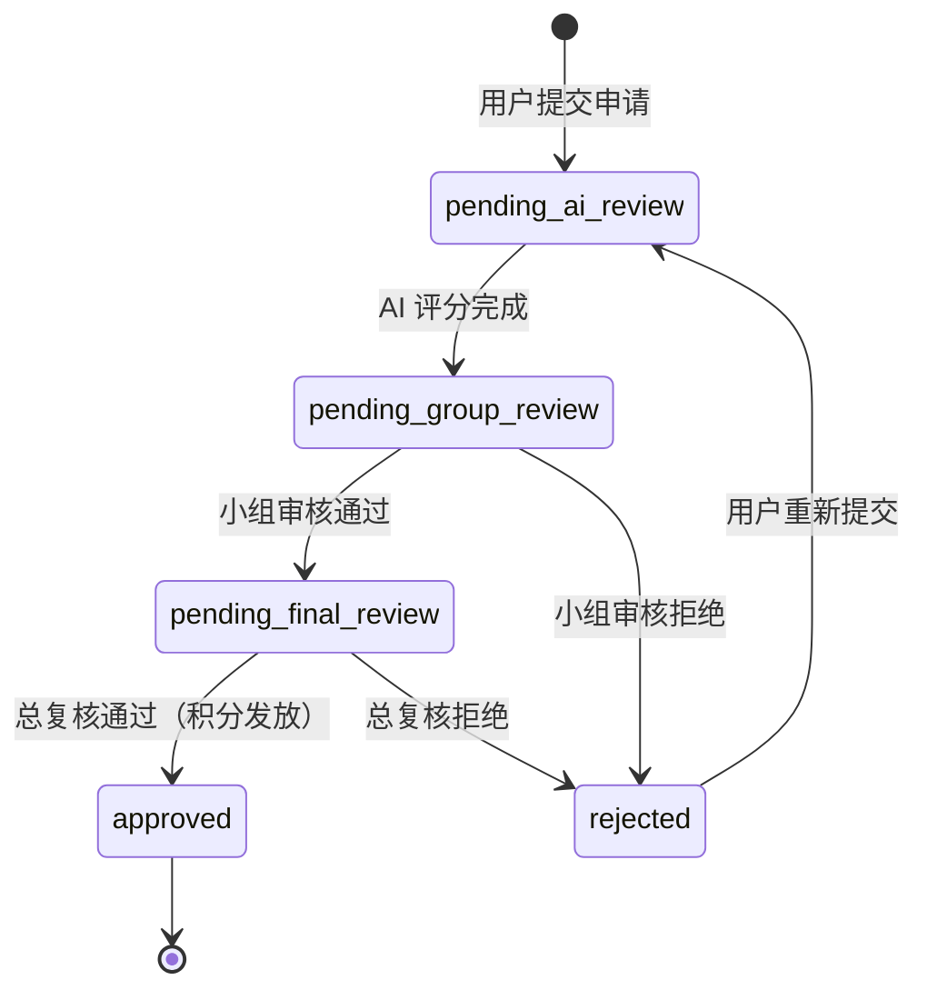
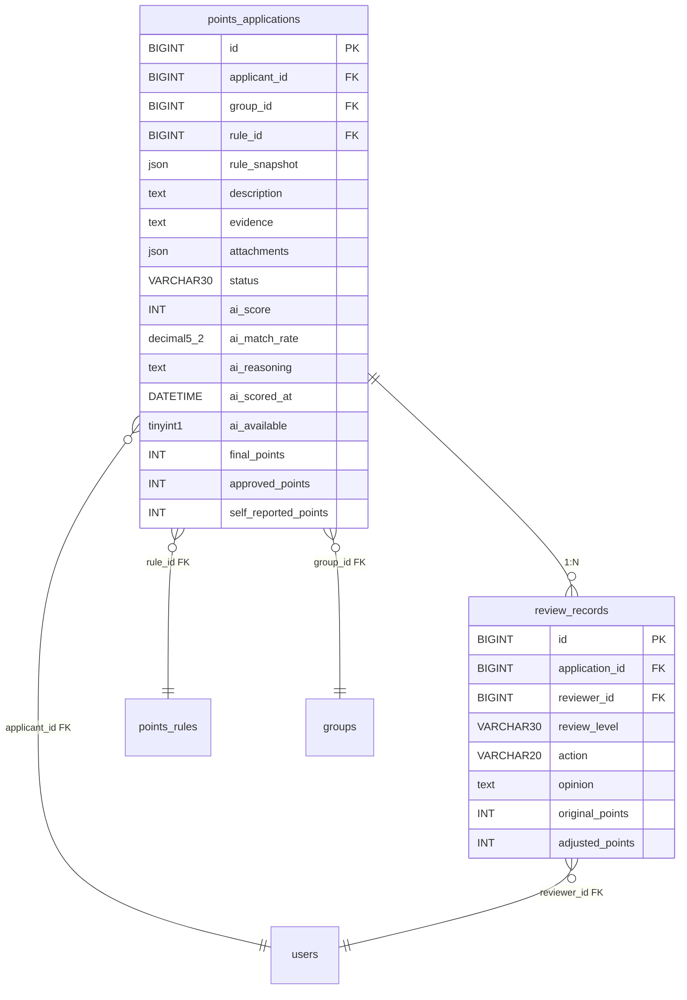
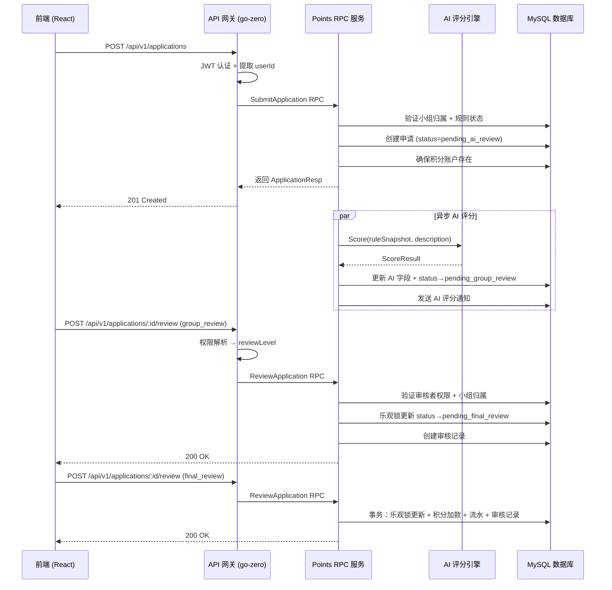

积分申请是积分商城系统的核心业务线，承载了从用户行为申报到最终积分入账的完整生命周期。本文从架构层面解析这条流水线的每一个阶段——申请提交时的规则快照与小组校验、AI 评分引擎的异步触发与结果校验、双级审核中的权限隔离与乐观锁控制、以及最终积分发放时的事务一致性保障。理解这条链路，是掌握整个系统业务逻辑的基石。

Sources: [status.go](pkg/consts/status.go#L4-L11), [types.go](pkg/consts/types.go#L27-L38)

## 状态机：五态流转与驳回重入

积分申请的状态流转本质上是一个**有限状态机**，共定义了六个状态常量，构成一条单向主干流加上一条驳回重入支路：



### 状态常量定义

| 状态常量 | 字符串值 | 含义 | 触发条件 |
|----------|---------|------|---------|
| `AppStatusPendingAIReview` | `pending_ai_review` | 待 AI 评分 | 初始创建或重新提交 |
| `AppStatusPendingGroupReview` | `pending_group_review` | 待小组审核 | AI 评分完成后自动流转 |
| `AppStatusPendingFinalReview` | `pending_final_review` | 待总复核 | 小组审核通过 |
| `AppStatusApproved` | `approved` | 已通过 | 总复核通过 |
| `AppStatusRejected` | `rejected` | 已拒绝 | 任一级审核拒绝 |
| `AppStatusResubmitted` | `resubmitted` | 已重新提交 | 保留值，实际重置为 `pending_ai_review` |

设计上有一个关键决策：**AI 评分无论成功与否，都会将状态推进到 `pending_group_review`**。这意味着 AI 评分失败不会阻塞流程，审核员仍可基于人工判断继续处理。这种"降级不中断"的模式确保了业务连续性。

Sources: [status.go](pkg/consts/status.go#L4-L11), [trigger_a_i_score_logic.go](app/rpc/points/INTernal/logic/pointsservice/trigger_a_i_score_logic.go#L119-L121)

## 数据模型：申请表与审核记录的关联结构

积分申请涉及两张核心数据表：`points_applications` 和 `review_records`，它们通过 `application_id` 形成 **一对多** 关系——一次申请可能产生多条审核记录（小组审核 + 总复核）。



**`PointsApplication` 模型**的字段设计体现了三个维度的信息：**申请输入**（`applicant_id`、`group_id`、`rule_id`、`description`、`evidence`、`attachments`、`self_reported_points`）、**AI 评分结果**（`ai_score`、`ai_match_rate`、`ai_reasoning`、`ai_scored_at`、`ai_available`）和**最终结算**（`final_points`、`approved_points`）。其中所有 AI 相关字段和积分字段均使用 `sql.Null*` 类型，因为这些值在申请创建时并不存在，而是由后续流程逐步填充。

**`ReviewRecord` 模型**记录每一次审核操作的完整上下文：审核人、审核级别（`group_review` / `final_review`）、动作（`approve` / `reject` / `adjust_approve`）以及积分调整信息（`original_points` → `adjusted_points`）。这些记录构成了不可篡改的审核轨迹。

Sources: [points_application.go](model/points_application.go#L10-L33), [review_record.go](model/review_record.go#L9-L19), [schema.sql](deploy/schema.sql#L173-L222)

## 阶段一：申请提交 —— 规则快照与小组归属校验

申请提交的入口位于 API 网关层，由 `POST /api/v1/applications` 路由触发，经 JWT 认证后进入 `SubmitApplication` 逻辑链。

### 前端表单

提交页面提供了五个核心字段：**积分规则选择**（从 `active` 状态规则列表中选取）、**所属小组**（从用户已分配的小组中选择，若只有一个则自动锁定）、**自报积分**（用户根据规则分数范围自行估算）、**行为描述**和**证明材料**。

Sources: [submit/index.tsx](frontend/src/pages/application/submit/index.tsx#L58-L75)

### API 层：JWT 上下文提取与 RPC 转发

API 网关层的 `SubmitApplicationLogic` 负责从 JWT 上下文中提取 `userId`，将前端请求字段映射为 RPC 请求对象，然后调用 `PointsRpc.SubmitApplication` 将实际业务逻辑委托给 Points RPC 服务。

```go
userId := contextx.GetUserID(l.ctx)
rpcReq := &pointsservice.SubmitApplicationReq{
    ApplicantId:        userId,
    GroupId:            req.GroupId,
    RuleId:             req.RuleId,
    Description:        req.Description,
    Evidence:           req.Evidence,
    Attachments:        attachments,
    SelfReportedPoints: req.SelfReportedPoints,
}
rpcResp, err := l.svcCtx.PointsRpc.SubmitApplication(l.ctx, rpcReq)
```

这种 API → RPC 的两层架构确保了网关层专注于认证与数据转换，而 RPC 层专注于业务逻辑与数据持久化。

Sources: [submit_application_logic.go](app/api/INTernal/logic/application/submit_application_logic.go#L31-L53), [INTegral.api](app/api/INTegral.api#L593-L611)

### RPC 层：六步提交逻辑

Points RPC 的 `SubmitApplication` 方法执行六个顺序步骤：

**第一步：验证申请人小组归属**。调用 `GroupRepo.FindUserGroups` 查询申请人的小组列表，确认 `group_id` 参数确实属于该申请人。这一校验防止了用户冒充其他小组成员提交申请。

**第二步：验证积分规则状态**。查找 `rule_id` 对应的规则，确认其 `status == "active"`。禁用的规则不允许作为申请依据。

**第三步：序列化规则快照**。将完整的 `PointsRule` 对象序列化为 JSON 并存入 `rule_snapshot` 字段。这是一个关键的**不可变性保障**——后续即使规则被修改或禁用，该申请始终能追溯到提交时刻的规则原文。

**第四步：创建申请记录**。组装 `PointsApplication` 实体，初始状态设为 `pending_ai_review`，调用 `ApplicationRepo.Create` 写入数据库。

**第五步：确保积分账户存在**。调用 `ensureAccount` 检查申请人是否已有积分账户，若无则自动创建。这是防御性编程——避免后续积分发放时找不到目标账户。

**第六步：异步触发 AI 评分**。通过 `go func` 启动一个带 30 秒超时的 goroutine，调用 `TriggerAIScoreLogic.TriggerAIScore`。值得注意的是代码显式传递了 `*application` 的**值拷贝** `(*application)`，而非指针引用，避免 goroutine 与主协程之间的数据竞争。goroutine 内部还包含 `recover` 机制防止 AI 评分 panic 导致服务崩溃。

Sources: [submit_application_logic.go](app/rpc/points/INTernal/logic/pointsservice/submit_application_logic.go#L33-L121)

## 阶段二：AI 评分 —— 异步引擎与幻觉防护

AI 评分是整条链路中唯一的异步环节，由提交阶段的 goroutine 触发。其设计哲学是"尽力而为，失败不阻塞"。

### 评分触发流程

`TriggerAIScore` 方法首先验证申请状态是否仍为 `pending_ai_review`——如果已经被人工处理则直接跳过。然后提取规则快照文本，调用 `AiScorer.Score` 获取评分结果，最后更新申请记录并流转到 `pending_group_review`。

```go
result, err := l.svcCtx.AiScorer.Score(l.ctx, ruleSnapshot, app.Description)
```

规则快照文本通过 `extractRuleSnapshotText` 函数格式化为可读结构：

```
规则名称: 项目技术创新贡献
适用行为: 在项目中提出并实施技术创新方案
分数范围: 10-50
评分标准: {"base_score":20,"bonus_items":[...],"penalty_items":[]}
```

Sources: [trigger_a_i_score_logic.go](app/rpc/points/INTernal/logic/pointsservice/trigger_a_i_score_logic.go#L36-L66), [trigger_a_i_score_logic.go](app/rpc/points/INTernal/logic/pointsservice/trigger_a_i_score_logic.go#L150-L170)

### AI 评分结果校验（幻觉防护）

`updateApplicationWithAIResult` 函数包含一层重要的**LLM 输出验证逻辑**。它从规则快照中提取 `max_score`，将 AI 建议的积分值截断到该上限以内：

```go
if suggestedPoints > maxScore {
    logx.Infof("AI 建议积分 %d 超过规则上限 %d，已自动截断", suggestedPoints, maxScore)
    suggestedPoints = maxScore
}
if suggestedPoints < 0 {
    suggestedPoints = 0
}
```

这种防御性设计应对了 LLM 可能出现的幻觉输出——即使 AI 返回一个超出规则范围的值，系统也能自动修正。默认上限为 10000 分，作为兜底保护。

Sources: [trigger_a_i_score_logic.go](app/rpc/points/INTernal/logic/pointsservice/trigger_a_i_score_logic.go#L69-L125)

### AI 评分结果结构

`ScoreResult` 包含四个核心字段，写入 `points_applications` 表的五个 AI 相关列：

| `ScoreResult` 字段 | 数据库列 | 类型 | 说明 |
|---------------------|---------|------|------|
| `SuggestedPoints` | `ai_score` | `INT` | AI 建议的积分值 |
| `MatchRate` | `ai_match_rate` | `DECIMAL(5,2)` | 行为与规则的匹配度百分比 (0-100) |
| `Analysis` | `ai_reasoning` | `TEXT` | AI 的评分分析说明 |
| `Available` | `ai_available` | `TINYINT(1)` | AI 评分是否可用 |
| *(自动填充)* | `ai_scored_at` | `DATETIME` | 评分完成时间 |

Sources: [scorer.go](app/rpc/points/INTernal/ai/scorer.go#L24-L30), [trigger_a_i_score_logic.go](app/rpc/points/INTernal/logic/pointsservice/trigger_a_i_score_logic.go#L98-L118)

### 评分后通知

评分完成后，系统通过 `Notifier.Send` 向申请人发送站内通知，内容根据 AI 评分是否可用而不同：可用时告知建议积分和匹配度，不可用时提示已转人工审核。

Sources: [trigger_a_i_score_logic.go](app/rpc/points/INTernal/logic/pointsservice/trigger_a_i_score_logic.go#L127-L148)

## 阶段三：双级审核 —— 权限隔离与乐观锁

审核阶段是整条链路中权限控制最密集的环节，由两级审核组成，每一级都有独立的权限校验、状态验证和并发保护。

### 审核级别与角色对应

| 审核级别 | 常量值 | 角色要求 | 审核范围 |
|---------|--------|---------|---------|
| 小组审核 | `group_review` | `reviewer` 或 `admin` | 仅限审核员所属小组的申请 |
| 总复核 | `final_review` | `chief_reviewer` 或 `admin` | 所有通过小组审核的申请 |

### 审核请求入口

审核操作通过 `POST /api/v1/applications/:id/review` 进入。API 层的 `ReviewApplicationLogic` 首先从 JWT 上下文提取用户 ID，然后调用 `resolveReviewLevel` 函数确定审核级别——该函数优先使用前端传递的 `level` 参数，若未指定则根据用户权限自动推断（超级管理员默认进入总复核）。

```go
reviewLevel, err := resolveReviewLevel(req.Level, permissions, contextx.IsSuperAdmin(l.ctx))
```

Sources: [review_application_logic.go](app/api/INTernal/logic/review/review_application_logic.go#L31-L82)

### RPC 层审核：四步验证 + 三路分发

Points RPC 的 `ReviewApplication` 方法执行严格的四步验证：

**第一步：查询申请**。通过 `ApplicationRepo.FindByID` 获取申请记录。

**第二步：验证审核者权限**（`validateReviewerPermission`）。这一步实现了双重校验——首先查询审核者的角色列表，确认其拥有对应级别所需的角色编码；然后对小组审核额外验证审核者与申请是否属于同一小组：

```go
case consts.ReviewLevelGroup:
    if !hasRoleCode(reviewerRoles, consts.RoleReviewer, consts.RoleAdmin) {
        return errx.NewCodeError(errx.CodeForbidden, "无权执行小组审核")
    }
    reviewerGroupIDs, err := l.getReviewerGroupIDs(in.ReviewerId)
    // ...
    if !containsGroupID(reviewerGroupIDs, app.GroupID) {
        return errx.NewCodeError(errx.CodeForbidden, "无权审核该申请")
    }
```

**第三步：验证状态匹配**（`validateStatus`）。确保申请处于对应审核级别的等待状态——小组审核要求 `pending_group_review`，总复核要求 `pending_final_review`。

**第四步：根据动作分发处理**。支持三种审核动作：
- `approve`：通过
- `reject`：拒绝
- `adjust_approve`：调整积分后通过（仅总复核可用）

Sources: [review_application_logic.go](app/rpc/points/INTernal/logic/pointsservice/review_application_logic.go#L34-L63), [review_application_logic.go](app/rpc/points/INTernal/logic/pointsservice/review_application_logic.go#L66-L94)

### 乐观锁：并发安全的基石

整个审核流程使用**乐观锁模式**保护状态转换的原子性。`ApplicationRepository.UpdateStatusWithCheck` 方法在 UPDATE 语句中携带 `WHERE status = ?` 条件：

```go
result := r.db.WithContext(ctx).
    Model(&PointsApplication{}).
    Where("id = ? AND status = ?", id, expectedStatus).
    Updates(map[string]any{...})
return result.RowsAffected > 0, nil
```

当 `RowsAffected == 0` 时，说明申请状态已被其他请求修改，当前操作被拒绝并返回 `"申请状态已变更，请刷新后重试"` 错误。这种模式避免了分布式锁的开销，同时保证了并发安全。

Sources: [points_repository.go](model/points_repository.go#L138-L154)

### 小组审核通过：状态推进

小组审核通过时，申请状态从 `pending_group_review` 推进到 `pending_final_review`，使用乐观锁更新，然后创建审核记录并发送通知。此时**不涉及积分计算**，仅做状态流转。

Sources: [review_application_logic.go](app/rpc/points/INTernal/logic/pointsservice/review_application_logic.go#L140-L199)

### 总复核通过：积分发放事务

总复核通过是最复杂的操作，它需要在一个数据库事务中原子完成三件事：

**`finalizeApprovedApplication`** 方法使用 GORM 的 `Transaction` 方法包裹以下操作：

1. **乐观锁更新申请状态**：`WHERE id = ? AND status = 'pending_final_review'` 确保并发安全
2. **积分账户加款**：使用 `SELECT ... FOR UPDATE` 行锁查询账户，更新 `available_points` 和 `total_earned`，并递增 `version`
3. **创建积分流水**：写入 `points_transactions` 表，记录 `type = "earn"`、`source_type = "application"`、变更后余额等信息
4. **创建审核记录**：写入 `review_records` 表，记录审核动作和积分调整信息

```go
return l.svcCtx.Db.WithContext(l.ctx).Transaction(func(tx *gorm.DB) error {
    // 1. 更新申请状态（乐观锁）
    result := tx.Model(&model.PointsApplication{}).
        Where("id = ? AND status = ?", app.ID, expectedStatus).Updates(...)
    // 2. 积分账户加款（行锁）
    tx.Clauses(clause.Locking{Strength: "UPDATE"}).Where("user_id = ?", app.ApplicantID).First(&account)
    account.AvailablePoints += amount
    account.TotalEarned += amount
    account.Version++
    // 3. 创建积分流水
    tx.Create(txRecord)
    // 4. 创建审核记录
    tx.Create(record)
    return nil
})
```

这种事务内嵌行锁 + 版本号的组合设计，确保了在极高并发场景下积分发放的精确性。

Sources: [review_application_logic.go](app/rpc/points/INTernal/logic/pointsservice/review_application_logic.go#L280-L357)

### 积分计算优先级

最终积分数由 `calcFinalPoints` 函数决定，遵循两条优先级规则：

```go
func calcFinalPoints(app *model.PointsApplication) INT32 {
    if app.AiScore.Valid && app.AiScore.Int32 > 0 {
        return app.AiScore.Int32  // 优先使用 AI 评分
    }
    if app.ApprovedPoints.Valid && app.ApprovedPoints.Int32 > 0 {
        return app.ApprovedPoints.Int32  // 其次使用审批积分
    }
    return 0
}
```

总复核员可以通过 `adjust_approve` 动作覆盖这个值，此时 `adjusted_points` 直接成为最终发放金额。

Sources: [review_application_logic.go](app/rpc/points/INTernal/logic/pointsservice/review_application_logic.go#L268-L277), [review_application_logic.go](app/rpc/points/INTernal/logic/pointsservice/review_application_logic.go#L235-L266)

## 阶段四：驳回重入 —— 重新提交与 AI 重评

当申请被任一级审核拒绝后，申请人可以重新提交。`ResubmitApplication` 方法执行以下操作：

1. 验证申请人身份（`app.ApplicantID == in.ApplicantId`）
2. 验证状态为 `rejected`
3. **重置所有 AI 评分字段**为 `Null`（`AiScore`、`AiMatchRate`、`AiReasoning`、`AiScoredAt`、`AiAvailable`、`FinalPoints`、`ApprovedPoints`）
4. 将状态重置为 `pending_ai_review`
5. 异步重新触发 AI 评分（与初次提交相同的 goroutine 模式）

重入后，申请将完整走一遍 AI 评分 → 小组审核 → 总复核的流程，而非从被拒绝的环节继续。这是一个有意的设计选择——重新提交意味着申请内容可能已变更，需要 AI 重新评估。

Sources: [resubmit_application_logic.go](app/rpc/points/INTernal/logic/pointsservice/resubmit_application_logic.go#L31-L87)

## 通知机制：状态变更的实时感知

系统在每个关键状态节点都会通过 `Notifier` 发送站内通知：

| 触发时机 | 接收者 | 通知内容 |
|---------|--------|---------|
| AI 评分完成 | 申请人 | 建议积分 + 匹配度，或"已转人工审核" |
| 小组审核通过 | 申请人 | "已通过小组审核，等待总复核" |
| 总复核通过 | 申请人 | "已审核通过，获得 N 积分" |
| 审核拒绝 | 申请人 | "已被拒绝，原因：xxx" |

`Notifier` 底层通过 `NotificationRepository` 同步写入 `notifications` 表，预留了 `MarshalForQueue` 方法为未来的消息队列扩展做准备。

Sources: [notifier.go](pkg/notification/notifier.go#L24-L62), [review_application_logic.go](app/rpc/points/INTernal/logic/pointsservice/review_application_logic.go#L457-L470)

## 端到端调用链路总览

从 HTTP 请求到积分入账，整条链路跨越三个服务层：



Sources: [submit_application_logic.go](app/api/INTernal/logic/application/submit_application_logic.go#L31-L80), [review_application_logic.go](app/api/INTernal/logic/review/review_application_logic.go#L31-L52), [points.proto](app/rpc/points/points.proto#L276-L309)

## Repository 模式与依赖注入

所有数据访问均通过 Repository 接口抽象，由 `ServiceContext` 统一注入。Points RPC 的 `ServiceContext` 持有十个 Repository 和两个服务实例：

| 字段 | 类型 | 职责 |
|------|------|------|
| `RuleRepo` | `RuleRepository` | 积分规则的 CRUD 与版本快照 |
| `ApplicationRepo` | `ApplicationRepository` | 申请的 CRUD + 乐观锁状态更新 |
| `ReviewRecordRepo` | `ReviewRecordRepository` | 审核记录的创建与查询 |
| `AccountRepo` | `AccountRepository` | 积分账户余额操作（乐观锁 + 行锁） |
| `TransactionRepo` | `TransactionRepository` | 积分流水的创建与查询 |
| `GroupRepo` | `GroupRepository` | 小组信息与用户-小组关系查询 |
| `RoleRepo` | `RoleRepository` | 用户角色查询 |
| `Notifier` | `*notification.Notifier` | 站内通知发送 |
| `AiScorer` | `*ai.AiScorer` | AI 评分引擎 |

`ApplicationRepository` 的 `UpdateStatusWithCheck` 方法是乐观锁的核心实现——它在 UPDATE 语句中携带 `WHERE status = ?` 条件，仅当当前状态与期望值匹配时才执行更新，通过 `RowsAffected` 返回值判断是否成功。`ListByGroupIDs` 方法则为小组审核员提供了按多个小组 ID 批量查询的能力。

Sources: [service_context.go](app/rpc/points/INTernal/svc/service_context.go#L14-L35), [points_repository.go](model/points_repository.go#L104-L112)

## 关键设计决策总结

| 决策点 | 选择 | 理由 |
|--------|------|------|
| AI 评分调用方式 | 异步 goroutine | 不阻塞用户提交响应，AI 服务不可用时不影响主流程 |
| AI 评分失败处理 | 继续流转到人工审核 | "降级不中断"原则，保证业务连续性 |
| 规则引用方式 | 提交时快照 JSON | 规则后续修改不影响已提交的申请 |
| 并发控制 | 乐观锁 (CAS) | 避免分布式锁复杂度，审核场景冲突概率低 |
| 积分发放 | 数据库事务 + 行锁 | 确保积分加款与流水记录的原子性 |
| 驳回重入 | 完整重走全流程 | 申请内容可能变更，需要 AI 重新评估 |
| 审核权限 | 角色编码 + 小组归属双重校验 | 确保审核员只能审核自己小组的申请 |

Sources: [submit_application_logic.go](app/rpc/points/INTernal/logic/pointsservice/submit_application_logic.go#L86-L102), [points_account_repository.go](model/points_account_repository.go#L46-L68)

---

### 延伸阅读

- [AI 评分引擎：多提供商适配与 Prompt 工程](7-ai-ping-fen-yin-qing-duo-ti-gong-shang-gua-pei-yu-prompt-gong-cheng) — 深入了解 `AiScorer` 的多提供商架构与 Prompt 模板设计
- [兑换订单：积分冻结、库存扣减与事务一致性保障](8-dui-huan-ding-dan-ji-fen-dong-jie-ku-cun-kou-jian-yu-shi-wu-zhi-xing-bao-zhang) — 了解积分的另一条消费链路
- [RBAC 权限系统：角色、权限编码与中间件鉴权](9-rbac-quan-xian-xi-tong-jiao-se-quan-xian-bian-ma-yu-zhong-jian-jian-jian-quan) — 理解审核权限背后的 RBAC 体系
- [乐观锁机制：积分账户的并发安全控制](21-le-guan-suo-ji-zhi-ji-fen-zhang-hu-de-bing-fa-an-quan-kong-zhi) — 深入分析版本号与行锁的并发控制策略
- [GORM 模型定义与 Repository 模式](20-gorm-mo-xing-ding-yi-yu-repository-mo-shi) — 理解数据模型层的完整设计