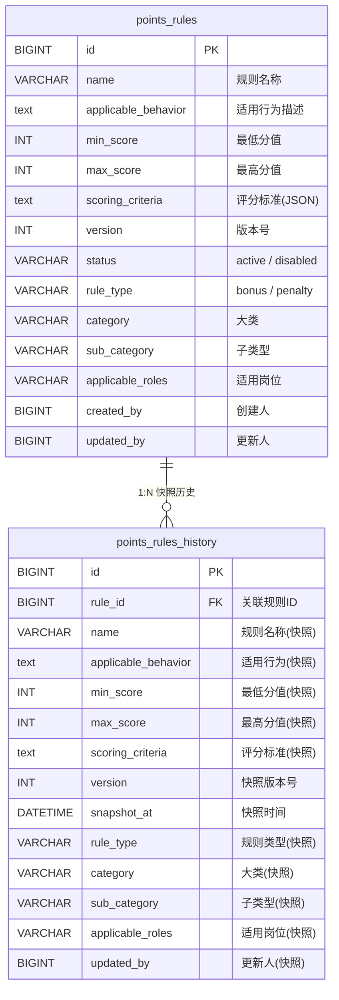
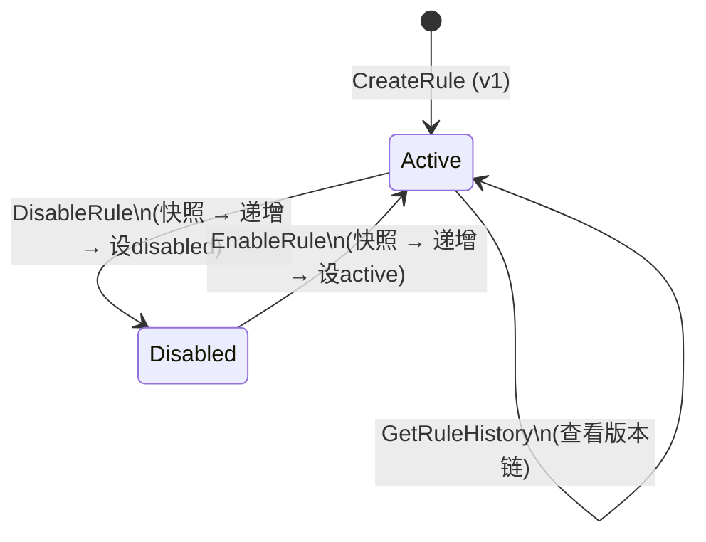

积分规则是整个积分商城的**评分基座**——它定义了"什么样的行为值多少分"。但规则并非一成不变：业务需求驱动规则不断调整分值区间、评分标准、适用范围。如果缺乏版本追踪，一旦规则发生变更，历史积分申请将失去审计依据。本系统采用**双表版本快照**模式（`points_rules` + `points_rules_history`），配合**乐观锁重试**的状态流转机制，确保规则在"创建 → 更新 → 禁用 → 启用"全生命周期中，每次变更都被精确记录、可回溯、可审计。与此同时，积分申请提交时会对当前规则进行 JSON 序列化快照，彻底解耦申请与规则的时序依赖。

Sources: [points_rule.go](model/points_rule.go#L1-L48), [schema.sql](deploy/schema.sql#L127-L168)

## 双表版本快照模型

系统的核心数据模型由两张表构成：`points_rules` 存储规则的**当前活跃版本**，`points_rules_history` 存储规则每次变更前的**完整快照**。两者通过 `rule_id` 外键关联（带 `ON DELETE CASCADE`），形成一条不可断裂的版本链。



**关键设计决策**：`points_rules_history` 并非只存储 diff，而是将变更前规则的**全部业务字段**逐字段复制。这意味着即使 `points_rules` 表结构未来扩展新字段，历史记录仍能完整还原当时规则的完整面貌。版本号（`version`）从 1 开始，每次 Update / Disable / Enable 操作均自增，版本号同时出现在当前表和历史表中，形成双向校验锚点。

Sources: [points_rule.go](model/points_rule.go#L8-L48), [schema.sql](deploy/schema.sql#L127-L168)

## 规则生命周期与状态机

规则拥有两个核心状态：**`active`**（启用）和 **`disabled`**（禁用），通过四个操作驱动状态流转。每个操作在执行状态变更前，都会先对当前版本做快照，再递增版本号。



下表总结了每个操作的**前置条件、快照行为和版本递增策略**：

| 操作 | 前置状态检查 | 快照内容 | 版本递增 | 并发控制 |
|------|------------|---------|---------|---------|
| **CreateRule** | 无（新建） | 不创建快照 | 初始 v1 | 无 |
| **UpdateRule** | 必须为 `active`；`disabled` 规则拒绝修改 | 变更前的完整规则字段 | v → v+1 | GORM Save（隐式乐观锁） |
| **DisableRule** | 必须为 `active`；已禁用则返回冲突 | 禁用前完整规则 | v → v+1 | **显式乐观锁 + 3 次重试** |
| **EnableRule** | 必须为 `disabled`；已启用则返回冲突 | 启用前完整规则 | v → v+1 | **显式乐观锁 + 3 次重试** |
| **GetRuleHistory** | 规则必须存在 | 只读操作 | 无 | 无 |

Sources: [update_rule_logic.go](app/rpc/points/INTernal/logic/pointsservice/update_rule_logic.go#L30-L124), [disable_rule_logic.go](app/rpc/points/INTernal/logic/pointsservice/disable_rule_logic.go#L28-L64), [enable_rule_logic.go](app/rpc/points/INTernal/logic/pointsservice/enable_rule_logic.go#L28-L63), [consts/status.go](pkg/consts/status.go#L34-L38)

## UpdateRule：快照优先的变更协议

UpdateRule 是版本快照机制中最关键的操作，其执行顺序严格遵循 **"先快照、后递增、再持久化"** 的三阶段协议：

1. **查找规则**：通过 `RuleRepo.FindByID` 获取当前规则，若状态为 `disabled` 则立即拒绝（错误码 `CodeStatusConflict`）
2. **字段合并**：请求中的非零字段逐一覆盖到规则对象上，支持**部分更新**语义
3. **分数校验**：`penalty` 类型规则的 `MaxScore` 不得大于 0；`bonus` 类型规则的 `MinScore` 不得小于 0；所有类型的 `MaxScore >= MinScore`
4. **创建快照**：将已合并但**尚未递增版本号**的规则完整写入 `points_rules_history`
5. **递增版本**：`rule.Version++`
6. **持久化更新**：通过 `RuleRepo.Update` 保存变更

这种"快照的是即将被替换的版本，而非递增后的新版本"的设计，确保历史表中每条记录的 `version` 字段精确对应其在主表中被替换前的版本号。

Sources: [update_rule_logic.go](app/rpc/points/INTernal/logic/pointsservice/update_rule_logic.go#L30-L124)

### Repository 层快照实现

快照的物理实现在 `RuleRepository.SnapshotRule` 方法中完成——它接收一个 `*PointsRule` 对象，将其**所有业务字段**逐字段映射为 `PointsRulesHistory` 结构体，然后通过 GORM `Create` 插入历史表：

```go
func (r *ruleRepository) SnapshotRule(ctx context.Context, rule *PointsRule) error {
    snapshot := PointsRulesHistory{
        RuleID:             rule.ID,
        Name:               rule.Name,
        ApplicableBehavior: rule.ApplicableBehavior,
        MinScore:           rule.MinScore,
        MaxScore:           rule.MaxScore,
        ScoringCriteria:    rule.ScoringCriteria,
        Version:            rule.Version,
        RuleType:           rule.RuleType,
        Category:           rule.Category,
        SubCategory:        rule.SubCategory,
        ApplicableRoles:    rule.ApplicableRoles,
        UpdatedBy:          rule.UpdatedBy,
    }
    return r.db.WithContext(ctx).Create(&snapshot).Error
}
```

注意 `snapshot_at` 字段使用数据库默认值 `CURRENT_TIMESTAMP`，无需应用层显式赋值，避免时钟偏移问题。

Sources: [points_repository.go](model/points_repository.go#L84-L100)

## Disable / Enable：乐观锁与重试机制

与 UpdateRule 不同，Disable 和 Enable 操作采用**显式乐观锁重试**模式（最多 3 次尝试），原因是状态翻转操作更容易遭遇并发冲突——例如管理员 A 和管理员 B 同时尝试禁用同一条规则：

```go
const maxRetries = 3
for i := 0; i < maxRetries; i++ {
    rule, err := l.svcCtx.RuleRepo.FindByID(l.ctx, in.Id)
    // ... 状态检查 + 快照 ...
    rule.Version++
    rule.Status = consts.RuleStatusDisabled  // 或 RuleStatusActive
    if err := l.svcCtx.RuleRepo.Update(l.ctx, rule); err != nil {
        if i < maxRetries-1 {
            l.Infof("禁用规则乐观锁冲突，重试第 %d 次", i+2)
            continue  // 重新读取 → 重新检查 → 重新快照
        }
        return nil, errx.NewCodeError(...)
    }
    return &points.Empty{}, nil
}
```

重试循环的每次迭代都会**重新从数据库读取最新版本**，这意味着如果在重试期间规则被其他操作修改，本次操作将基于最新数据重新进行状态检查和快照，保证语义正确性。

Sources: [disable_rule_logic.go](app/rpc/points/INTernal/logic/pointsservice/disable_rule_logic.go#L28-L64), [enable_rule_logic.go](app/rpc/points/INTernal/logic/pointsservice/enable_rule_logic.go#L28-L63)

## GetRuleHistory：版本链组装

历史查询接口 `GetRuleHistory` 采用**"当前版本 + 历史快照"**的组装策略：先从 `points_rules` 读取当前规则作为版本链的最新节点，再从 `points_rules_history` 按 `version DESC` 排序读取所有历史快照，将两者合并为一条完整的时间线返回给前端。这意味着即使一条规则从未被修改过，`GetRuleHistory` 也会返回至少 1 条记录（当前版本）。

Sources: [get_rule_history_logic.go](app/rpc/points/INTernal/logic/pointsservice/get_rule_history_logic.go#L28-L81)

## 结构化评分体系：ScoringCriteria JSON 规范

`scoring_criteria` 字段采用 JSON 格式存储，将评分标准从简单的"分数范围"升级为**结构化的加减分项体系**。其标准格式为：

```json
{
  "base_score": 5,
  "bonus_items": [
    {"description": "包含详细代码示例", "max_score": 2},
    {"description": "文档被团队广泛参考", "max_score": 1}
  ],
  "penalty_items": [
    {"description": "文档存在错误", "max_score": -1}
  ],
  "notes": "备注信息"
}
```

系统定义了两种规则类型，它们的分值约束截然不同：

| 维度 | `bonus`（加分规则） | `penalty`（扣分规则） |
|------|-------------------|---------------------|
| `rule_type` 值 | `"bonus"` | `"penalty"` |
| `min_score` | ≥ 0 | < 0 |
| `max_score` | ≥ 0 | ≤ 0 |
| `base_score` | 正整数 | 负整数 |
| `bonus_items.max_score` | 正整数 | 负整数 |
| 典型分值范围 | 0 ~ 60 | -100 ~ -5 |
| 业务示例 | 技术文档、技术攻坚、项目贡献 | 严重事故、代码违规、协作态度恶劣 |

Sources: [rule-scoring-structure/spec.md](openspec/specs/rule-scoring-structure/spec.md#L6-L46), [points-rules-seed.sql](deploy/seeds/points-rules-seed.sql#L1-L8)

### 规则分类体系

规则通过三层维度进行分类管理，覆盖业务中"8 大加分类 + 5 类扣分"的完整分类体系：

| 大类 (`category`) | 子类型 (`sub_category`) 示例 | 类型 | 分值范围 |
|------------------|---------------------------|------|---------|
| `technology`（技术） | tech_doc, INTernal_share, external_share, tech_innovation, tech_breakthrough | bonus | 0 ~ 40 |
| `problem_solving`（解决问题） | major_incident, bug_fix, risk_discovery, holiday_support | bonus | 0 ~ 25 |
| `talent_development`（人才培养） | certification, mentoring | bonus | 0 ~ 27 |
| `efficiency`（效率提升） | tool_building, process_improvement, emergency_task | bonus | 0 ~ 30 |
| `project_management`（项目管理） | project_contribution, project_support | bonus | 0 ~ 60 |
| `activity`（活动） | activity_organize, activity_participate | bonus | 0 ~ 10 |
| `other`（其他） | others | bonus | 1 ~ 100 |
| `accident`（事故） | p0_incident | penalty | -40 ~ -10 |
| `compliance`（合规） | code_violation, test_violation | penalty | -10 ~ -5 |
| `collaboration`（协作） | bad_attitude | penalty | -100 ~ -20 |
| `performance`（绩效） | task_breach | penalty | -100 ~ -20 |

`applicable_roles` 字段以逗号分隔存储适用岗位（如 `frontend,backend,qa`），在列表查询时通过 `LIKE` 模糊匹配实现过滤。

Sources: [points-rules-seed.sql](deploy/seeds/points-rules-seed.sql#L1-L394), [points_repository.go](model/points_repository.go#L52-L76)

## API 路由与权限控制

规则管理接口通过 go-zero API 网关暴露，分为**公开查询**和**权限管控**两组路由：

| HTTP 方法 | 路由 | 权限守卫 | 功能说明 |
|-----------|------|---------|---------|
| `GET` | `/api/v1/rules` | 仅 JWT 认证 | 规则列表（含过滤参数） |
| `GET` | `/api/v1/rules/:id` | `page:admin:rules` | 获取单条规则详情 |
| `POST` | `/api/v1/rules` | `page:admin:rules` | 创建规则 |
| `PUT` | `/api/v1/rules/:id` | `page:admin:rules` | 更新规则 |
| `PUT` | `/api/v1/rules/:id/disable` | `page:admin:rules` | 禁用规则 |
| `PUT` | `/api/v1/rules/:id/enable` | `page:admin:rules` | 启用规则 |
| `GET` | `/api/v1/rules/:id/history` | `page:admin:rules` | 查看版本历史 |

规则列表接口（`GET /rules`）不设权限守卫，原因是积分申请页需要所有已登录用户都能浏览可用规则。其余写操作和详情查询均受 `page:admin:rules` 权限编码保护，该权限在系统初始化时自动分配给 `admin` 角色。

Sources: [routes.go](app/api/INTernal/handler/routes.go#L259-L306), [INTegral.api](app/api/INTegral.api#L119-L179), [migrate.go](model/migrate.go#L86-L121)

## gRPC 接口与 Proto 契约

规则管理通过 Points RPC 服务对外提供 gRPC 接口，API 网关层作为代理调用 RPC Logic。核心 Proto 消息定义如下：

```
message CreateRuleReq {
  string name = 1;
  string applicable_behavior = 2;
  INT32 min_score = 3;
  INT32 max_score = 4;
  string scoring_criteria = 5;
  INT64 created_by = 6;
  string rule_type = 7;
  string category = 8;
  string sub_category = 9;
  string applicable_roles = 10;
}

message UpdateRuleReq {
  INT64 id = 1;
  string name = 2;
  // ... 业务字段 3-10 同 CreateRuleReq ...
  INT64 updated_by = 11;
  string change_summary = 12;   // 变更说明（审计字段）
}

message RuleResp {
  INT64 id = 1;
  string name = 2;
  // ... 完整业务字段 ...
  INT32 version = 7;
  string status = 8;
  INT64 updated_by = 13;
  INT64 created_at = 14;
  INT64 updated_at = 15;
}
```

`UpdateRuleReq` 中特有 `updated_by`（变更人 ID）和 `change_summary`（变更说明）两个审计字段。若 `change_summary` 为空，系统自动生成 `"v{N} 更新"` 作为默认值，确保每条历史记录都有审计说明。

Sources: [points.proto](app/rpc/points/points.proto#L13-L92), [update_rule_logic.go](app/rpc/points/INTernal/logic/pointsservice/update_rule_logic.go#L89-L92)

## 申请提交时的规则快照

版本快照机制不仅服务于规则自身的变更追踪，还深度集成到积分申请流程中。当用户通过 `SubmitApplication` 提交积分申请时，系统会执行以下操作：

1. **验证规则可用性**：检查 `rule.Status == active`，禁用规则不可用于申请
2. **序列化规则快照**：将整个 `PointsRule` 对象通过 `json.Marshal` 序列化为 JSON，存入 `points_applications.rule_snapshot` 字段
3. **解耦时序依赖**：后续审核、复核、积分发放均基于 `rule_snapshot` 而非实时查询规则表

```go
// 验证积分规则存在且状态为 active
rule, err := l.svcCtx.RuleRepo.FindByID(l.ctx, in.RuleId)
if rule.Status != consts.RuleStatusActive {
    return nil, errx.NewCodeError(errx.CodeStatusConflict, "规则已禁用，无法申请")
}
// 序列化规则为 JSON 快照
ruleSnapshot, err := json.Marshal(rule)
```

这意味着即使规则在申请提交后被修改甚至禁用，该申请关联的评分标准仍然锁定在提交时的版本，确保审核公平性和数据一致性。

Sources: [submit_application_logic.go](app/rpc/points/INTernal/logic/pointsservice/submit_application_logic.go#L33-L76), [points_application.go](model/points_application.go#L16-L16)

## 错误码体系

规则管理涉及以下专用错误码，覆盖从参数校验到并发冲突的全场景：

| 错误码 | 常量 | 触发场景 |
|--------|------|---------|
| `40403` | `CodeRuleNotFound` | 规则 ID 不存在 |
| `40904` | `CodeStatusConflict` | 禁用规则不可修改；重复禁用/启用；禁用规则不可申请 |
| `40905` | `CodeVersionConflict` | 乐观锁版本冲突（超出重试次数） |
| `40001` | `CodeParamError` | 分数范围不合法、规则名称为空 |
| `50002` | `CodeDBError` | 快照写入失败、规则更新失败 |

Sources: [code.go](pkg/errx/code.go#L1-L57)

## 测试覆盖

规则管理的 RPC Logic 层拥有完整的单元测试覆盖，采用 Mock Repository 模式，关键测试场景包括：

- **UpdateRule**：成功更新并验证版本递增到 v2、规则不存在、快照失败回滚、非法分数范围、数据库写入失败
- **DisableRule / EnableRule**：乐观锁重试验证
- **GetRuleHistory**：正常历史查询、规则不存在、无历史记录（仅返回当前版本）、历史查询失败

Sources: [update_rule_logic_test.go](app/rpc/points/INTernal/logic/pointsservice/update_rule_logic_test.go#L1-L75), [get_rule_history_logic_test.go](app/rpc/points/INTernal/logic/pointsservice/get_rule_history_logic_test.go#L1-L66)

## 延伸阅读

- 积分申请提交时如何消费规则快照，详见 [积分申请全流程：提交 → AI 评分 → 双级审核 → 积分发放](6-ji-fen-shen-qing-quan-liu-cheng-ti-jiao-ai-ping-fen-shuang-ji-shen-he-ji-fen-fa-fang)
- 规则管理 API 的权限守卫实现，详见 [PermissionMiddleware 权限守卫的实现原理](13-permissionmiddleware-quan-xian-shou-wei-de-shi-xian-yuan-li)
- GORM 模型与 Repository 模式的通用设计，详见 [GORM 模型定义与 Repository 模式](20-gorm-mo-xing-ding-yi-yu-repository-mo-shi)
- 乐观锁在积分账户并发控制中的应用，详见 [乐观锁机制：积分账户的并发安全控制](21-le-guan-suo-ji-zhi-ji-fen-zhang-hu-de-bing-fa-an-quan-kong-zhi)