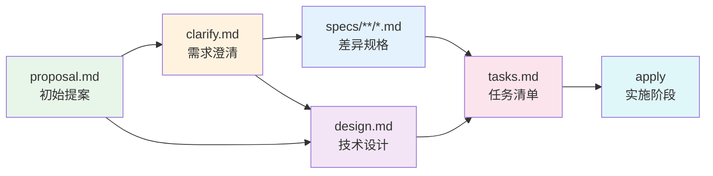
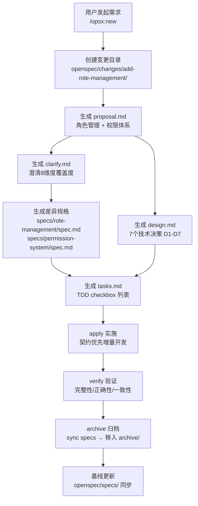

积分商城项目引入 **OpenSpec** 作为增量变更管理的核心框架，它围绕一条明确的工程信念展开：**每一次功能迭代都应该是可追溯、可验证、可回滚的**。OpenSpec 不是传统的需求管理工具，而是一套嵌入在代码仓库中的、由 Schema 驱动的产物工作流——从提案发起（proposal）到需求澄清（clarify）、规格定义（specs）、技术设计（design）、任务分解（tasks），再到最终的实现与归档，形成一条完整的增量变更流水线。本文将系统性地拆解这套框架的设计理念、目录结构、工作流机制，以及它与项目已有的 `.specify`/Speckit 体系如何协同，帮助中级开发者快速掌握在积分商城中进行增量开发的"标准作业流程"。

Sources: [schema.yaml](openspec/schemas/standard-spec-driven/schema.yaml#L1-L304), [constitution.md](.specify/memory/constitution.md#L1-L200)

## 设计理念：为什么需要增量变更框架

在积分商城这样的中型微服务项目中，一次功能迭代往往同时触及后端 API 契约、RPC 服务逻辑、前端页面和数据库 Schema。如果缺乏结构化的变更管理，常见的问题包括：需求理解偏差导致返工、前后端接口漂移、上线后无法追溯某次改动的决策依据。OpenSpec 的设计目标正是解决这些痛点，它通过三个核心机制来实现可控的增量开发：

**Schema 驱动的产物链**：每种变更类型（如 `standard-spec-driven`）定义了产物的生成顺序和依赖关系——proposal 是所有后续产物的基础，specs 依赖 clarify，tasks 依赖 specs 和 design。这种声明式依赖确保了"先想清楚再动手"的工程纪律。

**Delta Spec 差异规格**：当一次变更修改了已有功能的行为时，不是重写整个规格文档，而是通过 `ADDED/MODIFIED/REMOVED/RENAMED` 四种操作符描述差异。归档时这些差异会被智能合并到主规格中，既保持了规格的时效性，又避免了全量重写的维护负担。

**契约单一真相源**：schema 中明确声明了项目的契约来源——HTTP 契约来自 `app/api/INTegral.api`，RPC 契约来自 `app/rpc/**/*.proto`，前端共享类型来自 `frontend/src/api/generated/`。所有增量变更必须先修改契约、再运行生成脚本、最后实现业务代码，杜绝了手写镜像类型的反模式。

Sources: [schema.yaml](openspec/schemas/standard-spec-driven/schema.yaml#L1-L19), [constitution.md](.specify/memory/constitution.md#L56-L66)

## 目录结构总览

OpenSpec 在项目根目录下占据三个关键位置，各自承担不同职责：

```
openspec/
├── schemas/                    # Schema 定义（工作流模板）
│   └── standard-spec-driven/   # 当前项目使用的标准工作流
│       ├── schema.yaml         # 产物链、依赖关系、指令模板
│       └── templates/          # 五种产物的 Markdown 模板
├── specs/                      # 功能基线（主规格库）
│   ├── application-self-score/ # 自报积分规格
│   ├── permission-system/      # 权限体系规格
│   ├── role-management/        # 角色管理规格
│   ├── rule-management/        # 规则管理规格
│   ├── rule-role-scope/        # 规则角色范围规格
│   └── rule-scoring-structure/ # 规则评分结构规格
└── changes/                    # 变更工作区
    ├── fix-ui-bugs/            # 活跃变更（进行中）
    └── archive/                # 已归档变更
        ├── 2026-04-11-add-role-management/
        ├── 2026-04-14-allow-self-score-application/
        └── 2026-04-14-enhance-points-rule-management/
```

**`schemas/`** 定义了"游戏规则"——产物的种类、顺序、模板和校验逻辑。**`specs/`** 是系统功能的"活文档"，每个子目录对应一个已落地的能力，代表当前系统的行为基线。**`changes/`** 是变更的工作沙箱，每个活跃变更都有独立的目录，包含自己的提案、澄清、差异规格、设计和任务；归档后这些变更会被移入 `archive/` 并打上日期戳。

Sources: [openspec directory](openspec/), [schema.yaml](openspec/schemas/standard-spec-driven/schema.yaml#L1-L4)

## 工作流 Schema：standard-spec-driven 详解

项目当前使用的 Schema 是 `standard-spec-driven`（版本 2），它定义了一条五阶段的产物链，每个阶段都有明确的输入依赖和输出格式：



上图的箭头表示**依赖关系**（而非严格的线性执行）。注意 `design.md` 依赖 `proposal` 和 `clarify` 但不依赖 `specs`，这意味着技术设计可以和规格编写并行推进。而 `tasks.md` 则需要同时参考 `specs` 和 `design`，确保任务清单既覆盖了所有需求场景，又遵循了技术决策。

Sources: [schema.yaml](openspec/schemas/standard-spec-driven/schema.yaml#L19-L269)

## 五种产物深度解析

### 产物一：proposal.md —— 变更提案

提案是整个变更流程的起点，回答 **"为什么做"** 和 **"做什么"**。模板要求包含四个章节：

| 章节 | 核心问题 | 典型内容 |
|------|----------|----------|
| **Why** | 为什么做？为什么是现在？ | 1-2 句话说明问题或机会 |
| **What Changes** | 具体变更什么？ | 要点列表，破坏性变更用 **BREAKING** 标记 |
| **Capabilities** | 引入/修改了哪些能力？ | New Capabilities + Modified Capabilities |
| **Impact** | 影响范围？ | 受影响的代码、API、依赖或系统 |

**Capabilities 章节是提案与规格阶段之间的关键契约**。提案中列出的每项新能力（如 `role-management`、`permission-system`）都会在后续的 specs 阶段生成对应的规格文件。以项目中 `add-role-management` 变更为例，其提案明确声明了两个新能力——角色管理和权限体系——这直接决定了后续会生成两个独立的差异规格文件。

Sources: [schema.yaml](openspec/schemas/standard-spec-driven/schema.yaml#L20-L49), [proposal template](openspec/schemas/standard-spec-driven/templates/proposal.md#L1-L23), [add-role-management proposal](openspec/changes/archive/2026-04-11-add-role-management/proposal.md#L1-L32)

### 产物二：clarify.md —— 需求澄清

澄清阶段的核心目标是**降低后续规格和设计阶段的返工风险**。它通过一个八维度的覆盖度扫描来识别提案中的模糊性：

| 扫描维度 | 关注点 |
|----------|--------|
| 功能范围与行为 | 核心用户目标、范围排除声明、角色区分 |
| 领域与数据模型 | 实体/属性/关系、唯一性规则、生命周期 |
| 交互与用户体验流程 | 用户旅程、错误/空状态处理、国际化 |
| 非功能质量属性 | 性能、可扩展性、可观测性、安全 |
| 集成与外部依赖 | 外部服务故障模式、协议版本 |
| 边界情况与异常处理 | 异常场景、限流策略、冲突解决 |
| 约束与权衡 | 技术约束、已排除的替代方案 |
| 完成信号 | 验收标准的可测试性 |

澄清流程最多生成 **5 个优先级排序的问题**，每个问题都通过多选或简短回答来快速决策。以 `fix-ui-bugs` 变更为例，澄清阶段确认了头像上传复用商品图片组件、行为描述不截断直接换行、后端已有标记已读接口等 5 个关键决策点，有效避免了实现阶段的返工。

Sources: [schema.yaml](openspec/schemas/standard-spec-driven/schema.yaml#L51-L122), [clarify template](openspec/schemas/standard-spec-driven/templates/clarify.md#L1-L41), [fix-ui-bugs clarify](openspec/changes/fix-ui-bugs/clarify.md#L1-L67)

### 产物三：specs —— 差异规格

差异规格回答 **"系统要做什么"**，它不写完整的需求文档，而是通过四种操作符描述相对于现有基线的差异：

| 操作符 | 含义 | 格式要求 |
|--------|------|----------|
| **ADDED Requirements** | 新增能力 | 每项需求至少一个 WHEN/THEN 场景 |
| **MODIFIED Requirements** | 变更已有行为 | 必须包含完整的更新内容块 |
| **REMOVED Requirements** | 废弃特性 | 必须包含 Reason 和 Migration 路径 |
| **RENAMED Requirements** | 仅名称变更 | 使用 FROM:/TO: 格式 |

每条需求使用 `SHALL/MUST` 表达规范性约束，每个场景使用 `#### Scenario:` + `WHEN/THEN` 格式——**场景必须恰好使用 4 个井号（`####`）**，否则会导致解析静默失败。这种严格的格式要求是为了保证场景可测试——每个 WHEN/THEN 对应一个潜在的测试用例。

以 `dashboard-i18n-spec.md` 为例，它定义了三个 ADDED 需求（订单状态中文显示、审核操作中文显示、时间列布局修复），每个需求都有一个明确的 WHEN/THEN 场景，直接对应了 E2E 测试中的验证点。

Sources: [schema.yaml](openspec/schemas/standard-spec-driven/schema.yaml#L125-L169), [spec template](openspec/schemas/standard-spec-driven/templates/spec.md#L1-L9), [dashboard-i18n-spec](openspec/changes/fix-ui-bugs/specs/dashboard-i18n-spec.md#L1-L26)

### 产物四：design.md —— 技术设计

技术设计回答 **"怎么做"**，它只在满足以下任一条件时才需要创建：跨切面变更、新的外部依赖、安全/性能/迁移的复杂性、编码前需要消除技术歧义。设计文档包含五个章节：

| 章节 | 核心内容 |
|------|----------|
| **Context** | 背景、当前状态、技术栈约束 |
| **Goals / Non-Goals** | 本设计要达成的目标和明确排除的内容 |
| **Decisions** | 关键技术选择及理由（含替代方案） |
| **Risks / Trade-offs** | 风险 → 缓解措施的映射 |
| **Migration Plan** | 部署步骤和回滚策略 |

`add-role-management` 变更的 design.md 是一个优秀的范例——它记录了 7 个关键技术决策（D1-D7），包括权限模型选择平面列表而非树形层级、权限写入 JWT 而非 Redis 缓存、角色 code 中文化等。每个决策都包含了被否决的替代方案和选择理由，这种决策审计能力是 OpenSpec 的核心价值之一。

Sources: [schema.yaml](openspec/schemas/standard-spec-driven/schema.yaml#L172-L205), [design template](openspec/schemas/standard-spec-driven/templates/design.md#L1-L20), [add-role-management design](openspec/changes/archive/2026-04-11-add-role-management/design.md#L1-L200)

### 产物五：tasks.md —— 任务清单

任务清单将实施工作分解为可执行的 checkbox 列表，是 apply 阶段直接消费的输入。它有三个关键约束：

**严格 checkbox 格式**：`- [ ] X.Y 任务描述`。apply 阶段解析 checkbox 格式来跟踪进度，不使用此格式的任务不会被跟踪。

**TDD 驱动**：每个功能任务必须拆分为 RED（写测试）→ GREEN（写实现）→ REFACTOR（重构）子步骤。

**并行标记 `[p]`**：无互相依赖的任务可标记 `[p]`，表示可派发给不同子智能体并行执行。以 `fix-ui-bugs` 变更为例，仪表盘修复（§3）、积分申请修复（§4）、通知中心修复（§5）等都标记了 `[p]`，可同时派发执行以加速交付。

任务排序必须遵循**契约优先流程**：先改 `.api`/`.proto` → 运行 `scripts/generate-contracts.sh` → 再实现业务代码，最后运行 `scripts/check-contracts.sh` 校验漂移。

Sources: [schema.yaml](openspec/schemas/standard-spec-driven/schema.yaml#L207-L269), [tasks template](openspec/schemas/standard-spec-driven/templates/tasks.md#L1-L10), [fix-ui-bugs tasks](openspec/changes/fix-ui-bugs/tasks.md#L1-L84)

## 技能（Skills）全景：11 个操作入口

OpenSpec 通过 11 个 Claude Code Skills 提供操作入口，每个 Skill 对应工作流中的一个具体动作：

| Skill | 用途 | 典型触发时机 |
|-------|------|-------------|
| `openspec-new-change` | 创建新变更目录 | 用户提出新的功能/修复需求 |
| `openspec-propose` | 一步生成全部产物 | 用户想快速获得完整提案 |
| `openspec-continue-change` | 推进下一个产物 | 逐个创建产物的渐进式流程 |
| `openspec-ff-change` | 快进到实施就绪 | 跳过逐步确认，批量生成 |
| `openspec-apply-change` | 执行任务清单 | 开始编码实现 |
| `openspec-verify-change` | 验证实现一致性 | 归档前检查 |
| `openspec-archive-change` | 归档已完成的变更 | 变更完成并验证后 |
| `openspec-bulk-archive-change` | 批量归档多个变更 | 多个并行变更同时完成 |
| `openspec-sync-specs` | 同步差异规格到主规格 | 归档前或手动同步 |
| `openspec-explore` | 探索模式（思维伙伴） | 需求尚不清晰时 |
| `zero-skills` | 项目参考技能集 | 查询 goctl 命令、REST 模式等 |

这些 Skill 遵循一个统一的**"操作而非阶段"模型**——用户可以随时调用任何 Skill，不强制线性执行。例如，可以先用 `explore` 探索想法，再用 `new-change` 正式发起变更；也可以在 `apply` 过程中发现设计问题，回过头更新 `design.md` 再继续实现。

Sources: [SKILL.md (new-change)](.claude/skills/openspec-new-change/SKILL.md#L1-L75), [SKILL.md (propose)](.claude/skills/openspec-propose/SKILL.md#L1-L111), [SKILL.md (apply-change)](.claude/skills/openspec-apply-change/SKILL.md#L1-L157)

## 功能基线管理：specs 目录的活文档机制

`openspec/specs/` 目录是系统功能的**权威基线**。当前项目维护了 6 份主规格，每份代表一个已落地并经过验证的能力：

| 基线规格 | 来源变更 | 核心内容 |
|----------|---------|----------|
| `role-management` | add-role-management | 角色CRUD、权限分配、启停控制、前端页面 |
| `permission-system` | add-role-management | 权限项定义、JWT写入、中间件、菜单渲染 |
| `rule-management` | enhance-points-rule-management | 规则变更审计、新增字段透传、历史快照 |
| `application-self-score` | allow-self-score-application | 自报积分能力 |
| `rule-role-scope` | enhance-points-rule-management | 规则适用角色范围 |
| `rule-scoring-structure` | enhance-points-rule-management | 规则评分结构 |

这些基线规格不是静态文档，而是随着每次变更的归档而**持续演进**的。归档流程中的 `sync-specs` 步骤会将变更中的差异规格（Delta Spec）智能合并到对应的主规格中——ADDED 的需求直接追加，MODIFIED 的需求原地更新，REMOVED 的需求整体移除。以 `rule-management/spec.md` 为例，它的 `Purpose` 字段标注了 "TBD - created by archiving change enhance-points-rule-management"，说明这是一次归档操作自动创建的基线文档，后续变更还会继续更新它。

Sources: [role-management spec](openspec/specs/role-management/spec.md#L1-L81), [permission-system spec](openspec/specs/permission-system/spec.md#L1-L131), [rule-management spec](openspec/specs/rule-management/spec.md#L1-L39), [SKILL.md (sync-specs)](.claude/skills/openspec-sync-specs/SKILL.md#L1-L139)

## 完整生命周期：从提案到归档

一次典型的增量变更经历以下完整生命周期，以项目中实际发生的 `add-role-management` 变更为例：



**阶段 1 - 发起与规划**（`new-change` / `propose`）：用户描述需求，AI 生成变更目录和全部产物。`add-role-management` 的提案明确了引入超级管理员角色、权限数据模型、RBAC 中间件改造等变更范围。

**阶段 2 - 实施执行**（`apply-change`）：按照 tasks.md 中的 checkbox 逐项执行。apply 阶段严格遵循契约优先流程——先改 `INTegral.api` 和 `.proto` 文件、运行 `generate-contracts.sh` 生成类型代码、再补后端逻辑和前端页面。

**阶段 3 - 验证与归档**（`verify-change` → `archive-change`）：verify 检查三个维度——**Completeness**（任务是否全部完成）、**Correctness**（需求是否正确实现）、**Coherence**（设计决策是否被遵循）。确认无误后归档，将差异规格同步到主规格，变更目录移入 `archive/2026-04-11-add-role-management/`。

Sources: [add-role-management proposal](openspec/changes/archive/2026-04-11-add-role-management/proposal.md#L1-L32), [add-role-management design](openspec/changes/archive/2026-04-11-add-role-management/design.md#L1-L200), [SKILL.md (verify)](.claude/skills/openspec-verify-change/SKILL.md#L1-L169), [SKILL.md (archive)](.claude/skills/openspec-archive-change/SKILL.md#L1-L115)

## 契约优先增量开发流程

apply 阶段的 schema 中定义了一条**契约优先增量开发流程**，这是在现有系统上做增量开发（而非从零构建）的核心纪律：

```
标准流程（严格遵守顺序）：
1. 先阅读需求文档、AGENTS.md、现有契约和相关实现
2. 先修改 .api / .proto，不要先改前后端业务代码
3. 运行契约生成脚本：bash scripts/generate-contracts.sh
4. 再补后端逻辑、前端页面适配和测试
5. 提交前运行漂移校验：bash scripts/check-contracts.sh
6. 至少执行一次前端构建和后端测试脚本
```

这条流程与项目的 Constitution 原则（API-First 和 Test-First）一脉相承。schema 中还明确列出了**AI 执行约束**：禁止在页面、store、API 层猜字段名、状态值、权限码；禁止新增手写后端镜像类型文件。这些约束确保了增量变更不会引入前后端类型不一致的隐患。

Sources: [schema.yaml](openspec/schemas/standard-spec-driven/schema.yaml#L266-L304), [constitution.md](.specify/memory/constitution.md#L56-L80)

## 与 .specify / Speckit 体系的关系

项目中同时存在两套规格管理框架：`openspec/` 和 `.specify/`。它们的关系是**互补而非替代**：

| 维度 | OpenSpec | .specify / Speckit |
|------|----------|-------------------|
| **定位** | 增量变更管理 | 功能开发全流程管理 |
| **产物** | proposal → clarify → specs → design → tasks | spec → plan → research → contracts → tasks |
| **触发方式** | Claude Code Skills (`/opsx:*`) | Claude Code Commands (`/speckit:*`) |
| **规格粒度** | 差异规格（Delta Spec） | 完整功能规格 |
| **归档机制** | 自动归档到 `archive/` + 主规格同步 | 静态保留在 `specs/` 目录 |
| **适用场景** | 已有功能的迭代、Bug 修复 | 全新功能从 0 到 1 的开发 |

`.specify/` 提供了更传统的规格驱动开发流程——从完整的用户故事、验收场景到实施计划和任务分解，适合大型新功能的规划。而 OpenSpec 的优势在于**增量场景下的轻量性和可追溯性**——它不要求重写整个规格，只需描述差异，更适合快速迭代的维护阶段。

两者共享同一套 Constitution 原则，都要求遵循 API-First 和 TDD 实践，开发者在实际工作中可以根据变更的规模和性质灵活选择。

Sources: [.specify/templates/spec-template.md](.specify/templates/spec-template.md#L1-L129), [.specify/templates/tasks-template.md](.specify/templates/tasks-template.md#L1-L200), [constitution.md](.specify/memory/constitution.md#L1-L200), [init-options.json](.specify/init-options.json#L1-L11)

## 实战案例：fix-ui-bugs 变更

当前活跃的 `fix-ui-bugs` 变更是一个典型的中小规模增量修复案例，它覆盖了 11 个模块的 UI/UX 问题。通过这个案例可以清晰看到 OpenSpec 工作流的实际运作：

**提案阶段**：提案将 11 个问题归纳为 12 项新能力（如 `dashboard-i18n`、`notification-center-read-status`、`pagination-i18n`），并明确声明"无后端 API 行为变更"，划清了影响范围。

**澄清阶段**：通过 5 个关键问题消除了实现歧义——头像上传复用现有组件、行为描述不截断、通知中心复用后端已有接口、组长搜索仅限激活用户、角色状态默认值由后端处理。

**差异规格**：生成了 11 份独立的差异规格文件（如 `dashboard-i18n-spec.md`、`notification-center-spec.md`），每份都包含明确的 WHEN/THEN 场景。

**任务清单**：84 个子任务按模块分组，多个模块标记了 `[p]` 并行标记，所有任务均已完成（`[x]`），变更处于可归档状态。

Sources: [fix-ui-bugs proposal](openspec/changes/fix-ui-bugs/proposal.md#L1-L75), [fix-ui-bugs clarify](openspec/changes/fix-ui-bugs/clarify.md#L1-L67), [fix-ui-bugs tasks](openspec/changes/fix-ui-bugs/tasks.md#L1-L84), [fix-ui-bugs design](openspec/changes/fix-ui-bugs/design.md#L1-L66)

## 推荐阅读路径

理解了增量变更管理的全貌后，以下页面提供了更深入的关联知识：

- [微服务架构总览：API 网关与四路 RPC 的协作关系](3-wei-fu-wu-jia-gou-zong-lan-api-wang-guan-yu-si-lu-rpc-de-xie-zuo-guan-xi)——理解增量变更为什么需要"契约优先"流程
- [前后端契约驱动开发：goctl 类型生成与漂移检查](16-qian-hou-duan-qi-yue-qu-dong-kai-fa-goctl-lei-xing-sheng-cheng-yu-piao-yi-jian-cha)——契约生成脚本和漂移校验的具体机制
- [RBAC 权限系统：角色、权限编码与中间件鉴权](9-rbac-quan-xian-xi-tong-jiao-se-quan-xian-bian-ma-yu-zhong-jian-jian-quan)——`add-role-management` 变更落地后的系统全貌
- [Makefile 构建入口与常用开发命令速查](27-makefile-gou-jian-ru-kou-yu-chang-yong-kai-fa-ming-ling-su-cha)——契约脚本、测试脚本的快速调用方式