积分商城的数据模型层以 `model/` 包为核心，采用 **GORM v2**（v1.31.1）作为 ORM 框架，通过 Go 结构体标签将领域模型映射到 MySQL 8.0 的 14 张业务表。在此基础上，每个业务实体配备一个 **Repository 接口**作为数据访问抽象，使上层服务逻辑与底层 SQL 实现完全解耦。本文将从模型定义规范、Repository 架构设计、事务安全控制、依赖注入集成四个维度，系统性地解析这一数据层的实现细节与设计决策。

Sources: [go.mod](go.mod#L13-L15), [deploy/schema.sql](deploy/schema.sql#L1-L318)

## 整体架构：模型与仓库的分层关系

在进入具体实现之前，先理解 `model/` 包的整体结构。该包将**纯数据模型（struct）**与**数据访问逻辑（repository）**共同放置在同一个包内，按业务域拆分为多个文件：

```
model/
├── 模型定义（纯 struct + TableName）
│   ├── user.go                    # User
│   ├── role.go                    # Role, UserRole, Permission, RolePermission
│   ├── group.go                   # Group, UserGroup
│   ├── points_account.go          # PointsAccount, PointsTransaction
│   ├── points_application.go      # PointsApplication
│   ├── points_rule.go             # PointsRule, PointsRulesHistory
│   ├── product.go                 # Product
│   ├── exchange_order.go          # ExchangeOrder
│   ├── review_record.go           # ReviewRecord
│   └── notification.go            # Notification
├── Repository 实现（INTerface + impl）
│   ├── user_repository.go         # UserRepository, RoleRepository, GroupRepository
│   ├── points_account_repository.go # AccountRepository, TransactionRepository
│   ├── points_repository.go       # RuleRepository, ApplicationRepository, ReviewRecordRepository
│   ├── business_repository.go     # NotificationRepository, ProductRepository, OrderRepository
│   └── permission_repository.go   # PermissionRepository, RolePermissionRepository
└── 基础设施
    ├── migrate.go                 # AutoMigrate + SeedData
    └── *_test.go                  # 单元测试
```

这种"同包不同文件"的组织方式，在 Go 中是一种务实的选择——模型和仓库天然紧密耦合，同包访问避免了循环依赖，同时文件名清晰地传达了每个文件的职责边界。

Sources: [model/](model/)

下面的 Mermaid 图展示了 13 个 Repository 接口与对应模型之间的关系，以及它们如何被三个微服务的 ServiceContext 消费：

```mermaid
graph TB
    subgraph "model 包 — 数据模型"
        U[User] ~~~ UR[UserRole]
        R[Role] ~~~ RP[RolePermission]
        G[Group] ~~~ UG[UserGroup]
        P[Permission]
        PA[PointsAccount] ~~~ PT[PointsTransaction]
        PAp[PointsApplication]
        PR[PointsRule] ~~~ PRH[PointsRulesHistory]
        RR[ReviewRecord]
        Prod[Product]
        EO[ExchangeOrder]
        N[Notification]
    end

    subgraph "model 包 — Repository 接口"
        UR_I[UserRepository]
        RR_I[RoleRepository]
        GR_I[GroupRepository]
        PR_I[PermissionRepository]
        RPR_I[RolePermissionRepository]
        AR_I[AccountRepository]
        TR_I[TransactionRepository]
        RuR_I[RuleRepository]
        ApR_I[ApplicationRepository]
        RvR_I[ReviewRecordRepository]
        NR_I[NotificationRepository]
        ProR_I[ProductRepository]
        OR_I[OrderRepository]
    end

    subgraph "微服务 ServiceContext"
        API["API 网关<br/>api/svc"]
        UserRPC["User RPC<br/>user/svc"]
        OrderRPC["Order RPC<br/>order/svc"]
    end

    U --> UR_I; R --> RR_I; G --> GR_I; P --> PR_I; RP --> RPR_I
    PA --> AR_I; PT --> TR_I; PR --> RuR_I; PAp --> ApR_I
    RR --> RvR_I; N --> NR_I; Prod --> ProR_I; EO --> OR_I

    API -.->|6 个 Repository| UR_I; API -.-> RR_I; API -.-> GR_I
    API -.-> NR_I; API -.-> PR_I; API -.-> RPR_I

    UserRPC -.->|5 个 Repository| UR_I; UserRPC -.-> RR_I
    UserRPC -.-> GR_I; UserRPC -.-> PR_I; UserRPC -.-> RPR_I

    OrderRPC -.->|5 个 Repository| OR_I; OrderRPC -.-> AR_I
    OrderRPC -.-> TR_I; OrderRPC -.-> ProR_I; OrderRPC -.-> NR_I
```



Sources: [app/api/INTernal/svc/service_context.go](app/api/INTernal/svc/service_context.go#L34-L40), [app/rpc/user/INTernal/svc/service_context.go](app/rpc/user/INTernal/svc/service_context.go#L18-L23), [app/rpc/order/INTernal/svc/service_context.go](app/rpc/order/INTernal/svc/service_context.go#L26-L31)

## GORM 模型定义规范

### 双标签映射策略

每个模型结构体同时使用 `gorm` 和 `json` 两个结构标签：**`gorm` 标签定义数据库列的物理属性**（类型、约束、索引），**`json` 标签定义 API 序列化时的字段名**。这种"一套结构体，双通道映射"的设计，使得同一个类型既能被 GORM 用于数据库操作，又能直接参与 JSON 序列化，避免了 DTO 转换的开销。

以 `User` 模型为例：

```go
type User struct {
    ID           INT64          `gorm:"primaryKey;autoIncrement" json:"id"`
    Email        string         `gorm:"type:VARCHAR(255);uniqueIndex:uk_users_email;not null" json:"email"`
    PasswordHash sql.NullString `gorm:"type:VARCHAR(255)" json:"-"`
    Name         string         `gorm:"type:VARCHAR(100);not null" json:"name"`
    Status       string         `gorm:"type:VARCHAR(20);not null;default:active" json:"status"`
    CreatedAt    time.Time      `gorm:"not null;default:CURRENT_TIMESTAMP" json:"created_at"`
    UpdatedAt    time.Time      `gorm:"not null;default:CURRENT_TIMESTAMP" json:"updated_at"`
}
```

注意 `PasswordHash` 的 `json:"-"` 标签——这是安全设计的直接体现，确保密码哈希永远不会出现在 API 响应中。

Sources: [model/user.go](model/user.go#L1-L22)

### 可空字段的 `sql.Null*` 模式

项目中大量使用了 Go 标准库的 `sql.NullString`、`sql.NullInt32`、`sql.NullFloat64`、`sql.NullBool`、`sql.NullTime` 来映射数据库中允许 `NULL` 的列。`PointsApplication` 是最典型的案例——AI 评分相关字段（`AiScore`、`AiMatchRate`、`AiReasoning`、`AiScoredAt`、`AiAvailable`）在申请创建时均为空，只有 AI 评分完成后才有值：

```go
type PointsApplication struct {
    AiScore       sql.NullInt32   `gorm:"" json:"ai_score"`
    AiMatchRate   sql.NullFloat64 `gorm:"type:decimal(5,2)" json:"ai_match_rate"`
    AiReasoning   sql.NullString  `gorm:"type:text" json:"ai_reasoning"`
    AiScoredAt    sql.NullTime    `gorm:"" json:"ai_scored_at"`
    AiAvailable   sql.NullBool    `gorm:"type:tinyint(1)" json:"ai_available"`
    FinalPoints   sql.NullInt32   `gorm:"" json:"final_points"`
    ApprovedPoints sql.NullInt32  `gorm:"" json:"approved_points"`
}
```

这种模式相比指针类型（`*INT32`）的优势在于语义更明确——`sql.NullInt32` 的 `Valid` 字段明确表达了"数据库中是否有值"的语义，而非 Go 的零值歧义。

Sources: [model/points_application.go](model/points_application.go#L1-L33)

### JSON 列与 `datatypes.JSON`

`ExchangeOrder.ProductSnapshot` 和 `PointsApplication.RuleSnapshot` 以及 `PointsApplication.Attachments` 使用了 `gorm.io/datatypes` 包的 `datatypes.JSON` 类型来映射 MySQL 的 `JSON` 列。这允许将复杂的嵌套数据结构（如商品快照、评分标准）直接存储为 JSON，同时通过 GORM 的 datatype 扩展实现透明的读写。

Sources: [model/exchange_order.go](model/exchange_order.go#L16), [model/points_application.go](model/points_application.go#L16-L19)

### 索引命名的统一规范

所有 GORM 标签中的索引均采用**语义化命名前缀**，形成了一套清晰的命名约定：

| 前缀 | 含义 | 示例 |
|---|---|---|
| `uk_` | 唯一索引 | `uk_users_email`, `uk_orders_order_no` |
| `idx_` | 普通索引 | `idx_orders_user`, `idx_transactions_type` |
| 复合索引 | 多列组合 | `uk_user_roles` (user_id + role_id) |

这种命名规范使得索引的用途在 DDL 中一目了然，也便于 DBA 在排查慢查询时快速定位。

Sources: [model/user.go](model/user.go#L11), [model/exchange_order.go](model/exchange_order.go#L13-L19), [model/points_account.go](model/points_account.go#L8)

### 显式 `TableName()` 方法

所有模型均实现了 `func (T) TableName() string` 方法，显式指定表名而非依赖 GORM 的默认蛇形复数推导。例如：

```go
func (User) TableName() string       { return "users" }
func (UserGroup) TableName() string  { return "user_groups" }
func (PointsRule) TableName() string { return "points_rules" }
```

这消除了 GORM 对不规则名词（如 `history` → `histories`）推导错误的潜在风险，同时让模型与 DDL 中 `CREATE TABLE` 语句的表名形成精确的对照关系。

Sources: [model/user.go](model/user.go#L22), [model/group.go](model/group.go#L15), [model/points_rule.go](model/points_rule.go#L28)

### 14 张表的模型映射总览

| 模型结构体 | 数据库表名 | 所属文件 | 核心特征 |
|---|---|---|---|
| `User` | `users` | `user.go` | 唯一邮箱、多认证方式 |
| `Role` | `roles` | `role.go` | 系统角色标记、排序权重 |
| `UserRole` | `user_roles` | `role.go` | 复合唯一索引、用户-角色关联 |
| `Permission` | `permissions` | `role.go` | 模块分类、权限编码 |
| `RolePermission` | `role_permissions` | `role.go` | 角色-权限关联 |
| `Group` | `groups` | `group.go` | 小组状态管理 |
| `UserGroup` | `user_groups` | `group.go` | 复合唯一索引、用户-小组关联 |
| `PointsAccount` | `points_accounts` | `points_account.go` | 乐观锁版本号、冻结/可用分离 |
| `PointsTransaction` | `points_transactions` | `points_account.go` | 积分流水、来源追踪 |
| `PointsApplication` | `points_applications` | `points_application.go` | AI 评分、多状态流转 |
| `PointsRule` | `points_rules` | `points_rule.go` | 版本号、规则类型分类 |
| `PointsRulesHistory` | `points_rules_history` | `points_rule.go` | 规则快照、版本归档 |
| `ReviewRecord` | `review_records` | `review_record.go` | 双级审核、分数调整记录 |
| `Product` | `products` | `product.go` | 库存管理、商家关联 |
| `ExchangeOrder` | `exchange_orders` | `exchange_order.go` | 商品快照 JSON、订单号唯一 |
| `Notification` | `notifications` | `notification.go` | 已读状态、业务关联 |

Sources: [model/user.go](model/user.go#L9-L22), [model/role.go](model/role.go#L1-L52), [model/points_account.go](model/points_account.go#L1-L33), [model/notification.go](model/notification.go#L1-L17)

## Repository 模式：接口设计与实现

### 设计原则：接口在上，实现在下

Repository 模式的核心价值在于**将数据访问逻辑抽象为接口**，使得上层业务代码只依赖接口而非具体实现。本项目定义了 13 个 Repository 接口，每个接口遵循一致的构造模式：

```go
// 1. 接口定义 — 面向业务语义的方法签名
type UserRepository INTerface {
    Create(ctx context.Context, user *User) error
    FindByID(ctx context.Context, id INT64) (*User, error)
    // ...
}

// 2. 私有结构体 — 持有 *gorm.DB
type userRepository struct {
    db *gorm.DB
}

// 3. 构造函数 — 返回接口类型（非结构体类型）
func NewUserRepository(db *gorm.DB) UserRepository {
    return &userRepository{db: db}
}

// 4. 方法实现 — 始终传递 context
func (r *userRepository) FindByID(ctx context.Context, id INT64) (*User, error) {
    var user User
    if err := r.db.WithContext(ctx).First(&user, id).Error; err != nil {
        return nil, errx.NewCodeError(errx.CodeNotFound, "用户不存在")
    }
    return &user, nil
}
```

三个关键设计决策值得注意：**私有结构体**（`userRepository` 小写开头）阻止了外部直接实例化；**构造函数返回接口类型**确保调用方只能看到接口方法；**统一使用 `WithContext(ctx)`** 使得每个数据库操作都能参与请求级超时控制和链路追踪。

Sources: [model/user_repository.go](model/user_repository.go#L10-L39)

### 13 个 Repository 接口的方法矩阵

| Repository | 核心方法 | 特殊能力 |
|---|---|---|
| `UserRepository` | Create, FindByID, FindByIDs, FindByEmail, Update, List | JOIN 角色和小组过滤、DISTINCT 去重 |
| `RoleRepository` | FindByCode, FindByID, FindUserRoles, FindUserActiveRoles, AssignRoles, List, Create, Update, Delete | 事务性角色分配、级联删除关联 |
| `GroupRepository` | Create, FindByID, Update, Delete, List, FindUserGroups, AssignGroups | 事务性小组分配 |
| `PermissionRepository` | FindAll, FindByModule, FindByIDs, FindByCodes, FindByRoleID | JOIN 查询角色权限 |
| `RolePermissionRepository` | FindByRoleID, FindByRoleIDs, ReplaceRolePermissions, DeleteByRoleID | 事务性替换权限、多角色去重查询 |
| `AccountRepository` | FindByUserID, Create, UpdateBalance, FreezePoints, UnfreezePoints, ConfirmFrozen | 悲观锁 `SELECT FOR UPDATE` |
| `TransactionRepository` | Create, FindBySource, List | 防重复流水查询 |
| `RuleRepository` | Create, FindByID, Update, Disable, List, FindHistory, SnapshotRule | 规则版本快照 |
| `ApplicationRepository` | Create, FindByID, Update, UpdateStatusWithCheck, List, ListByGroupIDs | 乐观锁状态检查更新 |
| `ReviewRecordRepository` | Create, FindByApplicationID | 按申请查询审核历史 |
| `NotificationRepository` | Create, FindByID, List, MarkRead, MarkAllRead, UnreadCount | 已读过滤、未读计数 |
| `ProductRepository` | Create, FindByID, Update, List, DeductStock, RestoreStock | 原子库存扣减 |
| `OrderRepository` | Create, FindByID, FindByOrderNo, List, Update | 订单号精确查找 |

Sources: [model/user_repository.go](model/user_repository.go#L12-L18), [model/points_account_repository.go](model/points_account_repository.go#L13-L20), [model/points_repository.go](model/points_repository.go#L14-L22), [model/business_repository.go](model/business_repository.go#L75-L82), [model/permission_repository.go](model/permission_repository.go#L11-L17)

### 分页查询的统一模式

所有 `List` 方法均采用 `(page, pageSize INT64) → ([]*T, total INT64, error)` 的三元组返回模式。分页逻辑的实现高度一致：

```go
func (r *orderRepository) List(ctx context.Context, page, pageSize, userID, merchantID INT64, status string) ([]*ExchangeOrder, INT64, error) {
    var orders []*ExchangeOrder
    query := r.db.WithContext(ctx).Model(&ExchangeOrder{})
    // 条件叠加
    if userID > 0 {
        query = query.Where("user_id = ?", userID)
    }
    if status != "" {
        query = query.Where("status = ?", status)
    }
    // 先计数
    var total INT64
    if err := query.Count(&total).Error; err != nil {
        return nil, total, err
    }
    // 再分页
    offset := (page - 1) * pageSize
    if err := query.Offset(INT(offset)).Limit(INT(pageSize)).Order("created_at DESC").Find(&orders).Error; err != nil {
        return nil, total, err
    }
    return orders, total, nil
}
```

`UserRepository.List` 在此基础上增加了 JOIN 查询的复杂度——当需要按角色或小组过滤时，会 JOIN `user_roles` 和 `user_groups` 表，并使用 `DISTINCT("users.id")` 去重计数，确保分页数据准确。

Sources: [model/business_repository.go](model/business_repository.go#L185-L206), [model/user_repository.go](model/user_repository.go#L64-L97)

### 错误转译：GORM 错误到业务错误码

Repository 层承担了一个重要的职责——将 GORM 的底层错误（如 `gorm.ErrRecordNotFound`）转译为项目统一的业务错误码。每个 `FindByID` 方法都遵循这一模式：

```go
func (r *productRepository) FindByID(ctx context.Context, id INT64) (*Product, error) {
    var p Product
    if err := r.db.WithContext(ctx).First(&p, id).Error; err != nil {
        return nil, errx.NewCodeError(errx.CodeNotFound, "商品不存在")
    }
    return &p, nil
}
```

这意味着上层服务逻辑无需关心"记录不存在"是 GORM 错误还是其他什么异常——它只需处理 `*errx.CodeError` 即可。关于错误码体系的完整设计，参见 [统一错误码体系与错误处理规范](5-tong-cuo-wu-ma-ti-xi-yu-cuo-wu-chu-li-gui-fan)。

Sources: [model/business_repository.go](model/business_repository.go#L96-L102), [pkg/errx/error.go](pkg/errx/error.go)

## 事务安全控制：并发场景下的三种策略

数据一致性是积分商城的核心挑战。在 Repository 层，针对不同并发场景采用了三种互补的安全控制策略。

### 策略一：悲观锁 — 积分账户操作

`AccountRepository` 的 `FreezePoints`、`UnfreezePoints`、`ConfirmFrozen` 三个方法均使用 **`SELECT ... FOR UPDATE`** 悲观锁，确保在事务持有期间其他并发请求无法读取同一账户：

```go
func (r *accountRepository) FreezePoints(ctx context.Context, userID, amount, orderID INT64) error {
    return r.db.WithContext(ctx).Transaction(func(tx *gorm.DB) error {
        var account PointsAccount
        // 悲观锁：SELECT * FROM points_accounts WHERE user_id = ? FOR UPDATE
        if err := tx.Clauses(clause.Locking{Strength: "UPDATE"}).
            Where("user_id = ?", userID).First(&account).Error; err != nil {
            return err
        }
        if account.AvailablePoints < amount {
            return errx.NewCodeError(errx.CodePointsInsufficient, "积分不足")
        }
        account.AvailablePoints -= amount
        account.FrozenPoints += amount
        account.Version++
        return tx.Save(&account).Error
    })
}
```

悲观锁的适用场景是**高并发写入热点**——积分账户是全局共享资源，使用行锁可以序列化同一用户的所有积分变更操作，避免超卖。关于这一机制的深度解析，参见 [乐观锁机制：积分账户的并发安全控制](21-le-guan-suo-ji-zhi-ji-fen-zhang-hu-de-bing-fa-an-quan-kong-zhi)。

Sources: [model/points_account_repository.go](model/points_account_repository.go#L70-L86)

### 策略二：乐观锁 — 申请状态流转

`ApplicationRepository.UpdateStatusWithCheck` 使用 **CAS（Compare-And-Swap）** 模式实现乐观锁，仅当申请的当前状态与预期匹配时才执行更新：

```go
func (r *applicationRepository) UpdateStatusWithCheck(ctx context.Context, id INT64, expectedStatus string, app *PointsApplication) (bool, error) {
    result := r.db.WithContext(ctx).
        Model(&PointsApplication{}).
        Where("id = ? AND status = ?", id, expectedStatus).
        Updates(map[string]any{
            "status":          app.Status,
            "final_points":    app.FinalPoints,
            "approved_points": app.ApprovedPoints,
            "updated_at":      time.Now(),
        })
    if result.Error != nil {
        return false, result.Error
    }
    return result.RowsAffected > 0, nil
}
```

返回 `bool` 值告知调用方更新是否实际生效——如果 `RowsAffected == 0`，说明状态已被其他请求抢先变更，调用方可以据此决定重试或报错。这避免了"审核员 A 和 B 同时审批同一申请"的竞态条件。

Sources: [model/points_repository.go](model/points_repository.go#L138-L154)

### 策略三：原子表达式 — 库存扣减

`ProductRepository.DeductStock` 使用 GORM 的 **`gorm.Expr`** 生成原子 SQL 表达式 `stock = stock - ?`，配合 `WHERE stock >= ?` 条件，在单条 SQL 中完成库存检查与扣减：

```go
func (r *productRepository) DeductStock(ctx context.Context, id INT64, quantity INT32) error {
    result := r.db.WithContext(ctx).Model(&Product{}).
        Where("id = ? AND stock >= ?", id, quantity).
        Update("stock", gorm.Expr("stock - ?", quantity))
    if result.Error != nil {
        return result.Error
    }
    if result.RowsAffected == 0 {
        return errx.NewCodeError(errx.CodeStockInsufficient, "库存不足")
    }
    return nil
}
```

这种方式的并发安全性完全依赖数据库的行锁——`UPDATE` 语句会对匹配行加排他锁，`RowsAffected == 0` 则精确判断了"库存是否够扣"。

Sources: [model/business_repository.go](model/business_repository.go#L128-L139)

### 三种策略的对比选择

| 维度 | 悲观锁 | 乐观锁 (CAS) | 原子表达式 |
|---|---|---|---|
| **实现方式** | `SELECT FOR UPDATE` | `WHERE status = ?` 条件更新 | `gorm.Expr("stock - ?")` |
| **适用场景** | 高频写入热点（积分账户） | 低冲突状态流转（申请审批） | 简单数值增减（库存扣减） |
| **锁粒度** | 数据库行锁（事务期间持有） | 无锁（冲突时放弃） | 数据库行锁（单语句期间） |
| **冲突处理** | 等待锁释放 | 返回 `false` 由调用方决定 | 返回 `RowsAffected == 0` |
| **代表方法** | `FreezePoints` | `UpdateStatusWithCheck` | `DeductStock` |

Sources: [model/points_account_repository.go](model/points_account_repository.go#L46-L122), [model/points_repository.go](model/points_repository.go#L138-L154), [model/business_repository.go](model/business_repository.go#L128-L144)

## 依赖注入：ServiceContext 集成模式

### 三个微服务的 Repository 分配

积分商城的四个微服务（API 网关、User RPC、Points RPC、Order RPC）各自在 `ServiceContext` 中注入所需的 Repository。这种分配遵循**最小权限原则**——每个服务只注入它直接需要的 Repository：

| Repository | API 网关 | User RPC | Points RPC | Order RPC |
|---|---|---|---|---|
| `UserRepository` | ✅ | ✅ | — | — |
| `RoleRepository` | ✅ | ✅ | — | — |
| `GroupRepository` | ✅ | ✅ | — | — |
| `PermissionRepository` | ✅ | ✅ | — | — |
| `RolePermissionRepository` | ✅ | ✅ | — | — |
| `NotificationRepository` | ✅ | — | ✅ | ✅ |
| `OrderRepository` | — | — | — | ✅ |
| `AccountRepository` | — | — | ✅ | ✅ |
| `TransactionRepository` | — | — | ✅ | ✅ |
| `ProductRepository` | — | — | — | ✅ |
| `RuleRepository` | — | — | ✅ | — |
| `ApplicationRepository` | — | — | ✅ | — |
| `ReviewRecordRepository` | — | — | ✅ | — |

构造函数统一通过 `model.NewXxxRepository(db)` 将共享的 `*gorm.DB` 实例注入到各 Repository 中：

```go
func NewServiceContext(c config.Config) *ServiceContext {
    db, _ := gorm.Open(mysql.Open(c.MySQL.DataSource), &gorm.Config{})
    return &ServiceContext{
        OrderRepo:        model.NewOrderRepository(db),
        AccountRepo:      model.NewAccountRepository(db),
        TransactionRepo:  model.NewTransactionRepository(db),
        ProductRepo:      model.NewProductRepository(db),
        NotificationRepo: model.NewNotificationRepository(db),
    }
}
```

Sources: [app/rpc/order/INTernal/svc/service_context.go](app/rpc/order/INTernal/svc/service_context.go#L37-L59)

### 可测试性：接口驱动的 Mock 体系

由于 Repository 均为接口类型，在测试中可以轻松替换为 Mock 实现。项目中的测试策略分为两个层次：

**模型层测试**（`model/repository_test.go`）使用 `go-sqlmock` 模拟 MySQL 驱动，验证 Repository 的 SQL 生成和错误转译逻辑：

```go
func setupMockDB(t *testing.T) (*gorm.DB, sqlmock.Sqlmock) {
    db, mock, err := sqlmock.New()
    gormDB, _ := gorm.Open(mysql.New(mysql.Config{
        Conn: db, SkipInitializeWithVersion: true,
    }), &gorm.Config{})
    t.Cleanup(func() { db.Close() })
    return gormDB, mock
}
```

**业务层测试**（如 `pointsservice` 的测试）则使用内存 Map 实现的 Mock Repository，完全脱离数据库运行，大幅提升测试速度。

Sources: [model/repository_test.go](model/repository_test.go#L17-L31), [app/rpc/points/INTernal/logic/pointsservice/mock_helper_test.go](app/rpc/points/INTernal/logic/pointsservice/mock_helper_test.go#L78-L100)

## 数据库迁移与种子数据

### AutoMigrate：开发环境的快速建表

`migrate.go` 中的 `AutoMigrate` 函数注册了全部 16 个模型（14 张表 + 2 张关联表），在开发环境中可以通过 GORM 自动建表：

```go
func AutoMigrate(db *gorm.DB) error {
    return db.AutoMigrate(
        &User{}, &Role{}, &UserRole{}, &Group{}, &UserGroup{},
        &PointsRule{}, &PointsRulesHistory{}, &PointsApplication{},
        &ReviewRecord{}, &PointsAccount{}, &PointsTransaction{},
        &Notification{}, &Product{}, &ExchangeOrder{},
        &Permission{}, &RolePermission{},
    )
}
```

需要注意的是，生产环境使用 `deploy/schema.sql` 手动管理 DDL，AutoMigrate 仅用于开发和测试场景——因为 AutoMigrate 无法处理外键约束、索引命名等高级 DDL 特性。

Sources: [model/migrate.go](model/migrate.go#L27-L46)

### SeedData：幂等的种子数据初始化

`SeedData` 函数实现了**幂等的种子数据初始化**——角色、权限、管理员用户、默认小组均采用"先查后建"模式，确保多次执行不会产生重复数据。该函数还会执行历史数据迁移（如将旧的中文角色码迁移为英文码），保证向前兼容。

种子数据包括 6 个系统角色、16 项权限、角色-权限映射关系、默认管理员用户及其积分账户和 3 个默认小组。

Sources: [model/migrate.go](model/migrate.go#L48-L207)

## 模型文件组织规范

### 文件拆分的逻辑边界

`model/` 包的文件拆分遵循两条规则：**模型定义**按业务实体拆分（一个实体一个文件），**Repository 实现**按服务域拆分（同一微服务使用的 Repository 放入同一文件）。这解释了为什么 `business_repository.go` 包含了 `NotificationRepository`、`ProductRepository` 和 `OrderRepository` 三个看似不相关的接口——它们都是 Order RPC 服务所需的 Repository。

Sources: [model/business_repository.go](model/business_repository.go#L1-L8)

### 新增模型的操作清单

当需要为系统添加一个新的业务实体时，遵循以下步骤：

1. **创建模型文件** — 在 `model/` 下新增如 `coupon.go`，定义 struct + `TableName()` 方法
2. **注册 AutoMigrate** — 在 `migrate.go` 的 `AutoMigrate` 调用中添加新模型
3. **编写 DDL** — 在 `deploy/schema.sql` 中添加对应的 `CREATE TABLE` 语句
4. **定义 Repository 接口** — 在对应服务域的 repository 文件中添加接口和实现
5. **注入 ServiceContext** — 在需要的微服务 `svc/service_context.go` 中添加字段和初始化
6. **编写单元测试** — 在 `model/` 下添加结构体验证测试，在 `repository_test.go` 中添加 Mock 测试

Sources: [model/migrate.go](model/migrate.go#L27-L46), [model/model_test.go](model/model_test.go#L12-L53)

## 延伸阅读

本文聚焦于 GORM 模型定义与 Repository 模式的静态结构。以下页面提供了相关联的动态行为和运维视角的补充：

- **[乐观锁机制：积分账户的并发安全控制](21-le-guan-suo-ji-zhi-ji-fen-zhang-hu-de-bing-fa-an-quan-kong-zhi)** — 深入解析 `AccountRepository` 中悲观锁与乐观锁的配合使用
- **[Handler / Logic / ServiceContext 三层架构与依赖注入](14-handler-logic-servicecontext-san-ceng-jia-gou-yu-yi-lai-zhu-ru)** — 理解 Repository 如何被注入到 Logic 层并参与业务流程
- **[数据库设计：14 张核心表的关联与约束](4-shu-ju-ku-she-ji-14-zhang-he-xin-biao-de-guan-lian-yu-yue-shu)** — 从 DDL 视角理解表间外键关系与索引设计
- **[后端单元测试策略：Mock 辅助与覆盖范围](22-hou-duan-dan-yuan-ce-shi-ce-lue-mock-fu-zhu-yu-fu-gai-fan-wei)** — 了解 sqlmock 驱动的 Repository 测试体系