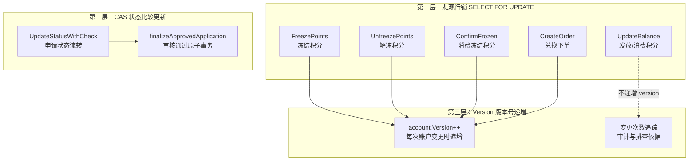
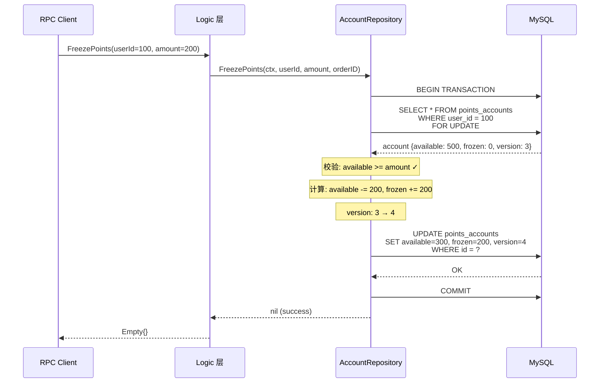
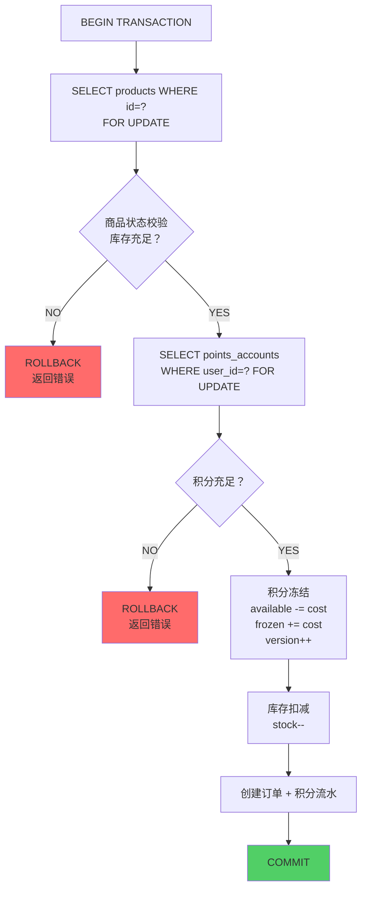

在积分商城系统中，积分账户是最容易被并发请求击穿的数据热点——一次积分申请审核通过可能同时触发积分发放，用户连续点击兑换可能瞬间产生多个冻结请求，商家操作订单取消/完成与用户的新兑换请求可能同时竞争同一账户。本文将深入剖析系统如何通过 **乐观锁版本号 + 状态 CAS + 悲观行锁** 的三层防御体系，确保在高并发场景下积分数据的绝对一致性。

Sources: [points_account.go](model/points_account.go#L5-L18), [schema.sql](deploy/schema.sql#L227-L239)

## 数据模型：积分账户的结构设计

`PointsAccount` 是每个用户的积分资产载体，采用 **单行聚合** 模式——每个用户仅有一条记录，所有积分变动都在此行的数值字段上操作。这种设计将并发冲突收敛到行级别，为后续的锁策略提供了简洁的控制粒度。

| 字段 | 类型 | 语义 | 并发控制角色 |
|------|------|------|-------------|
| `user_id` | `BIGINT` | 用户唯一标识（UNIQUE KEY） | 行级锁定依据 |
| `available_points` | `BIGINT` | 可用积分 | 业务操作核心字段 |
| `frozen_points` | `BIGINT` | 冻结积分 | 兑换订单中间态 |
| `total_earned` | `BIGINT` | 累计获取 | 审计统计字段 |
| `total_spent` | `BIGINT` | 累计消费 | 审计统计字段 |
| `version` | `BIGINT` | 版本号（默认 0） | 乐观锁版本计数器 |

GORM 模型定义中，`Version` 字段标注 `gorm:"not null;default:0"`，数据库 DDL 同样将其设为 `BIGINT NOT NULL DEFAULT 0`。该字段在每次账户变更时递增，作为数据变更次数的可靠追踪标记。

Sources: [points_account.go](model/points_account.go#L5-L18), [schema.sql](deploy/schema.sql#L227-L239)

## 并发控制的三层防御体系

本系统的并发安全并非依赖单一锁机制，而是根据业务场景的冲突特征和性能要求，采用分层防御策略。下图展示了三种机制在不同操作中的分布：



**为什么需要三层？** 每层解决不同维度的并发问题：悲观行锁确保同一条账户记录的串行化写入；CAS 机制确保申请状态的单向流转不会被重复审核覆盖；Version 版本号则为事后排查提供变更序号。三层相互配合，形成完整的防御纵深。

Sources: [points_account_repository.go](model/points_account_repository.go#L45-L122), [points_repository.go](model/points_repository.go#L138-L154), [review_application_logic.go](app/rpc/points/INTernal/logic/pointsservice/review_application_logic.go#L279-L357)

## 第一层：悲观行锁 + Version 递增（积分账户操作）

积分账户的所有余额变更操作均采用 **事务内 `SELECT ... FOR UPDATE`** 模式。这看似与"乐观锁"的标题矛盾，但实为工程上的务实选择——积分属于资金类数据，丢失更新的代价不可接受，因此将悲观行锁作为主要并发控制手段，同时配合 Version 递增形成双重保障。

### 操作模式概览

每个 Repository 方法遵循完全一致的四步模式：**开启事务 → 悲观锁读取 → 业务校验与计算 → 写入（含 Version 递增）**。



### 四种操作的对比分析

| 操作 | 可用积分变化 | 冻结积分变化 | 累计字段 | Version | 失败条件 |
|------|------------|------------|---------|---------|---------|
| **FreezePoints** | `-amount` | `+amount` | 不变 | `++` | `available < amount` |
| **UnfreezePoints** | `+amount` | `-amount` | 不变 | `++` | `frozen < amount` |
| **ConfirmFrozen** | 不变 | `-amount` | `total_spent += amount` | `++` | `frozen < amount` |
| **UpdateBalance(earn)** | `+amount` | 不变 | `total_earned += amount` | 不变 | 账户不存在 |
| **UpdateBalance(spend)** | `-amount` | 不变 | `total_spent += amount` | 不变 | `available < amount` |

值得注意的是，`UpdateBalance` 方法虽然也使用 `SELECT FOR UPDATE` 悲观锁，但 **没有递增 Version 字段**——这是因为该方法在 `finalizeApprovedApplicationWithoutDB`（无 DB 实例的降级路径）中被调用，而主路径通过 `finalizeApprovedApplication` 直接在事务内操作，后者会递增 Version。

Sources: [points_account_repository.go](model/points_account_repository.go#L45-L122)

### 冻结积分的完整实现

以 `FreezePoints` 为例，展示从悲观锁读取到版本号写入的完整代码路径：

```go
func (r *accountRepository) FreezePoints(ctx context.Context, userID INT64, amount INT64, orderID INT64) error {
    return r.db.WithContext(ctx).Transaction(func(tx *gorm.DB) error {
        var account PointsAccount
        // 步骤 1：悲观行锁读取，确保此事务内独占该行
        if err := tx.Clauses(clause.Locking{Strength: "UPDATE"}).
            Where("user_id = ?", userID).First(&account).Error; err != nil {
            return err
        }
        // 步骤 2：余额充足性校验
        if account.AvailablePoints < amount {
            return errx.NewCodeError(errx.CodePointsInsufficient, "积分不足")
        }
        // 步骤 3：业务计算
        account.AvailablePoints -= amount
        account.FrozenPoints += amount
        account.Version++
        // 步骤 4：写入（GORM Save 生成 UPDATE ... WHERE id = ?）
        return tx.Save(&account).Error
    })
}
```

`clause.Locking{Strength: "UPDATE"}` 生成 MySQL 的 `SELECT ... FOR UPDATE`，在 InnoDB 中对目标行加排他锁（X Lock），阻塞其他事务对同一行的任何锁定读取或写入，直到当前事务提交或回滚。

Sources: [points_account_repository.go](model/points_account_repository.go#L70-L86)

## 第二层：CAS 状态比较更新（申请状态流转）

积分申请的审核流程涉及状态机流转（`pending_group_review` → `pending_final_review` → `approved`），这里采用了经典的 **Compare-And-Swap（CAS）** 乐观锁模式。与积分账户的悲观行锁不同，申请状态更新的并发冲突概率较低（通常只有特定审核员操作特定申请），但数据一致性要求同样严格。

### CAS 的核心实现

`UpdateStatusWithCheck` 方法是 CAS 模式的核心封装——通过 `WHERE id = ? AND status = ?` 条件更新，仅当数据库中当前状态与期望状态一致时才执行写入，并通过 `RowsAffected` 判断是否成功：

```go
func (r *applicationRepository) UpdateStatusWithCheck(
    ctx context.Context, id INT64, expectedStatus string, app *PointsApplication,
) (bool, error) {
    result := r.db.WithContext(ctx).
        Model(&PointsApplication{}).
        Where("id = ? AND status = ?", id, expectedStatus).  // CAS 条件
        Updates(map[string]any{
            "status":          app.Status,
            "final_points":    app.FinalPoints,
            "approved_points": app.ApprovedPoints,
            "updated_at":      time.Now(),
        })
    if result.Error != nil {
        return false, result.Error
    }
    return result.RowsAffected > 0, nil  // 0 = 状态已变更（冲突）
}
```

调用方的处理逻辑遵循"冲突即拒绝"策略——若 `RowsAffected == 0`（即 `updated == false`），直接返回 `CodeStatusConflict` 错误（错误码 40904），告知前端"申请状态已变更，请刷新后重试"。

Sources: [points_repository.go](model/points_repository.go#L138-L154), [review_application_logic.go](app/rpc/points/INTernal/logic/pointsservice/review_application_logic.go#L179-L186)

### 两类 CAS 使用场景

**场景一：小组审核通过**，调用 `UpdateStatusWithCheck` 并在事务外创建审核记录。这种模式下，状态更新和审核记录创建不是原子操作，如果审核记录创建失败，状态已经变更且不会回滚——这是有意为之的设计，日志记录失败不应阻塞业务流转。

**场景二：总复核通过（含积分发放）**，通过 `finalizeApprovedApplication` 在单一数据库事务中原子完成：CAS 更新申请状态 → 悲观锁读取积分账户 → 发放积分 → 创建积分流水 → 创建审核记录。五步操作要么全部成功，要么全部回滚：

```go
func (l *ReviewApplicationLogic) finalizeApprovedApplication(...) error {
    return l.svcCtx.Db.WithContext(l.ctx).Transaction(func(tx *gorm.DB) error {
        // 原子步骤 1：CAS 更新申请状态
        result := tx.Model(&model.PointsApplication{}).
            Where("id = ? AND status = ?", app.ID, expectedStatus).
            Updates(map[string]any{...})
        if result.RowsAffected == 0 {
            return errx.NewCodeError(errx.CodeStatusConflict, "申请状态已变更，请刷新后重试")
        }
        // 原子步骤 2：悲观锁读取积分账户 + 发放积分
        var account model.PointsAccount
        tx.Clauses(clause.Locking{Strength: "UPDATE"}).
            Where("user_id = ?", app.ApplicantID).First(&account)
        account.AvailablePoints += amount
        account.TotalEarned += amount
        account.Version++
        tx.Save(&account)
        // 原子步骤 3-4：创建积分流水 + 审核记录
        tx.Create(&txRecord)
        tx.Create(record)
        return nil
    })
}
```

Sources: [review_application_logic.go](app/rpc/points/INTernal/logic/pointsservice/review_application_logic.go#L279-L357)

## 第三层：兑换订单的联合锁策略

兑换下单是系统中最复杂的并发场景——需要同时操作积分账户、商品库存和订单记录三张表。`CreateOrderLogic` 在单一事务中完成了所有锁定和写入，确保"扣库存 + 冻结积分 + 创建订单"的原子性：



这个实现中，**积分账户的冻结操作直接内联在 Order RPC 的事务中**（而非调用 Points RPC 的 `FreezePoints` 方法），原因是跨 RPC 调用无法共享数据库事务。这也体现了微服务架构下分布式事务的权衡——当强一致性要求高于服务边界隔离时，直接操作远端数据库表是更务实的选择。

同样，`CancelOrderLogic`（取消订单解冻积分）和 `CompleteOrderLogic`（完成订单消费冻结积分）也都直接在 Order RPC 事务中操作 `points_accounts` 表，并递增 `Version` 字段。

Sources: [create_order_logic.go](app/rpc/order/INTernal/logic/orderservice/create_order_logic.go#L57-L112), [cancel_order_logic.go](app/rpc/order/INTernal/logic/orderservice/cancel_order_logic.go#L52-L94), [complete_order_logic.go](app/rpc/order/INTernal/logic/orderservice/complete_order_logic.go#L52-L83)

## 错误码与冲突处理

系统通过 [统一错误码体系](5-tong-cuo-wu-ma-ti-xi-yu-cuo-wu-chu-li-gui-fan) 为并发冲突提供了精确的语义化反馈。与积分账户并发控制直接相关的错误码如下：

| 错误码 | 常量名 | 语义 | 触发场景 |
|--------|--------|------|---------|
| **40901** | `CodePointsInsufficient` | 积分不足 | 冻结/消费时 `available < amount` |
| **40904** | `CodeStatusConflict` | 状态冲突 | CAS 更新时状态已变更、订单状态不允许操作 |
| **40905** | `CodeVersionConflict` | 版本冲突 | 预留的乐观锁版本冲突错误码 |
| **40902** | `CodeStockInsufficient` | 库存不足 | 兑换下单时商品库存为 0 |

前端在收到 `40904` 错误时，应提示用户刷新页面并重新操作；收到 `40901` 时则直接展示积分不足的提示。`CodeVersionConflict`（40905）是预留给未来可能引入的纯版本号乐观锁场景的错误码，当前代码路径中尚未启用。

Sources: [code.go](pkg/errx/code.go#L38-L47)

## Repository 接口设计：抽象与可测试性

`AccountRepository` 接口定义了四个核心方法，将并发控制逻辑封装在 Repository 层内部，使上层的 Logic 代码完全无需感知锁的实现细节：

```go
type AccountRepository INTerface {
    FindByUserID(ctx context.Context, userID INT64) (*PointsAccount, error)
    Create(ctx context.Context, account *PointsAccount) error
    UpdateBalance(ctx context.Context, userID INT64, amount INT64, txType string) error
    FreezePoints(ctx context.Context, userID INT64, amount INT64, orderID INT64) error
    UnfreezePoints(ctx context.Context, userID INT64, amount INT64, orderID INT64) error
    ConfirmFrozen(ctx context.Context, userID INT64, amount INT64, orderID INT64) error
}
```

测试中使用 `MockAccountRepository` 替代真实数据库实现，通过 `sync.Mutex` 在内存中模拟并发安全。Mock 的 `FreezePoints` 方法忠实地复现了业务校验逻辑（余额不足返回错误），但跳过了悲观锁和 Version 递增——因为这些是基础设施层面的保障，不影响业务逻辑的正确性验证。

Sources: [points_account_repository.go](model/points_account_repository.go#L13-L20), [mock_helper_test.go](app/rpc/points/INTernal/logic/pointsservice/mock_helper_test.go#L423-L576)

## 并发控制策略对比与选型依据

本系统选择当前方案（而非纯乐观锁或纯悲观锁）有其清晰的工程权衡：

| 维度 | 纯乐观锁（Version WHERE） | 纯悲观锁（FOR UPDATE） | 本系统混合方案 |
|------|------------------------|---------------------|-------------|
| **吞吐量** | 高（无锁等待） | 低（串行化） | 中（按场景选择） |
| **一致性保障** | 弱（需重试） | 强（排他锁） | 强（资金类场景用悲观锁） |
| **死锁风险** | 无 | 有（多行锁定顺序） | 低（单行锁定为主） |
| **重试复杂度** | 需要应用层重试 | 不需要 | 不需要（CAS 场景拒绝而非重试） |
| **适用场景** | 冲突概率低 | 资金级一致性要求 | 两者兼具 |

**选型核心逻辑**：积分账户是资金类数据，`available + frozen` 的不变式（`available >= 0` 且 `frozen >= 0`）必须绝对保证，丢失更新不可容忍——因此选择悲观行锁作为账户操作的主要手段。而申请状态流转的冲突概率极低（同一申请几乎不可能被两个审核员同时操作），CAS 的"冲突即拒绝"策略在保证正确性的同时避免了不必要的锁开销。

Sources: [points_account_repository.go](model/points_account_repository.go#L45-L122), [points_repository.go](model/points_repository.go#L138-L154)

## 扩展阅读

- **积分账户所在的完整数据模型**：参见 [GORM 模型定义与 Repository 模式](20-gorm-mo-xing-ding-yi-yu-repository-mo-shi)，了解 Repository 模式如何统一数据访问层。
- **兑换订单的完整事务流程**：参见 [兑换订单：积分冻结、库存扣减与事务一致性保障](8-dui-huan-ding-dan-ji-fen-dong-jie-ku-cun-kou-jian-yu-shi-wu-zhi-xing-bao-zhang)，理解联合锁策略如何跨表保证原子性。
- **错误码的完整定义**：参见 [统一错误码体系与错误处理规范](5-tong-cuo-wu-ma-ti-xi-yu-cuo-wu-chu-li-gui-fan)，了解 409xx 系列冲突错误码的设计思路。
- **测试覆盖**：参见 [后端单元测试策略：Mock 辅助与覆盖范围](22-hou-duan-dan-yuan-ce-shi-ce-lue-mock-fu-zhu-yu-fu-gai-fan-wei)，了解 Mock Repository 如何隔离并发控制逻辑进行单元测试。