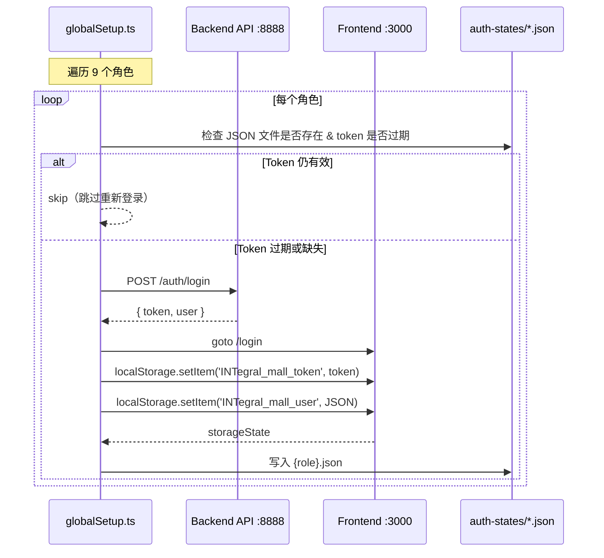
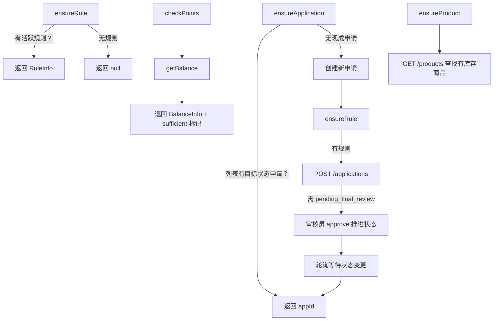
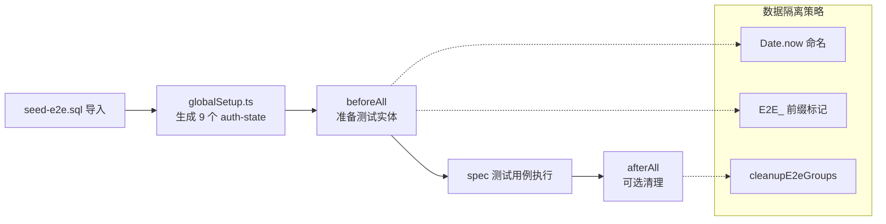

积分商城项目的 Playwright E2E 测试套件是对前端与后端协作行为的**端到端防线**。该套件以 52 个 spec 文件承载 531 个独立测试用例，按 12 个业务模块目录组织，通过 18 个 Page Object 类封装页面交互，辅以 data-helpers fixture 自动准备测试数据，最终在单 worker 串行模式下保障测试的确定性。本文将解构这套测试的架构分层、数据准备策略、执行配置与可靠性工程。

## 测试套件架构总览

测试代码遵循**四层分离**的设计原则：配置层（playwright.config.ts）→ 全局初始化层（globalSetup.ts）→ 测试数据层（fixtures/）→ 测试用例层（各模块 spec 文件）。Page Object Model（POM）作为横切关注点贯穿所有 UI 测试，将 Ant Design 组件的选择器与交互逻辑从测试断言中剥离。

```
frontend/e2e/
├── playwright.config.ts        # 配置入口（项目根目录）
├── globalSetup.ts              # 9 角色认证状态预生成
├── auth-states/                # storageState JSON（9 个角色）
├── fixtures/                   # 数据准备 + 测试图片
│   ├── fixtures.ts             # 统一导出入口
│   ├── data-helpers.ts         # API 级数据准备函数
│   └── test-images/            # 静态测试资源
├── pages/                      # 18 个 Page Object 类
│   ├── CommonPage.ts           # 通用 Ant Design 选择器（ant 对象）
│   ├── LoginPage.ts            # 登录页
│   ├── DashboardPage.ts        # 仪表盘
│   └── ...                     # 其余 14 个业务页面对象
├── utils/
│   └── helpers.ts              # API 登录、轮询、表格搜索等通用工具
├── admin/                      # 管理后台测试（14 文件，174 用例）
├── applications/               # 积分申请测试（7 文件，85 用例）
├── auth/                       # 认证测试（1 文件，14 用例）
├── flows/                      # 端到端业务流（10 文件，101 用例）
├── review/                     # 审核流程测试（4 文件，32 用例）
├── products/                   # 商品管理测试（4 文件，26 用例）
├── orders/                     # 订单测试（2 文件，13 用例）
├── points/                     # 积分查询测试（2 文件，22 用例）
├── dashboard/                  # 仪表盘测试（3 文件，31 用例）
├── notifications/              # 通知中心测试（1 文件，11 用例）
├── settings/                   # 个人设置测试（1 文件，14 用例）
├── cross-browser/              # 跨浏览器/响应式测试（2 文件，8 用例）
└── docs/                       # 已知失败记录
```

Sources: [playwright.config.ts](frontend/playwright.config.ts#L1-L39), [globalSetup.ts](frontend/e2e/globalSetup.ts#L1-L106), [pages/index.ts](frontend/e2e/pages/index.ts#L1-L18)

## Playwright 配置与执行策略

### 双 Project 模式：冒烟测试与全量回归

配置文件定义了两个 Playwright project，服务于不同的执行场景：

| 配置维度 | `smoke` project | `chromium` project |
|---|---|---|
| **触发条件** | `grep: /@smoke/` | 无过滤，全量执行 |
| **设备模拟** | Desktop Chrome | Desktop Chrome |
| **适用场景** | CI 快速验证、部署后健康检查 | 完整回归、代码审查门禁 |
| **典型用例数** | ~30 个标记为 `@smoke` | 全部 531 个 |

```typescript
// playwright.config.ts 核心配置
export default defineConfig({
  testDir: './e2e',
  fullyParallel: false,     // 串行执行，避免数据竞争
  workers: 1,               // 单 worker，保障状态一致性
  retries: process.env.CI ? 2 : 0,  // CI 环境自动重试
  trace: 'on-first-retry',  // 仅失败重试时录制 trace
  screenshot: 'only-on-failure',
  video: 'retain-on-failure',
});
```

**串行执行**（`workers: 1` + `fullyParallel: false`）是这个套件的关键设计决策。由于测试直接操作共享数据库状态，并行执行将导致积分余额、商品库存等业务数据在不同 worker 间产生竞争。虽然牺牲了执行速度，但换来了**确定性与可重复性**。

Sources: [playwright.config.ts](frontend/playwright.config.ts#L1-L39)

### 运行命令

```bash
# 全量回归测试（默认 chromium project）
pnpm test:e2e

# 带浏览器 UI 的交互式调试
pnpm test:e2e:ui

# 有头模式（可见浏览器窗口）
pnpm test:e2e:headed

# 仅运行冒烟测试
npx playwright test --project=smoke

# 运行单个 spec 文件
npx playwright test e2e/flows/main-flows.spec.ts

# 通过 tag 过滤
npx playwright test --grep "@smoke"
npx playwright test --grep "@regression"
```

Sources: [package.json](frontend/package.json#L11-L14), [test-e2e.sh](scripts/test-e2e.sh#L1-L16)

## 认证状态预生成：globalSetup 机制

### 问题：JWT Token 的生命周期管理

E2E 测试涉及 9 个不同角色的用户，每个角色的权限范围决定了他能访问的 API 和页面。如果每个测试用例都通过 UI 登录，不仅耗时（每次 ~3s），还可能因 Ant Design 动画延迟导致 flaky。项目采用 Playwright 的 **globalSetup + storageState** 模式解决这个问题。

### 实现架构



globalSetup 在 Playwright 启动测试前自动执行，核心逻辑包含**JWT 过期检测**——解析 `INTegral_mall_token` 的 `exp` 字段，仅在过期时才触发重新登录。这一机制使得日常开发中反复运行测试时，9 次登录 API 调用可以完全跳过，直接复用缓存的认证状态。

| 角色文件 | 邮箱 | 业务用途 |
|---|---|---|
| `participant.json` | `e2e_participant@test.com` | 积分申请、商品兑换 |
| `participant2.json` | `e2e_participant2@test.com` | B 组参与者，并发测试 |
| `reviewer.json` | `e2e_reviewer@test.com` | A 组小组审核 |
| `reviewer2.json` | `e2e_reviewer2@test.com` | B 组小组审核 |
| `chief.json` | `e2e_chief@test.com` | 总复核、积分调整 |
| `merchant.json` | `e2e_merchant@test.com` | 商品管理、订单处理 |
| `merchant2.json` | `e2e_merchant2@test.com` | 第二商家 |
| `observer.json` | `e2e_observer@test.com` | 只读权限边界测试 |
| `admin.json` | `admin@company.com` | 全功能管理 |

Sources: [globalSetup.ts](frontend/e2e/globalSetup.ts#L1-L106), [participant.json](frontend/e2e/auth-states/participant.json#L1-L18), [TEST_ACCOUNTS.md](frontend/e2e/TEST_ACCOUNTS.md#L1-L90)

## 种子数据：测试环境的数据基线

### seed-e2e.sql 的设计哲学

测试套件依赖 [seed-e2e.sql](deploy/seeds/seed-e2e.sql) 建立完整的业务数据基线。这份 SQL 脚本采用**幂等设计**（`INSERT IGNORE` / `ON DUPLICATE KEY UPDATE`），可以安全地反复执行而不产生重复数据。

种子数据建立的业务场景覆盖：

| 数据类别 | 内容 | 测试支撑 |
|---|---|---|
| **9 个测试用户** | participant×2、reviewer×2、merchant×2、chief、observer、admin | 角色隔离、权限边界 |
| **2 个用户组** | E2E 测试A组（ID=3）、E2E 测试B组（ID=4） | 小组审核路由 |
| **积分规则** | 1 条 active + 1 条 disabled | 规则生命周期 |
| **5 个商品** | 低价50pt、中价200pt、高价500pt、限量1件、售罄0件 | 兑换边界场景 |
| **4 条积分申请** | approved、pending_final_review、rejected、pending_ai_review | 全状态覆盖 |
| **4 笔订单** | pending、completed、processing、pending | 订单生命周期 |
| **积分账户** | participant: 1030可用+250冻结，其余: 1000 | 余额断言基线 |
| **通知数据** | 未读/已读通知覆盖 application/order/system/review 类型 | 通知列表测试 |

```bash
# 导入种子数据
docker compose -f deploy/docker-compose.yaml \
  exec mysql mysql -uroot -proot123 INTegral_mall < deploy/seeds/seed-e2e.sql
```

Sources: [seed-e2e.sql](deploy/seeds/seed-e2e.sql#L1-L448), [TEST_ACCOUNTS.md](frontend/e2e/TEST_ACCOUNTS.md#L17-L32)

## Page Object Model：18 类封装 Ant Design 交互

### CommonPage 与 `ant` 选择器对象

Page Object 体系的核心是 [CommonPage.ts](frontend/e2e/pages/CommonPage.ts) 中定义的 `ant` 常量对象，它将 Ant Design 组件的 CSS 选择器收敛为语义化的函数调用：

```typescript
// ant 对象封装了所有 Ant Design 组件选择器
export const ant = {
  modal: (page) => page.locator('.ant-modal'),
  table: (page) => page.locator('.ant-table'),
  tableRows: (page) => page.locator('.ant-table-tbody tr'),
  select: (page, index = 0) => page.locator('.ant-select').nth(index),
  selectItem: (page) => page.locator('.ant-select-dropdown .ant-select-item'),
  message: (page) => page.locator('.ant-message-notice-content'),
  // ... 共 15 个组件选择器
};
```

这种设计的核心价值在于：当 Ant Design 升级导致 DOM 结构变化时，只需修改 `ant` 对象中的选择器，而无需逐个修改 52 个 spec 文件中的定位器。

### 页面对象的分层结构

| Page Object | 路由 | 封装的关键交互 |
|---|---|---|
| `LoginPage` | `/login` | `login()` / `loginFresh()` / `expectFormError()` |
| `DashboardPage` | `/dashboard` | `clickViewAll()` |
| `ApplicationSubmitPage` | `/applications/submit` | `selectRule()` / `selectGroup()` / `fillSelfReportedPoints()` |
| `ApplicationListPage` | `/applications` | 申请列表分页与详情 |
| `ReviewPendingPage` | `/review/pending` | 审核操作按钮 |
| `ProductMallPage` | `/products` | 商品卡片与兑换按钮 |
| `OrderListPage` | `/orders` | 订单列表与状态标签 |
| `PointsPage` | `/points` | 积分余额与流水 |
| `AdminUsersPage` | `/admin/users` | 用户 CRUD |
| `AdminGroupsPage` | `/admin/groups` | 小组 CRUD |
| `AdminRulesPage` | `/admin/rules` | 规则 CRUD |
| `AdminRolesPage` | `/admin/roles` | 角色权限分配 |
| `AdminProductsPage` | `/admin/products` | 商品管理 |
| `SettingsPage` | `/settings` | 个人资料编辑 |
| `NotificationsPage` | `/notifications` | 通知已读/未读切换 |

Sources: [CommonPage.ts](frontend/e2e/pages/CommonPage.ts#L1-L83), [LoginPage.ts](frontend/e2e/pages/LoginPage.ts#L1-L56), [ApplicationSubmitPage.ts](frontend/e2e/pages/ApplicationSubmitPage.ts#L1-L98)

## 数据准备层：Fixture 与 Data Helpers

### 设计动机：消除 `test.skip()` 的碎片化

传统 E2E 测试常见的模式是在测试开头检查前置数据是否满足条件，不满足则 `test.skip()`。当大量测试都依赖特定状态的数据（如"待审核的申请"）时，这种模式导致测试覆盖率虚高但实际执行率低。项目通过 **data-helpers** 层解决这个问题——由 fixture 层自动准备缺失的数据。

### 核心 Helper 函数



| Helper 函数 | 功能 | 幂等性 |
|---|---|---|
| `ensureRule()` | 获取一个活跃积分规则，无则返回 null | ✅ 查询式 |
| `ensureApplication(targetStatus)` | 确保存在指定状态的申请，无则自动创建并推进 | ✅ 先查后建 |
| `checkPoints(email, minPoints)` | 检查积分是否充足，返回 sufficient 标记 | ✅ 纯查询 |
| `ensureProduct(options)` | 查找一个有库存的商品 | ✅ 纯查询 |
| `getNotifications(email)` | 获取用户通知列表 | ✅ 纯查询 |
| `ensureRuleAndApplication()` | 组合 helper，一次调用同时获取规则和申请 | ✅ 组合式 |

`ensureApplication` 是最复杂的 helper——它接受 `pending_group_review` 或 `pending_final_review` 两种目标状态。当需要后者时，它会先创建申请，再以审核员身份调用 review API 推进状态，并通过 `waitForApplicationStatus` **轮询**（而非固定 sleep）确认状态变更后才返回。

Sources: [data-helpers.ts](frontend/e2e/fixtures/data-helpers.ts#L1-L322), [fixtures.ts](frontend/e2e/fixtures/fixtures.ts#L1-L58)

## 工具函数层：helpers.ts 的关键能力

[e2e/utils/helpers.ts](frontend/e2e/utils/helpers.ts) 提供了测试用例中高频使用的通用工具，按功能域分为以下几组：

**API 交互类**

| 函数 | 用途 |
|---|---|
| `apiLogin(request, email, password)` | 通过 API 登录获取 token，失败时抛异常（而非静默返回） |
| `unwrap(body)` | 解包 API 信封格式 `{ code, message, data }` → `data` |
| `uploadFile(request, file, token?)` | multipart 文件上传 |
| `createUserViaApi()` / `createGroupViaApi()` / `createRuleViaApi()` | 通过 API 创建测试实体 |

**等待与轮询类**

| 函数 | 用途 |
|---|---|
| `waitForStatus(request, token, appId, target, maxWaitMs)` | 轮询申请状态直到匹配或超时，含随机 jitter 防惊群 |
| `waitForAntMessage(page, pattern, timeout)` | 等待 Ant Design toast 出现 |
| `waitForAntSelectDropdown(page, timeout)` | 等待 Select 下拉菜单展开可交互 |
| `waitForTableRowWithText(page, selector, text, timeout)` | **跨分页搜索**表格中的目标文本 |
| `waitForPageStable(page, timeout)` | 等待 networkidle |

**业务流程类**

| 函数 | 用途 |
|---|---|
| `approveApplication(request, tokens, appId)` | 完整走完小组审核 + 总复核 |
| `cleanupE2eGroups(request, adminToken)` | 清理历史 E2E 测试小组（防分页污染） |
| `typeChinese(locator, text, delay)` | 逐字符输入中文（触发完整 IME 事件序列） |
| `extractRoleCodes(roles)` | 兼容 `[{code, name}]` 和 `["string"]` 两种角色格式 |

Sources: [helpers.ts](frontend/e2e/utils/helpers.ts#L1-L401)

## 测试模块详解

### 模块分布与覆盖矩阵

| 模块目录 | spec 文件数 | 测试用例数 | 测试类型 | 核心覆盖 |
|---|---|---|---|---|
| `admin/` | 14 | 174 | UI + API | 用户/小组/角色/规则/订单 CRUD、RBAC 守卫 |
| `applications/` | 7 | 85 | UI + API | 申请提交、重复防制、边界校验、文件上传、重新提交 |
| `flows/` | 10 | 101 | UI + API | 端到端业务流、并发竞争、跨模块闭环、回归 |
| `review/` | 4 | 32 | UI + API | 小组审核、总复核、调整积分、审核流 UI |
| `products/` | 4 | 26 | UI + API | 商品 CRUD、图片管理、生命周期 |
| `dashboard/` | 3 | 31 | UI + API | 仪表盘统计、权限隔离、观察员角色 |
| `points/` | 2 | 22 | UI + API | 余额查询、积分不足场景、通知偏好 |
| `auth/` | 1 | 14 | UI | 登录/注册表单验证、错误提示 |
| `settings/` | 1 | 14 | API | 个人资料查看/编辑、权限边界 |
| `notifications/` | 1 | 11 | API | 未读计数、分页、单条/批量已读 |
| `orders/` | 2 | 13 | UI + API | 订单生命周期、状态流转 |
| `cross-browser/` | 2 | 8 | UI | 浏览器兼容性、移动端响应式 |

### admin/：管理后台的全面覆盖

管理后台测试是最大的模块（174 用例），覆盖了用户管理、小组管理、角色管理、规则管理、订单管理五个 CRUD 模块。这些测试采用了**双重验证策略**——对每个操作同时编写 API 测试（直接验证后端行为）和 UI 测试（验证前端渲染与交互），确保前后端契约的一致性。

以 [roles.spec.ts](frontend/e2e/admin/roles.spec.ts) 为例，它的测试结构呈现**由外到内**的层次：首先验证 RBAC 守卫（participant/reviewer 无法访问 `/admin/roles`），然后验证列表展示（表格加载、系统角色标签），接着验证创建（表单校验、重复编码拦截），最后验证编辑和删除。

### flows/：端到端业务流的集成验证

`flows/` 目录承载了最核心的端到端业务流测试，其中几个关键文件的测试策略值得深入分析：

**[main-flows.spec.ts](frontend/e2e/flows/main-flows.spec.ts)** 定义了 `@smoke` 标记的主流程回归——积分申请（FLOW-APP-001~004）和商品兑换（FLOW-ORD-001~004），每个测试都从 UI 登录开始，贯穿完整的用户操作路径。

**[concurrency.spec.ts](frontend/e2e/flows/concurrency.spec.ts)** 是并发安全性的专项测试，验证了：
- 两人同时兑换限量商品 → 仅一人成功（库存扣减原子性）
- 并发完成订单 → 积分只发放一次（幂等性）
- 并发提交申请 → 全部成功（乐观锁兼容）

**[review-regression.spec.ts](frontend/e2e/flows/review-regression.spec.ts)（637 行，最大单文件）** 系统性地覆盖了审核流程的各种回归场景，是测试套件中最复杂的 spec 文件。

### review/：审核流程的精细控制

审核测试特别值得关注的是 [adjust-approve.spec.ts](frontend/e2e/review/adjust-approve.spec.ts)，它测试了**积分调整审核**这一复杂业务场景：总复核员可以在 approve 时覆盖 AI 建议的积分额度。测试的 `beforeAll` 阶段通过 API 完成前置操作（提交申请 → 等待 AI 评分完成），测试用例本身只关注审核操作和积分发放的断言。

Sources: [roles.spec.ts](frontend/e2e/admin/roles.spec.ts#L1-L200), [main-flows.spec.ts](frontend/e2e/flows/main-flows.spec.ts#L1-L343), [concurrency.spec.ts](frontend/e2e/flows/concurrency.spec.ts#L1-L297), [adjust-approve.spec.ts](frontend/e2e/review/adjust-approve.spec.ts#L1-L80)

## 测试用例的编写模式

### 模式一：纯 API 测试

适用于后端逻辑验证，不依赖浏览器渲染：

```typescript
test('API：角色列表返回分页数据', async ({ request }) => {
  const token = await getAdminToken(request);
  const res = await request.get(`${API_BASE}/admin/roles?page=1&page_size=20`, {
    headers: { Authorization: `Bearer ${token}` },
  });
  expect(res.ok()).toBeTruthy();
  const data = unwrap(await res.json());
  expect(Array.isArray(data?.list)).toBeTruthy();
});
```

### 模式二：UI 测试（browser context）

适用于验证前端渲染、路由守卫、Ant Design 组件交互：

```typescript
test('participant 访问 /admin/roles → 显示 403', async ({ browser }) => {
  const ctx = await browser.newContext();
  const page = await ctx.newPage();
  await uiLogin(page, 'e2e_participant@test.com', 'admin123');
  await page.goto('/admin/roles');
  const body = await page.locator('body').textContent() ?? '';
  expect(body).toMatch(/403|没有权限|无权|抱歉/);
  await ctx.close();
});
```

注意每个 UI 测试都创建独立的 `browser.newContext()` 并在结束时 `ctx.close()`，这是为了确保测试间的 localStorage 隔离。

### 模式三：混合测试（API 准备 + UI 断言）

最常见的高级模式——用 API 准备前置数据，用 UI 验证展示效果：

```typescript
test.describe.serial('审核流程', () => {
  let applicationId: number;

  test.beforeAll(async ({ request }) => {
    // API 创建申请并推进到待审核状态
    applicationId = await ensureApplication(request, 'pending_group_review');
  });

  test('UI: 审核员看到待审核申请', async ({ browser }) => {
    const ctx = await browser.newContext();
    const page = await ctx.newPage();
    await uiLogin(page, 'e2e_reviewer@test.com', 'admin123');
    await page.goto('/review/pending');
    // ... UI 断言
    await ctx.close();
  });
});
```

Sources: [roles.spec.ts](frontend/e2e/admin/roles.spec.ts#L163-L177), [roles.spec.ts](frontend/e2e/admin/roles.spec.ts#L63-L73), [review-regression.spec.ts](frontend/e2e/flows/review-regression.spec.ts#L1-L637)

## 可靠性工程：对抗 Flaky 的策略

### 已知的可靠性挑战

项目维护了一份 [known-failures](frontend/e2e/docs/known-failures-2026-04-19.md) 文档，记录了测试套件运行中的已知问题。最近一次完整运行的结果：**521 通过、17 失败、22 跳过**。失败原因的分布如下：

| 失败类别 | 数量 | 根因 | 修复方向 |
|---|---|---|---|
| 后端 API 错误 | ~3 | 重复邮箱返回 500、边界场景返回 500 | 修复后端错误处理 |
| UI 元素定位失败 | ~5 | Ant Design Select/Modal 动画时序 | 增加 waitFor、调整超时 |
| 测试数据依赖 | ~4 | 前置条件不满足、数据隔离问题 | 改用 data-helpers 自动准备 |
| RBAC 权限问题 | 1 | participant 意外能访问管理接口 | 修复后端 RBAC 配置 |
| 网络异常模拟 | 1 | Docker 环境下离线模拟冲突 | 标记 skip |
| 移动端 UI | 1 | CSS 响应式布局问题 | 修复前端样式 |

### 对抗不确定性的工程手段

**1. 轮询替代固定等待**。`waitForStatus`、`waitForAntSelectDropdown`、`waitForTableRowWithText` 等函数都采用轮询 + 超时的模式，而非 `setTimeout` 硬编码等待。其中 `waitForStatus` 还引入了随机 jitter（1500ms + random 1000ms）防止多测试同时轮询导致的惊群效应。

**2. 数据自愈**。`ensureApplication` 等函数在发现前置数据缺失时自动创建，而非被动 skip。`cleanupE2eGroups` 在 `beforeAll` 中清理历史 E2E 数据，防止分页被旧数据填满导致新数据不在首页。

**3. 串行执行**。`workers: 1` + `fullyParallel: false` 消除了测试间的数据库竞争。

**4. CI 重试策略**。CI 环境下 `retries: 2`，配合 `trace: 'on-first-retry'` 只在重试时才录制 trace，避免磁盘占用。

**5. 测试数据隔离标记**。所有动态创建的测试数据使用 `Date.now()` 时间戳或 `E2E_` 前缀命名，便于识别和清理。

Sources: [known-failures-2026-04-19.md](frontend/e2e/docs/known-failures-2026-04-19.md#L1-L135), [helpers.ts](frontend/e2e/utils/helpers.ts#L179-L218), [data-helpers.ts](frontend/e2e/fixtures/data-helpers.ts#L55-L73)

## 测试数据的生命周期管理

### 数据准备与清理的完整流程



### 重置环境的两种方案

当测试数据被反复消耗后（积分余额耗尽、商品库存清零），需要重置测试基线：

**方案一：精确 DELETE 清理**（推荐日常使用）
```bash
docker compose exec mysql mysql -uroot -proot123 INTegral_mall -e "
  DELETE FROM applications WHERE created_at > NOW() - INTERVAL 1 DAY AND id > 1000;
  DELETE FROM orders WHERE created_at > NOW() - INTERVAL 1 DAY AND id > 1000;
"
```

**方案二：TRUNCATE + 重新导入 seed**（最干净，推荐大版本发布前使用）
```bash
docker compose exec mysql mysql -uroot -proot123 INTegral_mall -e "
  SET FOREIGN_KEY_CHECKS=0;
  TRUNCATE TABLE applications; TRUNCATE TABLE orders; TRUNCATE TABLE notifications;
  SET FOREIGN_KEY_CHECKS=1;
"
docker compose exec mysql mysql -uroot -proot123 INTegral_mall < deploy/seeds/seed-e2e.sql
```

Sources: [TEST_ACCOUNTS.md](frontend/e2e/TEST_ACCOUNTS.md#L36-L77), [seed-e2e.sql](deploy/seeds/seed-e2e.sql#L1-L30)

## 与测试体系其他层的关系

E2E 测试套件在项目的整体测试金字塔中处于顶层，与后端单元测试和前端 Vitest 测试形成互补：

- **后端单元测试**（[后端单元测试策略](22-hou-duan-dan-yuan-ce-shi-ce-lue-mock-fu-zhu-yu-fu-gai-fan-wei)）验证 GORM Repository、错误码、JWT 工具等底层逻辑的正确性，不依赖数据库和前端。
- **前端 Vitest 测试**（[前端 Vitest 单元测试](24-qian-duan-vitest-dan-yuan-ce-shi-yu-zu-jian-ce-shi-shi-jian)）验证 React 组件渲染、Zustand Store、API 调用 Mock 等，快速反馈前端代码质量。
- **Playwright E2E 测试**（本文）验证前后端集成后的真实行为——包括 API 路由可达性、数据库状态一致性、Ant Design 组件渲染、RBAC 权限守卫的端到端生效。

E2E 测试的代价是执行速度（全量运行约 30-60 分钟），但它能捕获前两层测试无法发现的集成缺陷，特别是**前后端契约漂移**和**数据库事务边界**问题。