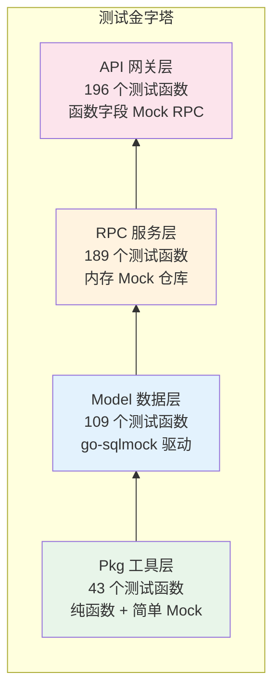

积分商城后端以 Go 语言构建，采用 **手写函数字段 Mock** 与 **go-sqlmock 数据库 Mock** 双轨并行策略，在 110 个测试文件中实现了 **537 个测试函数**，覆盖了从纯函数工具库到 RPC 服务层的全部四个测试层级。本文将深入解析项目采用的 Mock 架构、测试分层策略、典型代码模式以及各模块的覆盖范围，帮助你快速理解并参与后端测试编写。

Sources: [go.mod](go.mod#L1-L10), [scripts/test-backend.sh](scripts/test-backend.sh#L1-L50)

## 测试架构总览：四层金字塔

项目的测试体系遵循经典测试金字塔原则，从底到顶分为 **Pkg 工具层 → Model 数据层 → RPC 服务层 → API 网关层**，每一层采用不同的 Mock 策略以匹配其职责边界。下层测试聚焦于纯逻辑正确性，上层测试则关注参数传递、权限控制和错误传播。



各层测试的核心差异在于依赖隔离方式：Pkg 层无需隔离外部依赖，Model 层通过 `go-sqlmock` 模拟数据库连接，RPC 层使用内置内存 Map 的 Mock Repository，API 层则通过函数字段注入控制 RPC 客户端行为。

Sources: [model/repository_test.go](model/repository_test.go#L1-L31), [pkg/contextx/user_test.go](pkg/contextx/user_test.go#L1-L78), [app/rpc/points/INTernal/logic/pointsservice/mock_helper_test.go](app/rpc/points/INTernal/logic/pointsservice/mock_helper_test.go#L1-L906)

## Mock 架构设计：三种隔离策略

### 策略一：函数字段 Mock（API 层）

API 网关层采用了 **函数字段注入模式**（Function Field Injection），这是项目中最具特色的 Mock 设计。核心思路是定义一个结构体，每个方法对应一个 `func` 类型的字段，当字段为 `nil` 时返回零值默认响应，非 `nil` 时调用注入的测试函数。

| 特性 | 描述 |
|------|------|
| **Mock 定义方式** | 结构体字段为 `func(ctx, req, ...) (resp, err)` 类型 |
| **默认行为** | 字段为 `nil` 时返回零值响应（空结构体 + `nil` 错误） |
| **注入方式** | 测试中直接赋值函数字段 |
| **接口兼容** | Mock 结构体实现对应 RPC Client 接口 |

以 `MockOrderRpc` 为例，其结构定义如下：

```go
type MockOrderRpc struct {
    CreateOrderFunc  func(ctx context.Context, in *orderservice.CreateOrderReq, 
                          opts ...grpc.CallOption) (*orderservice.OrderResp, error)
    GetOrderFunc     func(ctx context.Context, in *orderservice.GetOrderReq, 
                          opts ...grpc.CallOption) (*orderservice.OrderDetailResp, error)
    // ... 其他方法字段
}

func (m *MockOrderRpc) CreateOrder(ctx context.Context, in *orderservice.CreateOrderReq, 
    opts ...grpc.CallOption) (*orderservice.OrderResp, error) {
    if m.CreateOrderFunc != nil {
        return m.CreateOrderFunc(ctx, in, opts...)
    }
    return &orderservice.OrderResp{}, nil  // 零值默认
}
```

这种模式的优势在于**零侵入性**：测试只需关注当前用例涉及的方法，其余方法自动返回安全默认值，避免了为每个测试用例配置大量桩代码。

Sources: [app/api/INTernal/logic/order/mock_helper_test.go](app/api/INTernal/logic/order/mock_helper_test.go#L14-L63), [app/api/INTernal/logic/logic.go](app/api/INTernal/logic/logic.go#L1-L107)

### 策略二：集中式 Mock 工厂

项目在 `logic` 包中维护了两个版本的集中式 Mock 工厂函数，用于一键创建装配了全部 Mock 依赖的 `ServiceContext`：

- **`NewMockSvcCtx()`** — 返回 9 个值，覆盖 5 个 RPC Mock + 4 个 Repository Mock
- **`NewMockSvcCtxV2()`** — 返回 12 个值，额外包含 `MockRoleRpc`、`MockPermissionRepo`、`MockRolePermissionRepo`

```go
func NewMockSvcCtx() (*svc.ServiceContext, *MockUserRpc, *MockPointsRpc, 
    *MockProductRpc, *MockOrderRpc, *MockUserRepo, *MockRoleRepo, 
    *MockGroupRepo, *MockNotificationRepo) {
    // 初始化所有 Mock 并注入 ServiceContext
    svcCtx := &svc.ServiceContext{
        UserRpc:           &MockUserRpc{},
        RoleRpc:           &MockRoleRpc{},
        PointsRpc:         &MockPointsRpc{},
        ProductRpc:        &MockProductRpc{},
        OrderRpc:          &MockOrderRpc{},
        // ... Repository 同理
    }
    return svcCtx, /* 各 Mock 实例 */
}
```

这套机制对应 [Handler / Logic / ServiceContext 三层架构与依赖注入](14-handler-logic-servicecontext-san-ceng-jia-gou-yu-yi-lai-zhu-ru) 中描述的 `ServiceContext` 结构，所有 RPC 客户端和 Repository 接口在测试中被完整替换。

Sources: [app/api/INTernal/logic/logic.go](app/api/INTernal/logic/logic.go#L702-L796), [app/api/INTernal/svc/service_context.go](app/api/INTernal/svc/service_context.go#L19-L41)

### 策略三：内置状态 Mock 仓库（RPC 层）

与 API 层的函数字段 Mock 不同，RPC 服务层的测试采用了**内置内存 Map 的状态化 Mock Repository**。这些 Mock 不是简单的函数桩，而是模拟了真实 Repository 的 CRUD 行为——数据存储在 `map[INT64]*Model` 中，支持过滤、分页、并发安全（`sync.Mutex`），以及链式错误注入。

| Mock Repository | 内置功能 |
|-----------------|----------|
| `MockRuleRepository` | `Seed()` 种子数据、`WithCreateErr()` 错误注入、`List()` 多条件过滤 |
| `MockApplicationRepository` | `FindByID()` 返回深拷贝、`UpdateStatusWithCheck()` 状态乐观锁模拟 |
| `MockReviewRecordRepository` | `Create()` 自增 ID、`WithFindErr()` 错误注入 |
| `MockPointsAccountRepository` | `FindByUserID()` 查询、`UpdateWithVersionCheck()` 版本乐观锁 |

以 `MockApplicationRepository` 的 `FindByID` 为例，它不仅返回数据，还返回**深拷贝**以模拟 GORM `First()` 的行为——避免测试代码修改影响 Mock 仓库中的原始数据：

```go
func (m *MockApplicationRepository) FindByID(ctx context.Context, id INT64) (*model.PointsApplication, error) {
    app, ok := m.apps[id]
    if !ok {
        return nil, errNotFound("申请不存在")
    }
    copy := *app  // 返回副本，符合 GORM 行为
    return &copy, nil
}
```

这种设计使得 RPC 层的测试可以编写复杂的业务场景——比如积分申请提交后状态流转、乐观锁冲突检测——而不需要依赖真实数据库。

Sources: [app/rpc/points/INTernal/logic/pointsservice/mock_helper_test.go](app/rpc/points/INTernal/logic/pointsservice/mock_helper_test.go#L64-L371), [app/rpc/order/INTernal/logic/orderservice/mock_helper_test.go](app/rpc/order/INTernal/logic/orderservice/mock_helper_test.go#L22-L134)

## 测试分层详解

### Pkg 工具层：纯函数测试

`pkg` 目录下的工具包测试最为简洁，它们不依赖任何外部系统，采用标准 `testing` 包 + `testify/assert` 编写。测试重点覆盖四类场景：

| 包名 | 测试函数数 | 测试焦点 |
|------|-----------|----------|
| `utils` | 15 | 订单号格式/唯一性/递增、Snowflake ID、JWT 生成解析、分页计算 |
| `consts` | 11 | 状态常量值验证（Application/Order/Product/User/Rule/Group） |
| `notification` | 8 | Notifier 各业务场景通知发送、JSON 序列化 |
| `contextx` | 5 | Context 存取 UserID/Roles/Permissions 的边界值 |
| `errx` | 4 | CodeError 构造、ErrorHandler 分支路由、错误码常量 |

这一层测试的特征是**大量使用 Table-Driven Tests**。以 `errx/error_test.go` 为例，`TestErrorHandler` 用 7 组测试用例覆盖了 `CodeError`、普通 `error`、gRPC 参数错误、积分不足错误、商品下架错误等多种分支，确保统一错误码体系的正确映射。

Sources: [pkg/errx/error_test.go](pkg/errx/error_test.go#L52-L136), [pkg/utils/order_no_test.go](pkg/utils/order_no_test.go#L1-L41), [pkg/notification/notifier_test.go](pkg/notification/notifier_test.go#L46-L206)

### Model 数据层：go-sqlmock 驱动的 Repository 测试

Model 层的测试使用 `go-sqlmock` 库在 GORM 下方注入 SQL Mock，验证 Repository 方法生成的 SQL 语句、参数绑定和结果映射。核心辅助函数 `setupMockDB` 封装了 Mock 初始化逻辑：

```go
func setupMockDB(t *testing.T) (*gorm.DB, sqlmock.Sqlmock) {
    t.Helper()
    db, mock, err := sqlmock.New()
    require.NoError(t, err)
    gormDB, err := gorm.Open(mysql.New(mysql.Config{
        Conn:                      db,
        SkipInitializeWithVersion: true,
    }), &gorm.Config{})
    require.NoError(t, err)
    t.Cleanup(func() { db.Close() })
    return gormDB, mock
}
```

测试覆盖了 5 个 Repository 共 109 个测试函数，每个 Repository 的测试模式高度一致：

1. **构造成功路径** — 验证 `INSERT` 语句和参数
2. **查询成功路径** — 验证 `SELECT` 语句、`sqlmock.NewRows()` 列定义和数据映射
3. **查询未找到** — 验证 `gorm.ErrRecordNotFound` → `errx.CodeNotFound` 转换
4. **更新/删除操作** — 验证事务 Begin/Commit
5. **列表查询** — 验证 COUNT + SELECT 双查询模式

| Repository | 测试覆盖 |
|------------|---------|
| `UserRepository` | Create、FindByID（成功/未找到）、FindByEmail、Update、List（有/无关键词） |
| `RoleRepository` | FindByCode、FindUserRoles、AssignRoles |
| `GroupRepository` | Create、FindByID、Delete、List、AssignGroups、FindUserGroups |
| `PointsRuleRepository` | Create、FindByID、Disable、List、FindHistory、SnapshotRule |
| `PermissionRepository` | FindAll、FindByModule、FindByIDs、FindByCodes、FindByRoleID |

Sources: [model/repository_test.go](model/repository_test.go#L17-L200), [model/permission_repository_test.go](model/permission_repository_test.go#L1-L195)

### API 网关层：Logic 测试与权限验证

API 层的 196 个测试函数分布在 12 个业务模块中，每个模块都有对应的 `mock_helper_test.go`（部分使用集中式 `logic.NewMockSvcCtx()`，部分使用模块级独立 Mock）。测试关注三个维度：

**维度一：参数校验与用户身份**

每个 Logic 测试都通过 `NewCtxWithUser(userID, roles)` 或 `NewCtxWithUserAndPermissions(userID, permissions, isSuperAdmin)` 构建测试上下文，覆盖已登录/未登录场景：

```go
func TestCreateOrder_NoUser(t *testing.T) {
    svcCtx, _, _, _, _, _, _, _, _ := logic.NewMockSvcCtx()
    ctx := logic.NewCtxWithNoUser()
    l := NewCreateOrderLogic(ctx, svcCtx)
    resp, err := l.CreateOrder(&types.CreateOrderReq{ProductId: 1})
    assert.Error(t, err)
    assert.Nil(t, resp)
}
```

**维度二：RPC 调用验证**

测试中通过注入 `XXXFunc` 字段捕获 RPC 请求参数，同时验证请求值的正确性和响应值的回传：

```go
orderRpc.CreateOrderFunc = func(ctx context.Context, in *orderservice.CreateOrderReq, ...) {
    assert.Equal(t, INT64(100), in.UserId)
    assert.Equal(t, INT64(1), in.ProductId)
    return &orderservice.OrderResp{OrderNo: "ORD20260402000001"}, nil
}
```

**维度三：错误传播**

每个模块至少包含一个 RPC 错误场景测试，验证 gRPC 错误能正确传播到 API 层并被 [统一错误码体系](5-tong-cuo-wu-ma-ti-xi-yu-cuo-wu-chu-li-gui-fan) 消费。

| 业务模块 | 测试函数数 | 核心测试场景 |
|---------|-----------|-------------|
| `order` | 34 | 创建/处理/完成/取消订单、库存校验、积分冻结 |
| `rule` | 21 | 创建/更新/启用/禁用规则、版本历史查询 |
| `product` | 21 | 商品 CRUD、上下架状态控制 |
| `user` | 19 | 用户创建、角色分配、组分配、档案更新 |
| `notification` | 18 | 通知列表、已读标记、未读计数 |
| `review` | 16 | 审核权限分流（group/final 级别）、超级管理员绕过 |
| `application` | 14 | 积分申请提交/重新提交/查询 |
| `admin` | 11 | 角色 CRUD、权限分配 |

Sources: [app/api/INTernal/logic/order/create_order_logic_test.go](app/api/INTernal/logic/order/create_order_logic_test.go#L1-L75), [app/api/INTernal/logic/review/review_logic_permission_test.go](app/api/INTernal/logic/review/review_logic_permission_test.go#L94-L189), [app/api/INTernal/logic/logic.go](app/api/INTernal/logic/logic.go#L767-L796)

### 中间件层：HTTP 级别的集成测试

中间件测试使用 Go 标准库的 `httptest.NewRecorder()` 和 `httptest.NewRequest()` 模拟 HTTP 请求/响应，验证中间件对请求的处理行为。

**JWT 中间件测试**（12 个测试函数）覆盖了无 Token、无效 Token、有效 Token、过期 Token 等场景，以及 `roles` 字段的三种类型解析（`[]any`、`[]string`、单 `string`）：

```go
func TestJwtContextMiddleware_ValidToken(t *testing.T) {
    m := NewJwtContextMiddleware(testSecret)
    var capturedCtx context.Context
    handler := m.Handle(func(w http.ResponseWriter, r *http.Request) {
        capturedCtx = r.Context()
    })
    // 创建真实 JWT 并注入 Authorization header
    req := httptest.NewRequest(http.MethodGet, "/", nil)
    req.Header.Set("Authorization", "Bearer "+tokenString)
    rr := httptest.NewRecorder()
    handler(rr, req)
    assert.Equal(t, INT64(123), contextx.GetUserID(capturedCtx))
}
```

**权限中间件测试**（9 个测试函数）验证了超级管理员绕过、权限匹配通过、无权限拒绝、空权限列表拒绝等场景，确保 [PermissionMiddleware 权限守卫的实现原理](13-permissionmiddleware-quan-xian-shou-wei-de-shi-xian-yuan-li) 中描述的逻辑被完整覆盖。

Sources: [app/api/INTernal/middleware/jwt_context_middleware_test.go](app/api/INTernal/middleware/jwt_context_middleware_test.go#L1-L239), [app/api/INTernal/middleware/permission_middleware_test.go](app/api/INTernal/middleware/permission_middleware_test.go#L27-L183)

### RPC 服务层：业务逻辑的深度测试

RPC 层拥有 189 个测试函数，其中 Points RPC 独占 95 个，是测试密度最高的服务。这一层采用了两种互补的 Mock 策略：

**go-sqlmock 策略**（Order RPC）— 用于需要精确验证 SQL 事务的场景，比如订单创建中的 `SELECT ... FOR UPDATE` 行级锁模拟：

```go
func TestCreateOrder_Success(t *testing.T) {
    db, mock := newOrderMockDB(t)
    l := NewCreateOrderLogic(context.Background(), newOrderDBSvcCtx(db))
    // 1. 查商品（FOR UPDATE）
    mock.ExpectBegin()
    mock.ExpectQuery(regexp.QuoteMeta(
        "SELECT * FROM `products` WHERE ... FOR UPDATE")).
        WillReturnRows(productRows)
    // 2. 查积分账户（FOR UPDATE）
    mock.ExpectQuery(regexp.QuoteMeta(
        "SELECT * FROM `points_accounts` WHERE ... FOR UPDATE")).
        WillReturnRows(accountRows)
    // 3. 扣库存 + 冻结积分 + 创建订单 + 记录流水
    // ...
    mock.ExpectCommit()
}
```

**内存 Mock 仓库策略**（Points RPC）— 用于复杂业务逻辑测试，支持状态管理、并发安全和链式错误注入。`MockRuleRepository` 的 `Seed()` 方法允许快速创建前置数据，`WithCreateErr()` 等链式方法允许在特定操作上注入错误：

```go
mockRepo := NewMockRuleRepository()
mockRepo.Seed(&model.PointsRule{ID: 1, Name: "规则A", Status: "active"})
mockRepo.WithUpdateErr(errors.New("db error"))  // 模拟更新失败
```

Sources: [app/rpc/order/INTernal/logic/orderservice/create_order_logic_test.go](app/rpc/order/INTernal/logic/orderservice/create_order_logic_test.go#L1-L267), [app/rpc/points/INTernal/logic/pointsservice/mock_helper_test.go](app/rpc/points/INTernal/logic/pointsservice/mock_helper_test.go#L64-L200)

## 测试工具链与执行

### 依赖库选型

项目精选了三个测试依赖，保持工具链精简：

| 依赖库 | 版本 | 用途 |
|--------|------|------|
| `github.com/stretchr/testify` | v1.11.1 | 断言库（`assert`、`require`） |
| `github.com/DATA-DOG/go-sqlmock` | v1.5.2 | SQL 数据库 Mock |
| `go.uber.org/mock` | v0.6.0 | 间接依赖，未直接使用 |

项目**没有使用** `gomock` 或 `mockgen` 代码生成工具，所有 Mock 均为手写实现。这一决策降低了构建复杂度，同时因为接口方法数量有限（RPC Client 接口通常 6-20 个方法），手写 Mock 的维护成本可接受。

Sources: [go.mod](go.mod)

### 测试执行入口

后端测试通过 `scripts/test-backend.sh` 脚本执行，支持两种模式：

- **全量测试**：`./scripts/test-backend.sh` — 执行 `go test ./...`
- **定向测试**：`./scripts/test-backend.sh ./app/rpc/order/...` — 仅测试指定包

测试报告自动保存到 `.artifacts/reports/` 目录，包含时间戳快照和 `latest` 符号链接。

Sources: [scripts/test-backend.sh](scripts/test-backend.sh#L1-L50)

## Mock 模式对比与选型指南

对于需要新增测试的开发者，以下决策矩阵可帮助选择合适的 Mock 策略：

```mermaid
graph TD
    Start[编写新测试] --> Q1{测试哪一层?}
    Q1 |Pkg 工具层| S1[纯函数测试<br/>Table-Driven]
    Q1 |Model 数据层| S2[go-sqlmock<br/>验证 SQL]
    Q1 |RPC 服务层| Q2{需要状态管理?}
    Q1 |API 网关层| S4[函数字段 Mock<br/>NewMockSvcCtx]
    Q2 |是| S3A[内存 Map Mock<br/>Seed + 错误注入]
    Q2 |否| S3B[go-sqlmock<br/>事务验证]
    
    style S1 fill:#e8f5e9
    style S2 fill:#e3f2fd
    style S3A fill:#fff3e0
    style S3B fill:#fff3e0
    style S4 fill:#fce4ec
```

| 场景 | 推荐策略 | 理由 |
|------|---------|------|
| 纯函数/工具方法 | `testing` + `testify` | 无外部依赖，直接验证输入输出 |
| Repository 方法 | `go-sqlmock` | 需要验证 SQL 语句和参数绑定 |
| 需要事务验证的 RPC | `go-sqlmock` + 正则匹配 | 验证 `BEGIN/COMMIT/ROLLBACK` 序列 |
| 复杂状态流转的 RPC | 内存 Map Mock | 支持状态管理、过滤、并发安全 |
| API Logic 方法 | 函数字段 Mock | 快速注入，关注参数传递和错误传播 |
| 权限/角色相关 Logic | `NewMockSvcCtxV2()` | 包含完整的 RoleRpc/Permission Mock |

## 覆盖范围统计与模块分布

项目后端测试的整体规模如下：

| 层级 | 测试文件数 | 测试函数数 | Mock 策略 |
|------|-----------|-----------|----------|
| **API 网关层** | 45 | 196 | 函数字段 Mock（集中式工厂） |
| **RPC 服务层** | 44 | 189 | 内存 Map Mock + go-sqlmock |
| **Model 数据层** | 3 | 109 | go-sqlmock |
| **Pkg 工具层** | 9 | 43 | 纯函数测试 |
| **Middleware** | 2 | — | httptest HTTP Mock |
| **合计** | **110** | **537** | — |

API 层各模块的测试函数分布：

| 模块 | 函数数 | Mock 方式 |
|------|--------|----------|
| `order` | 34 | `logic.NewMockSvcCtx()` |
| `rule` | 21 | `logic.NewMockSvcCtx()` |
| `product` | 21 | 模块级 `mock_helper_test.go` |
| `user` | 19 | 模块级 `mock_helper_test.go` |
| `notification` | 18 | 模块级 `mock_helper_test.go` |
| `review` | 16 | 独立 `MockPointsRpcForReview` |
| `application` | 14 | `logic.NewMockSvcCtx()` |
| `admin` | 11 | `logic.NewMockSvcCtxV2()` |
| `dashboard` | 8 | `logic.NewMockSvcCtx()` |
| `points` | 6 | `logic.NewMockSvcCtx()` |
| `auth` | 4 | 模块级 `mock_helper_test.go` |
| `group` | 4 | `logic.NewMockSvcCtx()` |

Sources: [app/api/INTernal/logic/logic.go](app/api/INTernal/logic/logic.go#L702-L732), [app/api/INTernal/logic/notification/mock_helper_test.go](app/api/INTernal/logic/notification/mock_helper_test.go#L1-L84)

## 扩展阅读

- 了解测试依赖的 `ServiceContext` 完整结构，参阅 [Handler / Logic / ServiceContext 三层架构与依赖注入](14-handler-logic-servicecontext-san-ceng-jia-gou-yu-yi-lai-zhu-ru)
- 了解测试中验证的错误码映射规则，参阅 [统一错误码体系与错误处理规范](5-tong-cuo-wu-ma-ti-xi-yu-cuo-wu-chu-li-gui-fan)
- 了解前端 E2E 测试如何与后端 API 配合，参阅 [Playwright E2E 测试：147 用例的组织与执行](23-playwright-e2e-ce-shi-147-yong-li-de-zu-zhi-yu-zhi-xing)
- 了解前端单元测试的 Vitest 实践，参阅 [前端 Vitest 单元测试与组件测试实践](24-qian-duan-vitest-dan-yuan-ce-shi-yu-zu-jian-ce-shi-shi-jian)