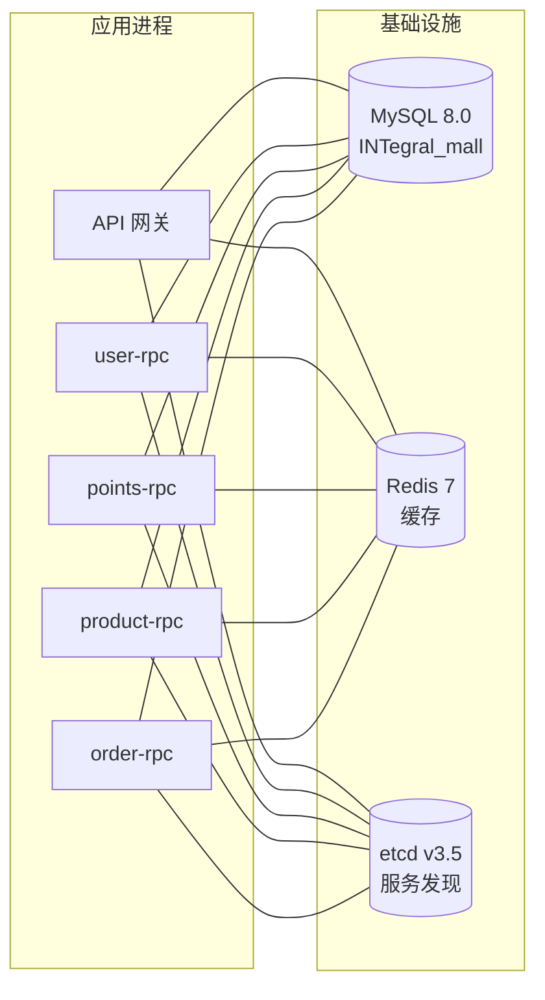
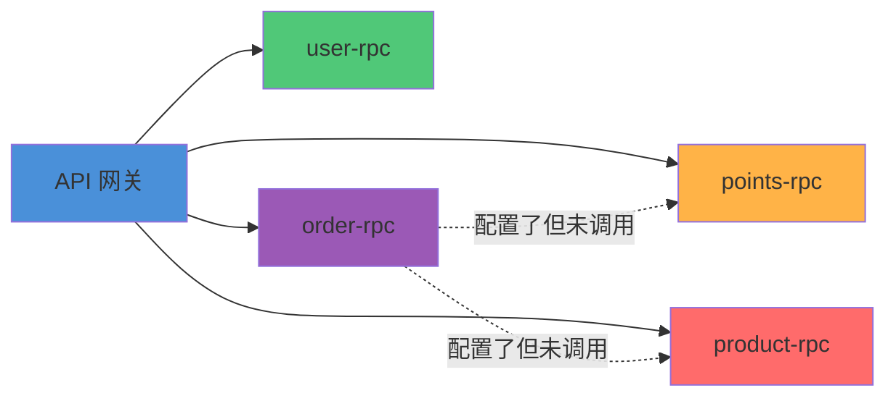
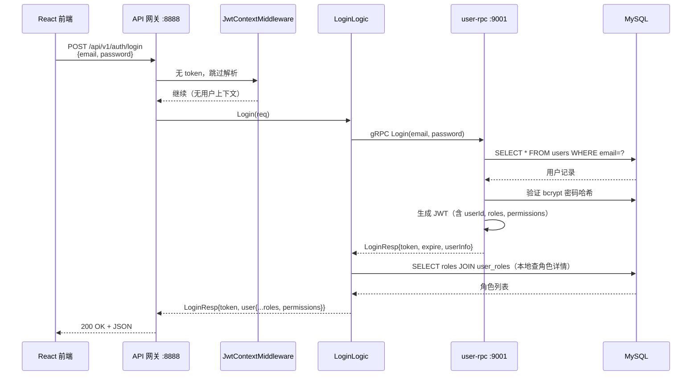

积分商城基于 **go-zero** 微服务框架构建，采用 **API 网关 + 四路 gRPC 服务** 的经典分层架构。一个 HTTP REST 网关作为唯一对外入口，通过 etcd 服务发现将请求路由到四个独立的 RPC 服务——用户、积分、商品、订单——每个服务拥有独立的 Proto 契约、端口和部署单元。本页将系统性地拆解这五个进程如何协作、如何发现彼此、以及跨服务事务如何在本地事务中安全完成。

Sources: [INTegralmall.go](app/api/INTegralmall.go#L1-L45), [go.mod](go.mod#L1-L16)

## 架构全景图

在深入每一层之前，先建立全局心智模型。下图展示了五个运行时进程及其核心依赖关系——实线箭头表示 gRPC 调用方向，虚线表示共享基础设施连接。

```mermaid
graph TB
    subgraph "客户端"
        Browser["React 前端<br/>:3000"]
    end

    subgraph "API 网关层"
        API["API Gateway<br/>:8888<br/>go-zero REST"]
        JWT_MW["JwtContextMiddleware"]
        Perm_MW["PermissionMiddleware"]
    end

    subgraph "RPC 服务层"
        UserRPC["user-rpc<br/>:9001<br/>认证 · 用户 · 角色 · 小组"]
        PointsRPC["points-rpc<br/>:9002<br/>规则 · 申请 · 审核 · AI评分 · 积分操作"]
        ProductRPC["product-rpc<br/>:9003<br/>商品管理 · 库存"]
        OrderRPC["order-rpc<br/>:9004<br/>订单生命周期"]
    end

    subgraph "基础设施"
        Etcd["etcd<br/>:2379"]
        MySQL["MySQL 8.0<br/>INTegral_mall"]
        Redis["Redis 7"]
    end

    Browser -->|"HTTP /api/v1/*" | API
    API --> JWT_MW --> Perm_MW
    API -->|"gRPC" | UserRPC
    API -->|"gRPC" | PointsRPC
    API -->|"gRPC" | ProductRPC
    API -->|"gRPC" | OrderRPC

    OrderRPC -.->|"FreezePoints<br/>ConfirmFrozen<br/>UnfreezePoints" | PointsRPC
    OrderRPC -.->|"DeductStock<br/>RestoreStock" | ProductRPC

    UserRPC --- Etcd
    PointsRPC --- Etcd
    ProductRPC --- Etcd
    OrderRPC --- Etcd
    API --- Etcd

    UserRPC --- MySQL
    PointsRPC --- MySQL
    ProductRPC --- MySQL
    OrderRPC --- MySQL
    API -.->|"RBAC 直连" | MySQL

    UserRPC --- Redis
    PointsRPC --- Redis
    ProductRPC --- Redis
    OrderRPC --- Redis
    API --- Redis

    style API fill:#4A90D9
    style UserRPC fill:#50C878
    style PointsRPC fill:#FFB347
    style ProductRPC fill:#FF6B6B
    style OrderRPC fill:#9B59B6
    style Etcd fill:#34495E
    style MySQL fill:#00758F
    style Redis fill:#DC382D
```



Sources: [docker-compose.yaml](deploy/docker-compose.yaml#L1-L263), [rpc-deployments.yaml](k8s/base/rpc-deployments.yaml#L1-L250)

## 五个运行时进程：职责与端口映射

系统由五个独立进程组成，每个进程在 Docker Compose 和 Kubernetes 中都有明确的端口分配和资源约束。下表汇总了每个进程的核心身份。

| 进程 | 类型 | 本地端口 | Docker 端口 | K8s 副本 | K8s 资源配额 | Proto 文件 |
|------|------|---------|------------|---------|------------|-----------|
| **api** | REST 网关 | `0.0.0.0:8888` | `8888` | 2 | 256Mi~512Mi | `INTegral.api` |
| **user-rpc** | gRPC 服务 | `0.0.0.0:9001` | `9001` | 2 | 128Mi~512Mi | `user.proto` + `role.proto` |
| **points-rpc** | gRPC 服务 | `0.0.0.0:9002` | `9002` | 2 | 256Mi~1Gi | `points.proto` |
| **product-rpc** | gRPC 服务 | `0.0.0.0:9003` | `9003` | 2 | 128Mi~512Mi | `product.proto` |
| **order-rpc** | gRPC 服务 | `0.0.0.0:9004` | `9004` | 2 | 128Mi~512Mi | `order.proto` |

值得注意的是 **points-rpc** 的资源配额最高（1Gi 上限），因为其内部集成了 AI 评分引擎，需要处理外部 HTTP 调用到 Anthropic/OpenAI 等提供商的请求与响应。**user-rpc** 和 **product-rpc** 作为纯 CRUD 服务，资源需求最低。

Sources: [INTegral_mall.yaml](app/api/etc/INTegral_mall.yaml#L1-L48), [docker-compose.yaml](deploy/docker-compose.yaml#L58-L215), [rpc-deployments.yaml](k8s/base/rpc-deployments.yaml#L1-L250)

## API 网关：请求的唯一入口

API 网关是整个系统的"前台接待"，所有前端 HTTP 请求经由 Nginx 反向代理到达 `:8888`。它的核心职责是 **协议转换**（HTTP → gRPC）、**身份验证**（JWT 解析与上下文注入）、以及 **权限守卫**（PermissionMiddleware）。

### 启动流程

网关的启动遵循 go-zero 的标准范式：加载配置 → 创建 REST 服务器 → 注册全局中间件 → 注册路由处理器 → 启动监听。一个关键的安全检查在启动时执行——如果 JWT 密钥仍是默认值则直接 panic，防止生产环境使用弱密钥。

```go
// 核心启动序列
server := rest.MustNewServer(c.RestConf)
httpx.SetErrorHandler(errx.ErrorHandler)          // 自定义错误处理器
ctx := svc.NewServiceContext(c)                     // 初始化 RPC 客户端
server.Use(ctx.JwtContextMiddleware.Handle)          // 全局 JWT 上下文中间件
handler.RegisterHandlers(server, ctx)               // 注册所有路由
server.Start()
```

### 中间件管道

每个请求经过两层中间件过滤。第一层是全局注册的 **JwtContextMiddleware**，它从 `Authorization: Bearer <token>` 头中解析 JWT，将 `userId`、`roles`、`permissions`、`isSuperAdmin` 写入 Go context，供下游 Logic 层读取。第二层是路由级中间件，包括 **PermissionMiddleware**（基于权限编码如 `page:admin:users`）和 **SuperAdminMiddleware**（仅允许超级管理员访问角色管理接口）。对于无需认证的路由（如 `/auth/login`），JWT 中间件安全跳过，不设置用户上下文。

Sources: [INTegralmall.go](app/api/INTegralmall.go#L19-L45), [jwt_context_middleware.go](app/api/INTernal/middleware/jwt_context_middleware.go#L14-L102)

### 路由分组与 RPC 调用映射

网关将 40+ 个 HTTP 端点组织为 14 个路由组，每组统一前缀 `/api/v1` 并绑定不同的中间件策略。下表展示了主要的业务域及其对应的 RPC 服务调用关系。

| 业务域 | 路由前缀 | 中间件 | 目标 RPC | 代表性端点 |
|--------|---------|--------|---------|-----------|
| 认证 | `/auth` | 无 | user-rpc | `POST /auth/login`, `POST /auth/register` |
| 用户资料 | `/users/profile` | JWT | user-rpc | `GET /users/profile`, `PUT /users/profile` |
| 用户管理 | `/users` | JWT + adminPerm | user-rpc | `GET /users`, `POST /users`, `PUT /users/:id/roles` |
| 小组管理 | `/groups` | JWT + groupPerm | user-rpc | `GET /groups`, `POST /groups`, `PUT /groups/:id` |
| 角色管理 | `/admin/roles` | JWT + superAdmin | user-rpc (RoleService) | `GET /admin/roles`, `POST /admin/roles` |
| 权限管理 | `/admin/permissions` | JWT | user-rpc (RoleService) | `GET /admin/permissions` |
| 积分规则 | `/rules` | JWT (+ rulePerm) | points-rpc | `GET /rules`, `POST /rules`, `PUT /rules/:id/disable` |
| 积分申请 | `/applications` | JWT | points-rpc | `POST /applications`, `GET /applications/:id` |
| 审核 | `/applications/:id/review` | JWT + reviewPerm | points-rpc | `POST /applications/:id/review` |
| 积分查询 | `/points` | JWT | points-rpc | `GET /points/balance`, `GET /points/transactions` |
| 商品 | `/products` | JWT (+ productPerm) | product-rpc | `GET /products`, `POST /products` |
| 订单 | `/orders` | JWT | order-rpc | `POST /orders`, `PUT /orders/:id/cancel` |
| 通知 | `/notifications` | JWT | 直连 DB | `GET /notifications`, `PUT /notifications/read-all` |
| 仪表盘 | `/dashboard` | JWT | 直连 DB | `GET /dashboard` |

**关键观察**：通知和仪表盘两个模块没有走 RPC 调用，而是在 API 网关层直接通过 Repository 操作数据库。这是一种务实的架构选择——通知属于聚合查询、仪表盘属于跨表统计，它们不涉及核心业务状态的变更，直接读 DB 避免了为这类"边缘"功能增加 RPC 方法。

Sources: [routes.go](app/api/INTernal/handler/routes.go#L28-L421)

## ServiceContext：依赖注入的神经中枢

每个进程都有一个 **ServiceContext** 结构体，充当该进程的依赖容器。API 网关的 ServiceContext 尤其重要——它同时持有四个 RPC 客户端的引用和六个本地 Repository。

```go
type ServiceContext struct {
    Config  config.Config
    Db      *gorm.DB           // MySQL 直连（用于 RBAC、通知等）
    Redis   *redis.Redis        // 缓存

    // RPC 客户端
    UserRpc    userservice.UserService       // user-rpc 客户端
    RoleRpc    RoleService                   // user-rpc 内的 RoleService
    PointsRpc  pointsservice.PointsService   // points-rpc 客户端
    ProductRpc productservice.ProductService // product-rpc 客户端
    OrderRpc   orderservice.OrderService     // order-rpc 客户端

    // 本地 Repository（API 网关直连 DB 用途）
    UserRepo, RoleRepo, GroupRepo,
    NotificationRepo, PermissionRepo, RolePermissionRepo  model.*
}
```

初始化时，`NewServiceContext` 通过 `zrpc.MustNewClient` 创建 RPC 客户端。**注意 `RoleRpc` 复用了 `c.UserRpc` 的 etcd 配置**——角色权限服务（RoleService）作为第二个 gRPC 服务注册在 user-rpc 进程内，共享同一个 etcd 服务键 `user.rpc`。这是一个精巧的设计：角色权限在业务上属于用户域，但在代码层面拆分为独立的 Proto 文件和 Server，保持了关注点分离。

Sources: [service_context.go](app/api/INTernal/svc/service_context.go#L19-L70), [role_service.go](app/api/INTernal/svc/role_service.go#L13-L32)

## 四路 RPC 服务：契约与职责边界

每个 RPC 服务的边界由其 `.proto` 文件严格定义。下面逐一分析四个服务的契约设计、方法数量和依赖关系。

### user-rpc：身份与组织管理中枢

user-rpc 承载了两个 gRPC 服务——`UserService`（12 个方法）和 `RoleService`（8 个方法），在同一个 `:9001` 端口上通过同一个 gRPC Server 暴露。它的职责范围涵盖：

- **认证**：Login / Register（含 JWT 生成）
- **用户管理**：Get / List / Create / UpdateProfile
- **角色分配**：AssignRoles
- **小组管理**：List / Create / Update / Delete / AssignGroups
- **后台角色 CRUD**：CreateRole / UpdateRole / DeleteRole / GetRole / ListRoles
- **权限管理**：AssignRolePermissions / GetRolePermissions / ListPermissions

user-rpc 是一个**纯叶节点**——它不依赖任何其他 RPC 服务，内部只使用 MySQL（GORM）和 Redis。它的 ServiceContext 包含 UserRepository、RoleRepository、GroupRepository 等五个 Repository 以及一个 JWT 工具。

Sources: [user.proto](app/rpc/user/user.proto#L220-L254), [role.proto](app/rpc/user/role.proto#L89-L103), [user.go](app/rpc/user/user.go#L36-L43)

### points-rpc：积分生命周期的完整闭环

points-rpc 拥有系统中最庞大的 Proto 契约——`PointsService` 包含 **19 个方法**，横跨四个业务子域：

| 子域 | 方法 | 说明 |
|------|------|------|
| 积分规则 | CreateRule, UpdateRule, DisableRule, EnableRule, GetRule, ListRules, GetRuleHistory | 规则版本快照与生命周期管理 |
| 积分申请 | SubmitApplication, GetApplication, ListApplications, ResubmitApplication, TriggerAIScore | 提交 → AI 评分 → 审核流水线 |
| 审核 | ListPendingReviews, ReviewApplication | 双级审核机制 |
| 积分账户 | GetBalance, ListTransactions | 查询 |
| 积分操作 | FreezePoints, ConfirmFrozenPoints, UnfreezePoints | **供 order-rpc 调用** |

最后三个方法（Freeze / ConfirmFrozen / Unfreeze）在 Proto 注释中明确标注为"供 order.rpc 调用"，这是**跨服务契约**的体现。points-rpc 同样是叶节点，但它额外集成了 AI 评分引擎（`AiScorer`），支持 Anthropic 和 OpenAI 两个提供商，这也是其资源配额最高的原因。

Sources: [points.proto](app/rpc/points/points.proto#L256-L309), [service_context.go](app/rpc/points/INTernal/svc/service_context.go#L14-L35)

### product-rpc：商品与库存管理

product-rpc 是最轻量的服务，`ProductService` 仅有 **7 个方法**。前 5 个是标准的 CRUD 操作，后 2 个是库存操作：

- `DeductStock(product_id, quantity)` — 扣减库存
- `RestoreStock(product_id, quantity)` — 恢复库存

这两个方法同样标注为"供 order.rpc 调用"，与 points-rpc 的积分冻结/解冻方法形成互补。product-rpc 的 ServiceContext 极其简洁——只有一个 `ProductRepository`，是所有服务中依赖最少的。

Sources: [product.proto](app/rpc/product/product.proto#L64-L88), [service_context.go](app/rpc/product/INTernal/svc/service_context.go#L12-L35)

### order-rpc：事务编排者

order-rpc 是四个服务中**唯一依赖其他 RPC 服务**的服务。它的 ServiceContext 同时持有 `PointsRpc` 和 `ProductRpc` 客户端：

```go
type ServiceContext struct {
    // RPC 客户端
    PointsRpc  pointsservice.PointsService
    ProductRpc productservice.ProductService
    // ...
}
```

然而，这里有一个重要的架构细节值得深入理解。

Sources: [order config.go](app/rpc/order/INTernal/config/config.go#L8-L22), [order service_context.go](app/rpc/order/INTernal/svc/service_context.go#L17-L35)

## 跨服务调用模式：RPC 预留 vs 本地事务

这是本系统架构中最值得关注的模式。尽管 order-rpc 配置了 `PointsRpc` 和 `ProductRpc` 客户端，但在实际的 `CreateOrder` 逻辑中，它**并没有调用这些 RPC**。

### 实际的 CreateOrder 实现

订单创建在 order-rpc 内部通过一个**单数据库事务**完成所有操作：行锁读取商品 → 行锁读取积分账户 → 冻结积分 → 扣减库存 → 创建订单 → 写入积分流水。全部六步在同一个 `gorm.Transaction` 回调中执行。

```go
// 简化的核心流程
l.svcCtx.Db.Transaction(func(tx *gorm.DB) error {
    // 1. 行锁读取商品（SELECT ... FOR UPDATE）
    tx.Clauses(clause.Locking{Strength: "UPDATE"}).First(&productModel, in.ProductId)
    // 2. 行锁读取积分账户（SELECT ... FOR UPDATE）
    tx.Clauses(clause.Locking{Strength: "UPDATE"}).Where("user_id = ?", in.UserId).First(&account)
    // 3. 冻结积分（available -= cost, frozen += cost）
    // 4. 扣减库存（stock--），若 stock==0 则标记售罄
    // 5. 创建订单
    // 6. 写入积分流水
})
```

这种设计意味着 order-rpc 直接操作了 `points_accounts` 和 `products` 两张在概念上属于其他服务"领域"的表。之所以可行，是因为 **所有四个 RPC 服务连接同一个 MySQL 数据库**（`INTegral_mall`），而本地事务能保证 ACID 语义——这是跨服务 RPC 调用无法做到的。

### 两种模式的对比

| 维度 | RPC 调用模式（预留） | 本地事务模式（实际） |
|------|---------------------|---------------------|
| **一致性** | 最终一致（需补偿/Saga） | 强一致（数据库 ACID） |
| **延迟** | 多次网络往返 | 单次事务提交 |
| **复杂度** | 需要幂等、重试、补偿逻辑 | 标准 SQL 事务 |
| **耦合度** | 低（服务边界清晰） | 高（直接操作他服务的表） |
| **可扩展性** | 易于拆分数据库 | 需要共库 |

Proto 文件中的 `FreezePoints`、`DeductStock` 等方法属于**架构预留**——为未来数据库分库（Database per Service）场景准备的契约。当前单体数据库阶段，本地事务是最务实的选择。当业务增长到需要独立数据库时，只需将事务内的直接 SQL 替换为 RPC 调用，Proto 契约已经就绪。

Sources: [create_order_logic.go](app/rpc/order/INTernal/logic/orderservice/create_order_logic.go#L33-L126), [order.yaml](app/rpc/order/etc/order.yaml#L19-L30)

## etcd 服务发现：动态注册与键名约定

所有 RPC 服务通过 **etcd** 实现服务注册与发现。每个 RPC 服务启动时向 etcd 注册自己的地址，API 网关和 order-rpc 通过 etcd 查找目标服务的可用实例。

### 服务键映射

| etcd 键 | 提供者 | 消费者 |
|---------|-------|--------|
| `user.rpc` | user-rpc (`:9001`) | API 网关、（同时注册 RoleService） |
| `points.rpc` | points-rpc (`:9002`) | API 网关、order-rpc |
| `product.rpc` | product-rpc (`:9003`) | API 网关、order-rpc |
| `order.rpc` | order-rpc (`:9004`) | API 网关 |

API 网关的配置文件中，四个 RPC 客户端均指向同一个 etcd 集群（`127.0.0.1:2379`），通过不同的 Key 区分服务。这意味着新增 RPC 实例时，只要注册到相同的 Key 下，客户端会自动发现新实例——这是 go-zero 内置的客户端负载均衡机制。

Sources: [INTegral_mall.yaml](app/api/etc/INTegral_mall.yaml#L19-L42), [order.yaml](app/rpc/order/etc/order.yaml#L4-L8)

## 共享基础设施：MySQL、Redis 与 etcd

三个基础设施组件被所有进程共享：



**MySQL** 使用单一数据库 `INTegral_mall`，所有服务共享同一连接串。数据库 Schema 包含 14 张核心表（参见 [数据库设计](4-shu-ju-ku-she-ji-14-zhang-he-xin-biao-de-guan-lian-yu-yue-shu)），通过 GORM 的自动迁移机制统一管理。

**Redis** 主要用于会话缓存和热数据缓存，每个 ServiceContext 都初始化了 `redis.MustNewRedis(c.CacheRedis)`。

**etcd** 同时承担两个角色：服务注册（RPC 服务端）和服务发现（RPC 客户端 + API 网关）。在 Kubernetes 环境中，etcd 部署为 StatefulSet（参见 [Kubernetes 生产部署](26-kubernetes-sheng-chan-bu-shu-kustomize-overlay-yu-ci-cd-liu-shui-xian)）。

Sources: [docker-compose.yaml](deploy/docker-compose.yaml#L1-L57), [schema.sql](deploy/schema.sql#L1-L1)

## 服务间依赖关系图

从依赖方向看，系统形成了一个清晰的**星型 + 链式混合拓扑**：



- **user-rpc**：零依赖叶节点，承载认证与组织架构
- **points-rpc**：零依赖叶节点，承载积分全生命周期
- **product-rpc**：零依赖叶节点，最轻量的服务
- **order-rpc**：配置了对 points-rpc 和 product-rpc 的依赖（当前为预留）
- **API 网关**：依赖所有四个 RPC 服务，同时直连 MySQL 处理通知和仪表盘

这种拓扑确保了 **没有循环依赖**，服务可以按 user → product → points → order → api 的顺序独立启动。Docker Compose 的 `depends_on` 配置也遵循了这个顺序。

Sources: [docker-compose.yaml](deploy/docker-compose.yaml#L176-L206), [Makefile](Makefile#L1-L36)

## 从请求到响应：一次完整的跨服务调用

以 **登录流程** 为例，追踪一个 HTTP 请求如何穿越多个层级：



登录是一个**纯 user-rpc 调用**加一个**本地 DB 补充查询**的组合。API 网关的 LoginLogic 先调用 `UserRpc.Login()` 获取 token 和基础用户信息，再通过本地 `RoleRepo.FindUserRoles()` 补充角色详情（code + name），最终组装完整的响应。这种"RPC 获取核心数据 + 本地 DB 补充"的模式在系统中广泛使用。

Sources: [login_logic.go](app/api/INTernal/logic/auth/login_logic.go#L28-L62)

## 进程启动顺序与依赖编排

五个进程的启动顺序由 Docker Compose 的 `depends_on: condition: service_healthy` 严格编排。健康检查使用 TCP 端口探测（`nc -z localhost <port>`），确保服务真正就绪后才标记为 healthy。

```
启动顺序（自底向上）：
1. MySQL + Redis + etcd（基础设施，并行启动）
2. user-rpc（等待基础设施 healthy）
3. product-rpc（等待基础设施 healthy）
4. points-rpc（等待基础设施 healthy）
5. order-rpc（等待基础设施 healthy）
6. API 网关（等待所有 RPC 服务 healthy）
7. Frontend（等待 API 网关 healthy）
```

本地开发时可通过 `make run` 一键启动全部服务，或通过 `make reload-order-rpc` 等命令单独重启某个服务。

Sources: [docker-compose.yaml](deploy/docker-compose.yaml#L58-L215), [Makefile](Makefile#L17-L36)

## 延伸阅读

本页建立了微服务架构的整体认知。以下页面将带你深入每个子系统：

- **[Handler / Logic / ServiceContext 三层架构与依赖注入](14-handler-logic-servicecontext-san-ceng-jia-gou-yu-yi-lai-zhu-ru)** — 深入理解 API 网关内部的请求处理流水线
- **[JWT 认证中间件与上下文传递机制](12-jwt-ren-zheng-zhong-jian-jian-yu-shang-xia-wen-chuan-di-ji-zhi)** — JWT 从签发到上下文注入的完整链路
- **[兑换订单：积分冻结、库存扣减与事务一致性保障](8-dui-huan-ding-dan-ji-fen-dong-jie-ku-cun-kou-jian-yu-shi-wu-zhi-xing-bao-zhang)** — order-rpc 事务编排的详细分析
- **[数据库设计：14 张核心表的关联与约束](4-shu-ju-ku-she-ji-14-zhang-he-xin-biao-de-guan-lian-yu-yue-shu)** — 共享数据库的表结构与领域归属
- **[Docker Compose 本地开发环境配置详解](25-docker-compose-ben-di-kai-fa-huan-jing-pei-zhi-xiang-jie)** — 完整的容器编排与配置