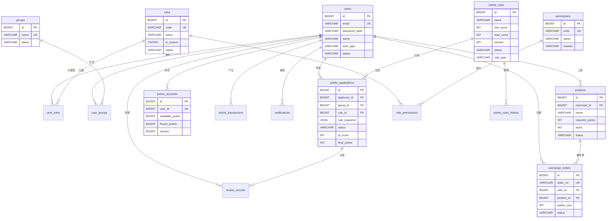

积分商城的数据库以 MySQL 8.0+ 为引擎，采用 `utf8mb4` 字符集，围绕"积分获取 → 审核 → 消费"的核心业务闭环设计。Schema 在 [schema.sql](deploy/schema.sql) 中以 14 个编号段落定义了 16 张物理表（其中权限系统的 `permissions` 和 `role_permissions` 以子节形式补充），覆盖用户身份、RBAC 权限、积分申请审核、积分账户流水、商品兑换五大业务域。每张表都通过 GORM 模型结构体在 Go 代码侧获得类型安全的映射，`AutoMigrate` 函数负责自动建表，`SeedData` 函数负责初始化系统角色、权限和管理员账户。

Sources: [schema.sql](deploy/schema.sql#L1-L11), [migrate.go](model/migrate.go#L27-L46)

## 全局 ER 关系图

在深入每张表之前，先通过全局实体关系图理解 16 张表之间的外键依赖与业务流向。下图展示了五个业务域的表如何通过 `users` 表作为核心枢纽连接——几乎所有业务表的外键都指向 `users.id`，形成了以用户为中心的星型拓扑。

Sources: [schema.sql](deploy/schema.sql#L16-L318)

## 五大业务域拆解

按照职责内聚原则，16 张表可以归入五个业务域。下表给出每个域的核心表、辅助表以及表间的关联模式，帮助你在代码导航时快速定位。

| 业务域 | 核心表 | 辅助/关联表 | 关联模式 |
|--------|--------|-------------|----------|
| **用户与权限** | `users` | `roles`, `user_roles`, `permissions`, `role_permissions`, `groups`, `user_groups` | 用户 ←M:N→ 角色 ←M:N→ 权限；用户 ←M:N→ 小组 |
| **积分规则** | `points_rules` | `points_rules_history` | 规则 1:N 历史版本（快照模式） |
| **申请与审核** | `points_applications` | `review_records` | 申请 1:N 审核记录（双级审核链） |
| **积分账户** | `points_accounts` | `points_transactions` | 账户 1:N 流水（乐观锁 + 冻结机制） |
| **商品与订单** | `products` | `exchange_orders` | 商品 1:N 订单（快照 + 库存扣减） |

Sources: [migrate.go](model/migrate.go#L28-L45), [status.go](pkg/consts/status.go#L1-L45), [types.go](pkg/consts/types.go#L1-L53)

## 域一：用户与 RBAC 权限（7 张表）

这是表数量最多的域，构成了系统的身份基石。设计采用经典 RBAC 五表模型：`users` → `user_roles` → `roles` → `role_permissions` → `permissions`，加上 `groups` 和 `user_groups` 实现组织维度的数据隔离。

### users — 用户表

`users` 是全局外键最密集的表，被 9 张其他表引用。核心字段包括 `email`（唯一键，作为登录标识）、`password_hash`（LDAP 用户为 NULL）、`auth_type`（区分 `local` 和 `ldap` 认证）、`status`（`active`/`disabled`）。`email` 上的 `uk_users_email` 唯一索引保证了公司邮箱的唯一性约束，而 `idx_users_auth_type` 索引则服务于按认证类型筛选用户的管理场景。

Sources: [schema.sql](deploy/schema.sql#L16-L29), [user.go](model/user.go#L9-L22)

### roles — 角色表

系统预置了 6 个内置角色，通过 `is_system = 1` 标记为不可删除。`code` 字段使用英文编码（如 `super_admin`、`reviewer`、`merchant`），在代码中通过 `pkg/consts/types.go` 的常量引用，确保数据库层与业务层的枚举一致性。`sort_order` 字段控制前端展示顺序，`status` 字段支持软禁用而不破坏已有关联。

Sources: [schema.sql](deploy/schema.sql#L34-L53), [role.go](model/role.go#L6-L18), [types.go](pkg/consts/types.go#L18-L25)

### permissions 与 role_permissions — 权限五表模型的后半段

`permissions` 的 `code` 字段采用 `模块:操作` 的命名规范（如 `page:dashboard`、`review:group`、`page:admin:users`），`module` 字段用于前端按模块分组展示。`role_permissions` 是角色与权限的 M:N 关联表，通过复合唯一键 `uk_role_permissions(role_id, permission_id)` 保证不重复分配。值得注意的是，`super_admin` 角色不在此表中分配权限——它在业务层通过 `is_super_admin` 标记直接跳过权限检查。

Sources: [schema.sql](deploy/schema.sql#L72-L95), [role.go](model/role.go#L31-L52), [migrate.go](model/migrate.go#L86-L155)

### groups 与 user_groups — 组织隔离

`groups` 表相对轻量，只包含 `name`（唯一）、`description`、`status` 三个业务字段。`user_groups` 的复合唯一键 `uk_user_groups(user_id, group_id)` 确保用户不会重复加入同一小组。小组维度的数据隔离是审核流程的关键：**小组审核员（reviewer）只能审核本组成员的积分申请**，这一约束在 `ListByGroupIDs` 查询方法中通过 `WHERE group_id IN ?` 实现。

Sources: [schema.sql](deploy/schema.sql#L100-L122), [group.go](model/group.go#L6-L25), [points_repository.go](model/points_repository.go#L177-L199)

## 域二：积分规则与版本快照（2 张表）

积分规则是申请审核的评分基准，也是 AI 评分引擎的输入源。设计上采用了**主表 + 历史版本表**的快照模式，确保已提交的积分申请引用的规则不会被后续修改覆盖。

### points_rules — 积分规则表

每条规则定义了一个评分区间（`min_score` ~ `max_score`）、评分标准（`scoring_criteria`，JSON 格式）、适用行为描述（`applicable_behavior`）以及规则类型（`rule_type`：`bonus` 加分 / `penalty` 扣分）。`version` 字段从 1 开始自增，每次更新规则时 +1。`created_by` 外键指向 `users(id)`，记录规则的创建者。增强字段 `category`、`sub_category`、`applicable_roles` 支持按大类、子类型和岗位进行规则筛选——这些字段通过增量迁移脚本 `003_add_points_rules_enhancement.sql` 加入，体现了 Schema 演进的实际路径。

Sources: [schema.sql](deploy/schema.sql#L127-L146), [points_rule.go](model/points_rule.go#L9-L28), [003_add_points_rules_enhancement.sql](deploy/migrations/archive/003_add_points_rules_enhancement.sql#L16-L21)

### points_rules_history — 规则快照表

`SnapshotRule` 方法在每次规则更新前，将当前规则的完整字段复制到 `points_rules_history` 中，记录 `version` 和 `snapshot_at` 时间戳。外键 `fk_rules_history_rule` 使用 `ON DELETE CASCADE`，确保规则删除时其历史版本一并清理。快照的存在使得积分申请中的 `rule_snapshot` JSON 字段可以与历史版本交叉验证，实现完整的审计追溯。

Sources: [schema.sql](deploy/schema.sql#L151-L168), [points_rule.go](model/points_rule.go#L31-L48), [points_repository.go](model/points_repository.go#L84-L100)

## 域三：积分申请与双级审核（2 张表）

这是业务逻辑最复杂的域。积分申请经历 `pending_ai_review → pending_group_review → pending_final_review → approved/rejected` 四阶段状态机，每一阶段的转换都由 `review_records` 表记录审核轨迹。

### points_applications — 积分申请表

这张表承载了申请的全部生命周期数据，字段设计体现了**多角色协作**的特征：`applicant_id`（申请人）、`group_id`（所属小组，决定哪位审核员有权审核）、`rule_id`（评分依据）三个外键定义了申请的上下文；AI 评分结果存储在 `ai_score`、`ai_match_rate`、`ai_reasoning`、`ai_scored_at`、`ai_available` 五个字段中，均使用 `sql.Null*` 类型以区分"尚未评分"和"评了 0 分"；`rule_snapshot` 以 JSON 类型保存规则提交时刻的快照，防止规则后续变更影响已有申请的评分基准。索引策略覆盖了三个高频查询路径：按申请人查询（`idx_applications_applicant`）、按小组+状态联合查询（`idx_applications_group_status`）、按状态查询（`idx_applications_status`）。

Sources: [schema.sql](deploy/schema.sql#L173-L203), [points_application.go](model/points_application.go#L11-L33)

### review_records — 审核记录表

`review_level` 字段区分两级审核：`group_review`（小组审核员审核）和 `final_review`（总复核员复核）。`action` 字段记录三种操作：`approve`（通过）、`reject`（拒绝）、`adjust_approve`（调整分数后通过），后者的 `original_points` 和 `adjusted_points` 字段会记录调整前后的分数差异。`fk_review_records_application` 使用 `ON DELETE CASCADE`，因为申请删除后其审核记录无独立存在的意义。查询时按 `created_at ASC` 排序，可以还原审核的时间线顺序。

Sources: [schema.sql](deploy/schema.sql#L208-L222), [review_record.go](model/review_record.go#L9-L21), [types.go](pkg/consts/types.go#L28-L38)

## 域四：积分账户与流水（2 张表）

积分账户是整个系统的"金融核心"，设计上采用了**乐观锁 + 行锁双重保障**以及**可用/冻结双余额**模型，确保积分兑换场景下的并发安全。

### points_accounts — 积分账户表

每个用户最多一个账户（`uk_points_accounts_user` 唯一约束）。`available_points` 和 `frozen_points` 分别表示可用和冻结的积分数量，`total_earned` 和 `total_spent` 记录累计获取和消费。`version` 字段用于乐观锁控制，但在实际实现中，Repository 层的 `FreezePoints`、`UnfreezePoints`、`ConfirmFrozen` 方法采用了更强的 `SELECT ... FOR UPDATE` 行级锁配合事务，确保积分冻结→消费→解冻的原子性。

Sources: [schema.sql](deploy/schema.sql#L227-L239), [points_account.go](model/points_account.go#L6-L18), [points_account_repository.go](model/points_account_repository.go#L71-L122)

### points_transactions — 积分流水表

这张表是积分账户的 append-only 事件日志。`type` 字段区分四种操作类型（`earn`/`freeze`/`unfreeze`/`spend`），`amount` 字段存储变动数量（正数获取、负数消费），`balance_after` 记录变动后的可用余额快照。`source_type` 和 `source_id` 实现了多态关联——一笔流水可以来源于积分申请（`application`）或兑换订单（`exchange_order`），`FindBySource` 方法正是通过这两个字段实现幂等性检查：防止同一笔业务重复发放或扣除积分。

Sources: [schema.sql](deploy/schema.sql#L244-L258), [points_account.go](model/points_account.go#L20-L33), [points_account_repository.go](model/points_account_repository.go#L144-L155)

## 域五：商品与兑换订单（2 张表）

### products — 商品表

`merchant_id` 外键指向 `users(id)`，标识商品的商家。`required_points` 定义兑换所需积分，`stock` 跟踪库存数量。`DeductStock` 方法使用 `WHERE stock >= ?` 条件更新实现原子化的库存扣减，避免了超卖风险——当 `RowsAffected == 0` 时返回 `CodeStockInsufficient` 错误。`RestoreStock` 方法在订单取消时回补库存。`status` 字段管理商品生命周期：`on_sale`（在售）→ `off_sale`（下架）→ `sold_out`（售罄）。

Sources: [schema.sql](deploy/schema.sql#L280-L294), [product.go](model/product.go#L6-L19), [business_repository.go](model/business_repository.go#L128-L145)

### exchange_orders — 兑换订单表

订单表通过 `product_snapshot` JSON 字段保存下单时刻的商品信息（名称、图片、积分价格），这与积分申请中的 `rule_snapshot` 是同一设计模式——**在关键业务节点冻结关联数据的快照**，确保即使商品后续被修改或下架，订单历史仍然完整可追溯。`order_no` 使用唯一键 `uk_orders_order_no` 保证全局唯一，由雪花算法生成。一个订单关联三个用户维度的外键：`user_id`（兑换者）、`product_id`（商品）、`merchant_id`（商家），形成三角关联。

Sources: [schema.sql](deploy/schema.sql#L299-L318), [exchange_order.go](model/exchange_order.go#L11-L25)

## 域六：通知系统（1 张表）

### notifications — 通知消息表

通知表服务于所有业务域的消息推送，通过 `biz_type` 字段实现多态关联：`application`（申请状态变更）、`review`（审核结果通知）、`points`（积分到账通知）、`order`（订单状态变更）。`biz_id` 字段存储关联业务实体的 ID。复合索引 `idx_notifications_user_read(user_id, is_read)` 专门优化了"未读消息数量查询"这一高频操作，`idx_notifications_user_created(user_id, created_at DESC)` 则服务于消息列表按时间倒序分页展示。`fk_notifications_user` 使用 `ON DELETE CASCADE`，用户删除时自动清理通知。

Sources: [schema.sql](deploy/schema.sql#L263-L275), [notification.go](model/notification.go#L6-L17), [types.go](pkg/consts/types.go#L47-L52)

## 外键约束策略总结

Schema 中的外键约束采用了**差异化的级联策略**，下表梳理了全部 16 条外键及其级联行为，这是理解数据删除行为的关键参考。

| 外键名称 | 所在表 | 引用表 | 级联行为 | 设计理由 |
|----------|--------|--------|----------|----------|
| `fk_user_roles_user` | `user_roles` | `users` | `ON DELETE CASCADE` | 用户删除时清除角色关联 |
| `fk_user_roles_role` | `user_roles` | `roles` | `ON DELETE CASCADE` | 角色删除时清除用户关联 |
| `fk_rp_role` | `role_permissions` | `roles` | `ON DELETE CASCADE` | 角色删除时清除权限映射 |
| `fk_rp_permission` | `role_permissions` | `permissions` | `ON DELETE CASCADE` | 权限删除时清除角色映射 |
| `fk_user_groups_user` | `user_groups` | `users` | `ON DELETE CASCADE` | 用户删除时清除小组关联 |
| `fk_user_groups_group` | `user_groups` | `groups` | `ON DELETE CASCADE` | 小组删除时清除用户关联 |
| `fk_points_rules_created_by` | `points_rules` | `users` | 无级联 | 创建人删除不级联删除规则 |
| `fk_rules_history_rule` | `points_rules_history` | `points_rules` | `ON DELETE CASCADE` | 规则删除时清除历史版本 |
| `fk_applications_applicant` | `points_applications` | `users` | 无级联 | 申请人删除不级联删除申请 |
| `fk_applications_group` | `points_applications` | `groups` | 无级联 | 小组删除不级联删除申请 |
| `fk_applications_rule` | `points_applications` | `points_rules` | 无级联 | 规则删除不级联删除申请 |
| `fk_review_records_application` | `review_records` | `points_applications` | `ON DELETE CASCADE` | 申请删除时清除审核记录 |
| `fk_review_records_reviewer` | `review_records` | `users` | 无级联 | 审核人删除不级联删除记录 |
| `fk_points_accounts_user` | `points_accounts` | `users` | 无级联 | 账户不随用户删除 |
| `fk_transactions_user` | `points_transactions` | `users` | 无级联 | 流水记录永久保留 |
| `fk_notifications_user` | `notifications` | `users` | `ON DELETE CASCADE` | 用户删除时清除通知 |
| `fk_products_merchant` | `products` | `users` | 无级联 | 商家删除不级联删除商品 |
| `fk_orders_user` | `exchange_orders` | `users` | 无级联 | 订单永久保留 |
| `fk_orders_product` | `exchange_orders` | `products` | 无级联 | 订单快照已保存商品信息 |
| `fk_orders_merchant` | `exchange_orders` | `users` | 无级联 | 商家信息独立于订单 |

一个清晰的模式浮现出来：**关联表（user_roles、role_permissions、user_groups、points_rules_history、review_records、notifications）普遍使用 CASCADE**，因为它们的生命周期从属于父实体；**业务主表（points_applications、points_accounts、points_transactions、exchange_orders）一律不使用 CASCADE**，因为它们是审计和财务数据，必须独立于用户/规则的删除而持久存在。

Sources: [schema.sql](deploy/schema.sql#L58-L318)

## 索引策略分析

Schema 共定义了 30+ 个索引，可以分为三类：**唯一约束索引**（保证数据完整性）、**外键索引**（加速 JOIN 查询）、**业务查询索引**（优化高频查询路径）。

| 索引类型 | 示例 | 用途 |
|----------|------|------|
| **唯一约束** | `uk_users_email`, `uk_orders_order_no`, `uk_points_accounts_user` | 防止重复数据，同时加速等值查找 |
| **复合唯一** | `uk_user_roles(user_id, role_id)`, `uk_user_groups(user_id, group_id)` | M:N 关联表去重，避免重复分配 |
| **复合业务索引** | `idx_applications_group_status(group_id, status)`, `idx_notifications_user_read(user_id, is_read)` | 覆盖最频繁的"按用户/组 + 状态"联合筛选 |
| **单列筛选索引** | `idx_applications_status`, `idx_products_status`, `idx_orders_status` | 状态枚举值区分度低但查询频率高 |
| **排序索引** | `idx_notifications_user_created(user_id, created_at DESC)` | 分页列表按时间倒序展示 |

Sources: [schema.sql](deploy/schema.sql#L16-L318)

## Schema 演进机制

项目采用**双轨 Schema 管理**策略：`deploy/schema.sql` 是全量 DDL，用于全新环境的一键初始化；`deploy/migrations/archive/` 目录存放增量迁移脚本，用于已运行环境的在线升级。例如 `003_add_points_rules_enhancement.sql` 为规则表追加了 `rule_type`、`category`、`sub_category`、`applicable_roles`、`updated_by` 五个字段——当这些字段被合并到主 `schema.sql` 后，迁移脚本的注释明确标注"【已合并到 schema.sql】新环境无需执行此迁移"。

在应用启动侧，GORM 的 `AutoMigrate` 方法会在每次启动时检查模型定义与实际表结构的差异，自动追加缺失的列和索引——这是一种便捷但力度较轻的同步机制，适合开发环境快速迭代，生产环境的结构变更仍应通过显式迁移脚本控制。

Sources: [migrate.go](model/migrate.go#L27-L46), [003_add_points_rules_enhancement.sql](deploy/migrations/archive/003_add_points_rules_enhancement.sql#L1-L35)

## 种子数据与初始状态

`SeedData` 函数在首次启动时执行，幂等地创建以下初始数据：

| 数据类型 | 数量 | 关键内容 |
|----------|------|----------|
| 系统角色 | 6 个 | `super_admin`, `admin`, `participant`, `reviewer`, `chief_reviewer`, `merchant` |
| 系统权限 | 16 项 | `page:dashboard` ~ `page:admin:roles`，按 common/review/admin 三模块分组 |
| 角色权限映射 | 5 组 | 每个非超管角色分配对应的权限编码集 |
| 默认管理员 | 1 个 | `admin@company.com`（密码: `admin123`），分配所有角色 |
| 默认小组 | 3 个 | A组、B组、C组 |

E2E 测试环境通过 `deploy/seeds/seed-e2e.sql` 额外创建 8 个测试用户、2 个测试小组、5 个商品（含限量/售罄场景）和 4 个不同状态的积分申请，覆盖了完整的业务状态空间。

Sources: [migrate.go](model/migrate.go#L49-L200), [seed-e2e.sql](deploy/seeds/seed-e2e.sql#L1-L200)

## 设计模式总结

回顾 16 张表的设计，三个反复出现的架构模式值得关注：

**快照模式**：`points_applications.rule_snapshot`、`exchange_orders.product_snapshot`、`points_rules_history` 都在关键业务节点冻结关联数据的完整副本。这确保了业务记录的历史一致性——即使原始数据被修改或删除，关联实体的快照仍然完整。

**乐观锁 + 行锁混合模式**：`points_accounts` 的 `version` 字段声明了乐观锁意图，但实际实现中采用了 `SELECT ... FOR UPDATE` 的悲观行锁。这种混合策略在高并发积分操作场景下提供了更强的隔离保证。

**多态关联模式**：`points_transactions.source_type` + `source_id`、`notifications.biz_type` + `biz_id` 都通过类型字段 + ID 字段的组合实现了多态外键。这在关系型数据库中是一种常见的折中方案——牺牲了声明式外键约束，换取了业务灵活性。

Sources: [points_application.go](model/points_application.go#L11-L33), [exchange_order.go](model/exchange_order.go#L11-L25), [points_account_repository.go](model/points_account_repository.go#L71-L122), [points_account.go](model/points_account.go#L20-L33), [notification.go](model/notification.go#L6-L17)

---

**下一步阅读**：理解了数据库结构后，建议按以下顺序深入：
- 了解 GORM 模型如何映射这些表 → [GORM 模型定义与 Repository 模式](20-gorm-mo-xing-ding-yi-yu-repository-mo-shi)
- 关注积分账户的并发控制实现 → [乐观锁机制：积分账户的并发安全控制](21-le-guan-suo-ji-zhi-ji-fen-zhang-hu-de-bing-fa-an-quan-kong-zhi)
- 追踪积分申请的完整生命周期 → [积分申请全流程：提交 → AI 评分 → 双级审核 → 积分发放](6-ji-fen-shen-qing-quan-liu-cheng-ti-jiao-ai-ping-fen-shuang-ji-shen-he-ji-fen-fa-fang)