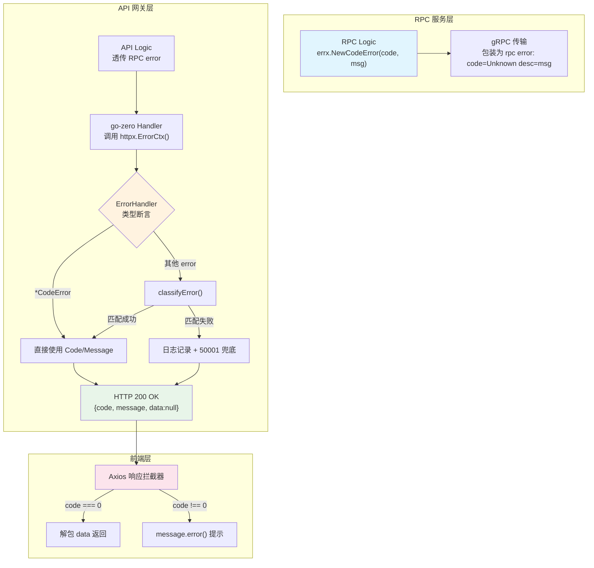

积分商城采用**五段式错误码**与**统一 JSON 信封**构成端到端的错误处理体系。从 RPC Logic 层抛出的 `CodeError`，经由 gRPC 传输、API 网关自动解包分类、最终以 `{ code, message, data }` 格式到达前端 Axios 拦截器——整条链路无需业务代码手动编解码。本文将从编码规范、传播机制、前端适配三个维度拆解这套体系的实现原理与使用方式。

Sources: [code.go](pkg/errx/code.go#L1-L57), [error.go](pkg/errx/error.go#L1-L128)

## 错误码分层设计：仿 HTTP 语义的五位编码

错误码采用 `XXYYZ` 的五位数字结构，前两位对标 HTTP 状态码语义，后三位提供细粒度区分。这种设计让开发者仅凭码值前缀即可判断错误大类，而不需要查阅文档。

| 码段范围 | 类别 | 典型场景 | HTTP 隐喻 |
|---------|------|---------|----------|
| `0` | 成功 | 业务正常完成 | 200 OK |
| `40001`–`40099` | 参数校验错误 | 缺少必填字段、格式非法 | 400 Bad Request |
| `40101`–`40199` | 认证错误 | Token 过期、密码错误 | 401 Unauthorized |
| `40301`–`40399` | 权限错误 | 角色不足、系统角色保护 | 403 Forbidden |
| `40401`–`40499` | 资源不存在 | 用户/规则/商品/订单缺失 | 404 Not Found |
| `40901`–`40999` | 业务冲突 | 积分不足、库存不足、状态冲突、乐观锁冲突 | 409 Conflict |
| `50001`–`50099` | 服务内部错误 | DB/Redis/RPC/AI 服务异常 | 500 Internal Error |

具体常量定义如下（摘自 `code.go`）：

```go
// 参数校验错误 40001-40099
CodeParamError   = 40001
CodeInvalidParam = 40002
CodeMissingParam = 40003

// 认证错误 40101-40199
CodeUnauthorized = 40101
CodeTokenExpired = 40102
CodeTokenInvalid = 40103
CodeLoginFailed  = 40104

// 业务冲突 40901-40999
CodePointsInsufficient = 40901
CodeStockInsufficient  = 40902
CodeAlreadyExists      = 40903
CodeStatusConflict     = 40904
CodeVersionConflict    = 40905  // 乐观锁版本冲突（预留）
CodeOperationDenied    = 40906  // 操作不允许（预留）
CodeInvalidStatus      = 40907  // 无效状态转换（预留）

// 服务内部错误 50001-50099
CodeServerError    = 50001
CodeDBError        = 50002
CodeRedisError     = 50003
CodeRPCError       = 50004
CodeAIServiceError = 50005
```

值得注意的是，**40905–40907 已预留但尚未在业务代码中引用**，它们为乐观锁冲突、操作拒绝、非法状态转换等场景做好了扩展准备。新增错误码时只需在对应码段递增，并遵循"同一语义类别共享前缀"的原则即可。

Sources: [code.go](pkg/errx/code.go#L1-L57)

## CodeError 结构体与全局 ErrorHandler

错误体系的基石是 `CodeError` 结构体，它实现了 Go 的 `error` 接口，携带 `Code` 和 `Message` 两个字段：

```go
type CodeError struct {
    Code    INT    `json:"code"`
    Message string `json:"message"`
}

func (e *CodeError) Error() string {
    return e.Message
}
```

`ErrorHandler` 是注册到 go-zero 框架的全局错误处理器，在应用启动时通过 `httpx.SetErrorHandler(errx.ErrorHandler)` 注入。它承担三项核心职责：

1. **类型断言**：若 err 已是 `*CodeError`，直接使用其 Code/Message
2. **智能分类**：若 err 是未知类型（如 gRPC 透传错误、框架校验错误），调用 `classifyError` 尝试映射
3. **兜底保护**：分类失败的错误记录日志并返回 50001（服务内部错误），**绝不将原始堆栈泄露给客户端**

无论哪条路径，HTTP 响应码始终为 **200 OK**，业务状态通过 JSON body 中的 `code` 字段表达。统一信封格式为：

```json
{
  "code": 40901,
  "message": "积分不足",
  "data": null
}
```

Sources: [error.go](pkg/errx/error.go#L10-L47), [INTegralmall.go](app/api/INTegralmall.go#L33-L34)

## 错误传播链：从 RPC 到 API 的三层流转

理解错误的传播方式是掌握这套体系的关键。积分商城采用 **API 网关 + 四路 RPC** 的微服务架构，错误需要跨越 gRPC 边界才能到达客户端。下面用流程图展示完整链路：



### 第一层：RPC Logic → gRPC 传输

RPC 服务内部的 Logic 层直接返回 `errx.NewCodeError()` 构造的错误对象。当 go-zero 框架将此 error 通过 gRPC 返回时，`CodeError.Error()` 方法返回的 message 字符串被包装进 gRPC 错误格式：

```
rpc error: code = Unknown desc = 积分不足
```

这意味着 **gRPC 传输层会丢失 `CodeError.Code` 数值**，只保留 message 文本。这是设计上的有意取舍——通过 message 内容反推语义，避免了自定义 gRPC status detail 的复杂性。

Sources: [error.go](pkg/errx/error.go#L120-L127), [create_order_logic.go](app/rpc/order/INTernal/logic/orderservice/create_order_logic.go#L33-L69)

### 第二层：API 网关 → classifyError 智能分类

API Logic 层接收 RPC 错误后通常直接透传（`return nil, err`），不做额外处理。错误最终到达 `ErrorHandler`，经 `classifyError` 函数完成"文本 → 码值"的逆向映射。

`classifyError` 的工作原理是**模式匹配**——它先用 `unwrapGrpcMessage` 剥离 gRPC 包装提取原始消息文本，然后按优先级匹配预定义的字符串模式：

```go
func unwrapGrpcMessage(msg string) string {
    const marker = " desc = "
    if idx := strings.LastIndex(msg, marker); idx >= 0 {
        return msg[idx+len(marker):]
    }
    return msg
}
```

分类规则按优先级排列，先匹配到的规则优先：

| 匹配关键词示例 | 映射错误码 | 语义类别 |
|-------------|---------|---------|
| `field ... is not set` | 40003 `CodeMissingParam` | go-zero 必填校验 |
| `必须大于0`、`不能为空`、`过长` | 40001 `CodeParamError` | 参数校验 |
| `已存在`、`重复` | 40903 `CodeAlreadyExists` | 重复资源 |
| `已下架`、`状态不允许`、`冻结积分不足` | 40904 `CodeStatusConflict` | 业务状态冲突 |
| `邮箱或密码错误` | 40104 `CodeLoginFailed` | 登录失败 |
| `积分不足`、`余额不足` | 40901 `CodePointsInsufficient` | 积分不足 |
| `库存不足` | 40902 `CodeStockInsufficient` | 库存不足 |
| `无权`、`forbidden` | 40301 `CodeForbidden` | 权限拒绝 |
| `不存在`、`not found` | 40401 `CodeNotFound` | 资源不存在 |

这种**基于消息文本的分类**意味着 RPC 端的 message 措辞必须与 `classifyError` 的匹配规则保持一致。新增错误场景时，需要在 RPC 端和 `classifyError` 两处同步维护。

Sources: [error.go](pkg/errx/error.go#L49-L119)

### 第三层：API 层直接构造 CodeError

除了透传 RPC 错误，API Logic 层也会主动构造 `CodeError`，用于在 API 层即可判定的场景（如权限检查、参数校验补充）：

```go
// 权限守卫：订单操作鉴权
return errx.NewCodeError(errx.CodeForbidden, "无权完成订单")

// 参数校验：订单视角枚举
return nil, errx.NewCodeError(errx.CodeParamError, "不支持的订单视角")

// 认证检查：JWT 上下文提取
return 0, errx.NewCodeError(errx.CodeUnauthorized, "未登录或登录已过期")
```

这类错误绕过 gRPC 传输，直接以 `*CodeError` 类型到达 `ErrorHandler`，被类型断言精准识别，无需经过 `classifyError` 的文本匹配。

Sources: [complete_order_logic.go](app/api/INTernal/logic/order/complete_order_logic.go#L39), [list_orders_logic.go](app/api/INTernal/logic/order/list_orders_logic.go#L56-L66), [authz.go](app/api/INTernal/logic/authz.go#L11-L17)

## 特殊路径：PermissionMiddleware 直接写响应

`PermissionMiddleware` 是唯一绕过 `ErrorHandler` 的错误路径。当权限校验失败时，中间件直接操作 `http.ResponseWriter` 写入 HTTP 403 状态码和 JSON body：

```go
w.WriteHeader(http.StatusForbidden)
resp := map[string]INTerface{}{
    "code":    errx.CodeForbidden,
    "message": "无访问权限",
    "data":    nil,
}
json.NewEncoder(w).Encode(resp)
```

这导致前端在**两种不同路径**接收权限错误：

| 路径 | HTTP 状态码 | 触发场景 | 前端处理 |
|-----|-----------|---------|---------|
| `PermissionMiddleware` | **403 Forbidden** | 路由级权限编码不匹配 | Axios error 拦截器捕获 |
| `ErrorHandler` | **200 OK** + `code: 40301` | Logic 层主动返回 `CodeForbidden` | Axios success 拦截器检查 `code` |

前端 `client.ts` 的错误拦截器已对此做了兼容：401 状态码触发登出跳转，其他 HTTP 错误通过 `error.response.data.message` 提取消息。

Sources: [permission_middleware.go](app/api/INTernal/middleware/permission_middleware.go#L48-L63), [client.ts](frontend/src/api/client.ts#L33-L42)

## 成功响应路径：OkJSON 统一信封

成功路径通过 `response.OkJSON` 工具函数输出，确保与错误路径共享相同的 JSON 结构：

```go
func OkJSON(w http.ResponseWriter, data any) {
    resp := SuccessResp{
        Code:    0,
        Message: "success",
        Data:    data,
    }
    // ... 序列化并写入 HTTP 200
}
```

标准 go-zero handler（由 `goctl` 生成）默认也走 `ErrorHandler` 路径，成功时框架自动包装 `code: 0` 的响应。`OkJSON` 主要用于需要**手动控制响应**的场景，如文件上传 Handler。

Sources: [response.go](app/api/INTernal/response/response.go#L1-L34)

## 前端错误适配：Axios 拦截器

前端通过 `frontend/src/api/client.ts` 中的 Axios 响应拦截器与后端错误体系对接。拦截器按两个分支处理：

**成功分支（HTTP 200）**：检查 `body.code === 0`，满足时解包 `body.data` 直接返回，上层调用者拿到纯业务数据；否则展示 `message.error()` 提示并 reject。

**失败分支（HTTP 4xx/5xx）**：401 状态码触发 `useAuthStore.getState().logout()` 并跳转登录页；其他状态码提取 `error.response.data.message` 展示错误提示。

```typescript
// 响应拦截：解包 {code, message, data}
client.INTerceptors.response.use(
  (res) => {
    const body = res.data as ApiResponse<unknown>
    if (body.code === 0) {
      return { ...res, data: body.data }  // 解包
    }
    message.error(body.message || '请求失败')
    return Promise.reject(new Error(body.message))
  },
  (error) => {
    if (error.response?.status === 401) {
      useAuthStore.getState().logout()
      window.location.href = '/login'
    }
    const msg = error.response?.data?.message || error.message || '网络错误'
    message.error(msg)
    return Promise.reject(error)
  },
)
```

前端类型系统通过 `ApiResponse<T>` 接口与后端信封对齐：

```typescript
export INTerface ApiResponse<T> {
  code: number
  message: string
  data: T
}
```

Sources: [client.ts](frontend/src/api/client.ts#L22-L43), [types-mapped.ts](frontend/src/api/types-mapped.ts#L10-L14)

## 编码规范与最佳实践

基于对整条错误链路的分析，以下是项目中新增错误处理时应遵循的规范：

**构造错误时**：

| 规范 | 正确做法 | 反模式 |
|-----|---------|-------|
| 使用 `errx.NewCodeError` | `errx.NewCodeError(errx.CodeNotFound, "商品不存在")` | `errors.New("商品不存在")` |
| 选择最精确的错误码 | 库存不足 → `CodeStockInsufficient` | 库存不足 → `CodeParamError` |
| message 保持简洁业务语义 | `"积分不足"` | `"points insufficient: available=0, required=100, userId=5"` |
| 不要泄露内部信息 | `"服务内部错误"` | `"database connection timeout: tcp 10.0.0.1:3306"` |

**新增错误码时**：

1. 在 `pkg/errx/code.go` 中对应码段末尾追加常量
2. 在 `classifyError` 的 switch-case 中添加匹配规则
3. 在 `error_test.go` 中补充 `TestCodeConstants` 测试条目
4. 确保 RPC 端的 message 措辞与 `classifyError` 的关键词匹配

**跨服务调用时**：

API 层调用 RPC 返回错误后，优先直接透传（`return nil, err`）。只有当 API 层需要**覆盖**错误语义或**补充**上下文信息时，才重新构造 `CodeError`。例如登录逻辑中，RPC 返回的登录失败错误会透传至 `classifyError` 自动映射为 `40104`，但若 RPC 响应结构异常，则 API 层主动构造 `50001` 表示服务异常。

Sources: [code.go](pkg/errx/code.go#L1-L57), [error.go](pkg/errx/error.go#L49-L119), [login_logic.go](app/api/INTernal/logic/auth/login_logic.go#L28-L39)

## 错误体系全量速查表

| 错误码 | 常量名 | 典型 message | 触发场景 |
|-------|--------|-------------|---------|
| 0 | `CodeSuccess` | success | 业务正常完成 |
| 40001 | `CodeParamError` | 参数错误 / 姓名不能为空 / 金额必须大于0 | 参数校验不通过 |
| 40002 | `CodeInvalidParam` | 参数格式不正确: xxx | go-zero 校验失败 |
| 40003 | `CodeMissingParam` | 缺少必填参数 / 缺少上传文件 | 必填字段缺失 |
| 40101 | `CodeUnauthorized` | 未登录或登录已过期 | JWT 上下文提取失败 |
| 40102 | `CodeTokenExpired` | *(预留)* | Token 过期 |
| 40103 | `CodeTokenInvalid` | *(预留)* | Token 非法 |
| 40104 | `CodeLoginFailed` | 邮箱或密码错误 | 登录凭证校验失败 |
| 40301 | `CodeForbidden` | 无权操作 / 系统角色不允许删除 | 权限不足 / 系统保护 |
| 40302 | `CodeRoleDenied` | *(预留)* | 角色拒绝 |
| 40401 | `CodeNotFound` | 资源不存在 | 通用资源缺失 |
| 40402 | `CodeUserNotFound` | *(预留)* | 用户不存在 |
| 40403 | `CodeRuleNotFound` | 规则不存在 | 积分规则缺失 |
| 40404 | `CodeProductNotFound` | 商品不存在 | 兑换商品缺失 |
| 40405 | `CodeOrderNotFound` | 订单不存在 | 兑换订单缺失 |
| 40901 | `CodePointsInsufficient` | 积分不足 | 可用积分 < 所需积分 |
| 40902 | `CodeStockInsufficient` | 库存不足 | 商品库存 ≤ 0 |
| 40903 | `CodeAlreadyExists` | 邮箱已被注册 / 小组名称已存在 | 唯一约束冲突 |
| 40904 | `CodeStatusConflict` | 商品已下架 / 订单状态不允许完成 | 状态前置条件不满足 |
| 40905 | `CodeVersionConflict` | *(预留)* | 乐观锁版本冲突 |
| 50001 | `CodeServerError` | 服务内部错误 | 兜底异常 |
| 50002 | `CodeDBError` | 创建用户失败 / 查询失败 | 数据库操作异常 |
| 50003 | `CodeRedisError` | *(预留)* | 缓存操作异常 |
| 50004 | `CodeRPCError` | *(预留)* | RPC 调用异常 |
| 50005 | `CodeAIServiceError` | AI 评分服务异常 | AI 提供商调用失败 |

Sources: [code.go](pkg/errx/code.go#L1-L57), [error_test.go](pkg/errx/error_test.go#L138-L172)

---

**阅读延伸**：理解错误码如何在不同层次传播后，推荐继续阅读以下页面深入相关机制：

- [微服务架构总览：API 网关与四路 RPC 的协作关系](3-wei-fu-wu-jia-gou-zong-lan-api-wang-guan-yu-si-lu-rpc-de-xie-zuo-guan-xi) — 理解 gRPC 传输层的完整调用链路
- [PermissionMiddleware 权限守卫的实现原理](13-permissionmiddleware-quan-xian-shou-wei-de-shi-xian-yuan-li) — 深入权限中间件的错误响应机制
- [Handler / Logic / ServiceContext 三层架构与依赖注入](14-handler-logic-servicecontext-san-ceng-jia-gou-yu-yi-lai-zhu-ru) — 理解错误在 Handler → Logic 间的传递模式
- [乐观锁机制：积分账户的并发安全控制](21-le-guan-suo-ji-zhi-ji-fen-zhang-hu-de-bing-fa-an-quan-kong-zhi) — 了解预留的 `CodeVersionConflict` 在并发场景下的应用