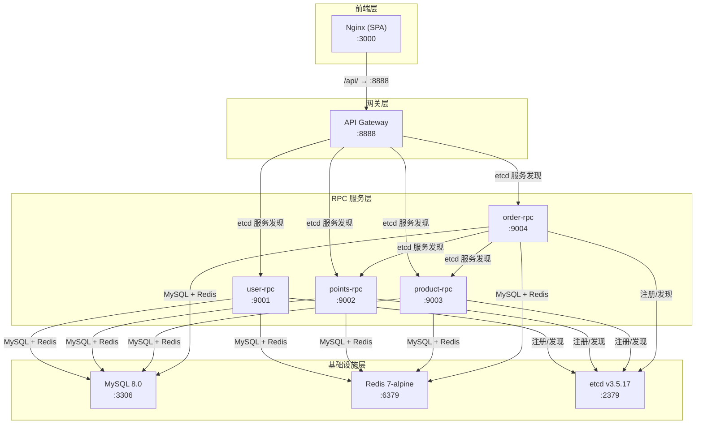
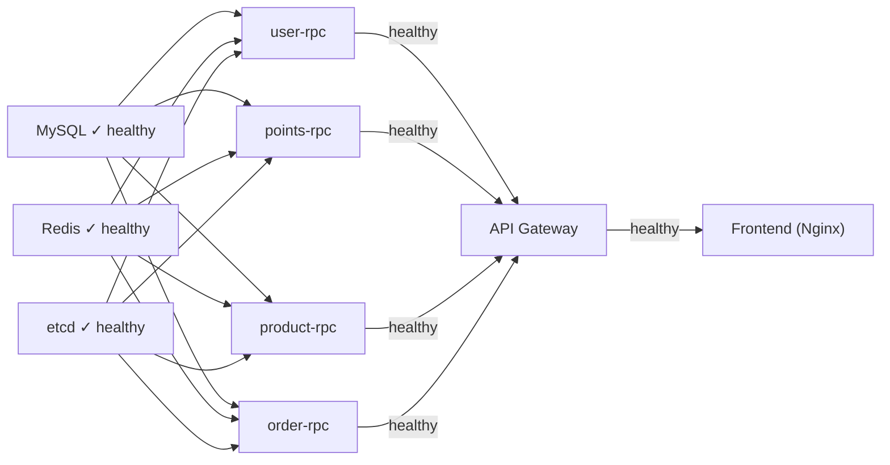
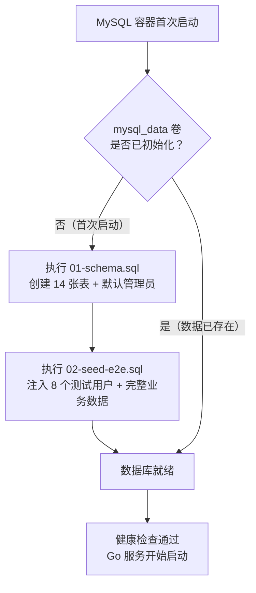

积分商城的本地开发环境围绕 `docker-compose.yaml` 构建，将 **3 个基础设施服务**（MySQL、Redis、etcd）与 **5 个 Go 微服务**（1 API 网关 + 4 RPC）及 **1 个前端容器**（Nginx）编排成一个完整的、开箱即用的全栈环境。本文将深入解析每个服务容器的配置细节、构建策略、服务依赖与健康检查机制，以及日常开发中最常用的操作命令，帮助你理解这套环境的内部运转原理并在遇到问题时快速定位。

Sources: [docker-compose.yaml](deploy/docker-compose.yaml#L1-L263)

## 全局架构：8 容器协作拓扑

Docker Compose 编排的 8 个容器通过 `INTegral-mall-network` 外部桥接网络相互通信。基础设施层先行启动并通过健康检查后，Go 微服务层才依次启动；微服务层全部就绪后，API 网关才接管请求；最后前端 Nginx 容器反向代理到 API，形成完整的请求链路。下图展示了各容器的依赖关系与网络拓扑：



Sources: [docker-compose.yaml](deploy/docker-compose.yaml#L1-L263), [nginx.conf](deploy/nginx.conf#L65-L82)

## 构建策略：宿主机交叉编译 + Volume 挂载

本地开发环境采用了一种**有别于传统 Docker 多阶段构建**的策略——宿主机交叉编译后以 volume 方式挂载二进制到容器内。这一设计的核心动机是**开发迭代速度**：当你修改了 Go 代码后，只需在宿主机执行 `make build` 交叉编译，然后 `docker compose restart` 即可，无需重新构建 Docker 镜像。

### Dockerfile.local：最小运行时镜像

所有 Go 服务（API 网关和 4 个 RPC）共享同一个 [Dockerfile.local](deploy/Dockerfile.local)，它基于 `alpine:3.19`，仅安装 `tzdata`（时区数据）、`ca-certificates`（TLS 证书）和 `gettext`（提供 `envsubst` 命令），最终产物是一个约 10MB 的空壳镜像：

```dockerfile
FROM alpine:3.19
RUN apk add --no-cache tzdata ca-certificates gettext
WORKDIR /app
RUN mkdir -p etc uploads/images
ENTRYPOINT ["./entrypoint.sh"]
```

Sources: [Dockerfile.local](deploy/Dockerfile.local#L1-L10)

实际的 Go 二进制文件通过 `docker-compose.yaml` 中的 `volumes` 挂载：

| 服务 | Volume 挂载源 | 容器内路径 | 监听端口 |
|------|-------------|-----------|---------|
| user-rpc | `.artifacts/bin/user-rpc` | `/app/service:ro` | 9001 |
| points-rpc | `.artifacts/bin/points-rpc` | `/app/service:ro` | 9002 |
| product-rpc | `.artifacts/bin/product-rpc` | `/app/service:ro` | 9003 |
| order-rpc | `.artifacts/bin/order-rpc` | `/app/service:ro` | 9004 |
| api | `.artifacts/bin/api` | `/app/service:ro` | 8888 |

Sources: [docker-compose.yaml](deploy/docker-compose.yaml#L58-L215)

### 前端容器：独立多阶段构建

前端使用独立的 [Dockerfile.frontend](deploy/Dockerfile.frontend)，采用经典的两阶段构建：第一阶段用 `node:22-alpine` + pnpm 构建生产版本，第二阶段用 `nginx:alpine` 托管静态文件。与 Go 服务不同，前端不需要频繁重建镜像——只有当依赖或代码发生变更时才需要重新构建。

Sources: [Dockerfile.frontend](deploy/Dockerfile.frontend#L1-L48)

### Dockerfile（生产用）：多阶段内部构建

对比之下，项目还保留了用于 CI/CD 环境的 [Dockerfile](deploy/Dockerfile)（不带 `.local` 后缀），它在 Docker 内部完成 Go 编译，通过 `--mount=type=cache` 持久化 Go Module 缓存，并通过 `SERVICE` 构建参数选择不同的服务入口。本地开发不使用此 Dockerfile，但生产流水线会基于它构建最终镜像。

Sources: [Dockerfile](deploy/Dockerfile#L1-L55)

## 配置注入：envsubst 模板替换机制

每个 Go 服务在容器启动时，配置文件中的 `${VAR}` 占位符会被实际的 Docker 环境变量替换。这一机制由 [entrypoint.sh](deploy/entrypoint.sh) 实现——它在启动服务前先通过 `envsubst` 将配置模板渲染为最终配置：

```bash
# 设置时区
cp /usr/share/zoneinfo/Asia/Shanghai /etc/localtime
echo 'Asia/Shanghai' > /etc/timezone

# 环境变量替换配置模板
envsubst < /app/etc/config.yaml > /tmp/config.yaml
exec ./service -f /tmp/config.yaml
```

Sources: [entrypoint.sh](deploy/entrypoint.sh#L1-L12)

### 配置文件映射关系

每个服务的 `*-docker.yaml` 配置文件通过 volume 以只读方式挂载到容器的 `/app/etc/config.yaml`：

| 服务 | 配置文件 | 关键占位符 |
|------|---------|-----------|
| API 网关 | [api-docker.yaml](deploy/api-docker.yaml) | `${JWT_SECRET}`, `${IMAGE_PREFIX}` |
| user-rpc | [user-rpc-docker.yaml](deploy/user-rpc-docker.yaml) | `${JWT_SECRET}` |
| points-rpc | [points-rpc-docker.yaml](deploy/points-rpc-docker.yaml) | `${AI_PROVIDER}`, `${AI_MODEL}`, `${AI_ANTHROPIC_API_KEY}` 等 |
| product-rpc | [product-rpc-docker.yaml](deploy/product-rpc-docker.yaml) | 无占位符 |
| order-rpc | [order-rpc-docker.yaml](deploy/order-rpc-docker.yaml) | 无占位符 |

以 API 网关配置为例，MySQL 连接地址使用 Docker 内部服务名 `mysql:3306`，etcd 使用 `etcd:2379`，Redis 使用 `redis:6379`——这些都是 Docker Compose 网络内的服务发现地址，而非 `localhost`：

```yaml
MySQL:
  DataSource: "mall:mall123@tcp(mysql:3306)/INTegral_mall?..."
CacheRedis:
  Host: redis:6379
UserRpc:
  Etcd:
    Hosts:
      - etcd:2379
    Key: user.rpc
```

Sources: [api-docker.yaml](deploy/api-docker.yaml#L1-L49)

### AI 评分配置的灵活切换

points-rpc 的配置中，AI 提供商通过环境变量动态切换。配置文件同时声明了 Anthropic 格式和 OpenAI 兼容格式两套 API 连接参数，`Provider` 字段决定实际走哪条路径。默认使用 MiniMax（Anthropic 兼容格式），但可切换为智谱、通义千问、DeepSeek 等 OpenAI 兼容格式提供商：

| 环境变量 | 默认值 | 说明 |
|---------|-------|------|
| `AI_PROVIDER` | `minimax` | AI 提供商名称 |
| `AI_MODEL` | `MiniMax-M2.7-highspeed` | 模型标识 |
| `AI_ANTHROPIC_API_KEY` | （需填入） | Anthropic 兼容格式 API Key |
| `AI_ANTHROPIC_BASE_URL` | `https://api.minimaxi.com/anthropic` | Anthropic 兼容端点 |
| `OPENAI_API_KEY` | 空 | OpenAI 兼容格式 API Key |
| `OPENAI_BASE_URL` | `https://api.openai.com/v1` | OpenAI 兼容端点 |

Sources: [points-rpc-docker.yaml](deploy/points-rpc-docker.yaml#L16-L39), [.env](deploy/.env#L11-L21)

## 基础设施服务详解

### MySQL 8.0：自动初始化与字符集

MySQL 容器利用 Docker 官方镜像的 `docker-entrypoint-initdb.d` 机制实现数据库的自动初始化。两个 SQL 文件按字母序依次执行：`01-schema.sql` 创建 14 张核心表并插入默认管理员和系统角色，`02-seed-e2e.sql` 注入 E2E 测试所需的完整种子数据。

| 配置项 | 值 | 说明 |
|-------|---|------|
| 镜像 | `mysql:8.0` | 官方 MySQL 8.0 |
| 字符集 | `utf8mb4` / `utf8mb4_unicode_ci` | 服务端强制 utf8mb4 |
| 初始化脚本 | `schema.sql` → `seed-e2e.sql` | 首次启动自动执行 |
| 持久化卷 | `mysql_data` | 数据持久化到 Docker 卷 |
| 健康检查 | `mysqladmin ping` | 10s 间隔，5 次重试 |

MySQL 的启动参数通过 `command` 字段强制所有客户端连接使用 utf8mb4，并通过 `--character-set-client-handshake=FALSE` 禁止客户端覆盖字符集协商。数据通过 `mysql_data` 命名卷持久化，即使容器销毁重建，数据也不会丢失。

Sources: [docker-compose.yaml](deploy/docker-compose.yaml#L2-L25), [schema.sql](deploy/schema.sql#L1-L332)

### Redis 7 Alpine：轻量缓存

Redis 容器使用 `redis:7-alpine` 镜像，以默认配置运行。go-zero 框架通过 `CacheRedis` 配置项连接 Redis 实现响应缓存和会话存储。数据通过 `redis_data` 卷持久化。

Sources: [docker-compose.yaml](deploy/docker-compose.yaml#L27-L41)

### etcd v3.5.17：服务注册与发现

etcd 是 go-zero 微服务架构中的服务注册中心。每个 RPC 服务启动后向 etcd 注册自己的地址（如 `user.rpc` → `etcd:2379`），API 网关通过 etcd 查询各 RPC 服务的可用实例来实现负载均衡。容器启动命令中 `-advertise-client-urls` 同时声明了容器名和 `127.0.0.1` 两种访问方式，确保容器内外都能连接。

Sources: [docker-compose.yaml](deploy/docker-compose.yaml#L43-L56)

## 服务启动顺序与健康检查

Docker Compose 通过 `depends_on` + `condition: service_healthy` 实现严格的启动顺序控制。下图展示了完整的启动依赖链：



每个容器的健康检查策略如下表所示：

| 服务 | 检查命令 | 间隔 | 超时 | 重试 | 启动等待 |
|------|---------|------|------|------|---------|
| MySQL | `mysqladmin ping -h localhost` | 10s | 5s | 5 | - |
| Redis | `redis-cli ping` | 10s | 5s | 5 | - |
| etcd | `etcdctl endpoint health` | 10s | 5s | 5 | - |
| user-rpc | `nc -z localhost 9001` | 10s | 5s | 10 | 15s |
| points-rpc | `nc -z localhost 9002` | 10s | 5s | 10 | 15s |
| product-rpc | `nc -z localhost 9003` | 10s | 5s | 10 | 15s |
| order-rpc | `nc -z localhost 9004` | 10s | 5s | 10 | 15s |
| API | `nc -z localhost 8888` | 10s | 5s | 10 | 15s |
| Frontend | `curl -f http://localhost/` | 30s | 5s | 3 | 10s |

Go 服务使用 `nc -z`（netcat 端口扫描）检测端口可达性，并设置了 `start_period: 15s` 的启动宽限期——在此期间的健康检查失败不会计入重试次数。这种设计确保了 go-zero RPC 服务有足够的时间完成 etcd 注册、数据库连接池初始化等启动任务。

Sources: [docker-compose.yaml](deploy/docker-compose.yaml#L18-L237)

## 前端 Nginx 配置解析

前端的 [nginx.conf](deploy/nginx.conf) 专门针对 Vite 构建的 SPA 应用做了优化，承担两个核心职责：**静态资源托管**和 **API 反向代理**。

### 静态资源缓存策略

Nginx 按文件类型设置差异化的缓存策略，关键原则是：带 hash 的版本化文件（JS/CSS/WASM）长期缓存，HTML 文件不缓存以确保用户获取最新版本：

| 文件类型 | 缓存时长 | Cache-Control |
|---------|---------|---------------|
| JS / CSS / WOFF2 / WASM | 1 年 | `public, immutable` |
| 图片（JPG/PNG/SVG 等） | 6 个月 | `public` |
| HTML | 不缓存 | `no-cache, no-store, must-revalidate` |
| 上传文件 `/uploads/` | 30 天 | `public, immutable` |

### API 代理与文件上传

`/api/` 路径代理到 API 网关的 `api:8888`，请求体大小限制为 12MB（`client_max_body_size`），这与后端的 `MaxBytes: 14680064`（14MB）形成配合——Nginx 限制 12MB 的用户文件，后端允许 14MB 以容纳 multipart boundary 等 HTTP 协议开销。配置还预留了 `/ws/` 路径的 WebSocket 代理支持（`proxy_read_timeout: 86400`），为未来的实时通知功能做准备。

### 安全头与 SPA 路由

Nginx 为所有响应注入了 `X-Frame-Options`、`X-Content-Type-Options`、`X-XSS-Protection` 和 `Referrer-Policy` 安全头。SPA 的客户端路由通过 `try_files $uri $uri/ /index.html` 兜底——所有不匹配静态文件的请求都回落到 `index.html`，由 React Router 在前端解析路由。

Sources: [nginx.conf](deploy/nginx.conf#L1-L111)

## 数据卷与共享存储

Docker Compose 定义了 3 个命名卷，其中 `uploads_data` 是一个关键的**跨容器共享卷**——API 网关写入上传图片到 `/app/uploads`，前端 Nginx 从 `/usr/share/nginx/html/uploads` 只读提供静态文件服务：

| 卷名 | 用途 | 挂载点 |
|------|------|-------|
| `mysql_data` | MySQL 数据持久化 | `mysql:/var/lib/mysql` |
| `redis_data` | Redis 数据持久化 | `redis:/data` |
| `uploads_data` | 上传文件共享存储 | `api:/app/uploads`（读写），`frontend:/usr/share/nginx/html/uploads`（只读） |

Sources: [docker-compose.yaml](deploy/docker-compose.yaml#L254-L257), [docker-compose.yaml](deploy/docker-compose.yaml#L185), [docker-compose.yaml](deploy/docker-compose.yaml#L227)

## 环境变量配置：.env 文件详解

[.env](deploy/.env) 文件定义了所有可通过环境变量自定义的配置项。Docker Compose 会自动加载同目录下的 `.env` 文件，其中的变量既用于 `docker-compose.yaml` 中的 `${VAR:-default}` 默认值语法，也通过 `environment` 字段传递给 Go 服务容器供 `envsubst` 使用：

```bash
# 数据库配置
MYSQL_ROOT_PASSWORD=root123      # Root 密码
MYSQL_DATABASE=INTegral_mall     # 数据库名
MYSQL_USER=mall                  # 业务用户
MYSQL_PASSWORD=mall123           # 业务密码
MYSQL_PORT=3306                  # 宿主机映射端口

# AI 评分引擎
AI_PROVIDER=minimax              # 提供商（minimax/zhipu/qwen/deepseek/kimi 等）
AI_MODEL=MiniMax-M2.7-highspeed  # 模型标识
AI_ANTHROPIC_API_KEY=sk-cp-...   # Anthropic 兼容 API Key
AI_ANTHROPIC_BASE_URL=https://api.minimaxi.com/anthropic

# 安全配置
JWT_SECRET=change-me-jwt-secret-32-chars-min  # JWT 签名密钥

# Docker 构建优化
DOCKER_BUILDKIT=1                # 启用 BuildKit
COMPOSE_DOCKER_CLI_BUILD=1       # 使用 CLI Builder
```

Sources: [.env](deploy/.env#L1-L29)

## Makefile 命令速查

日常开发操作通过 `deploy/Makefile`（以及根目录的 `Makefile` 代理）驱动。以下是最常用的命令及其内部逻辑：

| 命令 | 作用 | 内部逻辑 |
|------|------|---------|
| `make run` | 一键编译并启动 | 交叉编译全部 Go 二进制 → 创建网络 → `docker compose up -d` |
| `make reload` | 编译 + 重启全部 Go 服务 | `build` → `docker compose restart api user-rpc ...` |
| `make reload-points-rpc` | 仅编译并重启 points-rpc | `build-points-rpc` → `docker compose restart points-rpc` |
| `make restart` | 重启 Go 服务（不编译） | 直接 `docker compose restart`，适用于配置变更 |
| `make down` | 停止所有容器 | `docker compose down` |
| `make clean` | 清理一切 | 删除 `.artifacts/bin` + 停容器 + **删除数据卷** |
| `make logs-api` | 查看 API 日志 | `docker compose logs -f api` |
| `make migrate` | 重放 schema.sql | 通过 mysql CLI 执行 schema 文件到本地数据库 |

### 交叉编译细节

Makefile 中的 `go_build_service` 函数在宿主机上执行交叉编译：

```makefile
define go_build_service
    cd .. && mkdir -p $(BIN_DIR) && \
    CGO_ENABLED=0 GOOS=$(TARGET_GOOS) GOARCH=$(TARGET_GOARCH) \
    go build -ldflags="$(BUILD_LDFLAGS)" -o $(BIN_DIR)/$(1) $(2)
endef
```

默认 `TARGET_GOOS=linux`、`BUILD_LDFLAGS="-s -w"`（去除符号表和调试信息），编译产物输出到 `.artifacts/bin/` 目录。这意味着在 macOS 上开发的开发者，Go 二进制会被交叉编译为 Linux ELF 格式，然后挂载到 Alpine 容器中运行。

Sources: [deploy/Makefile](deploy/Makefile#L1-L117), [Makefile](Makefile#L1-L61)

## 数据库初始化流程

MySQL 容器首次启动时，`docker-entrypoint-initdb.d` 目录中的脚本按字母序自动执行：



`01-schema.sql`（即 [schema.sql](deploy/schema.sql)）创建 users、roles、permissions、groups、points_rules、points_applications、review_records、points_accounts、points_transactions、notifications、products、exchange_orders 等 14 张表，并预置系统管理员（`admin@company.com` / `admin123`）和 5 个系统角色（admin、participant、reviewer、chief_reviewer、merchant）。

`02-seed-e2e.sql`（即 [seed-e2e.sql](deploy/seeds/seed-e2e.sql)）注入完整的 E2E 测试数据：8 个测试用户（所有密码均为 `admin123`）、2 个测试小组、4 笔覆盖各状态的积分申请、4 笔兑换订单、完整的审核记录和积分流水。这些数据使用 `INSERT IGNORE` 和 `ON DUPLICATE KEY UPDATE` 保证幂等性，可以安全地重复执行。

Sources: [schema.sql](deploy/schema.sql#L1-L332), [seed-e2e.sql](deploy/seeds/seed-e2e.sql#L1-L200)

## 网络架构与端口映射

所有容器通过外部桥接网络 `INTegral-mall-network` 通信。之所以声明为 `external: true`，是因为 `make run` 在启动前显式创建该网络（`docker network create INTegral-mall-network`），确保网络在所有容器间共享且生命周期独立于任何单个容器。容器间通信使用 Docker 内部 DNS 解析服务名（如 `mysql:3306`、`etcd:2379`），对外仅暴露必要的端口：

| 端口映射 | 服务 | 用途 |
|---------|------|------|
| `3306 → 3306` | MySQL | 数据库客户端连接 |
| `6379 → 6379` | Redis | Redis CLI 调试 |
| `2379 → 2379` | etcd | etcdctl 服务发现调试 |
| `8888 → 8888` | API 网关 | 直接 API 调用/调试 |
| `3000 → 80` | Frontend | 浏览器访问入口 |

所有端口映射均支持通过 `.env` 文件自定义（如 `MYSQL_PORT=3307`），避免与宿主机已有服务冲突。

Sources: [docker-compose.yaml](deploy/docker-compose.yaml#L259-L262), [deploy/Makefile](deploy/Makefile#L33-L36)

## 前端容器资源限制与日志

前端容器是唯一设置了资源限制的服务——CPU 上限 0.5 核、内存上限 256MB，这反映了 Nginx 静态文件服务对资源的低需求。日志配置为 JSON 格式、单文件最大 10MB、保留 3 个轮转文件，防止日志文件无限增长。Go 服务和基础设施服务未设置显式资源限制，在本地开发环境中依赖 Docker 默认分配即可。

Sources: [docker-compose.yaml](deploy/docker-compose.yaml#L240-L252)

## 常见场景操作指南

### 首次启动全栈环境

```bash
# 在项目根目录
make run
# 等待所有容器健康检查通过后访问：
# 前端：http://localhost:3000
# API： http://localhost:8888
# 默认管理员登录：admin@company.com / admin123
```

`make run` 内部执行 `make build`（交叉编译所有 Go 二进制到 `.artifacts/bin/`）→ 创建 Docker 网络 → `docker compose up -d`。首次启动 MySQL 需要执行初始化脚本，整个启动过程大约需要 1-2 分钟。

### 修改 Go 代码后的快速重载

```bash
# 重载单个服务（推荐）
make reload-points-rpc

# 重载所有 Go 服务
make reload
```

`reload` 命令仅重新编译 Go 二进制并重启容器，**不重建 Docker 镜像**——这正是 volume 挂载策略的核心优势，重载通常在 10 秒内完成。

### 修改前端代码后的重建

```bash
# 重新构建前端镜像
docker compose build frontend
docker compose up -d frontend
```

前端容器使用多阶段构建，代码变更需要重建镜像。由于 `node_modules` 和 `pnpm-lock.yaml` 层有 Docker 缓存，仅源码变更时的重建速度也较快。

### 清理并重置数据库

```bash
make clean   # ⚠️ 删除所有数据卷，数据库数据将丢失
make run     # 重新初始化
```

Sources: [deploy/Makefile](deploy/Makefile#L33-L80)

---

**下一步阅读**：了解了本地开发环境后，可以继续探索生产环境的部署方式——[Kubernetes 生产部署：Kustomize Overlay 与 CI/CD 流水线](26-kubernetes-sheng-chan-bu-shu-kustomize-overlay-yu-ci-cd-liu-shui-xian)对比了本地 Docker Compose 与生产 K8s 的配置差异。日常开发中需要查找具体命令时，可以参考 [Makefile 构建入口与常用开发命令速查](27-makefile-gou-jian-ru-kou-yu-chang-yong-kai-fa-ming-ling-su-cha)。如需理解微服务间的协作关系，推荐回顾 [微服务架构总览：API 网关与四路 RPC 的协作关系](3-wei-fu-wu-jia-gou-zong-lan-api-wang-guan-yu-si-lu-rpc-de-xie-zuo-guan-xi)。