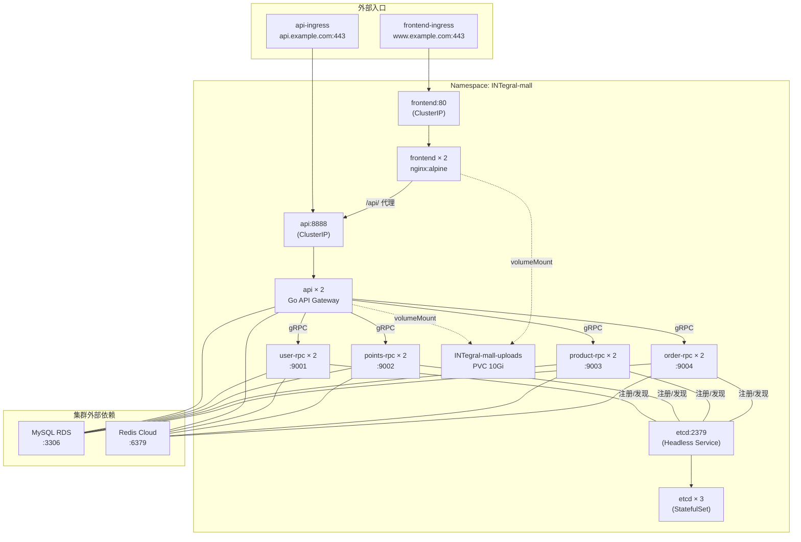
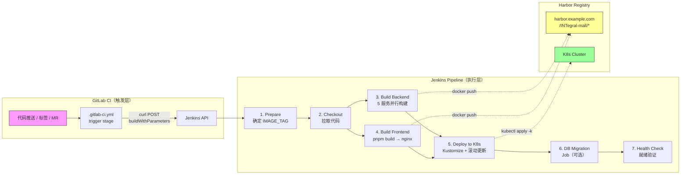

积分商城的生产部署采用 **Kustomize Base/Overlay** 模式管理 Kubernetes 资源清单，以 **GitLab CI → Jenkins** 两级流水线驱动镜像构建和滚动部署。本文将从目录架构出发，逐层拆解 Base 资源定义、Overlay 环境差异化策略、Docker 多阶段构建、七阶段 Jenkins Pipeline 完整流程，以及配置注入、数据库迁移和回滚方案等关键运维能力。

Sources: [README.md](k8s/README.md#L1-L56)

## Kustomize 目录架构

Kustomize 的核心思想是将所有环境的**共性资源**抽取到 `base/` 目录，再将**环境差异**通过 `overlays/` 覆盖注入。项目的 `k8s/` 目录严格遵循这一分层：

```
k8s/
├── base/                          # 所有环境共用的资源清单
│   ├── namespace.yaml             # Namespace 定义
│   ├── configmap.yaml             # 5 份 ConfigMap（api + 4 个 RPC 服务的 go-zero 配置）
│   ├── secret.yaml                # Secret 占位（生产使用 Vault/ESO 注入）
│   ├── pvc.yaml                   # 上传文件 PersistentVolumeClaim（10Gi）
│   ├── api-deployment.yaml        # API Gateway: Deployment + Service + Ingress
│   ├── rpc-deployments.yaml       # 4 个 RPC 服务的 Deployment + Service（合并为一个文件）
│   ├── frontend-deployment.yaml   # 前端: Deployment + Service + Ingress
│   ├── etcd-statefulset.yaml      # etcd 3 节点 StatefulSet + Headless Service
│   └── migrations-job.yaml        # 数据库迁移 Job
└── overlays/
    ├── staging/                   # 测试环境 Overlay
    │   └── kustomization.yaml
    └── production/                # 生产环境 Overlay
        └── kustomization.yaml
```

这种结构的优势在于：base 层定义服务的**拓扑关系**和**默认参数**（副本数、资源限制、健康检查），overlay 层仅覆盖环境特定值（namespace、镜像 tag、标签前缀），避免了 Helm 模板的复杂性，同时保持了 Git 可追踪的纯 YAML 声明式管理。

Sources: [README.md](k8s/README.md#L5-L22)

## Base 资源清单详解

### 服务拓扑总览

在深入每个资源之前，先建立整体认知——以下 Mermaid 图展示了 K8s 集群内部的流量路径与服务依赖关系。阅读此图需要理解：**Ingress** 是外部流量入口，**Service** 提供 ClusterIP 负载均衡，**etcd Headless Service** 为 RPC 服务发现提供 DNS 解析。



### 资源清单对照表

| 资源文件 | K8s 资源类型 | 数量 | 核心配置 |
|---------|-------------|------|---------|
| `namespace.yaml` | Namespace | 1 | `INTegral-mall` + 标签 |
| `configmap.yaml` | ConfigMap | 5 | api / points-rpc / user-rpc / product-rpc / order-rpc 的 go-zero 配置 |
| `secret.yaml` | Secret | 1 | JWT_SECRET, MYSQL_DATASOURCE, REDIS_HOST, AI Provider 密钥 |
| `pvc.yaml` | PersistentVolumeClaim | 1 | 10Gi ReadWriteOnce（上传文件持久化） |
| `api-deployment.yaml` | Deployment + Service + Ingress | 3 | 2 副本 / RollingUpdate / 8888 端口 / TLS |
| `rpc-deployments.yaml` | Deployment + Service × 4 | 8 | user-rpc:9001 / points-rpc:9002 / product-rpc:9003 / order-rpc:9004 |
| `frontend-deployment.yaml` | Deployment + Service + Ingress | 3 | 2 副本 / nginx:80 / SPA fallback / TLS |
| `etcd-statefulset.yaml` | StatefulSet + Headless Service | 2 | 3 节点 / Headless DNS / 动态 PVC |
| `migrations-job.yaml` | Job | 1 | ttlSecondsAfterFinished: 300 / backoffLimit: 2 |

Sources: [namespace.yaml](k8s/base/namespace.yaml#L1-L8), [configmap.yaml](k8s/base/configmap.yaml#L1-L157), [secret.yaml](k8s/base/secret.yaml#L1-L23), [api-deployment.yaml](k8s/base/api-deployment.yaml#L1-L117), [rpc-deployments.yaml](k8s/base/rpc-deployments.yaml#L1-L250), [frontend-deployment.yaml](k8s/base/frontend-deployment.yaml#L1-L92), [etcd-statefulset.yaml](k8s/base/etcd-statefulset.yaml#L1-L71), [migrations-job.yaml](k8s/base/migrations-job.yaml#L1-L51), [pvc.yaml](k8s/base/pvc.yaml#L1-L15)

### API Gateway Deployment 设计

API Gateway 作为系统的流量入口，其 Deployment 配置体现了几个关键的生产考量。**滚动更新策略**设置 `maxSurge: 1` / `maxUnavailable: 0`，确保升级过程中始终有完整副本在服务，不丢失任何请求。**三级健康检查**通过 `livenessProbe`（TCP 端口检测，10 秒间隔）自动重启故障容器，通过 `readinessProbe`（5 秒间隔）控制流量摘除时机。**资源配额**设定 `requests: 250m CPU / 256Mi Memory` 和 `limits: 1000m CPU / 1Gi Memory`，既保证了 QoS 等级，又防止异常 Pod 吃光节点资源。**双卷挂载**将 ConfigMap 挂载为只读配置（`/app/etc`），将 PVC 挂载为上传目录（`/app/uploads`），实现配置与数据的分离。

```yaml
# 关键配置节选
spec:
  replicas: 2
  strategy:
    type: RollingUpdate
    rollingUpdate:
      maxSurge: 1
      maxUnavailable: 0
  template:
    spec:
      containers:
        - name: api
          image: harbor.example.com/INTegral-mall/api:REPLACE_TAG
          envFrom:
            - secretRef:
                name: INTegral-mall-secret
          volumeMounts:
            - name: config
              mountPath: /app/etc
              readOnly: true
            - name: uploads
              mountPath: /app/uploads
```

注意镜像 tag 使用 `REPLACE_TAG` 占位符，实际由 Jenkins Pipeline 通过 Kustomize 的 `images` 字段动态替换。

Sources: [api-deployment.yaml](k8s/base/api-deployment.yaml#L1-L117)

### 四路 RPC 服务的统一管理

`rpc-deployments.yaml` 将四个 RPC 服务的 Deployment + Service 合并在一个文件中管理。这种设计减少了文件碎片化，同时通过端口分配表保持清晰的服务边界：

| RPC 服务 | 端口 | CPU Request / Limit | Memory Request / Limit | ConfigMap 引用 |
|----------|------|---------------------|----------------------|---------------|
| user-rpc | 9001 | 100m / 500m | 128Mi / 512Mi | `user-rpc-config` |
| points-rpc | 9002 | 250m / 1000m | 256Mi / 1Gi | `points-rpc-config` |
| product-rpc | 9003 | 100m / 500m | 128Mi / 512Mi | `product-rpc-config` |
| order-rpc | 9004 | 100m / 500m | 128Mi / 512Mi | `order-rpc-config` |

**points-rpc 的资源配额显著高于其他 RPC 服务**，原因是它承担了 AI 评分引擎的工作负载——调用外部 LLM API 需要维持 HTTP 长连接和 JSON 响应缓冲区，内存消耗远超普通 CRUD 服务。所有 RPC 服务统一通过 `envFrom` 注入 `INTegral-mall-secret`，通过 `volumeMounts` 挂载各自对应的 ConfigMap，配置模式高度一致。

Sources: [rpc-deployments.yaml](k8s/base/rpc-deployments.yaml#L1-L250)

### etcd StatefulSet：集群内服务发现

项目选择在 K8s 集群内部署 3 节点 etcd StatefulSet 用于 RPC 服务注册与发现，而非使用 K8s 原生的 Service 机制。这一决策源于 go-zero 框架的 **etcd 直连式服务发现**——RPC 客户端通过 etcd 的 Watch 机制获取服务端点列表，实现客户端负载均衡。StatefulSet 配合 **Headless Service**（`clusterIP: None`），使每个 etcd Pod 拥有稳定的 DNS 名称（如 `etcd-0.etcd.INTegral-mall.svc.cluster.local`），满足 etcd 集群对成员地址稳定性的要求。每个 etcd 节点通过 `volumeClaimTemplates` 动态申请 1Gi 存储卷，用于持久化数据目录 `/etcd-data`。

```yaml
# Headless Service — 为每个 Pod 提供稳定 DNS
spec:
  clusterIP: None   # Headless
  ports:
    - port: 2379
      name: client
  selector:
    app: etcd
```

ConfigMap 中所有 RPC 客户端配置统一指向 `etcd.INTegral-mall.svc.cluster.local:2379`，这是 Headless Service 解析到的所有就绪 Pod IP 的集合。

Sources: [etcd-statefulset.yaml](k8s/base/etcd-statefulset.yaml#L1-L71), [configmap.yaml](k8s/base/configmap.yaml#L26-L28)

### ConfigMap：环境变量占位符与运行时注入

Base 层的 ConfigMap 使用 `${VAR}` 占位符语法存储 go-zero 配置文件。例如 API 服务的 ConfigMap 中，`MYSQL_DATASOURCE` 写作 `"${MYSQL_DATASOURCE}"`，`JWT_SECRET` 写作 `"${JWT_SECRET}"`。这些占位符**不在 K8s 层面解析**，而是由容器启动时的 `entrypoint.sh` 通过 `envsubst` 命令完成替换：

```bash
#!/bin/sh
# entrypoint.sh — 容器入口脚本
if [ -f /usr/share/zoneinfo/Asia/Shanghai ]; then
    cp /usr/share/zoneinfo/Asia/Shanghai /etc/localtime
    echo 'Asia/Shanghai' > /etc/timezone
fi
set -e
envsubst < /app/etc/config.yaml > /tmp/config.yaml
exec ./service -f /tmp/config.yaml
```

这个设计将敏感配置的来源解耦——ConfigMap 管理结构骨架，Secret 管理具体值。容器运行时通过 `secretRef` 将 Secret 中的键值对注入为环境变量，`envsubst` 再用这些环境变量填充 ConfigMap 中的占位符，最终生成完整的配置文件。这样 ConfigMap 可以安全提交到 Git，而 Secret 由 Vault/ESO 独立管理。

Sources: [entrypoint.sh](deploy/entrypoint.sh#L1-L12), [configmap.yaml](k8s/base/configmap.yaml#L10-L46), [secret.yaml](k8s/base/secret.yaml#L1-L23)

## Overlay 环境差异化策略

### 生产环境 vs 测试环境对比

两个 Overlay 的 `kustomization.yaml` 结构一致，但通过三个差异化维度实现环境隔离：

| 差异维度 | production | staging |
|---------|-----------|---------|
| **namespace** | `INTegral-mall` | `INTegral-mall-staging` |
| **namePrefix** | `prod-` | `staging-` |
| **commonLabels** | `env: production` | `env: staging` |
| **镜像 tag** | 由 Jenkins 填充实际版本 | 由 Jenkins 填充实际版本 |

`namePrefix` 的效果是所有资源名称自动加上环境前缀——例如 API Deployment 在生产环境变为 `prod-api`，在测试环境变为 `staging-api`，避免同一集群内部署两个环境时的名称冲突。`commonLabels` 为所有资源注入环境标签，便于通过 `kubectl get -l env=production` 精确过滤。

```yaml
# k8s/overlays/production/kustomization.yaml
apiVersion: kustomize.config.k8s.io/v1beta1
kind: Kustomization

namespace: INTegral-mall
resources:
  - ../../base/namespace.yaml
  - ../../base/configmap.yaml
  - ../../base/secret.yaml
  - ../../base/pvc.yaml
  - ../../base/api-deployment.yaml
  - ../../base/rpc-deployments.yaml
  - ../../base/frontend-deployment.yaml
  - ../../base/etcd-statefulset.yaml

images:
  - name: harbor.example.com/INTegral-mall/api
    newTag: latest   # Jenkins 通过 sed 动态替换
  # ... 其余 5 个服务镜像

commonLabels:
  env: production
namePrefix: prod-
```

Jenkins Pipeline 部署时通过 `sed` 命令将 `newTag: latest` 替换为实际的 Git Tag 或 Commit SHA，然后执行 `kubectl apply -k .` 完成滚动更新。

Sources: [production/kustomization.yaml](k8s/overlays/production/kustomization.yaml#L1-L36), [staging/kustomization.yaml](k8s/overlays/staging/kustomization.yaml#L1-L35)

### Overlay 资源排除策略

值得注意的是，production 和 staging 的 `resources` 列表中**均未包含 `migrations-job.yaml`**。数据库迁移 Job 不作为常规部署的一部分自动执行，而是在 Jenkins Pipeline 的独立阶段（`Database Migration`）中按需 `kubectl apply -f k8s/base/migrations-job.yaml` 直接触发，且仅在生产环境且未勾选跳过迁移时执行。这种设计避免了每次部署都执行迁移——在无 schema 变更时跳过，有变更时精确控制执行时机。

Sources: [production/kustomization.yaml](k8s/overlays/production/kustomization.yaml#L7-L16), [Jenkinsfile](deploy/Jenkinsfile#L246-L275)

## Docker 多阶段构建

### 后端统一 Dockerfile：SERVICE 参数化

后端五个 Go 服务共享同一个 [Dockerfile](deploy/Dockerfile#L1-L55)，通过 `--build-arg SERVICE=xxx` 参数化选择构建入口。这是一个**两阶段多阶段构建**：

**阶段一（builder）**——基于 `golang:1.26-alpine`，利用 Docker BuildKit 的 `--mount=type=cache` 持久化 Go Module 缓存。同一台构建机器上，依赖只需下载一次，后续构建直接命中缓存。`case` 语句根据 `SERVICE` 参数选择入口文件并编译为静态二进制：

```dockerfile
ARG SERVICE
RUN set -e; \
    case "${SERVICE}" in \
      api)          ENTRY="app/api/INTegralmall.go" ;; \
      user-rpc)     ENTRY="app/rpc/user/user.go" ;; \
      points-rpc)   ENTRY="app/rpc/points/points.go" ;; \
      product-rpc)  ENTRY="app/rpc/product/product.go" ;; \
      order-rpc)    ENTRY="app/rpc/order/order.go" ;; \
      *)            echo "Unknown SERVICE: ${SERVICE}" >&2; exit 1 ;; \
    esac; \
    CGO_ENABLED=0 GOOS=linux go build -ldflags="-s -w" -o /app/service ./${ENTRY}
```

**阶段二（runner）**——基于 `alpine:3.19`，仅安装 `tzdata`、`ca-certificates` 和 `gettext`（提供 `envsubst`），最终镜像不含 Go 工具链和编译中间产物，体积控制在最小。

Sources: [Dockerfile](deploy/Dockerfile#L1-L55)

### 前端 Dockerfile：pnpm + nginx 静态服务

前端同样采用两阶段构建。**构建阶段**使用 `node:22-alpine` + pnpm 安装依赖并执行 `pnpm build`，产物输出到 `dist/` 目录。**运行阶段**使用 `nginx:alpine` 托管静态文件，内置 `HEALTHCHECK` 指令（30 秒间隔 curl 检测），并复制自定义 [nginx.conf](deploy/nginx.conf#L1-L112) 作为站点配置。nginx 配置针对 SPA 应用做了精细优化：带 hash 的 JS/CSS/WASM 文件设置 1 年缓存 + `immutable`，HTML 文件设置 `no-cache` 确保始终获取最新版本，`/api/` 路径反向代理到 API Service，`/uploads/` 路径提供上传文件静态服务，`/ws/` 路径保留 WebSocket 升级支持。

Sources: [Dockerfile.frontend](deploy/Dockerfile.frontend#L1-L48), [nginx.conf](deploy/nginx.conf#L1-L112)

## CI/CD 流水线：GitLab CI → Jenkins 七阶段 Pipeline

### 流水线架构

项目采用 **GitLab CI 触发 + Jenkins 执行**的两级流水线架构。GitLab CI 仅作为轻量级触发器——当代码推送到 `main` 分支、推送 `v*` 标签或创建 Merge Request 时，通过 `curl` 调用 Jenkins 的远程触发 API，将分支名、标签名和 Commit SHA 作为参数传递。所有编译、构建、推送、部署的实质工作由 Jenkins 完成。



Sources: [.gitlab-ci.yml](deploy/.gitlab-ci.yml#L1-L45), [Jenkinsfile](deploy/Jenkinsfile#L1-L361)

### GitLab CI 触发规则

[.gitlab-ci.yml](deploy/.gitlab-ci.yml#L1-L45) 定义了三条触发规则，覆盖三种代码提交场景。推送 `main` 分支触发常规构建（使用 Commit SHA 前 7 位作为镜像 tag），推送 `v*` 前缀标签触发正式发布构建（使用完整标签如 `v1.2.3` 作为镜像 tag），Merge Request 事件触发预验证构建。触发请求通过 Jenkins 的 `buildWithParameters` 端点发送，返回 HTTP 201 表示成功接收。

Sources: [.gitlab-ci.yml](deploy/.gitlab-ci.yml#L38-L44)

### Jenkins Pipeline 七阶段详解

#### Stage 1: Prepare（环境准备）

此阶段根据参数组合确定三个核心变量：`IMAGE_TAG`（镜像版本标签）、`K8S_CONTEXT`（目标集群）和 `SERVICE_LIST`（服务列表）。镜像 tag 的优先级为：**回滚模式** > **Git Tag** > **Commit SHA 前 7 位** > **latest**。这确保了紧急回滚时可以跳过构建直接部署指定版本的镜像。

```groovy
// 镜像 tag 确定逻辑
if (params.ROLLBACK) {
    env.IMAGE_TAG = params.ROLLBACK_TAG        // 回滚：使用指定版本
} else if (params.GIT_TAG) {
    env.IMAGE_TAG = params.GIT_TAG             // 标签发布：使用版本号
} else {
    env.IMAGE_TAG = env.GIT_COMMIT[0..7]       // 常规构建：使用短 Commit SHA
}
```

Sources: [Jenkinsfile](deploy/Jenkinsfile#L70-L108)

#### Stage 2-4: Build（并行镜像构建）

Stage 3 将后端五个服务的镜像构建**并行执行**，通过 `parallel` + `collectEntries` DSL 将 5 个 `docker build` 任务分配到不同执行器。每个构建任务使用 `--cache-from` 参数拉取 Harbor 上的 `latest` 标签作为缓存层，大幅减少重复构建时间。构建完成后推送版本标签镜像，同时打 `latest` 标签推送——为下一次构建提供缓存基础。

Stage 4 单独构建前端镜像。由于前端构建链（pnpm install + Vite build）与后端完全独立，串行执行不会影响总体速度——前端的 Node.js 构建和后端的 Go 构建在 Docker 层面无共享缓存。

Sources: [Jenkinsfile](deploy/Jenkinsfile#L127-L197)

#### Stage 5: Deploy to Kubernetes（Kustomize 部署）

这是流水线的核心部署阶段，执行以下步骤：

1. **切换 K8s Context** — 根据 `DEPLOY_ENV` 参数选择 `prod-cluster` 或 `staging-cluster`
2. **更新 Kustomize 镜像 tag** — 通过 `sed` 批量替换 overlay 目录下 `kustomization.yaml` 中的镜像版本
3. **Dry-run 验证** — `kubectl apply -k . --dry-run=server` 在服务端验证资源合法性
4. **正式应用** — `kubectl apply -k .` 提交资源到集群
5. **等待滚动更新** — 逐一检查每个 Deployment 的 `rollout status`，超时 300 秒

```bash
# 替换所有服务的镜像 tag
for svc in api user-rpc points-rpc product-rpc order-rpc frontend; do
  sed -i "s|harbor.example.com/INTegral-mall/${svc}:.*|...${svc}:${IMAGE_TAG}|" kustomization.yaml
done
# 应用 + 等待
kubectl apply -k .
for deployment in api user-rpc points-rpc product-rpc order-rpc frontend; do
  kubectl rollout status deployment/$deployment -n INTegral-mall --timeout=300s
done
```

Sources: [Jenkinsfile](deploy/Jenkinsfile#L200-L241)

#### Stage 6: Database Migration（数据库迁移）

此阶段仅在 **生产环境 + 非回滚模式 + 未跳过迁移** 三个条件同时满足时执行。它通过 `kubectl apply -f k8s/base/migrations-job.yaml` 创建一次性 Job，然后使用 `kubectl wait --for=condition=complete` 等待 Job 完成（超时 5 分钟）。Job 的 `ttlSecondsAfterFinished: 300` 配置确保完成后 5 分钟自动清理，不会残留已完成的 Job 对象。如果迁移失败，Pipeline 会抓取 Job 日志并中止流水线。

Sources: [Jenkinsfile](deploy/Jenkinsfile#L246-L275), [migrations-job.yaml](k8s/base/migrations-job.yaml#L1-L51)

#### Stage 7: Health Check（健康检查）

部署完成后，Pipeline 等待 30 秒让服务完全就绪，然后验证 API Deployment 的 `readyReplicas` 是否等于 `spec.replicas`。最后输出所有 Pod 状态和 Deployment 摘要信息，非 Running 状态的 Pod 会在日志中高亮显示。这一阶段确保部署结果在 Pipeline 日志中可追溯。

Sources: [Jenkinsfile](deploy/Jenkinsfile#L280-L309)

### Pipeline 参数速查

| 参数名 | 类型 | 默认值 | 说明 |
|-------|------|-------|------|
| `GIT_BRANCH` | string | `main` | Git 分支名称 |
| `GIT_TAG` | string | 空 | Git 标签（如 `v1.0.0`），优先于 Commit SHA 作为镜像 tag |
| `GIT_COMMIT` | string | 空 | Git Commit SHA，取前 7 位作为默认镜像 tag |
| `DEPLOY_ENV` | choice | `staging` | 部署目标：`staging` 或 `production` |
| `SKIP_DB_MIGRATE` | BOOLEAN | `false` | 跳过数据库迁移步骤 |
| `ROLLBACK` | BOOLEAN | `false` | 回滚模式——跳过构建，直接部署已有镜像 |
| `ROLLBACK_TAG` | string | 空 | 回滚到的镜像版本（`ROLLBACK=true` 时必填） |

Sources: [Jenkinsfile](deploy/Jenkinsfile#L28-L63)

## 配置管理与安全策略

### 敏感配置注入方案

生产环境严格禁止将真实密钥提交到 Git。项目的 [secret.yaml](k8s/base/secret.yaml#L1-L23) 仅作为占位文件，包含 `CHANGE_ME` 前缀的示例值。项目文档推荐三种渐进式密钥管理方案：

**方案 A（推荐）：Vault + Agent Injector** — 在 K8s 集群中部署 Vault Agent Injector，通过 Admission Webhook 自动将 Secret 注入到 Pod 的环境变量或文件卷中，应用代码无感知。

**方案 B：External Secrets Operator（ESO）** — 通过 `ExternalSecret` CRD 从 Vault/AWS Secrets Manager 等外部存储同步密钥到 K8s Secret，支持定时刷新。

**方案 C（初期方案）：Jenkins 注入** — 在 Pipeline 中通过 `kubectl create secret --dry-run=client -o yaml | kubectl apply -f -` 在部署前动态创建 Secret，适合团队早期快速启动。

### 环境配置差异对照

| 配置维度 | 测试环境 (staging) | 生产环境 (production) |
|---------|-------------------|---------------------|
| MySQL | 内置 RDS 测试实例 | 生产 RDS，开启 SSL |
| Redis | 内置 Redis | 云 Redis，开启密码认证 |
| 副本数 | 1 副本（可覆盖） | 2 副本（base 默认） |
| 资源限制 | 较低 | 较高（points-rpc 1Gi） |
| 日志级别 | debug（可覆盖） | info（base 默认） |
| 镜像拉取策略 | Always | Always（必须显式指定 tag） |
| Secret 管理 | Jenkins 注入 | Vault / ESO |

Sources: [secret.yaml](k8s/base/secret.yaml#L1-L23), [production-deployment.md](docs/production-deployment.md#L1074-L1140)

## 回滚方案

### 三级回滚策略

项目设计了从快到慢的三级回滚策略，覆盖不同紧急程度的故障场景：

**Level 1：K8s 原生回滚（秒级）** — 适用于刚部署完成即发现问题的场景。`kubectl rollout undo deployment/<svc>` 将 Deployment 回滚到上一个 ReplicaSet 的镜像版本。这是最快的回滚方式，因为旧 ReplicaSet 仍然存在，只需将 Pod 模板指回去。

**Level 2：Jenkins 参数化回滚（分钟级）** — 在 Jenkins 构建界面勾选 `ROLLBACK=true`，填写 `ROLLBACK_TAG=v1.2.2`，Pipeline 会跳过所有构建阶段，直接将 Kustomize overlay 的镜像 tag 指向已有版本并执行 `kubectl apply -k .`。这种方式适用于需要回滚到任意历史版本（不仅限于上一个版本）。

**Level 3：数据库回滚（需 DBA）** — 数据库回滚是最高风险操作。项目建议通过云 RDS 的 Point-in-Time Recovery 功能恢复到迁移前的时间点，或由 DBA 手动执行反向 SQL。所有 DDL 变更在测试环境验证后，推荐使用 `gh-ost` 或 `pt-online-schema-change` 执行在线 DDL，避免锁表。

```bash
# 紧急回滚——一键回滚所有服务
for svc in api user-rpc points-rpc product-rpc order-rpc frontend; do
  kubectl rollout undo deployment/$svc -n INTegral-mall
done

# 精确版本回滚——指定镜像 tag
for svc in api user-rpc points-rpc product-rpc order-rpc frontend; do
  kubectl set image deployment/$svc \
    $svc=harbor.example.com/INTegral-mall/$svc:v1.2.2 \
    -n INTegral-mall
done
```

Sources: [production-deployment.md](docs/production-deployment.md#L1181-L1236)

## 验证与故障排查

### 本地验证 Kustomize 配置

在将变更推送到 CI/CD 之前，可以通过以下命令在本地验证 Kustomize 配置的合法性：

```bash
cd k8s/overlays/production

# 服务端 dry-run 验证（需要 kubeconfig 连接到集群）
kubectl apply -k . --dry-run=server

# 查看完整渲染后的 YAML（不需要集群连接）
kubectl kustomize .
```

### 常见故障排查路径

| 症状 | 排查命令 | 可能原因 |
|-----|---------|---------|
| Pod CrashLoopBackOff | `kubectl logs <pod> --previous` | 配置错误 / 镜像不存在 / 端口冲突 |
| ImagePullBackOff | `kubectl describe pod <pod>` | Harbor 认证失败 / tag 不存在 |
| 就绪探针失败 | `kubectl exec <pod> -- nc -zv localhost <port>` | 服务未启动 / 端口不匹配 |
| 数据库连接失败 | `kubectl run mysql-client --rm -it --image=mysql:8.0 -- mysql -h <host> -u <user> -p -e "SELECT 1"` | Secret 配置错误 / 网络策略 |
| 滚动更新卡住 | `kubectl rollout status deployment/<svc>` | 就绪探针不通过 / 镜像拉取超时 |
| etcd 连接失败 | `kubectl exec <pod> -- etcdctl endpoint health` | etcd Pod 未就绪 / DNS 解析失败 |

Sources: [production-deployment.md](docs/production-deployment.md#L1331-L1394), [README.md](k8s/README.md#L24-L56)

## 总结与延伸阅读

积分商城的 Kubernetes 生产部署体系以 Kustomize Base/Overlay 模式为核心，通过 **`REPLACE_TAG` 占位符 + Jenkins `sed` 动态替换**实现镜像版本管理，通过 **`envsubst` 运行时注入**实现配置与密钥的分离，通过 **七阶段 Pipeline** 实现从代码提交到生产就绪的全自动化。这套架构的扩展性体现在：增加新环境只需添加一个新的 overlay 目录，增加新服务只需在 base 和 overlay 中各加几行 YAML。

建议继续阅读以下页面以获得完整的运维视角：
- [Docker Compose 本地开发环境配置详解](25-docker-compose-ben-di-kai-fa-huan-jing-pei-zhi-xiang-jie) — 理解本地开发与生产部署的镜像差异（`Dockerfile.local` vs `Dockerfile`）
- [Makefile 构建入口与常用开发命令速查](27-makefile-gou-jian-ru-kou-yu-chang-yong-kai-fa-ming-ling-su-cha) — 从 `make build` 到 `make run` 的本地构建全流程
- [微服务架构总览：API 网关与四路 RPC 的协作关系](3-wei-fu-wu-jia-gou-zong-lan-api-wang-guan-yu-si-lu-rpc-de-xie-zuo-guan-xi) — 理解 etcd 服务发现与 RPC 通信的架构原理