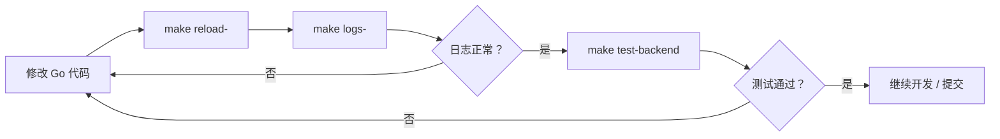

积分商城项目采用**双层 Makefile 委托架构**：根目录 [Makefile](Makefile) 作为统一入口，将 Docker 编排和编译命令委托给 [deploy/Makefile](deploy/Makefile)，将测试/契约/前端构建委托给 `scripts/` 目录下的 Shell 脚本。开发者只需在仓库根目录执行 `make <target>`，即可覆盖编译、启动、测试、契约生成等全部日常工作流。

Sources: [Makefile](Makefile#L1-L61), [deploy/Makefile](deploy/Makefile#L1-L117)

## 架构总览：命令委托链

```mermaid
graph TD
    subgraph "根 Makefile — 用户入口"
        HELP["make help"]
        BUILD["make build / build-<svc>"]
        RUN["make run / reload"]
        OPS["make down / logs / migrate"]
        TEST["make test-backend / test-frontend / test-e2e"]
        FE["make build-frontend"]
        CT["make generate-contracts / check-contracts"]
        PR["make generate-points-proto"]
    end

    subgraph "deploy/Makefile — 编译 & Docker 编排"
        D_BUILD["go build 交叉编译 → .artifacts/bin/"]
        D_RUN["docker compose up -d"]
        D_OPS["docker compose restart / logs / down"]
        D_MIG["mysql < schema.sql"]
    end

    subgraph "scripts/ — 测试 & 契约"
        S_TB["test-backend.sh → go test"]
        S_TF["test-frontend.sh → pnpm vitest run"]
        S_TE["test-e2e.sh → pnpm test:e2e"]
        S_BF["build-frontend.sh → pnpm build"]
        S_GC["generate-contracts.sh → goctl api go/ts"]
        S_CC["check-contracts.sh → diff 漂移检查"]
        S_GP["generate-points-proto.sh → protoc"]
    end

    BUILD --> D_BUILD
    RUN --> D_BUILD
    RUN --> D_RUN
    OPS --> D_OPS
    OPS --> D_MIG

    TEST --> S_TB
    TEST --> S_TF
    TEST --> S_TE
    FE --> S_BF
    CT --> S_GC
    CT --> S_CC
    PR --> S_GP
```



根 Makefile 通过 `@$(MAKE) -C deploy $@` 将 `build`、`run`、`restart`、`reload`、`down`、`logs`、`migrate` 等目标原样转发至 `deploy/Makefile`，同时利用 Make 的 **stem 匹配**（`restart-%`、`logs-%`、`reload-%`）支持动态服务名。测试与前端命令则直接调用 `scripts/` 下的专用脚本。

Sources: [Makefile](Makefile#L33-L39), [Makefile](Makefile#L41-L60)

## 命令速查表

### 构建与编译

| 命令 | 作用 | 关键行为 |
|------|------|----------|
| `make build` | 编译全部 5 个 Go 服务 | 交叉编译为 Linux ELF，产物输出到 `.artifacts/bin/` |
| `make build-api` | 仅编译 API 网关 | 入口：`./app/api/INTegralmall.go` |
| `make build-user-rpc` | 仅编译 user-rpc | 入口：`./app/rpc/user/user.go` |
| `make build-points-rpc` | 仅编译 points-rpc | 入口：`./app/rpc/points/points.go` |
| `make build-product-rpc` | 仅编译 product-rpc | 入口：`./app/rpc/product/product.go` |
| `make build-order-rpc` | 仅编译 order-rpc | 入口：`./app/rpc/order/order.go` |
| `make build-frontend` | 前端生产构建 | 产物输出到 `.artifacts/frontend/dist/` |

编译参数可通过变量覆盖：`TARGET_GOOS`（默认 `linux`）、`TARGET_GOARCH`（默认当前架构）、`BUILD_LDFLAGS`（默认 `-s -w` 裁剪符号表）。例如为 ARM64 架构编译：`make build-api TARGET_GOARCH=arm64`。

Sources: [deploy/Makefile](deploy/Makefile#L5-L31), [scripts/build-frontend.sh](scripts/build-frontend.sh#L1-L39)

### 服务生命周期管理

| 命令 | 作用 | 适用场景 |
|------|------|----------|
| `make run` | 编译 + 启动全部容器 | 首次启动或全量重建 |
| `make restart` | 重启全部 Go 服务（不重编译） | 配置文件修改后 |
| `make restart-<svc>` | 重启单个服务 | 单服务配置调整 |
| `make reload` | 编译 + 重启全部 Go 服务 | 代码修改后的完整重载 |
| `make reload-<svc>` | 编译 + 重启单个服务 | **最高频日常命令**，如 `make reload-points-rpc` |
| `make down` | 停止所有容器 | 结束开发会话 |
| `make logs` | 查看全部服务日志（实时跟踪） | 排查全局问题 |
| `make logs-<svc>` | 查看单个服务日志 | 精确定位，如 `make logs-api` |

`run` 目标会在编译后自动创建 Docker 网络 `INTegral-mall-network`（幂等操作），然后执行 `docker compose up -d`。容器采用 **volume 挂载二进制**模式：`Dockerfile.local` 仅提供 Alpine 运行时，宿主机编译产物通过只读 volume 映射到容器内 `/app/service`，因此 `reload-<svc>` 只需重编译 + 重启容器，无需重建镜像。

Sources: [deploy/Makefile](deploy/Makefile#L33-L71), [deploy/Dockerfile.local](deploy/Dockerfile.local#L1-L10), [deploy/docker-compose.yaml](deploy/docker-compose.yaml#L58-L66)

### 数据库与迁移

| 命令 | 作用 |
|------|------|
| `make migrate` | 执行 `deploy/schema.sql` 到本地 MySQL |

迁移命令从 `deploy/.env` 读取数据库连接信息（回退到默认值 `root/root123@127.0.0.1/INTegral_mall`）。Docker Compose 启动时 MySQL 会自动执行 `schema.sql` 和 `seeds/seed-e2e.sql`（通过 `docker-entrypoint-initdb.d`），因此 `make migrate` 主要用于开发过程中手动重建 schema。

Sources: [deploy/Makefile](deploy/Makefile#L73-L75), [deploy/.env](deploy/.env#L1-L8)

### 测试三件套

| 命令 | 作用 | 可覆盖变量 |
|------|------|------------|
| `make test-backend` | Go 全量单元测试 | `TEST_ARGS=./pkg/...` 缩小范围 |
| `make test-frontend` | Vitest 单元/组件测试 | `FRONTEND_TEST_ARGS='--runInBand'` |
| `make test-e2e` | Playwright E2E 测试 | 无（需前后端服务已运行） |

后端测试脚本会将输出同时写入 `.artifacts/reports/backend-go-test-<TIMESTAMP>.txt` 和 `backend-go-test-latest.txt`，方便 CI 归档和开发者快速回溯。前端测试同样产出报告到 `.artifacts/reports/`。E2E 测试前置条件较严格：后端服务 + seed 数据 + 前端 dev server 均需就绪。

Sources: [Makefile](Makefile#L5-L6), [scripts/test-backend.sh](scripts/test-backend.sh#L1-L49), [scripts/test-frontend.sh](scripts/test-frontend.sh#L1-L40), [scripts/test-e2e.sh](scripts/test-e2e.sh#L1-L16)

### 契约与代码生成

| 命令 | 作用 |
|------|------|
| `make generate-contracts` | 从 `INTegral.api` 重新生成 Go 类型 + 前端 TS 契约 |
| `make check-contracts` | 校验现有契约产物是否与 API 定义一致（漂移检测） |
| `make generate-points-proto` | 从 `points.proto` 重新生成 gRPC 代码 |

`generate-contracts` 执行三步操作：① `goctl api validate` 校验语法；② `goctl api go` 生成 Go 共享类型并覆盖 `app/api/INTernal/types/types.go`；③ `goctl api ts` 生成前端 TypeScript 类型到 `frontend/src/api/generated/`。`check-contracts` 则在临时目录中生成一份全新契约，用 `diff -u` 对比现有文件，任何差异即视为漂移。

Sources: [scripts/generate-contracts.sh](scripts/generate-contracts.sh#L1-L43), [scripts/check-contracts.sh](scripts/check-contracts.sh#L1-L56), [scripts/generate-points-proto.sh](scripts/generate-points-proto.sh#L1-L35)

## 典型工作流：从改代码到验证



**最常用的开发循环**是 `make reload-<svc>` + `make logs-<svc>` 组合。例如修改了积分规则逻辑后：`make reload-points-rpc` 编译并重启 points-rpc，再 `make logs-points-rpc` 实时观察启动日志和请求日志。这个循环之所以高效，是因为 volume 挂载模式避免了 Docker 镜像重建——单次编译 + 重启通常在 5 秒内完成。

Sources: [deploy/Makefile](deploy/Makefile#L47-L58)

## 编译产物与运行时环境

所有构建产物统一输出到 `.artifacts/` 目录，结构如下：

```
.artifacts/
├── bin/                          # Go 服务二进制（Linux ELF）
│   ├── api
│   ├── user-rpc
│   ├── points-rpc
│   ├── product-rpc
│   └── order-rpc
├── frontend/
│   └── dist/                     # 前端生产构建产物
└── reports/
    ├── backend-go-test-latest.txt
    ├── frontend-vitest-latest.txt
    ├── frontend-build-latest.txt
    └── contract-check-latest.txt
```

容器运行时通过 [entrypoint.sh](deploy/entrypoint.sh) 完成 two-step 初始化：首先设置 `Asia/Shanghai` 时区，然后用 `envsubst` 将配置文件中的 `${VAR}` 占位符替换为实际环境变量值，最后 `exec` 启动 Go 服务二进制。这种设计使得配置模板可以安全地提交到版本控制，敏感信息通过 `.env` 或 Kubernetes Secret 注入。

Sources: [deploy/entrypoint.sh](deploy/entrypoint.sh#L1-L12), [deploy/.env](deploy/.env#L1-L29)

## 常见问题与排查

| 现象 | 原因 | 解决方案 |
|------|------|----------|
| `make run` 报网络已存在 | 正常幂等行为 | 忽略 `2>/dev/null` 的提示即可 |
| `make reload-<svc>` 后服务未更新 | 二进制未正确挂载 | 检查 `.artifacts/bin/<svc>` 是否存在 |
| `make test-e2e` 全部失败 | 前后端服务未运行 | 先执行 `make run`，确认 `make logs-api` 无异常 |
| `make check-contracts` 报漂移 | API 定义已改但未重新生成 | 执行 `make generate-contracts` |
| `make generate-points-proto` 报 protoc 缺失 | 系统未安装 protobuf 工具链 | `go install google.golang.org/protobuf/cmd/protoc-gen-go@latest` 等 |
| 编译报 CGO 错误 | 默认 `CGO_ENABLED=0` | 正常行为，项目纯 Go 无 CGO 依赖 |

Sources: [deploy/Makefile](deploy/Makefile#L10-L13), [scripts/generate-points-proto.sh](scripts/generate-points-proto.sh#L9-L22)

## 扩展阅读

- 编译产物的 Docker 部署细节见 [Docker Compose 本地开发环境配置详解](25-docker-compose-ben-di-kai-fa-huan-jing-pei-zhi-xiang-jie)
- 前后端契约机制的深层原理见 [前后端契约驱动开发：goctl 类型生成与漂移检查](16-qian-hou-duan-qi-yue-qu-dong-kai-fa-goctl-lei-xing-sheng-cheng-yu-piao-yi-jian-cha)
- 测试体系的组织方式见 [后端单元测试策略：Mock 辅助与覆盖范围](22-hou-duan-dan-yuan-ce-shi-ce-lue-mock-fu-zhu-yu-fu-gai-fan-wei) 和 [Playwright E2E 测试：147 用例的组织与执行](23-playwright-e2e-ce-shi-147-yong-li-de-zu-zhi-yu-zhi-xing)